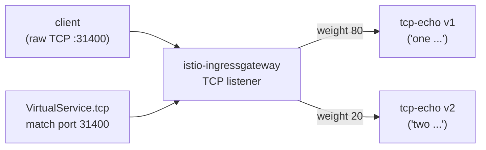

[Русская версия](README_RU.MD) · [Eng version](README.MD) · [Versión en español](README_ES.MD) · [Version française](README_FR.MD) · [Deutsche Version](README_DE.MD) · [ქართული ვერსია](README_GE.MD) · [繁體中文版](README_TW.MD)

# Lab 28 - TCP ルーティング: 非 HTTP トラフィックのルーティング

> [リファレンス解答](worker/files/solutions/1_JP.MD)

## 概要

すべてのトラフィックが HTTP というわけではありません。データベース、ブローカー、カスタムプロトコルは、生の
TCP 上で動作し、host/path/ヘッダーはありません。Istio は、このようなトラフィックを L4 レベルでルーティングします。
`protocol: TCP` を持つ `Gateway` と `VirtualService.tcp` を使用し、リスナーの**ポート**に基づいて
ルートを選択します。

このラボでは、生の TCP ポート `9000` で動作する 2 つのバージョンの TCP エコーサービス `tcp-echo` をデプロイしています。
- **v1** は `one` プレフィックスを付けて応答します。
- **v2** は `two` プレフィックスを付けて応答します。

Ingress gateway はすでに NodePort `31400` で TCP をリッスンしています。



## インフラストラクチャ

| コンポーネント | タイプ | 数 | 役割 |
|---|---|---|---|
| control-plane | `t3.medium` | 1 | master + istiod + ingress gateway |
| worker | `t3.small` | 1 | tcp-echo v1/v2 の容量 |
| worker PC | `t3.small` | 1 | 作業環境: `kubectl`、`bash /dev/tcp`、`check_result` |

リージョン: `eu-central-1` (AZ `eu-central-1a` / `eu-central-1b`)。

## デプロイ

```bash
TASK=28 make run_ica_task
```

## 課題

1. ポート `31400` に `protocol: TCP` を持つサーバーを設定した `Gateway` を作成します。
2. `v1`/`v2` サブセットを持つ `DestinationRule` を作成します。
3. TCP ルート（ポート 31400 による match）を持つ `VirtualService` を作成し、
   v1 (80%) と v2 (20%) の間で接続を重み付け分散します。
4. gateway 経由の raw-TCP がサービスに到達し、エコーが返ることを確認します。

## ステップ 1. TCP リスナーを持つ Gateway

```bash
kubectl apply -f - <<'EOF'
apiVersion: networking.istio.io/v1
kind: Gateway
metadata:
  name: tcp-echo-gateway
  namespace: app
spec:
  selector:
    istio: ingressgateway
  servers:
    - port:
        number: 31400
        name: tcp
        protocol: TCP
      hosts:
        - "*"
EOF
```

## ステップ 2. サブセットを持つ DestinationRule

```bash
kubectl apply -f - <<'EOF'
apiVersion: networking.istio.io/v1
kind: DestinationRule
metadata:
  name: tcp-echo
  namespace: app
spec:
  host: tcp-echo
  subsets:
    - name: v1
      labels:
        version: v1
    - name: v2
      labels:
        version: v2
EOF
```

## ステップ 3. TCP ルートを持つ VirtualService

```bash
kubectl apply -f - <<'EOF'
apiVersion: networking.istio.io/v1
kind: VirtualService
metadata:
  name: tcp-echo
  namespace: app
spec:
  hosts:
    - "*"
  gateways:
    - tcp-echo-gateway
  tcp:
    - match:
        - port: 31400
      route:
        - destination:
            host: tcp-echo
            port:
              number: 9000
            subset: v1
          weight: 80
        - destination:
            host: tcp-echo
            port:
              number: 9000
            subset: v2
          weight: 20
EOF
```

## ステップ 4. 確認

```bash
for i in $(seq 10); do
  echo "hello" | timeout 3 bash -c 'exec 3<>/dev/tcp/myapp.local/31400; cat >&3; head -n 1 <&3'
done
# ~80% "one hello", ~20% "two hello"
```

(`nc` がインストールされている場合: `echo hello | nc myapp.local 31400`。)

## 仕組み

- **TCP ルーティング**は L4 で動作します。HTTP の host/path/ヘッダーはないため、ルートは
  **リスナーのポート** (`match.port`) によって選択されます。`protocol: TCP` を持つ `Gateway` は
  Envoy に通常の TCP リスナーを開き、`VirtualService.tcp` は接続を適切なサブセットへ転送します。
- **ポート名は重要です**: サービス/gateway のポート名は `tcp`（または `tcp-*`）にする必要があります。
  Istio はポート名のプレフィックスからプロトコルを判断します。プレフィックスのない名前または `http-*` は、
  Istio に HTTP として扱わせるため、生のプロトコルが壊れます。
- **重み付け TCP** は、サブセット間で*接続*（リクエストではなく）を分散します。新しい TCP 接続はそれぞれ、
  重みに従ってルーティングされます。
- L7 機能（retries、header routing、fault injection）は TCP ルートには**適用されません**。
  `DestinationRule` を通じた接続レベルのポリシー（connection pool、timeouts）のみが使用できます。

## 関連プロトコル

- **MongoDB/MySQL/Redis** - Envoy が適切なプロトコルパーサーを適用するよう、ポートを `mongo-*` /
  `mysql-*` / `redis-*` と命名してください。ルーティングは引き続き `tcp` ルートで行います。
- **WebSocket** - 長時間接続であるにもかかわらず、HTTP `Upgrade` 上で動作するため、TCP ではなく通常の
  `http` ルートと `http-*` ポート名を使用してください。

## 結果の確認

worker PC で実行します。

```bash
check_result
```

## まとめ

ingress gateway を通じた生の TCP ルーティングを、バージョン間の重み付け分散とともに設定しました。
L4 ルーティング（ポートに基づくこと、ポート名を考慮すること）の理解は、mesh 内で非 HTTP ワークロード
（DB、ブローカー、カスタムプロトコル）を扱ううえで重要なスキルです。