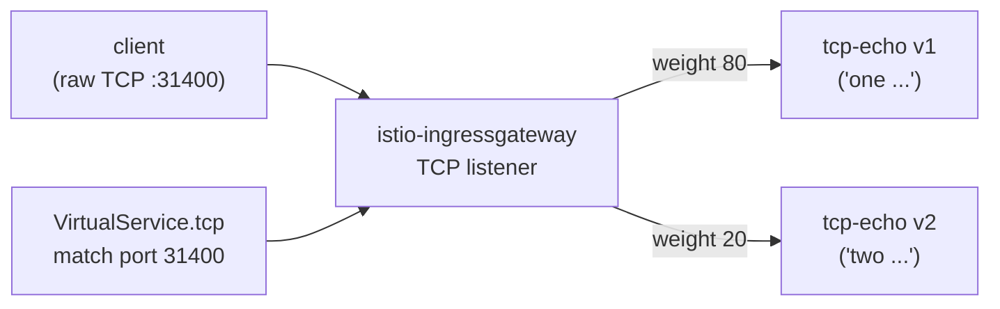

[Eng version](README.MD)

# Lab 28 - TCP routing: маршрутизация не-HTTP трафика

## Обзор

Не весь трафик - HTTP. Базы данных, брокеры, кастомные протоколы работают поверх сырого
TCP, где нет host/path/заголовков. Istio маршрутизирует такой трафик на уровне L4: через
`Gateway` с `protocol: TCP` и `VirtualService.tcp`, где маршрут выбирается по **порту**
слушателя.

В лабе развёрнут TCP-эхо-сервис `tcp-echo` в двух версиях (на сыром TCP-порту `9000`):
- **v1** отвечает с префиксом `one`;
- **v2** отвечает с префиксом `two`.

Ingress gateway уже слушает TCP на NodePort `31400`.



## Задание

1. Создать `Gateway` с сервером `protocol: TCP` на порту `31400`.
2. Создать `DestinationRule` с сабсетами `v1`/`v2`.
3. Создать `VirtualService` с `tcp`-маршрутом (match по порту 31400), взвешенно
   распределяющим соединения между v1 (80%) и v2 (20%).
4. Проверить, что raw-TCP через gateway доходит до сервиса и эхо возвращается.

## Шаг 1. Gateway с TCP-слушателем

```bash
kubectl apply -f - <<'EOF'
apiVersion: networking.istio.io/v1
kind: Gateway
metadata:
  name: tcp-echo-gateway
  namespace: app
spec:
  selector:
    istio: ingressgateway
  servers:
    - port:
        number: 31400
        name: tcp
        protocol: TCP
      hosts:
        - "*"
EOF
```

## Шаг 2. DestinationRule с сабсетами

```bash
kubectl apply -f - <<'EOF'
apiVersion: networking.istio.io/v1
kind: DestinationRule
metadata:
  name: tcp-echo
  namespace: app
spec:
  host: tcp-echo
  subsets:
    - name: v1
      labels:
        version: v1
    - name: v2
      labels:
        version: v2
EOF
```

## Шаг 3. VirtualService с TCP-маршрутом

```bash
kubectl apply -f - <<'EOF'
apiVersion: networking.istio.io/v1
kind: VirtualService
metadata:
  name: tcp-echo
  namespace: app
spec:
  hosts:
    - "*"
  gateways:
    - tcp-echo-gateway
  tcp:
    - match:
        - port: 31400
      route:
        - destination:
            host: tcp-echo
            port:
              number: 9000
            subset: v1
          weight: 80
        - destination:
            host: tcp-echo
            port:
              number: 9000
            subset: v2
          weight: 20
EOF
```

## Шаг 4. Проверка

```bash
for i in $(seq 10); do
  echo "hello" | timeout 3 bash -c 'exec 3<>/dev/tcp/myapp.local/31400; cat >&3; head -n 1 <&3'
done
# ~80% "one hello", ~20% "two hello"
```

(Если установлен `nc`: `echo hello | nc myapp.local 31400`.)

## Как это работает

- **TCP-маршрутизация** работает на L4: нет HTTP host/path/заголовков, поэтому маршрут
  выбирается по **порту слушателя** (`match.port`). `Gateway` с `protocol: TCP`
  открывает обычный TCP-listener в Envoy, а `VirtualService.tcp` направляет соединение в
  нужный сабсет.
- **Имя порта важно**: порт сервиса/gateway должен называться `tcp` (или `tcp-*`). Istio
  по префиксу имени порта определяет протокол; имя без префикса или `http-*` заставит
  Istio считать его HTTP и сырой протокол сломается.
- **Взвешенный TCP** распределяет *соединения* (а не запросы) по сабсетам - каждое новое
  TCP-соединение маршрутизируется по весу.
- L7-фичи (retries, header routing, fault injection) к TCP-маршрутам **не применяются** -
  только политики уровня соединения (connection pool, timeouts) через `DestinationRule`.

## Родственные протоколы

- **MongoDB/MySQL/Redis** - называйте порт `mongo-*` / `mysql-*` / `redis-*`, чтобы Envoy
  применил нужный парсер протокола; маршрутизация всё равно через `tcp`-маршруты.
- **WebSocket** - несмотря на долгоживущее соединение, работает поверх HTTP `Upgrade`,
  поэтому используйте обычные `http`-маршруты и имена портов `http-*`, а не TCP.

## Проверка результата

Запустите на worker PC:

```bash
check_result
```

## Итог

Вы настроили маршрутизацию сырого TCP через ingress gateway с взвешенным распределением
между версиями. Понимание L4-маршрутизации (по порту, с учётом именования портов) -
важный навык для работы с не-HTTP-нагрузками (БД, брокеры, кастомные протоколы) в mesh.

## Инфраструктура

| Компонент | Тип | Кол-во | Роль |
|---|---|---|---|
| control-plane | `t3.medium` | 1 | master + istiod + ingress gateway |
| worker | `t3.small` | 1 | ёмкость для tcp-echo v1/v2 |
| worker PC | `t3.small` | 1 | рабочее место: `kubectl`, `bash /dev/tcp`, `check_result` |

Регион: `eu-central-1` (AZ `eu-central-1a` / `eu-central-1b`).
