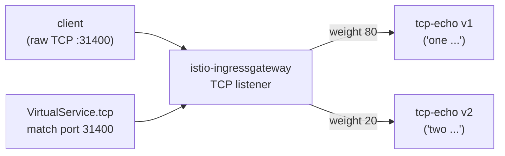

[Русская версия](README_RU.MD) · [Eng version](README.MD) · [Versión en español](README_ES.MD) · [Version française](README_FR.MD) · [Deutsche Version](README_DE.MD) · [ქართული ვერსია](README_GE.MD) · [日本語版](README_JP.MD)

# Lab 28 - TCP routing：非 HTTP 流量路由

> [參考解答](worker/files/solutions/1_TW.MD)

## 概述

並非所有流量都是 HTTP。資料庫、訊息代理與自訂協定皆透過原始 TCP 運作，
其中沒有 host/path/標頭。Istio 在 L4 層路由此類流量：透過具有 `protocol: TCP`
的 `Gateway` 和 `VirtualService.tcp`，路由依監聽器的**連接埠**選擇。

本 Lab 已部署兩個版本的 TCP 回應服務 `tcp-echo`（使用原始 TCP 連接埠 `9000`）：
- **v1** 回應時帶有前綴 `one`；
- **v2** 回應時帶有前綴 `two`。

Ingress gateway 已在 NodePort `31400` 上監聽 TCP。



## 基礎設施

| 元件 | 類型 | 數量 | 角色 |
|---|---|---|---|
| control-plane | `t3.medium` | 1 | master + istiod + ingress gateway |
| worker | `t3.small` | 1 | tcp-echo v1/v2 的容量 |
| worker PC | `t3.small` | 1 | 工作站：`kubectl`、`bash /dev/tcp`、`check_result` |

區域：`eu-central-1`（AZ `eu-central-1a` / `eu-central-1b`）。

## 部署

```bash
TASK=28 make run_ica_task
```

## 任務

1. 建立一個 `Gateway`，其中的伺服器使用 `protocol: TCP` 並監聽連接埠 `31400`。
2. 建立一個包含 `v1`/`v2` 子集的 `DestinationRule`。
3. 建立一個具有 `tcp` 路由的 `VirtualService`（依連接埠 31400 match），以權重方式
   將連線分配至 v1（80%）與 v2（20%）。
4. 確認原始 TCP 可透過 gateway 到達服務，且會傳回回應。

## 步驟 1：具有 TCP 監聽器的 Gateway

```bash
kubectl apply -f - <<'EOF'
apiVersion: networking.istio.io/v1
kind: Gateway
metadata:
  name: tcp-echo-gateway
  namespace: app
spec:
  selector:
    istio: ingressgateway
  servers:
    - port:
        number: 31400
        name: tcp
        protocol: TCP
      hosts:
        - "*"
EOF
```

## 步驟 2：具有子集的 DestinationRule

```bash
kubectl apply -f - <<'EOF'
apiVersion: networking.istio.io/v1
kind: DestinationRule
metadata:
  name: tcp-echo
  namespace: app
spec:
  host: tcp-echo
  subsets:
    - name: v1
      labels:
        version: v1
    - name: v2
      labels:
        version: v2
EOF
```

## 步驟 3：具有 TCP 路由的 VirtualService

```bash
kubectl apply -f - <<'EOF'
apiVersion: networking.istio.io/v1
kind: VirtualService
metadata:
  name: tcp-echo
  namespace: app
spec:
  hosts:
    - "*"
  gateways:
    - tcp-echo-gateway
  tcp:
    - match:
        - port: 31400
      route:
        - destination:
            host: tcp-echo
            port:
              number: 9000
            subset: v1
          weight: 80
        - destination:
            host: tcp-echo
            port:
              number: 9000
            subset: v2
          weight: 20
EOF
```

## 步驟 4：驗證

```bash
for i in $(seq 10); do
  echo "hello" | timeout 3 bash -c 'exec 3<>/dev/tcp/myapp.local/31400; cat >&3; head -n 1 <&3'
done
# ~80% "one hello", ~20% "two hello"
```

（若已安裝 `nc`：`echo hello | nc myapp.local 31400`。）

## 運作方式

- **TCP 路由**在 L4 層運作：沒有 HTTP host/path/標頭，因此路由由**監聽器連接埠**
  （`match.port`）選擇。使用 `protocol: TCP` 的 `Gateway` 會在 Envoy 中開啟一般的
  TCP listener，而 `VirtualService.tcp` 將連線導向適當的子集。
- **連接埠名稱很重要**：服務/gateway 的連接埠必須命名為 `tcp`（或 `tcp-*`）。Istio
  透過連接埠名稱的前綴判定協定；沒有此前綴的名稱或 `http-*` 會使 Istio 將其視為 HTTP，
  導致原始協定失效。
- **加權 TCP**會在子集之間分配*連線*（而非請求）--每個新的 TCP 連線均依權重路由。
- L7 功能（retries、header routing、fault injection）**不適用於** TCP 路由--僅可透過
  `DestinationRule` 套用連線層級的策略（connection pool、timeouts）。

## 相關協定

- **MongoDB/MySQL/Redis**：將連接埠命名為 `mongo-*` / `mysql-*` / `redis-*`，讓 Envoy
  套用正確的協定剖析器；路由仍然透過 `tcp` 路由進行。
- **WebSocket**：儘管為長連線，它運行在 HTTP `Upgrade` 之上，因此應使用一般的 `http`
  路由及連接埠名稱 `http-*`，而非 TCP。

## 結果驗證

在 worker PC 上執行：

```bash
check_result
```

## 總結

您已設定透過 ingress gateway 的原始 TCP 路由，並在各版本間進行加權分配。理解 L4
路由（依連接埠，並考量連接埠命名）是在 mesh 中處理非 HTTP 負載（資料庫、訊息代理、
自訂協定）的重要技能。
