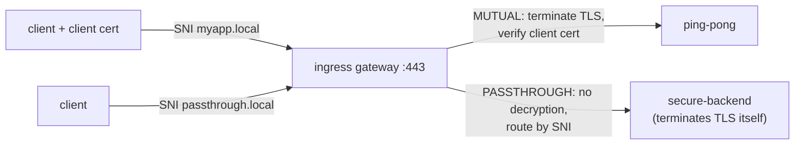

[RU version](README_RU.MD) · [Versión en español](README_ES.MD)

# Lab 29 - Ingress TLS: MUTUAL and PASSTHROUGH modes

## Overview

In Lab 13 we terminated TLS at the ingress gateway using `SIMPLE` mode. The gateway
supports other TLS modes too:

- **MUTUAL** - the gateway terminates TLS and **requires a client certificate** (mTLS at
  the edge): ideal for partner/B2B APIs where the client must prove its identity.
- **PASSTHROUGH** - the gateway **does not decrypt**; it forwards the encrypted stream by
  SNI and the backend terminates TLS (end-to-end encryption).

The lab pre-creates a PKI (server, client, backend certs) and deploys:
- `ping-pong` (namespace `app`, injected) - the MUTUAL target;
- `secure-backend` (namespace `backend`, no sidecar) - a TLS-only nginx replying
  `secure-ok`, the PASSTHROUGH target.

The ingress gateway listens for HTTPS on NodePort `32443`.



## Task

1. Create a `Gateway` with two servers on port 443 (selected by SNI):
   - `myapp.local` - `tls.mode: MUTUAL`, `credentialName: myapp-credential`;
   - `passthrough.local` - `tls.mode: PASSTHROUGH`.
2. A `VirtualService` (http) for `myapp.local` → `ping-pong`.
3. A `VirtualService` (tls, `sniHosts`) for `passthrough.local` → `secure-backend`.
4. Verify: MUTUAL without a client cert is rejected, with a cert → 200; PASSTHROUGH → 200.

## Step 1. Gateway with MUTUAL + PASSTHROUGH

```bash
kubectl apply -f - <<'EOF'
apiVersion: networking.istio.io/v1
kind: Gateway
metadata:
  name: edge-gateway
  namespace: app
spec:
  selector:
    istio: ingressgateway
  servers:
    - port:
        number: 443
        name: https-mutual
        protocol: HTTPS
      tls:
        mode: MUTUAL
        credentialName: myapp-credential
      hosts:
        - "myapp.local"
    - port:
        number: 443
        name: https-passthrough
        protocol: HTTPS
      tls:
        mode: PASSTHROUGH
      hosts:
        - "passthrough.local"
EOF
```

## Step 2. Route the MUTUAL host (HTTP after termination)

```bash
kubectl apply -f - <<'EOF'
apiVersion: networking.istio.io/v1
kind: VirtualService
metadata:
  name: myapp
  namespace: app
spec:
  hosts:
    - "myapp.local"
  gateways:
    - edge-gateway
  http:
    - route:
        - destination:
            host: ping-pong
            port:
              number: 8080
EOF
```

## Step 3. Route the PASSTHROUGH host (TLS, by SNI)

```bash
kubectl apply -f - <<'EOF'
apiVersion: networking.istio.io/v1
kind: VirtualService
metadata:
  name: passthrough
  namespace: app
spec:
  hosts:
    - "passthrough.local"
  gateways:
    - edge-gateway
  tls:
    - match:
        - sniHosts:
            - "passthrough.local"
      route:
        - destination:
            host: secure-backend.backend.svc.cluster.local
            port:
              number: 443
EOF
```

## Step 4. Verify

```bash
# MUTUAL - without a client cert the handshake is rejected
curl -sk -o /dev/null -w "%{http_code}\n" https://myapp.local:32443/        # not 200

# MUTUAL - with the client cert it succeeds
kubectl get secret client-certs -n app -o jsonpath='{.data.client\.crt}' | base64 -d > /tmp/c.crt
kubectl get secret client-certs -n app -o jsonpath='{.data.client\.key}' | base64 -d > /tmp/c.key
curl -sk --cert /tmp/c.crt --key /tmp/c.key https://myapp.local:32443/      # 200

# PASSTHROUGH - TLS terminates at the backend
curl -sk https://passthrough.local:32443/                                   # secure-ok
```

## TLS modes at a glance

| Mode | Who terminates TLS | Client cert | Typical use |
|---|---|---|---|
| `SIMPLE` (Lab 13) | gateway | no | standard HTTPS ingress |
| `MUTUAL` | gateway | **required** (verified against `ca.crt`) | mTLS at the edge, B2B/partner APIs |
| `PASSTHROUGH` | the backend | n/a at gateway | end-to-end encryption, gateway can't see plaintext |
| `ISTIO_MUTUAL` | gateway (Istio certs) | Istio-managed | mesh-internal gateway traffic |

## How it works

- A single `Gateway` can host **multiple servers on the same port**; Istio picks the
  server by the TLS **SNI** (`myapp.local` vs `passthrough.local`).
- **MUTUAL**: the gateway presents its server cert and demands a client cert, validating
  it against the `ca.crt` inside `myapp-credential`. After termination, routing is normal
  L7 (`http` route).
- **PASSTHROUGH**: the gateway does not decrypt; it routes by SNI at L4 using a
  `VirtualService.tls` + `sniHosts` match and forwards the raw TLS to the backend, which
  owns the certificate and terminates TLS.

## Check the result

Run on the worker PC:

```bash
check_result
```

## Summary

You configured two advanced ingress TLS modes on the gateway: edge mTLS (MUTUAL) and
end-to-end TLS (PASSTHROUGH), distinguished by SNI on a single port. Knowing all the
gateway TLS modes is a key skill for securely exposing services (partner APIs,
end-to-end encryption).

## Infrastructure

| Component | Type | Count | Role |
|---|---|---|---|
| control-plane | `t3.medium` | 1 | master + istiod + ingress gateway |
| worker | `t3.small` | 1 | capacity for ping-pong and secure-backend |
| worker PC | `t3.small` | 1 | workstation: `kubectl`, `curl`, `check_result` |

Region: `eu-central-1` (AZ `eu-central-1a` / `eu-central-1b`).
