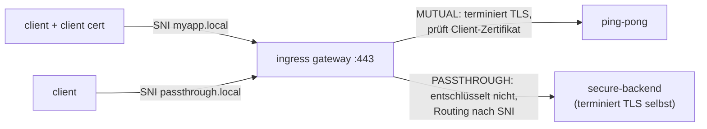

[RU version](README_RU.MD) · [Eng version](README.MD) · [Versión en español](README_ES.MD) · [Version française](README_FR.MD)

# Lab 29 - Ingress TLS: Modi MUTUAL und PASSTHROUGH

## Überblick

In Lab 13 haben wir TLS am Ingress Gateway im Modus `SIMPLE` terminiert. Aber das Gateway
hat noch weitere TLS-Modi:

- **MUTUAL** - das Gateway terminiert TLS und **verlangt ein Client-Zertifikat** (mTLS am
  Eingang): geeignet für Partner-/B2B-APIs, bei denen der Client seine Identität nachweisen muss.
- **PASSTHROUGH** - das Gateway **entschlüsselt** den Verkehr **nicht**, sondern leitet den
  verschlüsselten Datenstrom anhand der SNI weiter; TLS terminiert das Backend selbst
  (Ende-zu-Ende-Verschlüsselung).

Im Lab ist bereits eine PKI angelegt (Server-, Client- und Backend-Zertifikate) und es sind
bereitgestellt:
- `ping-pong` (ns `app`, mit Sidecar) - Ziel für MUTUAL;
- `secure-backend` (ns `backend`, ohne Sidecar) - TLS-only nginx, antwortet mit `secure-ok`,
  Ziel für PASSTHROUGH.

Das Ingress Gateway lauscht HTTPS am NodePort `32443`.



## Infrastruktur

| Komponente | Typ | Anzahl | Rolle |
|---|---|---|---|
| control-plane | `t3.medium` | 1 | master + istiod + ingress gateway |
| worker | `t3.small` | 1 | Kapazität für ping-pong und secure-backend |
| worker PC | `t3.small` | 1 | Arbeitsplatz: `kubectl`, `curl`, `check_result` |

Region: `eu-central-1` (AZ `eu-central-1a` / `eu-central-1b`).

## Deployment

```bash
TASK=29 make run_ica_task
```

## Aufgabe

1. Ein `Gateway` mit zwei Servern auf Port 443 erstellen (unterscheiden sich per SNI):
   - `myapp.local` - `tls.mode: MUTUAL`, `credentialName: myapp-credential`;
   - `passthrough.local` - `tls.mode: PASSTHROUGH`.
2. `VirtualService` (http) für `myapp.local` → `ping-pong`.
3. `VirtualService` (tls, `sniHosts`) für `passthrough.local` → `secure-backend`.
4. Prüfen: MUTUAL ohne Client-Zertifikat wird abgewiesen, mit Zertifikat → 200; PASSTHROUGH → 200.

## Schritt 1. Gateway mit MUTUAL + PASSTHROUGH

```bash
kubectl apply -f - <<'EOF'
apiVersion: networking.istio.io/v1
kind: Gateway
metadata:
  name: edge-gateway
  namespace: app
spec:
  selector:
    istio: ingressgateway
  servers:
    - port:
        number: 443
        name: https-mutual
        protocol: HTTPS
      tls:
        mode: MUTUAL
        credentialName: myapp-credential
      hosts:
        - "myapp.local"
    - port:
        number: 443
        name: https-passthrough
        protocol: HTTPS
      tls:
        mode: PASSTHROUGH
      hosts:
        - "passthrough.local"
EOF
```

## Schritt 2. Route für den MUTUAL-Host (HTTP nach der Terminierung)

```bash
kubectl apply -f - <<'EOF'
apiVersion: networking.istio.io/v1
kind: VirtualService
metadata:
  name: myapp
  namespace: app
spec:
  hosts:
    - "myapp.local"
  gateways:
    - edge-gateway
  http:
    - route:
        - destination:
            host: ping-pong
            port:
              number: 8080
EOF
```

## Schritt 3. Route für den PASSTHROUGH-Host (TLS, nach SNI)

```bash
kubectl apply -f - <<'EOF'
apiVersion: networking.istio.io/v1
kind: VirtualService
metadata:
  name: passthrough
  namespace: app
spec:
  hosts:
    - "passthrough.local"
  gateways:
    - edge-gateway
  tls:
    - match:
        - sniHosts:
            - "passthrough.local"
      route:
        - destination:
            host: secure-backend.backend.svc.cluster.local
            port:
              number: 443
EOF
```

## Schritt 4. Prüfung

```bash
# MUTUAL - ohne Client-Zertifikat wird der Handshake abgewiesen
curl -sk -o /dev/null -w "%{http_code}\n" https://myapp.local:32443/        # nicht 200

# MUTUAL - mit Client-Zertifikat geht es durch
kubectl get secret client-certs -n app -o jsonpath='{.data.client\.crt}' | base64 -d > /tmp/c.crt
kubectl get secret client-certs -n app -o jsonpath='{.data.client\.key}' | base64 -d > /tmp/c.key
curl -sk --cert /tmp/c.crt --key /tmp/c.key https://myapp.local:32443/      # 200

# PASSTHROUGH - TLS terminiert das Backend
curl -sk https://passthrough.local:32443/                                   # secure-ok
```

## TLS-Modi in Kürze

| Modus | Wer terminiert TLS | Client-Zertifikat | Wann |
|---|---|---|---|
| `SIMPLE` (Lab 13) | Gateway | nein | normaler HTTPS-Ingress |
| `MUTUAL` | Gateway | **erforderlich** (wird gegen `ca.crt` geprüft) | mTLS am Eingang, B2B-/Partner-APIs |
| `PASSTHROUGH` | Backend | am Gateway keins | Ende-zu-Ende-Verschlüsselung, Gateway sieht keinen Plaintext |
| `ISTIO_MUTUAL` | Gateway (Istio-Zertifikate) | von Istio verwaltet | mesh-interner Gateway-Verkehr |

## Wie es funktioniert

- Ein `Gateway` kann **mehrere Server auf demselben Port** halten; Istio wählt den Server
  anhand der **SNI** aus (`myapp.local` vs `passthrough.local`).
- **MUTUAL**: Das Gateway präsentiert das Server-Zertifikat und verlangt ein Client-Zertifikat,
  das es gegen `ca.crt` innerhalb von `myapp-credential` prüft. Nach der Terminierung folgt
  normales L7-Routing (`http`).
- **PASSTHROUGH**: Das Gateway entschlüsselt nicht; es routet nach SNI auf L4 über
  `VirtualService.tls` + `sniHosts` und leitet das rohe TLS an das Backend weiter, das das
  Zertifikat besitzt und TLS terminiert.

## Ergebnisprüfung

Führen Sie auf dem worker PC aus:

```bash
check_result
```

## Fazit

Sie haben am Ingress Gateway zwei fortgeschrittene TLS-Modi konfiguriert: mTLS am Eingang
(MUTUAL) und durchgehendes TLS (PASSTHROUGH), unterschieden nach SNI auf demselben Port. Das
Verständnis aller TLS-Modi des Gateways ist eine wichtige Fähigkeit für das sichere
Veröffentlichen von Services (Partner-APIs, Ende-zu-Ende-Verschlüsselung).
