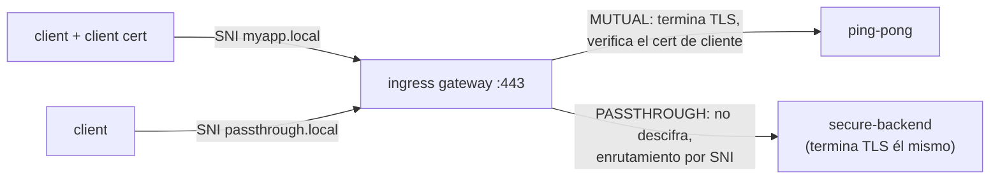

[RU version](README_RU.MD) · [Eng version](README.MD) · [Version française](README_FR.MD) · [Deutsche Version](README_DE.MD)

# Lab 29 - Ingress TLS: modos MUTUAL y PASSTHROUGH

## Resumen

En el Lab 13 terminamos TLS en el ingress gateway en modo `SIMPLE`. Pero el gateway tiene otros
modos TLS:

- **MUTUAL** - el gateway termina TLS y **exige un certificado de cliente** (mTLS en la
  entrada): adecuado para API de partners/B2B, donde el cliente debe demostrar su identidad.
- **PASSTHROUGH** - el gateway **no descifra** el tráfico, sino que por SNI reenvía el flujo
  cifrado más adelante; el TLS lo termina el propio backend (cifrado end-to-end).

En el lab ya está creado el PKI (certificados de servidor, cliente y backend) y desplegados:
- `ping-pong` (ns `app`, con sidecar) - objetivo para MUTUAL;
- `secure-backend` (ns `backend`, sin sidecar) - nginx TLS-only, responde `secure-ok`, objetivo
  para PASSTHROUGH.

El ingress gateway escucha HTTPS en el NodePort `32443`.



## Tarea

1. Crear un `Gateway` con dos servidores en el puerto 443 (se distinguen por SNI):
   - `myapp.local` - `tls.mode: MUTUAL`, `credentialName: myapp-credential`;
   - `passthrough.local` - `tls.mode: PASSTHROUGH`.
2. `VirtualService` (http) para `myapp.local` → `ping-pong`.
3. `VirtualService` (tls, `sniHosts`) para `passthrough.local` → `secure-backend`.
4. Comprobar: MUTUAL sin certificado de cliente se rechaza, con certificado → 200; PASSTHROUGH → 200.

## Paso 1. Gateway con MUTUAL + PASSTHROUGH

```bash
kubectl apply -f - <<'EOF'
apiVersion: networking.istio.io/v1
kind: Gateway
metadata:
  name: edge-gateway
  namespace: app
spec:
  selector:
    istio: ingressgateway
  servers:
    - port:
        number: 443
        name: https-mutual
        protocol: HTTPS
      tls:
        mode: MUTUAL
        credentialName: myapp-credential
      hosts:
        - "myapp.local"
    - port:
        number: 443
        name: https-passthrough
        protocol: HTTPS
      tls:
        mode: PASSTHROUGH
      hosts:
        - "passthrough.local"
EOF
```

## Paso 2. Ruta para el host MUTUAL (HTTP tras la terminación)

```bash
kubectl apply -f - <<'EOF'
apiVersion: networking.istio.io/v1
kind: VirtualService
metadata:
  name: myapp
  namespace: app
spec:
  hosts:
    - "myapp.local"
  gateways:
    - edge-gateway
  http:
    - route:
        - destination:
            host: ping-pong
            port:
              number: 8080
EOF
```

## Paso 3. Ruta para el host PASSTHROUGH (TLS, por SNI)

```bash
kubectl apply -f - <<'EOF'
apiVersion: networking.istio.io/v1
kind: VirtualService
metadata:
  name: passthrough
  namespace: app
spec:
  hosts:
    - "passthrough.local"
  gateways:
    - edge-gateway
  tls:
    - match:
        - sniHosts:
            - "passthrough.local"
      route:
        - destination:
            host: secure-backend.backend.svc.cluster.local
            port:
              number: 443
EOF
```

## Paso 4. Verificación

```bash
# MUTUAL - sin certificado de cliente el handshake se rechaza
curl -sk -o /dev/null -w "%{http_code}\n" https://myapp.local:32443/        # no 200

# MUTUAL - con certificado de cliente pasa
kubectl get secret client-certs -n app -o jsonpath='{.data.client\.crt}' | base64 -d > /tmp/c.crt
kubectl get secret client-certs -n app -o jsonpath='{.data.client\.key}' | base64 -d > /tmp/c.key
curl -sk --cert /tmp/c.crt --key /tmp/c.key https://myapp.local:32443/      # 200

# PASSTHROUGH - el TLS lo termina el backend
curl -sk https://passthrough.local:32443/                                   # secure-ok
```

## Modos TLS en breve

| Modo | Quién termina TLS | Certificado de cliente | Cuándo |
|---|---|---|---|
| `SIMPLE` (Lab 13) | gateway | no | ingress HTTPS normal |
| `MUTUAL` | gateway | **obligatorio** (se verifica por `ca.crt`) | mTLS en la entrada, API B2B/partners |
| `PASSTHROUGH` | backend | ninguno en el gateway | cifrado end-to-end, el gateway no ve plaintext |
| `ISTIO_MUTUAL` | gateway (certs de Istio) | gestionado por Istio | tráfico interno de la malla en el gateway |

## Cómo funciona

- Un mismo `Gateway` puede alojar **varios servidores en un mismo puerto**; Istio elige el
  servidor por **SNI** (`myapp.local` vs `passthrough.local`).
- **MUTUAL**: el gateway presenta el certificado de servidor y exige el de cliente,
  verificándolo con `ca.crt` dentro de `myapp-credential`. Tras la terminación, enrutamiento L7
  normal (`http`).
- **PASSTHROUGH**: el gateway no descifra; enruta por SNI a nivel L4 mediante
  `VirtualService.tls` + `sniHosts` y reenvía el TLS crudo al backend, que posee el certificado y
  termina TLS.

## Verificación del resultado

Ejecuta en el worker PC:

```bash
check_result
```

## Conclusión

Has configurado en el ingress gateway dos modos TLS avanzados: mTLS en la entrada (MUTUAL) y TLS
extremo a extremo (PASSTHROUGH), distinguidos por SNI en un mismo puerto. Entender todos los
modos TLS del gateway es una habilidad importante para publicar servicios de forma segura (API
de partners, cifrado end-to-end).

## Infraestructura

| Componente | Tipo | Cantidad | Rol |
|---|---|---|---|
| control-plane | `t3.medium` | 1 | master + istiod + ingress gateway |
| worker | `t3.small` | 1 | capacidad para ping-pong y secure-backend |
| worker PC | `t3.small` | 1 | puesto de trabajo: `kubectl`, `curl`, `check_result` |

Región: `eu-central-1` (AZ `eu-central-1a` / `eu-central-1b`).
