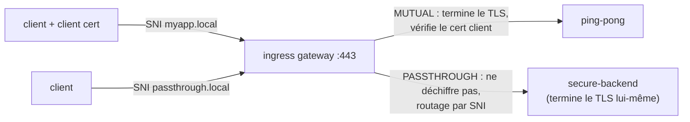

[RU version](README_RU.MD) · [Eng version](README.MD) · [Versión en español](README_ES.MD) · [Deutsche Version](README_DE.MD)

# Lab 29 - Ingress TLS : modes MUTUAL et PASSTHROUGH

## Aperçu

Dans le Lab 13, nous terminions le TLS sur l'ingress gateway en mode `SIMPLE`. Mais la gateway
dispose aussi d'autres modes TLS :

- **MUTUAL** - la gateway termine le TLS et **exige un certificat client** (mTLS en entrée) :
  adapté aux API partenaires/B2B où le client doit prouver son identité.
- **PASSTHROUGH** - la gateway **ne déchiffre pas** le trafic ; selon le SNI, elle transmet
  le flux chiffré plus loin ; le TLS est terminé par le backend lui-même (chiffrement de bout en bout).

Le lab a déjà créé une PKI (certificats serveur, client, backend) et déployé :
- `ping-pong` (ns `app`, avec sidecar) - cible pour MUTUAL ;
- `secure-backend` (ns `backend`, sans sidecar) - nginx TLS-only, répond `secure-ok`,
  cible pour PASSTHROUGH.

L'ingress gateway écoute en HTTPS sur le NodePort `32443`.



## Exercice

1. Créer un `Gateway` avec deux serveurs sur le port 443 (distingués par le SNI) :
   - `myapp.local` - `tls.mode: MUTUAL`, `credentialName: myapp-credential` ;
   - `passthrough.local` - `tls.mode: PASSTHROUGH`.
2. `VirtualService` (http) pour `myapp.local` → `ping-pong`.
3. `VirtualService` (tls, `sniHosts`) pour `passthrough.local` → `secure-backend`.
4. Vérifier : MUTUAL sans cert client est rejeté, avec cert → 200 ; PASSTHROUGH → 200.

## Étape 1. Gateway avec MUTUAL + PASSTHROUGH

```bash
kubectl apply -f - <<'EOF'
apiVersion: networking.istio.io/v1
kind: Gateway
metadata:
  name: edge-gateway
  namespace: app
spec:
  selector:
    istio: ingressgateway
  servers:
    - port:
        number: 443
        name: https-mutual
        protocol: HTTPS
      tls:
        mode: MUTUAL
        credentialName: myapp-credential
      hosts:
        - "myapp.local"
    - port:
        number: 443
        name: https-passthrough
        protocol: HTTPS
      tls:
        mode: PASSTHROUGH
      hosts:
        - "passthrough.local"
EOF
```

## Étape 2. Route pour l'hôte MUTUAL (HTTP après terminaison)

```bash
kubectl apply -f - <<'EOF'
apiVersion: networking.istio.io/v1
kind: VirtualService
metadata:
  name: myapp
  namespace: app
spec:
  hosts:
    - "myapp.local"
  gateways:
    - edge-gateway
  http:
    - route:
        - destination:
            host: ping-pong
            port:
              number: 8080
EOF
```

## Étape 3. Route pour l'hôte PASSTHROUGH (TLS, par SNI)

```bash
kubectl apply -f - <<'EOF'
apiVersion: networking.istio.io/v1
kind: VirtualService
metadata:
  name: passthrough
  namespace: app
spec:
  hosts:
    - "passthrough.local"
  gateways:
    - edge-gateway
  tls:
    - match:
        - sniHosts:
            - "passthrough.local"
      route:
        - destination:
            host: secure-backend.backend.svc.cluster.local
            port:
              number: 443
EOF
```

## Étape 4. Vérification

```bash
# MUTUAL - sans cert client, le handshake est rejeté
curl -sk -o /dev/null -w "%{http_code}\n" https://myapp.local:32443/        # pas 200

# MUTUAL - avec cert client, la requête passe
kubectl get secret client-certs -n app -o jsonpath='{.data.client\.crt}' | base64 -d > /tmp/c.crt
kubectl get secret client-certs -n app -o jsonpath='{.data.client\.key}' | base64 -d > /tmp/c.key
curl -sk --cert /tmp/c.crt --key /tmp/c.key https://myapp.local:32443/      # 200

# PASSTHROUGH - le TLS est terminé par le backend
curl -sk https://passthrough.local:32443/                                   # secure-ok
```

## Les modes TLS en bref

| Mode | Qui termine le TLS | Certificat client | Quand |
|---|---|---|---|
| `SIMPLE` (Lab 13) | gateway | non | ingress HTTPS classique |
| `MUTUAL` | gateway | **obligatoire** (vérifié via `ca.crt`) | mTLS en entrée, API B2B/partenaires |
| `PASSTHROUGH` | backend | aucun sur la gateway | chiffrement de bout en bout, la gateway ne voit pas le plaintext |
| `ISTIO_MUTUAL` | gateway (certs Istio) | géré par Istio | trafic gateway interne au mesh |

## Comment ça marche

- Un même `Gateway` peut porter **plusieurs serveurs sur un même port** ; Istio choisit le
  serveur d'après le **SNI** (`myapp.local` vs `passthrough.local`).
- **MUTUAL** : la gateway présente le certificat serveur et exige un certificat client, qu'elle
  vérifie via le `ca.crt` contenu dans `myapp-credential`. Après terminaison - routage L7 classique (`http`).
- **PASSTHROUGH** : la gateway ne déchiffre pas ; elle route par SNI au niveau L4 via
  `VirtualService.tls` + `sniHosts` et transmet le TLS brut au backend, qui détient le
  certificat et termine le TLS.

## Vérification du résultat

Lancez sur le worker PC :

```bash
check_result
```

## Bilan

Vous avez configuré sur l'ingress gateway deux modes TLS avancés : mTLS en entrée (MUTUAL) et
TLS de bout en bout (PASSTHROUGH), distingués par le SNI sur un même port. Comprendre tous les
modes TLS de la gateway est une compétence essentielle pour publier des services de façon
sécurisée (API partenaires, chiffrement de bout en bout).

## Infrastructure

| Composant | Type | Qté | Rôle |
|---|---|---|---|
| control-plane | `t3.medium` | 1 | master + istiod + ingress gateway |
| worker | `t3.small` | 1 | capacité pour ping-pong et secure-backend |
| worker PC | `t3.small` | 1 | poste de travail : `kubectl`, `curl`, `check_result` |

Région : `eu-central-1` (AZ `eu-central-1a` / `eu-central-1b`).
