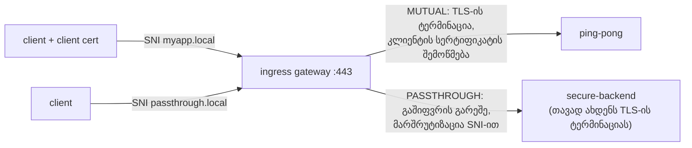

[Русская версия](README_RU.MD) · [Eng version](README.MD) · [Versión en español](README_ES.MD) · [Version française](README_FR.MD) · [Deutsche Version](README_DE.MD) · [繁體中文版](README_TW.MD) · [日本語版](README_JP.MD)

# ლაბორატორია 29 - Ingress TLS: MUTUAL და PASSTHROUGH რეჟიმები

> [საცნობარო გადაწყვეტა](worker/files/solutions/1_GE.MD)

## მიმოხილვა

ლაბორატორია 13-ში TLS-ის ტერმინაცია ingress gateway-ზე `SIMPLE` რეჟიმში მოვახდინეთ. თუმცა gateway-ს
TLS-ის სხვა რეჟიმებიც აქვს:

- **MUTUAL** - gateway ახდენს TLS-ის ტერმინაციას და **მოითხოვს კლიენტის სერტიფიკატს** (შემომავალი mTLS):
  გამოსადეგია პარტნიორული/B2B API-ებისთვის, სადაც კლიენტმა საკუთარი ვინაობა უნდა დაადასტუროს.
- **PASSTHROUGH** - gateway ტრაფიკს **არ გაშიფრავს** და SNI-ის მიხედვით დაშიფრულ ნაკადს
  უცვლელად გადასცემს; TLS-ის ტერმინაციას თავად ბექენდი ახდენს (end-to-end დაშიფვრა).

ლაბორატორიაში უკვე შექმნილია PKI (სერვერის, კლიენტისა და ბექენდის სერტიფიკატები) და განთავსებულია:
- `ping-pong` (ns `app`, sidecar-ით) - MUTUAL-ის სამიზნე;
- `secure-backend` (ns `backend`, sidecar-ის გარეშე) - TLS-only nginx, პასუხობს `secure-ok`-ით,
  PASSTHROUGH-ის სამიზნე.

Ingress gateway უსმენს HTTPS-ს NodePort `32443`-ზე.



## ინფრასტრუქტურა

| კომპონენტი | ტიპი | რაოდენობა | როლი |
|---|---|---|---|
| control-plane | `t3.medium` | 1 | master + istiod + ingress gateway |
| worker | `t3.small` | 1 | რესურსები ping-pong-ისა და secure-backend-ისთვის |
| worker PC | `t3.small` | 1 | სამუშაო გარემო: `kubectl`, `curl`, `check_result` |

რეგიონი: `eu-central-1` (AZ `eu-central-1a` / `eu-central-1b`).

## განთავსება

```bash
TASK=29 make run_ica_task
```

## დავალება

1. შექმენით `Gateway` ორი სერვერით 443 პორტზე (განსხვავდებიან SNI-ის მიხედვით):
   - `myapp.local` - `tls.mode: MUTUAL`, `credentialName: myapp-credential`;
   - `passthrough.local` - `tls.mode: PASSTHROUGH`.
2. `VirtualService` (http) `myapp.local`-ისთვის → `ping-pong`.
3. `VirtualService` (tls, `sniHosts`) `passthrough.local`-ისთვის → `secure-backend`.
4. შეამოწმეთ: MUTUAL კლიენტის სერტიფიკატის გარეშე უარყოფილია, სერტიფიკატით → 200; PASSTHROUGH → 200.

## ნაბიჯი 1. Gateway MUTUAL + PASSTHROUGH რეჟიმებით

```bash
kubectl apply -f - <<'EOF'
apiVersion: networking.istio.io/v1
kind: Gateway
metadata:
  name: edge-gateway
  namespace: app
spec:
  selector:
    istio: ingressgateway
  servers:
    - port:
        number: 443
        name: https-mutual
        protocol: HTTPS
      tls:
        mode: MUTUAL
        credentialName: myapp-credential
      hosts:
        - "myapp.local"
    - port:
        number: 443
        name: https-passthrough
        protocol: HTTPS
      tls:
        mode: PASSTHROUGH
      hosts:
        - "passthrough.local"
EOF
```

## ნაბიჯი 2. მარშრუტი MUTUAL ჰოსტისთვის (HTTP ტერმინაციის შემდეგ)

```bash
kubectl apply -f - <<'EOF'
apiVersion: networking.istio.io/v1
kind: VirtualService
metadata:
  name: myapp
  namespace: app
spec:
  hosts:
    - "myapp.local"
  gateways:
    - edge-gateway
  http:
    - route:
        - destination:
            host: ping-pong
            port:
              number: 8080
EOF
```

## ნაბიჯი 3. მარშრუტი PASSTHROUGH ჰოსტისთვის (TLS, SNI-ის მიხედვით)

```bash
kubectl apply -f - <<'EOF'
apiVersion: networking.istio.io/v1
kind: VirtualService
metadata:
  name: passthrough
  namespace: app
spec:
  hosts:
    - "passthrough.local"
  gateways:
    - edge-gateway
  tls:
    - match:
        - sniHosts:
            - "passthrough.local"
      route:
        - destination:
            host: secure-backend.backend.svc.cluster.local
            port:
              number: 443
EOF
```

## ნაბიჯი 4. შემოწმება

```bash
# MUTUAL - კლიენტის სერტიფიკატის გარეშე handshake უარყოფილია
curl -sk -o /dev/null -w "%{http_code}\n" https://myapp.local:32443/        # არა 200

# MUTUAL - კლიენტის სერტიფიკატით გადის
kubectl get secret client-certs -n app -o jsonpath='{.data.client\.crt}' | base64 -d > /tmp/c.crt
kubectl get secret client-certs -n app -o jsonpath='{.data.client\.key}' | base64 -d > /tmp/c.key
curl -sk --cert /tmp/c.crt --key /tmp/c.key https://myapp.local:32443/      # 200

# PASSTHROUGH - TLS-ს ტერმინაციას ახდენს ბექენდი
curl -sk https://passthrough.local:32443/                                   # secure-ok
```

## TLS რეჟიმების მოკლე მიმოხილვა

| რეჟიმი | ვინ ახდენს TLS-ის ტერმინაციას | კლიენტის სერტიფიკატი | როდის გამოიყენება |
|---|---|---|---|
| `SIMPLE` (ლაბორატორია 13) | gateway | არა | ჩვეულებრივი HTTPS ingress |
| `MUTUAL` | gateway | **სავალდებულოა** (მოწმდება `ca.crt`-ით) | შემომავალი mTLS, B2B/პარტნიორული API-ები |
| `PASSTHROUGH` | ბექენდი | gateway-ზე არა | end-to-end დაშიფვრა, gateway ვერ ხედავს plaintext-ს |
| `ISTIO_MUTUAL` | gateway (Istio-ს სერტიფიკატები) | მართავს Istio | gateway-ს mesh-ის შიდა ტრაფიკი |

## როგორ მუშაობს

- ერთ `Gateway`-ს შეუძლია **ერთ პორტზე რამდენიმე სერვერი** ჰქონდეს; Istio სერვერს
  **SNI**-ის მიხედვით ირჩევს (`myapp.local` და `passthrough.local`).
- **MUTUAL**: gateway წარადგენს სერვერის სერტიფიკატს და მოითხოვს კლიენტის სერტიფიკატს,
  რომელსაც `myapp-credential`-ში არსებული `ca.crt`-ით ამოწმებს. ტერმინაციის შემდეგ გამოიყენება
  ჩვეულებრივი L7 მარშრუტიზაცია (`http`).
- **PASSTHROUGH**: gateway ტრაფიკს არ გაშიფრავს; `VirtualService.tls` + `sniHosts`-ის მეშვეობით
  SNI-ის მიხედვით L4-ზე მარშრუტიზაციას ახდენს და დაუმუშავებელ TLS-ს გადასცემს ბექენდს, რომელიც
  ფლობს სერტიფიკატს და TLS-ის ტერმინაციას ახდენს.

## შედეგის შემოწმება

გაუშვით worker PC-ზე:

```bash
check_result
```

## შეჯამება

თქვენ ingress gateway-ზე TLS-ის ორი გაფართოებული რეჟიმი დააკონფიგურირეთ: შემომავალი mTLS (MUTUAL) და
გამჭოლი TLS (PASSTHROUGH), რომლებიც ერთ პორტზე SNI-ის მიხედვით განსხვავდება. gateway-ის TLS-ის ყველა
რეჟიმის ცოდნა სერვისების უსაფრთხოდ გამოქვეყნებისთვის მნიშვნელოვანი უნარია (პარტნიორული API-ები, end-to-end
დაშიფვრა).
