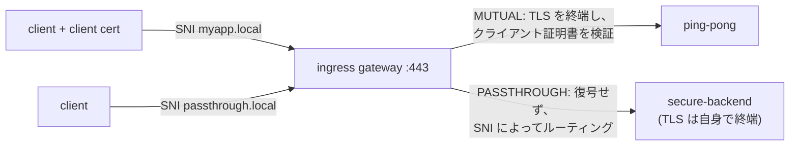

[Русская версия](README_RU.MD) · [Eng version](README.MD) · [Versión en español](README_ES.MD) · [Version française](README_FR.MD) · [Deutsche Version](README_DE.MD) · [ქართული ვერსია](README_GE.MD) · [繁體中文版](README_TW.MD)

# Lab 29 - Ingress TLS: MUTUAL と PASSTHROUGH モード

> [リファレンス解答](worker/files/solutions/1_JP.MD)

## 概要

Lab 13 では、`SIMPLE` モードで Ingress Gateway の TLS を終端しました。しかし、Gateway
には他にも TLS モードがあります。

- **MUTUAL** - Gateway が TLS を終端し、**クライアント証明書を要求**します（入口での
  mTLS）。クライアントが自身の ID を証明する必要がある、パートナー向け/B2B API に適しています。
- **PASSTHROUGH** - Gateway はトラフィックを**復号せず**、SNI に基づいて暗号化された
  ストリームを転送します。TLS はバックエンド自身が終端します（エンドツーエンド暗号化）。

この Lab にはすでに PKI（サーバー、クライアント、バックエンドの証明書）が作成され、以下が
デプロイされています。
- `ping-pong`（ns `app`、sidecar あり）- MUTUAL の宛先。
- `secure-backend`（ns `backend`、sidecar なし）- `secure-ok` を返す TLS 専用 nginx、
  PASSTHROUGH の宛先。

Ingress Gateway は NodePort `32443` で HTTPS をリッスンします。



## インフラストラクチャ

| コンポーネント | タイプ | 数 | 役割 |
|---|---|---|---|
| control-plane | `t3.medium` | 1 | master + istiod + ingress gateway |
| worker | `t3.small` | 1 | ping-pong と secure-backend の容量 |
| worker PC | `t3.small` | 1 | 作業環境: `kubectl`、`curl`、`check_result` |

リージョン: `eu-central-1`（AZ `eu-central-1a` / `eu-central-1b`）。

## デプロイ

```bash
TASK=29 make run_ica_task
```

## 課題

1. ポート 443 に 2 つのサーバーを持つ `Gateway` を作成します（SNI で区別）。
   - `myapp.local` - `tls.mode: MUTUAL`、`credentialName: myapp-credential`。
   - `passthrough.local` - `tls.mode: PASSTHROUGH`。
2. `myapp.local` → `ping-pong` 用の `VirtualService`（http）。
3. `passthrough.local` → `secure-backend` 用の `VirtualService`（tls、`sniHosts`）。
4. 検証: クライアント証明書なしの MUTUAL は拒否され、証明書ありでは → 200、PASSTHROUGH では → 200。

## ステップ 1. MUTUAL + PASSTHROUGH を持つ Gateway

```bash
kubectl apply -f - <<'EOF'
apiVersion: networking.istio.io/v1
kind: Gateway
metadata:
  name: edge-gateway
  namespace: app
spec:
  selector:
    istio: ingressgateway
  servers:
    - port:
        number: 443
        name: https-mutual
        protocol: HTTPS
      tls:
        mode: MUTUAL
        credentialName: myapp-credential
      hosts:
        - "myapp.local"
    - port:
        number: 443
        name: https-passthrough
        protocol: HTTPS
      tls:
        mode: PASSTHROUGH
      hosts:
        - "passthrough.local"
EOF
```

## ステップ 2. MUTUAL ホストのルート（終端後の HTTP）

```bash
kubectl apply -f - <<'EOF'
apiVersion: networking.istio.io/v1
kind: VirtualService
metadata:
  name: myapp
  namespace: app
spec:
  hosts:
    - "myapp.local"
  gateways:
    - edge-gateway
  http:
    - route:
        - destination:
            host: ping-pong
            port:
              number: 8080
EOF
```

## ステップ 3. PASSTHROUGH ホストのルート（TLS、SNI による）

```bash
kubectl apply -f - <<'EOF'
apiVersion: networking.istio.io/v1
kind: VirtualService
metadata:
  name: passthrough
  namespace: app
spec:
  hosts:
    - "passthrough.local"
  gateways:
    - edge-gateway
  tls:
    - match:
        - sniHosts:
            - "passthrough.local"
      route:
        - destination:
            host: secure-backend.backend.svc.cluster.local
            port:
              number: 443
EOF
```

## ステップ 4. 検証

```bash
# MUTUAL - クライアント証明書なしではハンドシェイクが拒否される
curl -sk -o /dev/null -w "%{http_code}\n" https://myapp.local:32443/        # 200 ではない

# MUTUAL - クライアント証明書ありで通過する
kubectl get secret client-certs -n app -o jsonpath='{.data.client\.crt}' | base64 -d > /tmp/c.crt
kubectl get secret client-certs -n app -o jsonpath='{.data.client\.key}' | base64 -d > /tmp/c.key
curl -sk --cert /tmp/c.crt --key /tmp/c.key https://myapp.local:32443/      # 200

# PASSTHROUGH - TLS はバックエンドが終端する
curl -sk https://passthrough.local:32443/                                   # secure-ok
```

## TLS モードの要約

| モード | TLS を終端するもの | クライアント証明書 | 用途 |
|---|---|---|---|
| `SIMPLE`（Lab 13） | Gateway | いいえ | 通常の HTTPS Ingress |
| `MUTUAL` | Gateway | **必須**（`ca.crt` に対して検証） | 入口での mTLS、B2B/パートナー API |
| `PASSTHROUGH` | バックエンド | Gateway では不要 | エンドツーエンド暗号化、Gateway は平文を確認しない |
| `ISTIO_MUTUAL` | Gateway（Istio 証明書） | Istio が管理 | メッシュ内の Gateway トラフィック |

## 仕組み

- 1 つの `Gateway` は**同じポート上に複数のサーバー**を保持できます。Istio は
  **SNI**（`myapp.local` と `passthrough.local`）に基づいてサーバーを選択します。
- **MUTUAL**: Gateway はサーバー証明書を提示し、`myapp-credential` 内の `ca.crt` に対して
  検証するクライアント証明書を要求します。終端後は通常の L7 ルーティング（`http`）になります。
- **PASSTHROUGH**: Gateway は復号しません。`VirtualService.tls` + `sniHosts` を通じて L4 で
  SNI に基づきルーティングし、証明書を保有して TLS を終端するバックエンドへ生の TLS を転送します。

## 結果の検証

worker PC で実行します。

```bash
check_result
```

## まとめ

Ingress Gateway に、入口での mTLS（MUTUAL）とエンドツーエンド TLS（PASSTHROUGH）という
2 つの高度な TLS モードを設定しました。同じポート上で SNI によって区別されます。Gateway の
すべての TLS モードを理解することは、サービスを安全に公開する（パートナー API、エンドツーエンド
暗号化）ための重要なスキルです。