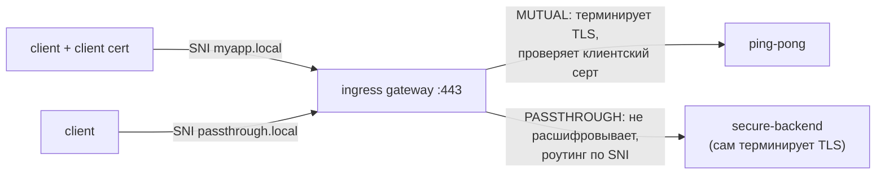

[Eng version](README.MD)

# Lab 29 — Ingress TLS: режимы MUTUAL и PASSTHROUGH

## Обзор

В Lab 13 мы терминировали TLS на ingress gateway в режиме `SIMPLE`. Но у gateway есть и
другие TLS-режимы:

- **MUTUAL** — gateway терминирует TLS и **требует клиентский сертификат** (mTLS на входе):
  подходит для партнёрских/B2B API, где клиент должен доказать свою личность.
- **PASSTHROUGH** — gateway **не расшифровывает** трафик, а по SNI пробрасывает
  зашифрованный поток дальше; TLS терминирует сам бэкенд (end-to-end шифрование).

В лабе уже создан PKI (сертификаты сервера, клиента, бэкенда) и развёрнуты:
- `ping-pong` (ns `app`, с sidecar) — цель для MUTUAL;
- `secure-backend` (ns `backend`, без sidecar) — TLS-only nginx, отвечает `secure-ok`,
  цель для PASSTHROUGH.

Ingress gateway слушает HTTPS на NodePort `32443`.



## Задание

1. Создать `Gateway` с двумя серверами на порту 443 (различаются по SNI):
   - `myapp.local` — `tls.mode: MUTUAL`, `credentialName: myapp-credential`;
   - `passthrough.local` — `tls.mode: PASSTHROUGH`.
2. `VirtualService` (http) для `myapp.local` → `ping-pong`.
3. `VirtualService` (tls, `sniHosts`) для `passthrough.local` → `secure-backend`.
4. Проверить: MUTUAL без клиентского серта отклоняется, с сертом → 200; PASSTHROUGH → 200.

## Шаг 1. Gateway с MUTUAL + PASSTHROUGH

```bash
kubectl apply -f - <<'EOF'
apiVersion: networking.istio.io/v1
kind: Gateway
metadata:
  name: edge-gateway
  namespace: app
spec:
  selector:
    istio: ingressgateway
  servers:
    - port:
        number: 443
        name: https-mutual
        protocol: HTTPS
      tls:
        mode: MUTUAL
        credentialName: myapp-credential
      hosts:
        - "myapp.local"
    - port:
        number: 443
        name: https-passthrough
        protocol: HTTPS
      tls:
        mode: PASSTHROUGH
      hosts:
        - "passthrough.local"
EOF
```

## Шаг 2. Маршрут для MUTUAL-хоста (HTTP после терминации)

```bash
kubectl apply -f - <<'EOF'
apiVersion: networking.istio.io/v1
kind: VirtualService
metadata:
  name: myapp
  namespace: app
spec:
  hosts:
    - "myapp.local"
  gateways:
    - edge-gateway
  http:
    - route:
        - destination:
            host: ping-pong
            port:
              number: 8080
EOF
```

## Шаг 3. Маршрут для PASSTHROUGH-хоста (TLS, по SNI)

```bash
kubectl apply -f - <<'EOF'
apiVersion: networking.istio.io/v1
kind: VirtualService
metadata:
  name: passthrough
  namespace: app
spec:
  hosts:
    - "passthrough.local"
  gateways:
    - edge-gateway
  tls:
    - match:
        - sniHosts:
            - "passthrough.local"
      route:
        - destination:
            host: secure-backend.backend.svc.cluster.local
            port:
              number: 443
EOF
```

## Шаг 4. Проверка

```bash
# MUTUAL — без клиентского серта хендшейк отклоняется
curl -sk -o /dev/null -w "%{http_code}\n" https://myapp.local:32443/        # не 200

# MUTUAL — с клиентским сертом проходит
kubectl get secret client-certs -n app -o jsonpath='{.data.client\.crt}' | base64 -d > /tmp/c.crt
kubectl get secret client-certs -n app -o jsonpath='{.data.client\.key}' | base64 -d > /tmp/c.key
curl -sk --cert /tmp/c.crt --key /tmp/c.key https://myapp.local:32443/      # 200

# PASSTHROUGH — TLS терминирует бэкенд
curl -sk https://passthrough.local:32443/                                   # secure-ok
```

## Режимы TLS кратко

| Режим | Кто терминирует TLS | Клиентский серт | Когда |
|---|---|---|---|
| `SIMPLE` (Lab 13) | gateway | нет | обычный HTTPS ingress |
| `MUTUAL` | gateway | **обязателен** (проверяется по `ca.crt`) | mTLS на входе, B2B/партнёрские API |
| `PASSTHROUGH` | бэкенд | на gateway нет | end-to-end шифрование, gateway не видит plaintext |
| `ISTIO_MUTUAL` | gateway (серты Istio) | управляется Istio | mesh-внутренний трафик gateway |

## Как это работает

- Один `Gateway` может держать **несколько серверов на одном порту**; Istio выбирает
  сервер по **SNI** (`myapp.local` vs `passthrough.local`).
- **MUTUAL**: gateway предъявляет серверный серт и требует клиентский, проверяя его по
  `ca.crt` внутри `myapp-credential`. После терминации — обычный L7-роутинг (`http`).
- **PASSTHROUGH**: gateway не расшифровывает; роутит по SNI на L4 через
  `VirtualService.tls` + `sniHosts` и пробрасывает сырой TLS в бэкенд, который владеет
  сертификатом и терминирует TLS.

## Проверка результата

Запустите на worker PC:

```bash
check_result
```

## Итог

Вы настроили на ingress gateway два продвинутых TLS-режима: mTLS на входе (MUTUAL) и
сквозной TLS (PASSTHROUGH), различаемые по SNI на одном порту. Понимание всех режимов TLS
gateway — важный навык для безопасной публикации сервисов (партнёрские API, end-to-end
шифрование).

## Инфраструктура

| Компонент | Тип | Кол-во | Роль |
|---|---|---|---|
| control-plane | `t3.medium` | 1 | master + istiod + ingress gateway |
| worker | `t3.small` | 1 | ёмкость для ping-pong и secure-backend |
| worker PC | `t3.small` | 1 | рабочее место: `kubectl`, `curl`, `check_result` |

Регион: `eu-central-1` (AZ `eu-central-1a` / `eu-central-1b`).
