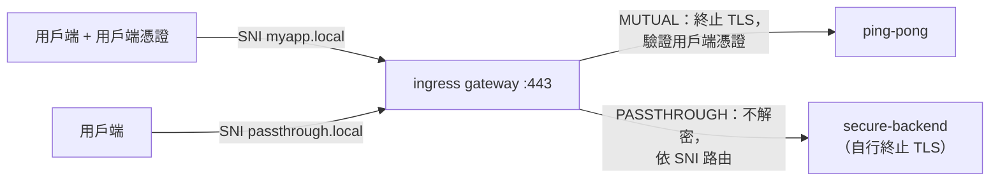

[Русская версия](README_RU.MD) · [Eng version](README.MD) · [Versión en español](README_ES.MD) · [Version française](README_FR.MD) · [Deutsche Version](README_DE.MD) · [ქართული ვერსია](README_GE.MD) · [日本語版](README_JP.MD)

# Lab 29 - Ingress TLS：MUTUAL 與 PASSTHROUGH 模式

> [參考解答](worker/files/solutions/1_TW.MD)

## 概述

在 Lab 13 中，我們以 `SIMPLE` 模式在 ingress gateway 上終止 TLS。但 gateway 還提供其他
TLS 模式：

- **MUTUAL** - gateway 終止 TLS，並且**要求用戶端憑證**（入口 mTLS）：
  適合合作夥伴／B2B API，因為用戶端必須證明其身分。
- **PASSTHROUGH** - gateway**不會解密**流量，而是依 SNI 將加密資料流轉送至後端；
  TLS 由後端本身終止（端對端加密）。

本 Lab 已建立 PKI（伺服器、用戶端與後端憑證），並已部署：
- `ping-pong`（命名空間 `app`，含 sidecar）- MUTUAL 的目標；
- `secure-backend`（命名空間 `backend`，不含 sidecar）- 僅 TLS 的 nginx，回應 `secure-ok`，
  為 PASSTHROUGH 的目標。

Ingress gateway 會在 NodePort `32443` 上監聽 HTTPS。



## 基礎架構

| 元件 | 類型 | 數量 | 角色 |
|---|---|---|---|
| control-plane | `t3.medium` | 1 | master + istiod + ingress gateway |
| worker | `t3.small` | 1 | ping-pong 與 secure-backend 的容量 |
| worker PC | `t3.small` | 1 | 工作站：`kubectl`、`curl`、`check_result` |

區域：`eu-central-1`（AZ `eu-central-1a` / `eu-central-1b`）。

## 部署

```bash
TASK=29 make run_ica_task
```

## 任務

1. 建立一個在連接埠 443 上含有兩個伺服器（依 SNI 區分）的 `Gateway`：
   - `myapp.local` - `tls.mode: MUTUAL`，`credentialName: myapp-credential`；
   - `passthrough.local` - `tls.mode: PASSTHROUGH`。
2. 為 `myapp.local` → `ping-pong` 建立 `VirtualService`（http）。
3. 為 `passthrough.local` → `secure-backend` 建立 `VirtualService`（tls，`sniHosts`）。
4. 驗證：沒有用戶端憑證的 MUTUAL 會被拒絕，使用憑證則 → 200；PASSTHROUGH → 200。

## 步驟 1. 建立含 MUTUAL + PASSTHROUGH 的 Gateway

```bash
kubectl apply -f - <<'EOF'
apiVersion: networking.istio.io/v1
kind: Gateway
metadata:
  name: edge-gateway
  namespace: app
spec:
  selector:
    istio: ingressgateway
  servers:
    - port:
        number: 443
        name: https-mutual
        protocol: HTTPS
      tls:
        mode: MUTUAL
        credentialName: myapp-credential
      hosts:
        - "myapp.local"
    - port:
        number: 443
        name: https-passthrough
        protocol: HTTPS
      tls:
        mode: PASSTHROUGH
      hosts:
        - "passthrough.local"
EOF
```

## 步驟 2. MUTUAL 主機的路由（終止後為 HTTP）

```bash
kubectl apply -f - <<'EOF'
apiVersion: networking.istio.io/v1
kind: VirtualService
metadata:
  name: myapp
  namespace: app
spec:
  hosts:
    - "myapp.local"
  gateways:
    - edge-gateway
  http:
    - route:
        - destination:
            host: ping-pong
            port:
              number: 8080
EOF
```

## 步驟 3. PASSTHROUGH 主機的路由（TLS，依 SNI）

```bash
kubectl apply -f - <<'EOF'
apiVersion: networking.istio.io/v1
kind: VirtualService
metadata:
  name: passthrough
  namespace: app
spec:
  hosts:
    - "passthrough.local"
  gateways:
    - edge-gateway
  tls:
    - match:
        - sniHosts:
            - "passthrough.local"
      route:
        - destination:
            host: secure-backend.backend.svc.cluster.local
            port:
              number: 443
EOF
```

## 步驟 4. 驗證

```bash
# MUTUAL - 沒有用戶端憑證，交握被拒絕
curl -sk -o /dev/null -w "%{http_code}\n" https://myapp.local:32443/        # 不是 200

# MUTUAL - 帶有用戶端憑證則通過
kubectl get secret client-certs -n app -o jsonpath='{.data.client\.crt}' | base64 -d > /tmp/c.crt
kubectl get secret client-certs -n app -o jsonpath='{.data.client\.key}' | base64 -d > /tmp/c.key
curl -sk --cert /tmp/c.crt --key /tmp/c.key https://myapp.local:32443/      # 200

# PASSTHROUGH - 由後端終止 TLS
curl -sk https://passthrough.local:32443/                                   # secure-ok
```

## TLS 模式摘要

| 模式 | 終止 TLS 的元件 | 用戶端憑證 | 適用時機 |
|---|---|---|---|
| `SIMPLE`（Lab 13） | gateway | 無 | 一般 HTTPS ingress |
| `MUTUAL` | gateway | **必要**（依 `ca.crt` 驗證） | 入口 mTLS、B2B／合作夥伴 API |
| `PASSTHROUGH` | 後端 | gateway 不需要 | 端對端加密，gateway 看不到明文 |
| `ISTIO_MUTUAL` | gateway（Istio 憑證） | 由 Istio 管理 | gateway 的 mesh 內部流量 |

## 運作方式

- 一個 `Gateway` 可在**同一連接埠上保有多個伺服器**；Istio 依 **SNI** 選擇
  伺服器（`myapp.local` 與 `passthrough.local`）。
- **MUTUAL**：gateway 提供伺服器憑證並要求用戶端憑證，使用
  `myapp-credential` 內的 `ca.crt` 驗證。終止後即為一般 L7 路由（`http`）。
- **PASSTHROUGH**：gateway 不會解密；它透過 `VirtualService.tls` + `sniHosts`
  在 L4 依 SNI 路由，並將原始 TLS 轉送至後端，後端持有憑證並終止 TLS。

## 驗證結果

在 worker PC 上執行：

```bash
check_result
```

## 總結

您已在 ingress gateway 上設定兩種進階 TLS 模式：入口 mTLS（MUTUAL）以及
端對端 TLS（PASSTHROUGH），兩者透過同一連接埠上的 SNI 區分。了解所有 TLS 模式
對於安全地公開服務（合作夥伴 API、端對端加密）是重要技能。
