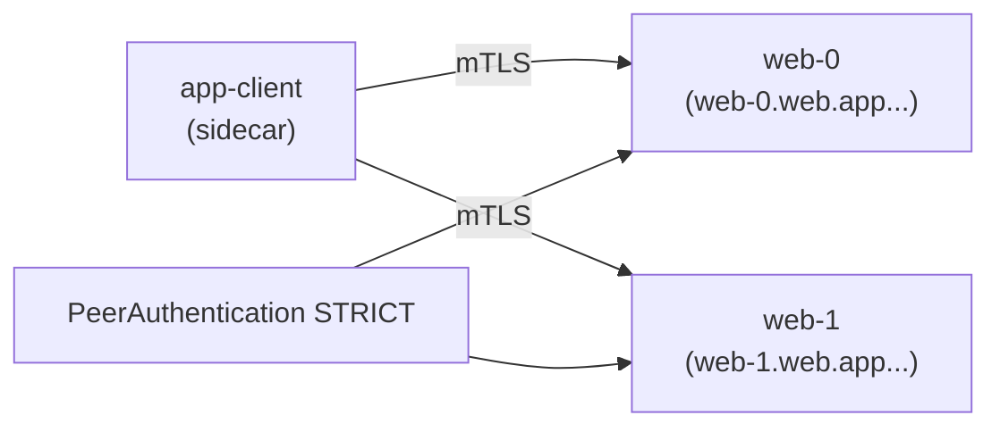

[RU version](README_RU.MD) · [Versión en español](README_ES.MD) · [Version française](README_FR.MD) · [Deutsche Version](README_DE.MD)

# Lab 30 - StatefulSets and headless services in the mesh

## Overview

A headless Service (`clusterIP: None`) has no virtual IP: DNS returns the individual pod
IPs. StatefulSet apps (Kafka, databases, quorum systems) often talk to a **specific** peer
by its stable name (`web-0.web...`) rather than a load-balanced VIP.

This historically clashed with the mesh: Envoy created `0.0.0.0` listeners that conflicted
with apps binding only to the pod IP, and mTLS on headless services was problematic.
**Istio 1.10+** supports headless natively: per-pod listeners and automatic mTLS work.

The lab has namespace `app` (istio-injection) and an in-mesh client `app-client`.
`istioctl` is available on the worker PC.



## Infrastructure

| Component | Type | Count | Role |
|---|---|---|---|
| control-plane | `t3.medium` | 1 | master + istiod |
| worker | `t3.small` | 1 | capacity for the StatefulSet and the client |
| worker PC | `t3.small` | 1 | workstation: `kubectl`, `istioctl`, `check_result` |

Region: `eu-central-1` (AZ `eu-central-1a` / `eu-central-1b`).

## Provisioning

```bash
TASK=30 make run_ica_task
```

## Task

1. Create a **headless Service** `web` (`clusterIP: None`) with a **named** port.
2. Create a **StatefulSet** `web` (`serviceName: web`, 2 replicas) in namespace `app`.
3. Enable **STRICT** mTLS in namespace `app`.
4. Confirm each replica is reachable by its stable DNS (`web-0.web.app...`,
   `web-1.web.app...`) over mTLS.

## Step 1. Headless Service + StatefulSet

The Service must be `clusterIP: None` and have a **named** port (Istio uses the port-name
prefix for protocol detection). The StatefulSet's `serviceName` must match the headless
Service so pods get stable DNS names `<pod>.<svc>.<ns>.svc.cluster.local`.

```bash
kubectl apply -f - <<'EOF'
apiVersion: v1
kind: Service
metadata:
  name: web
  namespace: app
  labels:
    app: web
spec:
  clusterIP: None          # headless
  selector:
    app: web
  ports:
    - name: http           # named port - required for Istio protocol detection
      port: 8080
      targetPort: 8080
---
apiVersion: apps/v1
kind: StatefulSet
metadata:
  name: web
  namespace: app
spec:
  serviceName: web         # ties the pods to the headless Service
  replicas: 2
  selector:
    matchLabels:
      app: web
  template:
    metadata:
      labels:
        app: web
    spec:
      containers:
        - name: web
          image: viktoruj/ping_pong:latest
          env:
            - name: ENABLE_DEFAULT_HOSTNAME   # report the real pod name (web-0/web-1)
              value: "false"
          ports:
            - name: http
              containerPort: 8080
EOF

kubectl rollout status statefulset/web -n app
```

## Step 2. Enforce STRICT mTLS

```bash
kubectl apply -f - <<'EOF'
apiVersion: security.istio.io/v1
kind: PeerAuthentication
metadata:
  name: default
  namespace: app
spec:
  mtls:
    mode: STRICT
EOF
```

## Step 3. Reach each replica by its stable identity (over mTLS)

```bash
kubectl exec -n app deploy/app-client -c curl -- \
  curl -s http://web-0.web.app.svc.cluster.local:8080/ | grep "Server Name"
# Server Name: web-0

kubectl exec -n app deploy/app-client -c curl -- \
  curl -s http://web-1.web.app.svc.cluster.local:8080/ | grep "Server Name"
# Server Name: web-1
```

Each stable DNS name resolves to a specific pod, and the traffic is mTLS-encrypted by the
sidecars even though the Service is headless.

## Why this matters and what to watch

- **Port naming** is required: `http`/`tcp`/`grpc`/`mongo-*` etc. An unnamed port makes
  Istio treat it as opaque TCP and you lose L7 features.
- **StatefulSet + serviceName** gives stable pod DNS names - exactly how DB/broker
  clusters are addressed.
- **STRICT mTLS works on headless** since Istio 1.10+ - per-pod traffic encryption with no
  VIP.

## External headless services (bonus)

For a headless service that lives **outside** the cluster (e.g. an external Kafka), add a
`ServiceEntry` with `resolution: DNS` so the mesh can resolve and route to it:

```yaml
apiVersion: networking.istio.io/v1
kind: ServiceEntry
metadata:
  name: kafka-ext
  namespace: app
spec:
  hosts: ["kafka.example.com"]
  location: MESH_INTERNAL
  ports:
    - name: tcp-kafka
      number: 9092
      protocol: TCP
  resolution: DNS
```

## Check the result

Run on the worker PC:

```bash
check_result
```

## Summary

You ran a StatefulSet behind a headless Service in the mesh, enabled STRICT mTLS, and
reached each replica by its stable identity. Understanding headless/StatefulSet specifics
(port naming, stable DNS, mTLS without a VIP) is a key skill for running stateful workloads
(databases, brokers, quorum systems) in a service mesh.
