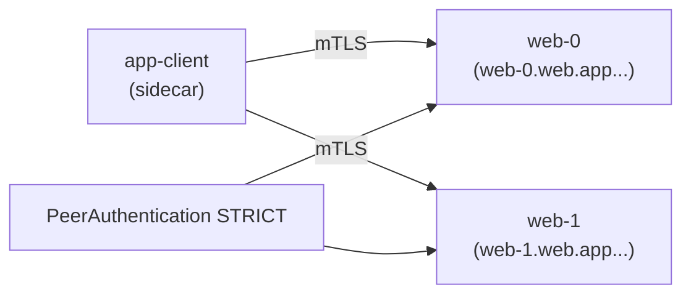

[RU version](README_RU.MD) · [Eng version](README.MD) · [Versión en español](README_ES.MD) · [Version française](README_FR.MD)

# Lab 30 - StatefulSet und Headless-Services im Mesh

## Überblick

Ein Headless-Service (`clusterIP: None`) hat keine virtuelle IP: DNS liefert die IPs einzelner
Pods zurück. StatefulSet-Anwendungen (Kafka, Datenbanken, Quorum-Systeme) sprechen oft einen
**konkreten** Peer über dessen stabilen Namen an (`web-0.web...`), nicht eine gelastbalancierte VIP.

Historisch vertrug sich das schlecht mit dem Mesh: Envoy erstellte Listener auf `0.0.0.0`, was
mit Anwendungen kollidierte, die nur auf der Pod-IP lauschten, und mTLS auf Headless-Services
brach. **Istio 1.10+** unterstützt Headless nativ: Per-Pod-Listener und automatisches mTLS
funktionieren.

Im Lab gibt es den Namespace `app` (Injection) und den In-Mesh-Client `app-client`. Auf dem
worker PC ist `istioctl` vorhanden.



## Infrastruktur

| Komponente | Typ | Anzahl | Rolle |
|---|---|---|---|
| control-plane | `t3.medium` | 1 | master + istiod |
| worker | `t3.small` | 1 | Kapazität für StatefulSet und Client |
| worker PC | `t3.small` | 1 | Arbeitsplatz: `kubectl`, `istioctl`, `check_result` |

Region: `eu-central-1` (AZ `eu-central-1a` / `eu-central-1b`).

## Deployment

```bash
TASK=30 make run_ica_task
```

## Aufgabe

1. Einen **Headless Service** `web` (`clusterIP: None`) mit **benanntem** Port erstellen.
2. Ein **StatefulSet** `web` (`serviceName: web`, 2 Replikate) im Namespace `app` erstellen.
3. **STRICT** mTLS im Namespace `app` aktivieren.
4. Sicherstellen, dass jedes Replikat über stabiles DNS (`web-0.web.app...`,
   `web-1.web.app...`) per mTLS erreichbar ist.

## Schritt 1. Headless Service + StatefulSet

Der Service muss `clusterIP: None` sein und einen **benannten** Port haben (Istio bestimmt das
Protokoll anhand des Präfixes des Portnamens). Der `serviceName` des StatefulSet muss mit dem
Headless Service übereinstimmen, dann erhalten die Pods stabile DNS-Namen
`<pod>.<svc>.<ns>.svc.cluster.local`.

```bash
kubectl apply -f - <<'EOF'
apiVersion: v1
kind: Service
metadata:
  name: web
  namespace: app
  labels:
    app: web
spec:
  clusterIP: None          # headless
  selector:
    app: web
  ports:
    - name: http           # benannter Port - von Istio zur Protokollbestimmung benötigt
      port: 8080
      targetPort: 8080
---
apiVersion: apps/v1
kind: StatefulSet
metadata:
  name: web
  namespace: app
spec:
  serviceName: web         # verbindet die Pods mit dem Headless Service
  replicas: 2
  selector:
    matchLabels:
      app: web
  template:
    metadata:
      labels:
        app: web
    spec:
      containers:
        - name: web
          image: viktoruj/ping_pong:latest
          env:
            - name: ENABLE_DEFAULT_HOSTNAME   # den echten Pod-Namen zurückgeben (web-0/web-1)
              value: "false"
          ports:
            - name: http
              containerPort: 8080
EOF

kubectl rollout status statefulset/web -n app
```

## Schritt 2. STRICT mTLS aktivieren

```bash
kubectl apply -f - <<'EOF'
apiVersion: security.istio.io/v1
kind: PeerAuthentication
metadata:
  name: default
  namespace: app
spec:
  mtls:
    mode: STRICT
EOF
```

## Schritt 3. Replikate über den stabilen Namen ansprechen (per mTLS)

```bash
kubectl exec -n app deploy/app-client -c curl -- \
  curl -s http://web-0.web.app.svc.cluster.local:8080/ | grep "Server Name"
# Server Name: web-0

kubectl exec -n app deploy/app-client -c curl -- \
  curl -s http://web-1.web.app.svc.cluster.local:8080/ | grep "Server Name"
# Server Name: web-1
```

Jeder stabile DNS-Name löst sich in einen konkreten Pod auf, und der Verkehr wird von den
Sidecars per mTLS verschlüsselt, obwohl der Service headless ist.

## Warum das wichtig ist und worauf zu achten ist

- **Die Benennung des Ports** ist zwingend: `http`/`tcp`/`grpc`/`mongo-*` usw. Ohne Namen
  betrachtet Istio den Port als „undurchsichtiges TCP" und verliert L7-Features.
- **StatefulSet + serviceName** liefert stabile DNS-Namen der Pods - genau so werden
  DB-/Broker-Cluster adressiert.
- **STRICT mTLS funktioniert auf Headless** ab Istio 1.10+ - Verschlüsselung des
  Per-Pod-Verkehrs ohne VIP.

## Externe Headless-Services (Bonus)

Für einen Headless-Service **außerhalb** des Clusters (z. B. externe Kafka) fügen Sie ein
`ServiceEntry` mit `resolution: DNS` hinzu, damit das Mesh ihn auflösen und routen kann:

```yaml
apiVersion: networking.istio.io/v1
kind: ServiceEntry
metadata:
  name: kafka-ext
  namespace: app
spec:
  hosts: ["kafka.example.com"]
  location: MESH_INTERNAL
  ports:
    - name: tcp-kafka
      number: 9092
      protocol: TCP
  resolution: DNS
```

## Ergebnisprüfung

Führen Sie auf dem worker PC aus:

```bash
check_result
```

## Fazit

Sie haben ein StatefulSet hinter einem Headless-Service im Mesh bereitgestellt, STRICT mTLS
aktiviert und jedes Replikat über seinen stabilen Namen angesprochen. Das Verständnis der
Besonderheiten von Headless/StatefulSet (Benennung der Ports, stabiles DNS, mTLS ohne VIP) ist
eine wichtige Fähigkeit für den Betrieb von Stateful-Workloads (DBs, Broker, Quorum-Systeme) im
Service Mesh.
