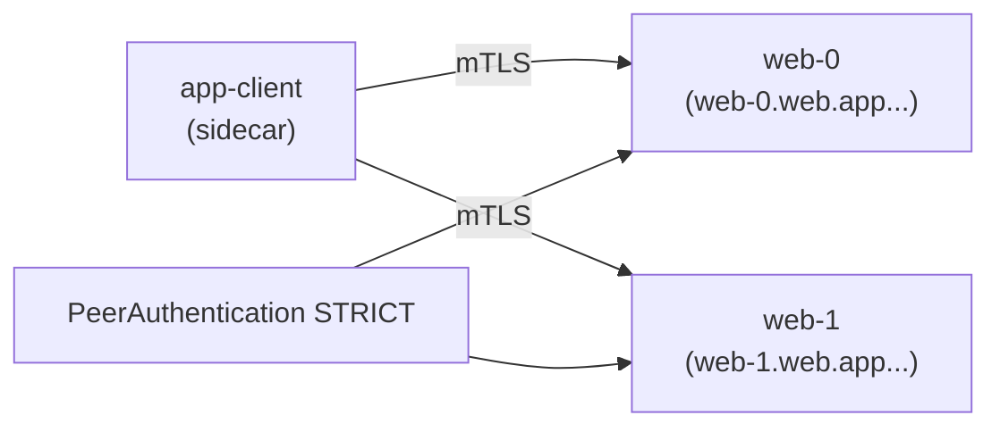

[RU version](README_RU.MD) · [Eng version](README.MD)

# Lab 30 - StatefulSet y servicios headless en la malla

## Resumen

Un servicio headless (`clusterIP: None`) no tiene IP virtual: el DNS devuelve las IP de los pods
individuales. Las aplicaciones StatefulSet (Kafka, bases de datos, sistemas de quórum) suelen
dirigirse a un peer **concreto** por su nombre estable (`web-0.web...`), no a un VIP balanceado.

Históricamente esto se llevaba mal con la malla: Envoy hacía listeners en `0.0.0.0`, lo que
entraba en conflicto con aplicaciones que solo escuchaban en la IP del pod, y el mTLS en los
servicios headless se rompía. **Istio 1.10+** soporta headless de forma nativa: los listeners
por pod y el mTLS automático funcionan.

En el lab hay un namespace `app` (con injection) y un cliente in-mesh `app-client`. En el worker
PC hay `istioctl`.



## Tarea

1. Crear un **Service headless** `web` (`clusterIP: None`) con un puerto **nombrado**.
2. Crear un **StatefulSet** `web` (`serviceName: web`, 2 réplicas) en el namespace `app`.
3. Habilitar mTLS **STRICT** en el namespace `app`.
4. Comprobar que cada réplica es accesible por su DNS estable (`web-0.web.app...`,
   `web-1.web.app...`) mediante mTLS.

## Paso 1. Service headless + StatefulSet

El servicio debe ser `clusterIP: None` y tener un puerto **nombrado** (Istio determina el
protocolo por el prefijo del nombre del puerto). El `serviceName` del StatefulSet debe coincidir
con el Service headless; así los pods obtienen nombres DNS estables
`<pod>.<svc>.<ns>.svc.cluster.local`.

```bash
kubectl apply -f - <<'EOF'
apiVersion: v1
kind: Service
metadata:
  name: web
  namespace: app
  labels:
    app: web
spec:
  clusterIP: None          # headless
  selector:
    app: web
  ports:
    - name: http           # puerto nombrado - lo necesita Istio para determinar el protocolo
      port: 8080
      targetPort: 8080
---
apiVersion: apps/v1
kind: StatefulSet
metadata:
  name: web
  namespace: app
spec:
  serviceName: web         # vincula los pods con el Service headless
  replicas: 2
  selector:
    matchLabels:
      app: web
  template:
    metadata:
      labels:
        app: web
    spec:
      containers:
        - name: web
          image: viktoruj/ping_pong:latest
          env:
            - name: ENABLE_DEFAULT_HOSTNAME   # devolver el nombre real del pod (web-0/web-1)
              value: "false"
          ports:
            - name: http
              containerPort: 8080
EOF

kubectl rollout status statefulset/web -n app
```

## Paso 2. Habilitar mTLS STRICT

```bash
kubectl apply -f - <<'EOF'
apiVersion: security.istio.io/v1
kind: PeerAuthentication
metadata:
  name: default
  namespace: app
spec:
  mtls:
    mode: STRICT
EOF
```

## Paso 3. Acceso a las réplicas por su nombre estable (mediante mTLS)

```bash
kubectl exec -n app deploy/app-client -c curl -- \
  curl -s http://web-0.web.app.svc.cluster.local:8080/ | grep "Server Name"
# Server Name: web-0

kubectl exec -n app deploy/app-client -c curl -- \
  curl -s http://web-1.web.app.svc.cluster.local:8080/ | grep "Server Name"
# Server Name: web-1
```

Cada nombre DNS estable resuelve a un pod concreto, y el tráfico se cifra con mTLS por los
sidecars, aunque el servicio sea headless.

## Por qué importa y en qué fijarse

- El **nombrado del puerto** es obligatorio: `http`/`tcp`/`grpc`/`mongo-*`, etc. Sin nombre,
  Istio considera el puerto «TCP opaco» y pierde las funciones L7.
- **StatefulSet + serviceName** da nombres DNS estables a los pods; así es como se direccionan
  los clústeres de BD/brokers.
- El **mTLS STRICT funciona en headless** desde Istio 1.10+: cifrado del tráfico por pod sin VIP.

## Servicios headless externos (bonus)

Para un servicio headless **fuera** del clúster (por ejemplo, una Kafka externa) añade un
`ServiceEntry` con `resolution: DNS`, para que la malla pueda resolverlo y enrutarlo:

```yaml
apiVersion: networking.istio.io/v1
kind: ServiceEntry
metadata:
  name: kafka-ext
  namespace: app
spec:
  hosts: ["kafka.example.com"]
  location: MESH_INTERNAL
  ports:
    - name: tcp-kafka
      number: 9092
      protocol: TCP
  resolution: DNS
```

## Verificación del resultado

Ejecuta en el worker PC:

```bash
check_result
```

## Conclusión

Has desplegado un StatefulSet detrás de un servicio headless en la malla, habilitado mTLS STRICT
y accedido a cada réplica por su nombre estable. Entender las particularidades de
headless/StatefulSet (nombrado de puertos, DNS estables, mTLS sin VIP) es una habilidad
importante para ejecutar cargas stateful (BD, brokers, sistemas de quórum) en una malla de
servicios.

## Infraestructura

| Componente | Tipo | Cantidad | Rol |
|---|---|---|---|
| control-plane | `t3.medium` | 1 | master + istiod |
| worker | `t3.small` | 1 | capacidad para el StatefulSet y el cliente |
| worker PC | `t3.small` | 1 | puesto de trabajo: `kubectl`, `istioctl`, `check_result` |

Región: `eu-central-1` (AZ `eu-central-1a` / `eu-central-1b`).
