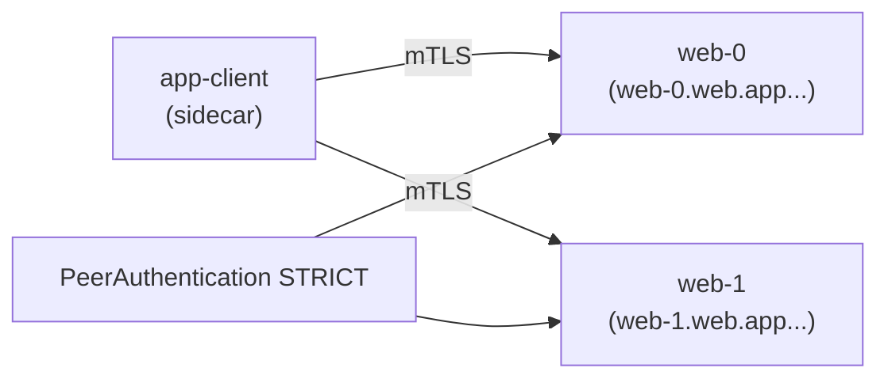

[RU version](README_RU.MD) · [Eng version](README.MD) · [Versión en español](README_ES.MD) · [Deutsche Version](README_DE.MD)

# Lab 30 - StatefulSet et services headless dans le mesh

## Aperçu

Un service headless (`clusterIP: None`) n'a pas d'IP virtuelle : le DNS renvoie les IP des pods
individuels. Les applications StatefulSet (Kafka, bases de données, systèmes à quorum)
s'adressent souvent à un pair **précis** par son nom stable (`web-0.web...`), et non à un VIP
équilibré.

Historiquement, cela cohabitait mal avec le mesh : Envoy créait des listeners sur `0.0.0.0`, ce
qui entrait en conflit avec les applications n'écoutant que sur l'IP du pod, et le mTLS sur les
services headless cassait. **Istio 1.10+** prend en charge le headless nativement : les listeners
par pod et le mTLS automatique fonctionnent.

Le lab dispose d'un namespace `app` (injection) et d'un client in-mesh `app-client`. Le worker PC
dispose d'`istioctl`.



## Infrastructure

| Composant | Type | Qté | Rôle |
|---|---|---|---|
| control-plane | `t3.medium` | 1 | master + istiod |
| worker | `t3.small` | 1 | capacité pour le StatefulSet et le client |
| worker PC | `t3.small` | 1 | poste de travail : `kubectl`, `istioctl`, `check_result` |

Région : `eu-central-1` (AZ `eu-central-1a` / `eu-central-1b`).

## Déploiement

```bash
TASK=30 make run_ica_task
```

## Exercice

1. Créer un **Service headless** `web` (`clusterIP: None`) avec un port **nommé**.
2. Créer un **StatefulSet** `web` (`serviceName: web`, 2 réplicas) dans le namespace `app`.
3. Activer le mTLS **STRICT** dans le namespace `app`.
4. Vérifier que chaque réplica est accessible via son DNS stable (`web-0.web.app...`,
   `web-1.web.app...`) en mTLS.

## Étape 1. Service headless + StatefulSet

Le service doit être `clusterIP: None` et avoir un port **nommé** (Istio détermine le protocole
d'après le préfixe du nom de port). Le `serviceName` du StatefulSet doit correspondre au Service
headless ; ainsi les pods obtiennent des noms DNS stables `<pod>.<svc>.<ns>.svc.cluster.local`.

```bash
kubectl apply -f - <<'EOF'
apiVersion: v1
kind: Service
metadata:
  name: web
  namespace: app
  labels:
    app: web
spec:
  clusterIP: None          # headless
  selector:
    app: web
  ports:
    - name: http           # port nommé - nécessaire à Istio pour déterminer le protocole
      port: 8080
      targetPort: 8080
---
apiVersion: apps/v1
kind: StatefulSet
metadata:
  name: web
  namespace: app
spec:
  serviceName: web         # lie les pods au Service headless
  replicas: 2
  selector:
    matchLabels:
      app: web
  template:
    metadata:
      labels:
        app: web
    spec:
      containers:
        - name: web
          image: viktoruj/ping_pong:latest
          env:
            - name: ENABLE_DEFAULT_HOSTNAME   # renvoyer le vrai nom du pod (web-0/web-1)
              value: "false"
          ports:
            - name: http
              containerPort: 8080
EOF

kubectl rollout status statefulset/web -n app
```

## Étape 2. Activer le mTLS STRICT

```bash
kubectl apply -f - <<'EOF'
apiVersion: security.istio.io/v1
kind: PeerAuthentication
metadata:
  name: default
  namespace: app
spec:
  mtls:
    mode: STRICT
EOF
```

## Étape 3. Accès aux réplicas par nom stable (via mTLS)

```bash
kubectl exec -n app deploy/app-client -c curl -- \
  curl -s http://web-0.web.app.svc.cluster.local:8080/ | grep "Server Name"
# Server Name: web-0

kubectl exec -n app deploy/app-client -c curl -- \
  curl -s http://web-1.web.app.svc.cluster.local:8080/ | grep "Server Name"
# Server Name: web-1
```

Chaque nom DNS stable se résout vers un pod précis, et le trafic est chiffré en mTLS par les
sidecars, bien que le service soit headless.

## Pourquoi c'est important et à quoi faire attention

- **Le nommage du port** est obligatoire : `http`/`tcp`/`grpc`/`mongo-*`, etc. Sans nom, Istio
  considère le port comme du « TCP opaque » et perd les fonctionnalités L7.
- **StatefulSet + serviceName** donne des noms DNS stables aux pods - c'est exactement ainsi que
  l'on adresse les clusters de BDD/brokers.
- **Le mTLS STRICT fonctionne sur le headless** à partir d'Istio 1.10+ - chiffrement du trafic
  par pod sans VIP.

## Services headless externes (bonus)

Pour un service headless **hors** cluster (par exemple un Kafka externe), ajoutez un
`ServiceEntry` avec `resolution: DNS`, afin que le mesh puisse le résoudre et le router :

```yaml
apiVersion: networking.istio.io/v1
kind: ServiceEntry
metadata:
  name: kafka-ext
  namespace: app
spec:
  hosts: ["kafka.example.com"]
  location: MESH_INTERNAL
  ports:
    - name: tcp-kafka
      number: 9092
      protocol: TCP
  resolution: DNS
```

## Vérification du résultat

Lancez sur le worker PC :

```bash
check_result
```

## Bilan

Vous avez déployé un StatefulSet derrière un service headless dans le mesh, activé le mTLS STRICT
et accédé à chaque réplica par son nom stable. Comprendre les spécificités headless/StatefulSet
(nommage des ports, DNS stables, mTLS sans VIP) est une compétence essentielle pour exécuter des
charges stateful (BDD, brokers, systèmes à quorum) dans un maillage de services.
