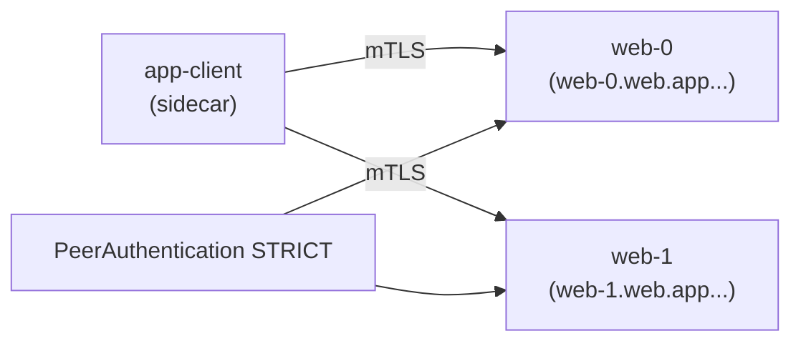

[Русская версия](README_RU.MD) · [Eng version](README.MD) · [Versión en español](README_ES.MD) · [Version française](README_FR.MD) · [Deutsche Version](README_DE.MD) · [繁體中文版](README_TW.MD) · [日本語版](README_JP.MD)

# ლაბორატორია 30 - StatefulSet და headless სერვისები mesh-ში

> [საცნობარო გადაწყვეტა](worker/files/solutions/1_GE.MD)

## მიმოხილვა

Headless სერვისს (`clusterIP: None`) ვირტუალური IP არ აქვს: DNS ცალკეული
პოდების IP-ებს აბრუნებს. StatefulSet აპლიკაციები (Kafka, მონაცემთა ბაზები, კვორუმული სისტემები) ხშირად
**კონკრეტულ** პირს მისი სტაბილური სახელით (`web-0.web...`) უკავშირდებიან და არა დაბალანსებად VIP-ს.

ისტორიულად ეს mesh-თან ცუდად მუშაობდა: Envoy ქმნიდა listener-ებს `0.0.0.0`-ზე, რაც კონფლიქტში
შედიოდა აპლიკაციებთან, რომლებიც მხოლოდ pod IP-ს უსმენდნენ, ხოლო headless სერვისებზე mTLS არ მუშაობდა. **Istio
1.10+** headless სერვისებს ნატიურად უჭერს მხარს: თითოეული პოდისთვის განკუთვნილი listener-ები და ავტომატური mTLS მუშაობს.

ლაბორატორიაში არის namespace `app` (injection) და mesh-ის შიგნით მყოფი კლიენტი `app-client`. Worker PC-ზე
ხელმისაწვდომია `istioctl`.



## ინფრასტრუქტურა

| კომპონენტი | ტიპი | რაოდენობა | როლი |
|---|---|---|---|
| control-plane | `t3.medium` | 1 | master + istiod |
| worker | `t3.small` | 1 | StatefulSet-ისა და კლიენტისთვის განკუთვნილი რესურსები |
| worker PC | `t3.small` | 1 | სამუშაო გარემო: `kubectl`, `istioctl`, `check_result` |

რეგიონი: `eu-central-1` (AZ `eu-central-1a` / `eu-central-1b`).

## გაშლა

```bash
TASK=30 make run_ica_task
```

## დავალება

1. შექმენით **headless Service** `web` (`clusterIP: None`) **სახელიანი** პორტით.
2. შექმენით **StatefulSet** `web` (`serviceName: web`, 2 რეპლიკა) namespace `app`-ში.
3. ჩართეთ **STRICT** mTLS namespace `app`-ში.
4. დარწმუნდით, რომ თითოეული რეპლიკა ხელმისაწვდომია სტაბილური DNS-ით (`web-0.web.app...`,
   `web-1.web.app...`) mTLS-ის გავლით.

## ნაბიჯი 1. Headless Service + StatefulSet

სერვისი უნდა იყოს `clusterIP: None` და ჰქონდეს **სახელიანი** პორტი (Istio პროტოკოლს
პორტის სახელის პრეფიქსით განსაზღვრავს). StatefulSet-ის `serviceName` უნდა ემთხვეოდეს headless
Service-ს, რის შემდეგაც პოდები მიიღებენ სტაბილურ DNS სახელებს `<pod>.<svc>.<ns>.svc.cluster.local`.

```bash
kubectl apply -f - <<'EOF'
apiVersion: v1
kind: Service
metadata:
  name: web
  namespace: app
  labels:
    app: web
spec:
  clusterIP: None          # headless
  selector:
    app: web
  ports:
    - name: http           # სახელიანი პორტი - საჭიროა Istio-სთვის პროტოკოლის განსასაზღვრად
      port: 8080
      targetPort: 8080
---
apiVersion: apps/v1
kind: StatefulSet
metadata:
  name: web
  namespace: app
spec:
  serviceName: web         # აკავშირებს პოდებს headless Service-თან
  replicas: 2
  selector:
    matchLabels:
      app: web
  template:
    metadata:
      labels:
        app: web
    spec:
      containers:
        - name: web
          image: viktoruj/ping_pong:latest
          env:
            - name: ENABLE_DEFAULT_HOSTNAME   # დააბრუნოს პოდის რეალური სახელი (web-0/web-1)
              value: "false"
          ports:
            - name: http
              containerPort: 8080
EOF

kubectl rollout status statefulset/web -n app
```

## ნაბიჯი 2. STRICT mTLS-ის ჩართვა

```bash
kubectl apply -f - <<'EOF'
apiVersion: security.istio.io/v1
kind: PeerAuthentication
metadata:
  name: default
  namespace: app
spec:
  mtls:
    mode: STRICT
EOF
```

## ნაბიჯი 3. რეპლიკებთან სტაბილური სახელით დაკავშირება (mTLS-ის გავლით)

```bash
kubectl exec -n app deploy/app-client -c curl -- \
  curl -s http://web-0.web.app.svc.cluster.local:8080/ | grep "Server Name"
# Server Name: web-0

kubectl exec -n app deploy/app-client -c curl -- \
  curl -s http://web-1.web.app.svc.cluster.local:8080/ | grep "Server Name"
# Server Name: web-1
```

თითოეული სტაბილური DNS სახელი კონკრეტულ პოდად გარდაიქმნება, ხოლო ტრაფიკი mTLS
sidecar-ებით იშიფრება, მიუხედავად იმისა, რომ სერვისი headless-ია.

## რატომ არის ეს მნიშვნელოვანი და რას უნდა მიაქციოთ ყურადღება

- **პორტის სახელის მითითება** სავალდებულოა: `http`/`tcp`/`grpc`/`mongo-*` და ა.შ. სახელის გარეშე Istio
  პორტს „გაუმჭვირვალე TCP“-დ მიიჩნევს და L7 შესაძლებლობებს კარგავს.
- **StatefulSet + serviceName** პოდებს სტაბილურ DNS სახელებს ანიჭებს - სწორედ ასე ხდება
  მონაცემთა ბაზებისა და ბროკერების კლასტერების მისამართირება.
- **STRICT mTLS მუშაობს headless სერვისებზე** Istio 1.10+-დან - თითოეული პოდის
  ტრაფიკის დაშიფვრა VIP-ის გარეშე.

## გარე headless სერვისები (ბონუსი)

კლასტერის **გარეთ** არსებული headless სერვისისთვის (მაგალითად, გარე Kafka) დაამატეთ `ServiceEntry`
`resolution: DNS`-ით, რათა mesh-მა მისი სახელის გარდაქმნა და მარშრუტიზაცია შეძლოს:

```yaml
apiVersion: networking.istio.io/v1
kind: ServiceEntry
metadata:
  name: kafka-ext
  namespace: app
spec:
  hosts: ["kafka.example.com"]
  location: MESH_INTERNAL
  ports:
    - name: tcp-kafka
      number: 9092
      protocol: TCP
  resolution: DNS
```

## შედეგის შემოწმება

Worker PC-ზე გაუშვით:

```bash
check_result
```

## შეჯამება

თქვენ mesh-ში headless სერვისის უკან StatefulSet გაშალეთ, ჩართეთ STRICT mTLS და
თითოეულ რეპლიკას სტაბილური სახელით დაუკავშირდით. headless/StatefulSet-ის თავისებურებების (პორტების
სახელდება, სტაბილური DNS, mTLS VIP-ის გარეშე) ცოდნა მნიშვნელოვანი უნარია stateful დატვირთვების (მონაცემთა ბაზები,
ბროკერები, კვორუმული სისტემები) service mesh-ში გასაშვებად.
