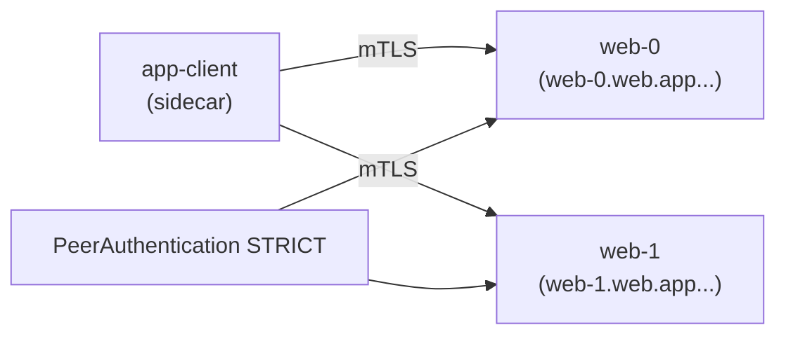

[Русская версия](README_RU.MD) · [Eng version](README.MD) · [Versión en español](README_ES.MD) · [Version française](README_FR.MD) · [Deutsche Version](README_DE.MD) · [ქართული ვერსია](README_GE.MD) · [繁體中文版](README_TW.MD)

# ラボ 30 - mesh 内の StatefulSet と headless サービス

> [リファレンス解答](worker/files/solutions/1_JP.MD)

## 概要

Headless サービス（`clusterIP: None`）には仮想 IP がありません。DNS は個々の
Pod の IP を返します。StatefulSet アプリケーション（Kafka、データベース、クォーラムシステム）は、
負荷分散される VIP ではなく、安定した名前（`web-0.web...`）を持つ**特定の**ピアに
アクセスすることがよくあります。

歴史的に、これは mesh とうまく連携していませんでした。Envoy が `0.0.0.0` にリスナーを作成し、
Pod IP だけでリッスンするアプリケーションと競合し、headless サービスでの mTLS が壊れていました。**Istio
1.10+** は headless をネイティブにサポートします。Pod ごとのリスナーと自動 mTLS が機能します。

このラボには namespace `app`（injection 有効）と、in-mesh クライアント `app-client` があります。worker PC には
`istioctl` があります。



## インフラストラクチャ

| コンポーネント | タイプ | 数量 | 役割 |
|---|---|---|---|
| control-plane | `t3.medium` | 1 | master + istiod |
| worker | `t3.small` | 1 | StatefulSet とクライアント用の容量 |
| worker PC | `t3.small` | 1 | ワークステーション: `kubectl`、`istioctl`、`check_result` |

リージョン: `eu-central-1`（AZ `eu-central-1a` / `eu-central-1b`）。

## デプロイ

```bash
TASK=30 make run_ica_task
```

## 課題

1. **名前付き**ポートを持つ **headless Service** `web`（`clusterIP: None`）を作成します。
2. namespace `app` に **StatefulSet** `web`（`serviceName: web`、2 レプリカ）を作成します。
3. namespace `app` で **STRICT** mTLS を有効にします。
4. 各レプリカに、安定した DNS（`web-0.web.app...`、
   `web-1.web.app...`）を通じて mTLS でアクセスできることを確認します。

## ステップ 1. Headless Service + StatefulSet

Service は `clusterIP: None` で、**名前付き**ポートを持つ必要があります（Istio は
ポート名のプレフィックスからプロトコルを判断します）。StatefulSet の `serviceName` は headless
Service と一致している必要があり、その場合 Pod は安定した DNS 名
`<pod>.<svc>.<ns>.svc.cluster.local` を取得します。

```bash
kubectl apply -f - <<'EOF'
apiVersion: v1
kind: Service
metadata:
  name: web
  namespace: app
  labels:
    app: web
spec:
  clusterIP: None          # headless
  selector:
    app: web
  ports:
    - name: http           # 名前付きポート - Istio がプロトコルを判定するために必要
      port: 8080
      targetPort: 8080
---
apiVersion: apps/v1
kind: StatefulSet
metadata:
  name: web
  namespace: app
spec:
  serviceName: web         # Pod を headless Service に紐付ける
  replicas: 2
  selector:
    matchLabels:
      app: web
  template:
    metadata:
      labels:
        app: web
    spec:
      containers:
        - name: web
          image: viktoruj/ping_pong:latest
          env:
            - name: ENABLE_DEFAULT_HOSTNAME   # Pod の実際の名前を返す (web-0/web-1)
              value: "false"
          ports:
            - name: http
              containerPort: 8080
EOF

kubectl rollout status statefulset/web -n app
```

## ステップ 2. STRICT mTLS を有効にする

```bash
kubectl apply -f - <<'EOF'
apiVersion: security.istio.io/v1
kind: PeerAuthentication
metadata:
  name: default
  namespace: app
spec:
  mtls:
    mode: STRICT
EOF
```

## ステップ 3. 安定した名前でレプリカにアクセスする（mTLS 経由）

```bash
kubectl exec -n app deploy/app-client -c curl -- \
  curl -s http://web-0.web.app.svc.cluster.local:8080/ | grep "Server Name"
# Server Name: web-0

kubectl exec -n app deploy/app-client -c curl -- \
  curl -s http://web-1.web.app.svc.cluster.local:8080/ | grep "Server Name"
# Server Name: web-1
```

各安定 DNS 名は特定の Pod に解決され、Service が headless であっても
トラフィックは sidecar により mTLS で暗号化されます。

## なぜ重要か、何に注意すべきか

- **ポート命名**は必須です: `http`/`tcp`/`grpc`/`mongo-*` など。名前がない場合、Istio は
  ポートを「不透明な TCP」と見なし、L7 機能を失います。
- **StatefulSet + serviceName** は安定した Pod DNS 名を提供します。これは DB/ブローカーの
  クラスターで使用されるアドレッシング方法です。
- **STRICT mTLS は headless で動作します**。Istio 1.10+ 以降、VIP なしで Pod ごとの
  トラフィックを暗号化できます。

## 外部 headless サービス（ボーナス）

クラスター**外部**の headless サービス（例: 外部 Kafka）では、mesh が解決および
ルーティングできるように、`resolution: DNS` を指定した `ServiceEntry` を追加します。

```yaml
apiVersion: networking.istio.io/v1
kind: ServiceEntry
metadata:
  name: kafka-ext
  namespace: app
spec:
  hosts: ["kafka.example.com"]
  location: MESH_INTERNAL
  ports:
    - name: tcp-kafka
      number: 9092
      protocol: TCP
  resolution: DNS
```

## 結果の確認

worker PC で実行します。

```bash
check_result
```

## まとめ

mesh 内で headless サービスの背後に StatefulSet をデプロイし、STRICT mTLS を有効化して、
安定した名前で各レプリカにアクセスしました。headless/StatefulSet の特性（ポート命名、安定した DNS、VIP なしの
mTLS）を理解することは、service mesh で stateful ワークロード（DB、ブローカー、
クォーラムシステム）を実行するための重要なスキルです。
