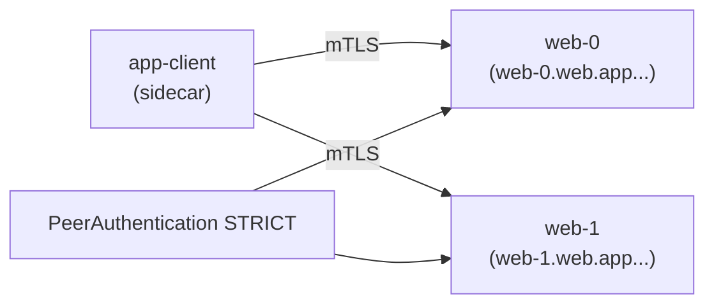

[Eng version](README.MD)

# Lab 30 — StatefulSet и headless-сервисы в mesh

## Обзор

Headless-сервис (`clusterIP: None`) не имеет виртуального IP: DNS возвращает IP отдельных
подов. StatefulSet-приложения (Kafka, базы, кворумные системы) часто обращаются к
**конкретному** пиру по его стабильному имени (`web-0.web...`), а не к балансируемому VIP.

Исторически это плохо дружило с mesh: Envoy делал слушатели на `0.0.0.0`, что конфликтовало
с приложениями, слушающими только pod IP, а mTLS на headless-сервисах ломался. **Istio
1.10+** поддерживает headless нативно: пер-подовые слушатели и автоматический mTLS работают.

В лабе есть namespace `app` (injection) и in-mesh клиент `app-client`. На worker PC есть
`istioctl`.



## Задание

1. Создать **headless Service** `web` (`clusterIP: None`) с **именованным** портом.
2. Создать **StatefulSet** `web` (`serviceName: web`, 2 реплики) в namespace `app`.
3. Включить **STRICT** mTLS в namespace `app`.
4. Убедиться, что каждая реплика доступна по стабильному DNS (`web-0.web.app...`,
   `web-1.web.app...`) через mTLS.

## Шаг 1. Headless Service + StatefulSet

Сервис должен быть `clusterIP: None` и иметь **именованный** порт (Istio определяет
протокол по префиксу имени порта). `serviceName` StatefulSet должен совпадать с headless
Service, тогда поды получают стабильные DNS-имена `<pod>.<svc>.<ns>.svc.cluster.local`.

```bash
kubectl apply -f - <<'EOF'
apiVersion: v1
kind: Service
metadata:
  name: web
  namespace: app
  labels:
    app: web
spec:
  clusterIP: None          # headless
  selector:
    app: web
  ports:
    - name: http           # именованный порт — нужен Istio для определения протокола
      port: 8080
      targetPort: 8080
---
apiVersion: apps/v1
kind: StatefulSet
metadata:
  name: web
  namespace: app
spec:
  serviceName: web         # связывает поды с headless Service
  replicas: 2
  selector:
    matchLabels:
      app: web
  template:
    metadata:
      labels:
        app: web
    spec:
      containers:
        - name: web
          image: viktoruj/ping_pong:latest
          env:
            - name: ENABLE_DEFAULT_HOSTNAME   # отдавать реальное имя пода (web-0/web-1)
              value: "false"
          ports:
            - name: http
              containerPort: 8080
EOF

kubectl rollout status statefulset/web -n app
```

## Шаг 2. Включить STRICT mTLS

```bash
kubectl apply -f - <<'EOF'
apiVersion: security.istio.io/v1
kind: PeerAuthentication
metadata:
  name: default
  namespace: app
spec:
  mtls:
    mode: STRICT
EOF
```

## Шаг 3. Обращение к репликам по стабильному имени (через mTLS)

```bash
kubectl exec -n app deploy/app-client -c curl -- \
  curl -s http://web-0.web.app.svc.cluster.local:8080/ | grep "Server Name"
# Server Name: web-0

kubectl exec -n app deploy/app-client -c curl -- \
  curl -s http://web-1.web.app.svc.cluster.local:8080/ | grep "Server Name"
# Server Name: web-1
```

Каждое стабильное DNS-имя резолвится в конкретный под, а трафик шифруется mTLS
сайдкарами, хотя сервис headless.

## Почему это важно и на что смотреть

- **Именование порта** обязательно: `http`/`tcp`/`grpc`/`mongo-*` и т.д. Без имени Istio
  считает порт «непрозрачным TCP» и теряет L7-фичи.
- **StatefulSet + serviceName** даёт стабильные DNS-имена подов — именно так адресуются
  кластеры БД/брокеров.
- **STRICT mTLS работает на headless** начиная с Istio 1.10+ — шифрование пер-подового
  трафика без VIP.

## Внешние headless-сервисы (бонус)

Для headless-сервиса **вне** кластера (например, внешняя Kafka) добавьте `ServiceEntry` с
`resolution: DNS`, чтобы mesh мог его резолвить и маршрутизировать:

```yaml
apiVersion: networking.istio.io/v1
kind: ServiceEntry
metadata:
  name: kafka-ext
  namespace: app
spec:
  hosts: ["kafka.example.com"]
  location: MESH_INTERNAL
  ports:
    - name: tcp-kafka
      number: 9092
      protocol: TCP
  resolution: DNS
```

## Проверка результата

Запустите на worker PC:

```bash
check_result
```

## Итог

Вы развернули StatefulSet за headless-сервисом в mesh, включили STRICT mTLS и обратились к
каждой реплике по стабильному имени. Понимание особенностей headless/StatefulSet (именование
портов, стабильные DNS, mTLS без VIP) — важный навык для запуска stateful-нагрузок (БД,
брокеры, кворумные системы) в service mesh.

## Инфраструктура

| Компонент | Тип | Кол-во | Роль |
|---|---|---|---|
| control-plane | `t3.medium` | 1 | master + istiod |
| worker | `t3.small` | 1 | ёмкость для StatefulSet и клиента |
| worker PC | `t3.small` | 1 | рабочее место: `kubectl`, `istioctl`, `check_result` |

Регион: `eu-central-1` (AZ `eu-central-1a` / `eu-central-1b`).
