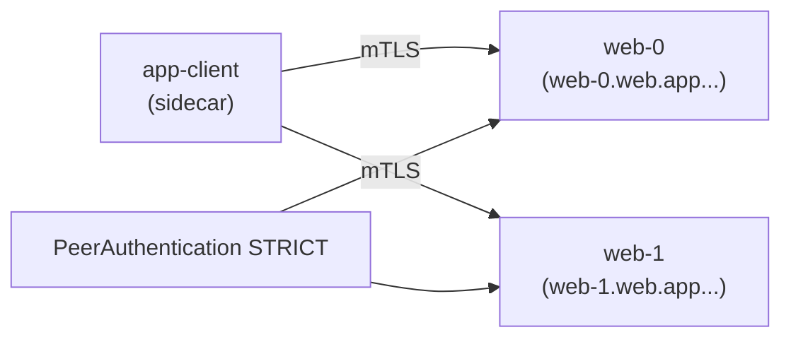

[Русская версия](README_RU.MD) · [Eng version](README.MD) · [Versión en español](README_ES.MD) · [Version française](README_FR.MD) · [Deutsche Version](README_DE.MD) · [ქართული ვერსია](README_GE.MD) · [日本語版](README_JP.MD)

# Lab 30 - mesh 中的 StatefulSet 與 headless 服務

> [參考解答](worker/files/solutions/1_TW.MD)

## 概述

Headless 服務（`clusterIP: None`）沒有虛擬 IP：DNS 會回傳個別 Pod 的 IP。StatefulSet
應用程式（Kafka、資料庫、仲裁系統）通常會透過其穩定名稱（`web-0.web...`）存取**特定**對等節點，
而不是存取經負載平衡的 VIP。

過去，這與 mesh 的相容性不佳：Envoy 在 `0.0.0.0` 上建立監聽器，這會與僅監聽 pod IP 的
應用程式衝突，且 headless 服務上的 mTLS 會失效。**Istio 1.10+** 原生支援 headless：
每個 Pod 的監聽器與自動 mTLS 均可運作。

此實驗包含 namespace `app`（injection）及 mesh 內客戶端 `app-client`。worker PC 上有
`istioctl`。



## 基礎架構

| 元件 | 類型 | 數量 | 角色 |
|---|---|---|---|
| control-plane | `t3.medium` | 1 | master + istiod |
| worker | `t3.small` | 1 | StatefulSet 與客戶端的容量 |
| worker PC | `t3.small` | 1 | 工作站：`kubectl`、`istioctl`、`check_result` |

區域：`eu-central-1`（AZ `eu-central-1a` / `eu-central-1b`）。

## 部署

```bash
TASK=30 make run_ica_task
```

## 任務

1. 建立具有**具名**連接埠的 **headless Service** `web`（`clusterIP: None`）。
2. 在 namespace `app` 中建立 **StatefulSet** `web`（`serviceName: web`，2 個副本）。
3. 在 namespace `app` 啟用 **STRICT** mTLS。
4. 確認每個副本皆可透過穩定 DNS（`web-0.web.app...`、
   `web-1.web.app...`）使用 mTLS 存取。

## 步驟 1. Headless Service + StatefulSet

Service 必須是 `clusterIP: None`，且需具備**具名**連接埠（Istio 會根據連接埠名稱的前綴
判定通訊協定）。StatefulSet 的 `serviceName` 必須與 headless Service 相同，如此 Pod 才會
取得穩定的 DNS 名稱 `<pod>.<svc>.<ns>.svc.cluster.local`。

```bash
kubectl apply -f - <<'EOF'
apiVersion: v1
kind: Service
metadata:
  name: web
  namespace: app
  labels:
    app: web
spec:
  clusterIP: None          # headless
  selector:
    app: web
  ports:
    - name: http           # 具名連接埠 - Istio 需要用它來判斷協定
      port: 8080
      targetPort: 8080
---
apiVersion: apps/v1
kind: StatefulSet
metadata:
  name: web
  namespace: app
spec:
  serviceName: web         # 將 Pod 與 headless Service 綁定
  replicas: 2
  selector:
    matchLabels:
      app: web
  template:
    metadata:
      labels:
        app: web
    spec:
      containers:
        - name: web
          image: viktoruj/ping_pong:latest
          env:
            - name: ENABLE_DEFAULT_HOSTNAME   # 回傳 Pod 的真實名稱 (web-0/web-1)
              value: "false"
          ports:
            - name: http
              containerPort: 8080
EOF

kubectl rollout status statefulset/web -n app
```

## 步驟 2. 啟用 STRICT mTLS

```bash
kubectl apply -f - <<'EOF'
apiVersion: security.istio.io/v1
kind: PeerAuthentication
metadata:
  name: default
  namespace: app
spec:
  mtls:
    mode: STRICT
EOF
```

## 步驟 3. 透過穩定名稱存取副本（經由 mTLS）

```bash
kubectl exec -n app deploy/app-client -c curl -- \
  curl -s http://web-0.web.app.svc.cluster.local:8080/ | grep "Server Name"
# Server Name: web-0

kubectl exec -n app deploy/app-client -c curl -- \
  curl -s http://web-1.web.app.svc.cluster.local:8080/ | grep "Server Name"
# Server Name: web-1
```

每個穩定 DNS 名稱都會解析為特定 Pod，而流量由 sidecar 透過 mTLS 加密，
即使該服務是 headless。

## 為何重要及注意事項

- **連接埠命名**為必要條件：`http`/`tcp`/`grpc`/`mongo-*` 等。沒有名稱時，Istio
  會將連接埠視為「不透明 TCP」，並失去 L7 功能。
- **StatefulSet + serviceName** 提供穩定的 Pod DNS 名稱--這正是資料庫／broker
  叢集的定址方式。
- 從 Istio 1.10+ 開始，**STRICT mTLS 可在 headless 上運作**--不需 VIP 即可加密
  每個 Pod 的流量。

## 外部 headless 服務（加分）

針對叢集**外部**的 headless 服務（例如外部 Kafka），新增 `resolution: DNS` 的
`ServiceEntry`，以便 mesh 可解析並路由至該服務：

```yaml
apiVersion: networking.istio.io/v1
kind: ServiceEntry
metadata:
  name: kafka-ext
  namespace: app
spec:
  hosts: ["kafka.example.com"]
  location: MESH_INTERNAL
  ports:
    - name: tcp-kafka
      number: 9092
      protocol: TCP
  resolution: DNS
```

## 結果驗證

在 worker PC 上執行：

```bash
check_result
```

## 總結

您已在 mesh 中於 headless 服務後部署 StatefulSet、啟用 STRICT mTLS，並透過穩定名稱
存取每個副本。理解 headless／StatefulSet 的特性（連接埠命名、穩定 DNS、無 VIP 的 mTLS）
是於 service mesh 中執行有狀態工作負載（資料庫、broker、仲裁系統）的重要技能。