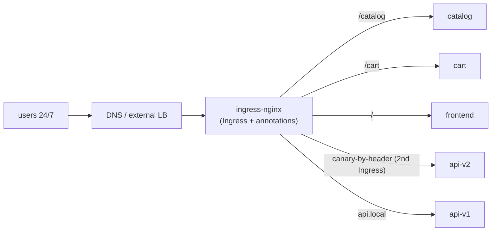
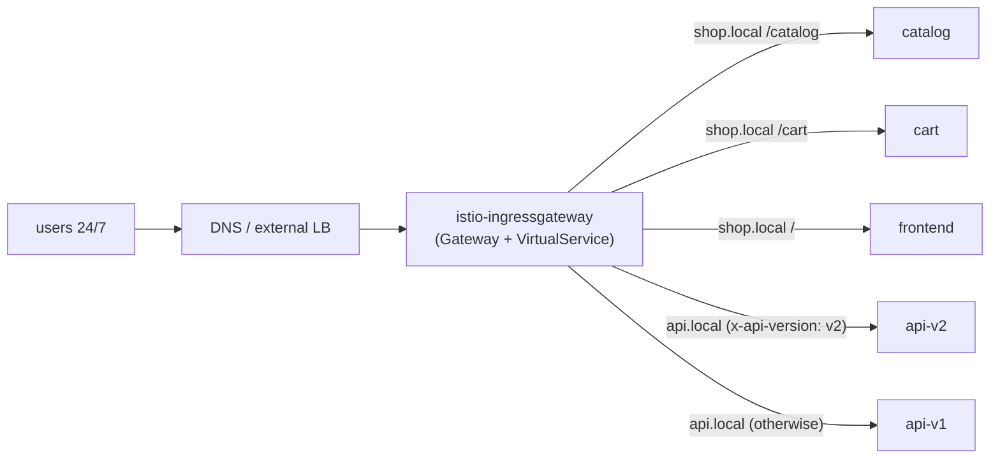
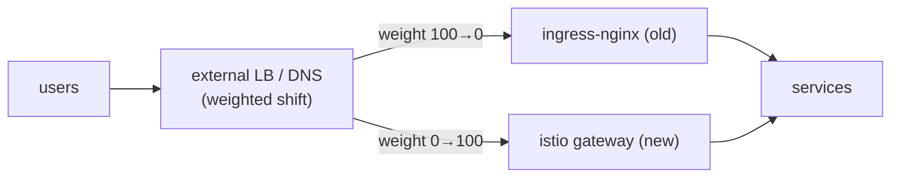

[RU version](README_RU.MD)

# Lab 31 — Zero-downtime production migration: ingress-nginx → Istio Gateway

## Overview

We emulate a **real production migration** of ingress routing from **ingress-nginx** to
an **Istio Gateway + VirtualService**. The constraints mirror production:

- the service runs **24/7**, users **must not** be affected (zero downtime);
- the migration happens in a **low-traffic window**;
- there are **100+ such services** — we cannot migrate in one pass, so we go in **waves**;
- every step must have a **fast rollback** with minimal user impact.

Technically you migrate one "wave" here (two hosts): multiple hosts, path-based and
header-based routing. But this README also describes the **methodology** for migrating the
whole fleet.

Namespace `app` already runs 5 backends (`frontend`, `catalog`, `cart`, `api-v1`,
`api-v2`), each replying `Server Name: <name>`. Istio is installed, ingress gateway on
NodePort `32080`.

## Source architecture (as-is)



## Target architecture (to-be)



## Intermediate state: both ingresses run in parallel

The core zero-downtime principle: **do not remove nginx until the migration is done**.
ingress-nginx and istio-ingressgateway run **at the same time**, and public traffic is
switched at the **external LB / DNS** layer — gradually and reversibly.



## Migration principle (per service/host)

1. **Build the Istio equivalent** (`Gateway` + `VirtualService`) — an exact copy of the
   nginx rules (hosts, paths, headers, timeouts, rewrite). See "Task".
2. **Parity check BEFORE switching users.** The Istio gateway already runs in parallel;
   send test traffic to it (internal address / correct Host) and compare each rule against
   nginx. Users still go through nginx.
3. **(optional) Shadow / mirroring.** Use `VirtualService.mirror` to copy part of live
   traffic to the new path (responses discarded) — validation under real load with no user
   impact.
4. **Cut over in the low-traffic window.** On the external LB/DNS gradually shift weight:
   `nginx 100/istio 0 → 90/10 → 50/50 → 0/100`. Watch metrics between steps.
5. **Soak.** Keep 100% on Istio for hours/days, watch errors and latency. Leave the nginx
   config **untouched** — it stays a hot standby.
6. **Decommission nginx** for this service — only after a successful soak.

## Traffic-shift mechanism (and why it matters for rollback)

| Mechanism | Pros | Cons / rollback impact |
|---|---|---|
| **External LB target-group weights** (ALB/NLB) | instant, no cache; rollback in seconds | needs a weighting-capable LB |
| **Weighted DNS** (Route53 weighted) | simple | **cache/TTL** — rollback not instant; set a low TTL ahead of time |
| **Per-host cutover** | risk isolated per host | more steps |

Recommendation for 24/7: shift with **LB weights** (instant rollback), not DNS. If DNS
only — lower the TTL (e.g. to 30–60s) a day before.

## Risks to users and how to remove them

| Risk | Impact | Mitigation |
|---|---|---|
| Rule mismatch (path/header/regex) | some requests go wrong / 404 | parity-test **every** rule before cutover; diff nginx annotations ↔ VS fields |
| Path semantics differ (`pathType`, rewrite, nginx regex) | some routes break | map explicitly to `uri.exact/prefix` + `rewrite.uri`, test |
| Different timeouts/limits (nginx vs Istio) | timeouts/drops under load | set explicit `timeout`/`retries` in the VS to match nginx |
| Sticky sessions / affinity | users "logged out" | `DestinationRule` `consistentHash` (cookie/header) |
| mTLS/injection in the namespace | 503 between services | keep `PeerAuthentication: PERMISSIVE` during migration |
| WebSocket / gRPC / large headers | dropped connections | test explicitly; correct port names |
| DNS cache on rollback | rollback "sticks" | shift with LB weights; low TTL ahead of time |
| No observability at cutover | slow to catch regressions | dashboards and alerts (5xx, p99) **ready before** cutover |

## Rollback plan (if something goes wrong)

Rollback must take **seconds to minutes** because the old path is not torn down:

1. On the external LB/DNS, put the weight back on nginx (`istio 0 / nginx 100`).
2. Confirm from metrics that 5xx/latency returned to normal.
3. The nginx `Ingress` **stayed untouched** the whole time — nothing to restore.
4. Root-cause the issue (usually a rule mismatch), fix the `VirtualService`, re-run the
   parity test, and retry the cutover.

> Rule: **build and validate the new path first, switch only then, and remove the old one
> only at the very end.** While the old path lives, rollback is trivial.

## Phased rollout for 100+ services (waves)

You cannot migrate everything at once — build confidence in waves:

1. **Wave 0 (pilot):** 2–3 **non-critical**, low-traffic services. Cut over in the
   low-traffic window, observe for **several days**. Break in the runbook, dashboards, and
   rollback procedure.
2. **Waves 1..N (the bulk):** batches of 5–10 services. Each batch only after the previous
   one's soak is stable. Same repeatable process (Gateway/VS templates).
3. **Final wave (most critical / highest traffic):** migrate **last**, with maximum
   monitoring, the tightest window, and a rehearsed rollback.

Between waves record: error rate, p95/p99, incidents. Any regression is a stop-gate for
the next wave.

## Task (pilot wave: shop.local + api.local)

Build the exact Istio equivalent of the nginx rules.

### Step 1. One Gateway for both hosts

```bash
kubectl apply -f - <<'EOF'
apiVersion: networking.istio.io/v1
kind: Gateway
metadata:
  name: shop-gateway
  namespace: app
spec:
  selector:
    istio: ingressgateway
  servers:
    - port: {number: 80, name: http, protocol: HTTP}
      hosts:
        - "shop.local"
        - "api.local"
EOF
```

### Step 2. shop.local — path-based routing

Order matters: specific prefixes first, catch-all `/` last.

```bash
kubectl apply -f - <<'EOF'
apiVersion: networking.istio.io/v1
kind: VirtualService
metadata:
  name: shop
  namespace: app
spec:
  hosts: ["shop.local"]
  gateways: ["shop-gateway"]
  http:
    - match: [{uri: {prefix: /catalog}}]
      route: [{destination: {host: catalog, port: {number: 8080}}}]
    - match: [{uri: {prefix: /cart}}]
      route: [{destination: {host: cart, port: {number: 8080}}}]
    - route: [{destination: {host: frontend, port: {number: 8080}}}]
EOF
```

### Step 3. api.local — header-based routing

What needed a separate canary Ingress in nginx is a single `match` block in Istio.

```bash
kubectl apply -f - <<'EOF'
apiVersion: networking.istio.io/v1
kind: VirtualService
metadata:
  name: api
  namespace: app
spec:
  hosts: ["api.local"]
  gateways: ["shop-gateway"]
  http:
    - match:
        - headers:
            x-api-version:
              exact: v2
      route: [{destination: {host: api-v2, port: {number: 8080}}}]
    - route: [{destination: {host: api-v1, port: {number: 8080}}}]
EOF
```

### Step 4. Parity-check the new path (users still on nginx)

```bash
curl -s http://shop.local:32080/catalog | grep "Server Name"   # catalog
curl -s http://shop.local:32080/cart    | grep "Server Name"   # cart
curl -s http://shop.local:32080/        | grep "Server Name"   # frontend
curl -s http://api.local:32080/         | grep "Server Name"   # api-v1
curl -s -H "x-api-version: v2" http://api.local:32080/ | grep "Server Name"   # api-v2
```

All rules match → you can schedule the LB weight shift in the low-traffic window.

## How to verify everything is good BEFORE shifting traffic on the LB

The goal is to fully validate the new Istio path while **all users still go through nginx**
and the LB weight is still `istio 0 / nginx 100`.

### 1. Istio config health

```bash
istioctl analyze -n app            # no errors/warnings on Gateway/VirtualService
kubectl get gateway,virtualservice -n app
istioctl proxy-status              # all proxies SYNCED (config reached Envoy)
# the routes are actually present on the ingress gateway pod:
istioctl proxy-config routes deploy/istio-ingressgateway -n istio-system | grep -E 'shop.local|api.local'
```

### 2. Hit the istio-gateway directly, bypassing the public LB

Users are not affected: send requests **straight to istio-ingressgateway** with the right
`Host`, without changing the public DNS/LB. In production use `--resolve`, pointing at the
istio-gateway IP instead of the public one:

```bash
GW=<istio-ingressgateway IP or NodePort>
curl -s --resolve shop.local:80:$GW http://shop.local/catalog
curl -s --resolve api.local:80:$GW  -H "x-api-version: v2" http://api.local/
```

In this environment the istio-gateway is on `:32080` and `shop.local`/`api.local` already
resolve to the node — so the Step 4 commands hit the new path directly, bypassing the
"public" LB. That is exactly the pre-cutover check.

### 3. Parity matrix nginx ↔ istio

Run the **same** set of requests against both ingresses and compare status code, body
(which service answered), key headers, and redirects:

```bash
NGINX=<ingress-nginx IP>ISTIO=<istio-ingressgateway IP>
for req in "shop.local /catalog" "shop.local /cart" "shop.local /" "api.local /"; do
  set -- $req; host=$1; path=$2
  echo "== $host$path =="
  echo -n "nginx: "; curl -s -o /dev/null -w "%{http_code}\n" --resolve $host:80:$NGINX  http://$host$path
  echo -n "istio: "; curl -s -o /dev/null -w "%{http_code}\n" --resolve $host:80:$ISTIO  http://$host$path
done
# header route:
curl -s --resolve api.local:80:$ISTIO -H "x-api-version: v2" http://api.local/ | grep "Server Name"
```

Everything must match for **every** rule. A mismatch is a stop-gate — fix the VS and retry.

### 4. (optional) Shadow traffic / replay

- **Replay from nginx access logs**: take a sample of real requests from the nginx logs and
  replay them against the istio-gateway (`--resolve`), diff the responses — validation on
  the real traffic profile with no user impact.
- **Mirroring**: once Istio already serves some traffic, `VirtualService.mirror` sends a
  copy of requests to the new backend (responses discarded) — validation under real load.

### 5. Load test and observability

```bash
# drive load straight at the istio-gateway (users not affected)
fortio load -qps 200 -t 60s -H "Host: shop.local" http://$GW/catalog
```

Compare p95/p99 and errors with nginx; make sure dashboards (5xx, latency) and alerts are
up, and the rollback (put weight back on nginx) is rehearsed.

**Only when everything is green → shift the LB weights in the low-traffic window.**

## The source ingress-nginx config (for reference)

```yaml
# shop.local — path-based
apiVersion: networking.k8s.io/v1
kind: Ingress
metadata: {name: shop}
spec:
  ingressClassName: nginx
  rules:
  - host: shop.local
    http:
      paths:
      - {path: /catalog, pathType: Prefix, backend: {service: {name: catalog,  port: {number: 8080}}}}
      - {path: /cart,    pathType: Prefix, backend: {service: {name: cart,     port: {number: 8080}}}}
      - {path: /,        pathType: Prefix, backend: {service: {name: frontend, port: {number: 8080}}}}
---
# api.local — header routing = TWO Ingresses (main + canary)
apiVersion: networking.k8s.io/v1
kind: Ingress
metadata: {name: api}
spec:
  ingressClassName: nginx
  rules:
  - host: api.local
    http:
      paths:
      - {path: /, pathType: Prefix, backend: {service: {name: api-v1, port: {number: 8080}}}}
---
apiVersion: networking.k8s.io/v1
kind: Ingress
metadata:
  name: api-canary
  annotations:
    nginx.ingress.kubernetes.io/canary: "true"
    nginx.ingress.kubernetes.io/canary-by-header: "x-api-version"
    nginx.ingress.kubernetes.io/canary-by-header-value: "v2"
spec:
  ingressClassName: nginx
  rules:
  - host: api.local
    http:
      paths:
      - {path: /, pathType: Prefix, backend: {service: {name: api-v2, port: {number: 8080}}}}
```

## Tools that auto-convert Ingress → Gateway API

You don't have to rewrite rules by hand — open-source tools can read your existing
`Ingress` resources (with provider annotations) straight from the cluster and generate
Gateway API resources.

- **[ingress2gateway](https://github.com/kubernetes-sigs/ingress2gateway)**
  (kubernetes-sigs, the official SIG-Network project) is the main tool. It reads Ingress
  and provider-specific annotations from the cluster and prints Gateway API
  (`Gateway`/`HTTPRoute`). It supports several providers (ingress-nginx, gce, kong, apisix,
  istio, etc.) and can run as a kubectl plugin.
  ```bash
  # generate Gateway API from existing ingress-nginx Ingresses in all namespaces
  ingress2gateway print --providers ingress-nginx -A
  ```
- **Implementation-specific forks**: the kgateway/agentgateway maintainers extended
  ingress2gateway for their projects; [`ingress2eg`](https://github.com/kkk777-7/ingress2eg)
  targets Envoy Gateway; Kong has its own migration guide.

Important caveats:

- the tool emits **Gateway API** (`Gateway`/`HTTPRoute`), not native Istio
  `Gateway`/`VirtualService`. Istio implements Gateway API (see Lab 16), so the generated
  resources are applied to Istio with `gatewayClassName: istio`;
- **not everything converts 1:1**: nginx-specific annotations (rewrite, canary-by-header,
  auth-url, custom timeouts/limits) may translate only partially or not at all — the
  output is a **draft**;
- therefore always **review + parity-test** (section above) before shifting traffic.

Practical flow: `ingress2gateway print ... > gwapi.yaml` → review and edit → `kubectl
apply` alongside nginx → parity check → shift the LB weights.

> Note: tool descriptions are rephrased for licensing compliance; links to the original
> sources are provided above.

## nginx Ingress → Istio mapping

| ingress-nginx | Istio |
|---|---|
| `Ingress` (host + paths) | `Gateway` (host/port) + `VirtualService` (routing) |
| `ingressClassName: nginx` | `Gateway.selector: istio=ingressgateway` + `gateways:` in VS |
| `rules[].host` | `Gateway.servers[].hosts` + `VirtualService.hosts` |
| `paths[].path` + `pathType` | `http[].match[].uri.{exact,prefix}` |
| canary-by-header (extra Ingress) | one `http[].match[].headers` block |
| `rewrite-target` | `http[].rewrite.uri` |
| timeouts/retries (annotations) | `http[].timeout`, `http[].retries` |
| `nginx.ingress.kubernetes.io/*` | first-class fields on VS/DestinationRule |

## Check the result

Run on the worker PC:

```bash
check_result
```

## Summary

You ran the **pilot wave** of a real ingress-nginx → Istio Gateway migration: built the
rule equivalent, parity-checked before cutover, worked through the LB-weight shift
mechanism, the risks to 24/7 users, the instant rollback, and the phased plan for 100+
services. This is exactly the process used when adopting a service mesh in live
production.

## Infrastructure

| Component | Type | Count | Role |
|---|---|---|---|
| control-plane | `t3.medium` | 1 | master + istiod + ingress gateway |
| worker | `t3.small` | 1 | capacity for the 5 backends |
| worker PC | `t3.small` | 1 | workstation: `kubectl`, `curl`, `check_result` |

Region: `eu-central-1` (AZ `eu-central-1a` / `eu-central-1b`).
