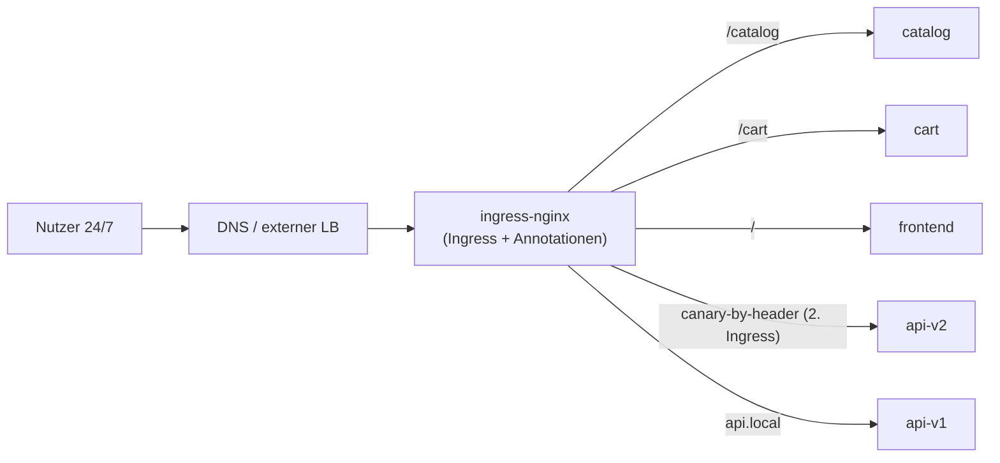
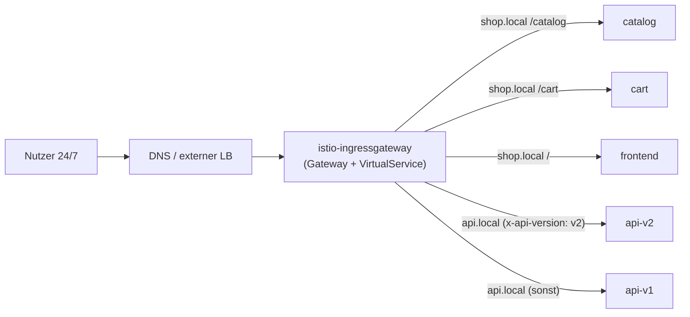
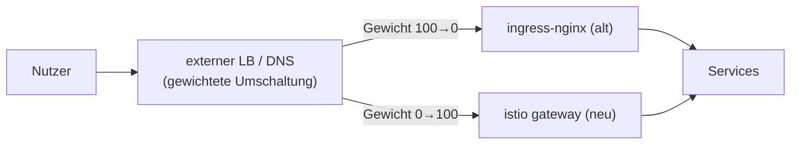

[RU version](README_RU.MD) · [Eng version](README.MD) · [Versión en español](README_ES.MD) · [Version française](README_FR.MD)

# Lab 31 - Produktionsmigration ohne Downtime: ingress-nginx → Istio Gateway

## Überblick

Wir emulieren eine **echte Produktionsmigration** des Ingress-Routings von **ingress-nginx** zu
**Istio Gateway + VirtualService**. Die Rahmenbedingungen sind praxisnah:

- der Service läuft **24/7**, Nutzer dürfen **nicht** beeinträchtigt werden (zero downtime);
- die Migration führen wir im **Fenster minimaler Last** durch;
- solcher Services gibt es **mehr als 100** - in einem Durchgang lässt sich das nicht migrieren,
  wir gehen in **Wellen** vor;
- bei jedem Schritt muss ein **schnelles Rollback** mit minimalen Folgen möglich sein.

Technisch verlagern Sie in diesem Lab eine „Welle" (zwei Hosts): mehrere Hosts, path-based und
header-based Routing. Aber die README beschreibt auch die **Methodik** der Migration des
gesamten Service-Bestands.

Im Namespace `app` sind bereits 5 Backends bereitgestellt (`frontend`, `catalog`, `cart`,
`api-v1`, `api-v2`), jedes antwortet mit `Server Name: <Name>`. Istio ist installiert, das
Ingress Gateway am NodePort `32080`.

## Ausgangsarchitektur (wie sie ist)



## Zielarchitektur (worauf wir hinarbeiten)



## Zwischenzustand: beide Ingress laufen parallel

Das Hauptprinzip von Zero-Downtime: **wir entfernen nginx nicht bis zum Ende der Migration**.
ingress-nginx und istio-ingressgateway leben **gleichzeitig**, und der öffentliche Verkehr wird
auf der Ebene des **externen LB / DNS** umgeschaltet - schrittweise und reversibel.



## Migrationsprinzip (für einen Service/Host)

1. **Das Äquivalent in Istio bauen** (`Gateway` + `VirtualService`) - eine exakte Kopie der
   nginx-Regeln (Hosts, Pfade, Header, Timeouts, rewrite). Siehe Abschnitt „Aufgabe".
2. **Paritätsprüfung VOR der Umschaltung der Nutzer.** Das Istio-Gateway läuft bereits parallel;
   wir schicken Testverkehr hinein (über die interne Adresse / mit dem nötigen Host) und
   vergleichen das Verhalten pro Regel mit nginx. Die Nutzer laufen weiterhin über nginx.
3. **(optional) Shadow / Mirroring.** Über den VirtualService `mirror` kopieren wir einen Teil
   des Produktivverkehrs in den neuen Pfad (die Antworten werden verworfen) - Validierung unter
   echter Last ohne Auswirkung auf die Nutzer.
4. **Umschaltung im Fenster minimaler Last.** Am externen LB/DNS ändern wir das Gewicht sanft:
   `nginx 100/istio 0 → 90/10 → 50/50 → 0/100`. Zwischen den Schritten schauen wir auf die Metriken.
5. **Soak (Reifezeit).** Wir halten 100 % auf Istio einige Stunden/Tage, beobachten Fehler und
   Latenz. Die nginx-Konfiguration **fassen wir nicht an** - sie bleibt heiße Reserve.
6. **Außerbetriebnahme von nginx** für diesen Service - erst nach erfolgreicher Reifezeit.

## Mechanismus der Verkehrsumschaltung (und warum das für das Rollback wichtig ist)

| Mechanismus | Vorteile | Nachteile / Auswirkung auf das Rollback |
|---|---|---|
| **Target-Group-Gewichte am externen LB** (ALB/NLB) | sofort, ohne Cache; Rollback in Sekunden | benötigt LB, der Gewichtung unterstützt |
| **Gewichtetes DNS** (Route53 weighted) | einfach | **Cache/TTL** - Rollback nicht sofort; niedrigen TTL vorab setzen |
| **Per-Host-Umschaltung** | Risikoisolation pro Host | mehr Schritte |

Empfehlung für 24/7: mit **Gewichten am LB** umschalten (sofortiges Rollback), nicht per DNS.
Wenn nur DNS - den TTL vorab senken (z. B. auf 30–60 s) einen Tag vor der Migration.

## Unterbrechungsrisiken für Nutzer und wie man sie beseitigt

| Risiko | Folge | Mitigation |
|---|---|---|
| Regel-Diskrepanz (Pfad/Header/regex) | ein Teil der Anfragen geht falsch / 404 | Paritätstest **jeder** Regel vor der Umschaltung; Diff der nginx-Annotationen ↔ VS-Felder |
| Unterschiedliche Pfad-Semantik (`pathType`, rewrite, nginx-regex) | einige Routen brechen | explizit auf `uri.exact/prefix` + `rewrite.uri` mappen, testen |
| Unterschiedliche Timeouts/Limits (nginx vs Istio) | Timeouts/Abbrüche unter Last | explizite `timeout`/`retries` im VS auf die nginx-Werte setzen |
| Sticky Sessions / Affinity | „Ausloggen" der Nutzer | `DestinationRule` `consistentHash` (Cookie/Header) |
| mTLS/Injection im Namespace | 503 zwischen Services | während der Migration `PeerAuthentication: PERMISSIVE` halten |
| WebSocket / gRPC / große Header | Verbindungsabbrüche | explizit testen; korrekte Portnamen |
| DNS-Cache beim Rollback | Rollback „klemmt" | mit LB-Gewichten umschalten; niedriger TTL vorab |
| Keine Observability zum Cutover-Zeitpunkt | Regression wird spät bemerkt | Dashboards und Alerts (5xx, p99) **vor** der Umschaltung bereit |

## Rollback-Plan (falls etwas schiefgeht)

Das Rollback muss **Sekunden bis Minuten** dauern, weil der alte Pfad nicht abgebaut ist:

1. Am externen LB/DNS das Gewicht zurück auf nginx setzen (`istio 0 / nginx 100`).
2. Anhand der Metriken sicherstellen, dass 5xx/Latenz wieder normal sind.
3. Der nginx-`Ingress` **blieb die ganze Zeit unangetastet** - es muss nichts
   wiederhergestellt werden.
4. Die Ursache analysieren (meist eine Regel-Diskrepanz), den `VirtualService` korrigieren,
   erneut den Paritätstest durchlaufen und die Umschaltung wiederholen.

> Regel: **zuerst bauen und den neuen Pfad validieren, erst dann umschalten, und erst ganz am
> Ende den alten löschen.** Solange der alte Pfad lebt, ist das Rollback trivial.

## Stufenplan für 100+ Services (in Wellen)

Alles auf einmal zu migrieren ist nicht möglich - wir sammeln Vertrauen in Wellen:

1. **Welle 0 (Pilot):** 2–3 **unkritische** Services mit niedrigem Verkehr. Umschalten im Fenster
   minimaler Last, **mehrere Tage** beobachten. Runbook, Dashboards und die Rollback-Prozedur
   einfahren.
2. **Welle 1..N (Hauptmasse):** in Batches von 5–10 Services. Jeder Batch erst nach stabiler
   Reifezeit des vorherigen. Derselbe wiederholbare Prozess (Gateway/VS-Templates).
3. **Finale Welle (die kritischsten / am stärksten belasteten):** wir migrieren sie **zuletzt**,
   mit maximalem Monitoring, dem engsten Fenster und einem eingeübten Rollback.

Zwischen den Wellen halten wir fest: Fehlerrate, p95/p99, Vorfälle. Jede Regression → Stopp-Faktor
für die nächste Welle.

## Aufgabe (Pilotwelle: shop.local + api.local)

Bauen Sie in Istio ein exaktes Äquivalent der nginx-Regeln.

### Schritt 1. Ein Gateway für beide Hosts

```bash
kubectl apply -f - <<'EOF'
apiVersion: networking.istio.io/v1
kind: Gateway
metadata:
  name: shop-gateway
  namespace: app
spec:
  selector:
    istio: ingressgateway
  servers:
    - port: {number: 80, name: http, protocol: HTTP}
      hosts:
        - "shop.local"
        - "api.local"
EOF
```

### Schritt 2. shop.local - path-based Routing

Die Reihenfolge ist wichtig: zuerst konkrete Präfixe, catch-all `/` - zuletzt.

```bash
kubectl apply -f - <<'EOF'
apiVersion: networking.istio.io/v1
kind: VirtualService
metadata:
  name: shop
  namespace: app
spec:
  hosts: ["shop.local"]
  gateways: ["shop-gateway"]
  http:
    - match: [{uri: {prefix: /catalog}}]
      route: [{destination: {host: catalog, port: {number: 8080}}}]
    - match: [{uri: {prefix: /cart}}]
      route: [{destination: {host: cart, port: {number: 8080}}}]
    - route: [{destination: {host: frontend, port: {number: 8080}}}]
EOF
```

### Schritt 3. api.local - header-based Routing

Was bei nginx einen separaten canary-Ingress erforderte, ist in Istio ein einziger `match`-Block.

```bash
kubectl apply -f - <<'EOF'
apiVersion: networking.istio.io/v1
kind: VirtualService
metadata:
  name: api
  namespace: app
spec:
  hosts: ["api.local"]
  gateways: ["shop-gateway"]
  http:
    - match:
        - headers:
            x-api-version:
              exact: v2
      route: [{destination: {host: api-v2, port: {number: 8080}}}]
    - route: [{destination: {host: api-v1, port: {number: 8080}}}]
EOF
```

### Schritt 4. Paritätsprüfung des neuen Pfads (Nutzer noch auf nginx)

```bash
curl -s http://shop.local:32080/catalog | grep "Server Name"   # catalog
curl -s http://shop.local:32080/cart    | grep "Server Name"   # cart
curl -s http://shop.local:32080/        | grep "Server Name"   # frontend
curl -s http://api.local:32080/         | grep "Server Name"   # api-v1
curl -s -H "x-api-version: v2" http://api.local:32080/ | grep "Server Name"   # api-v2
```

Stimmt es bei allen Regeln überein → kann man die Umschaltung der LB-Gewichte im Fenster
niedriger Last planen.

## Wie man sich VOR der Umschaltung des Verkehrs am LB vergewissert, dass alles gut ist

Ziel - den neuen Pfad über Istio vollständig zu validieren, während **alle Nutzer über nginx
laufen** und das Gewicht am Load Balancer weiterhin `istio 0 / nginx 100` ist.

### 1. Gesundheit der Istio-Konfiguration

```bash
istioctl analyze -n app            # keine Fehler/Warnungen zu Gateway/VirtualService
kubectl get gateway,virtualservice -n app
istioctl proxy-status              # alle Proxies SYNCED (Konfig ist bei Envoy angekommen)
# konkret am Pod des ingress gateway sind unsere Routen sichtbar:
istioctl proxy-config routes deploy/istio-ingressgateway -n istio-system | grep -E 'shop.local|api.local'
```

### 2. Direkter Zugriff auf das istio-gateway unter Umgehung des öffentlichen LB

Die Nutzer sind nicht betroffen: Wir schicken Anfragen **direkt ans istio-ingressgateway** mit dem
nötigen `Host`, ohne das öffentliche DNS/LB zu ändern. In der Produktion - über `--resolve`, wobei
die IP des istio-gateway statt der öffentlichen angegeben wird:

```bash
GW=<IP oder NodePort istio-ingressgateway>
curl -s --resolve shop.local:80:$GW http://shop.local/catalog
curl -s --resolve api.local:80:$GW  -H "x-api-version: v2" http://api.local/
```

In diesem Stand ist das istio-gateway unter `:32080` erreichbar, und `shop.local`/`api.local`
lösen sich bereits auf die Node auf - deshalb treffen die Befehle aus Schritt 4 genau den neuen
Pfad und umgehen den „öffentlichen" LB. Das ist die Pre-Cutover-Prüfung.

### 3. Paritätsmatrix nginx ↔ istio

Denselben Satz von Anfragen an beide Ingress schicken und Statuscode, Body (welcher Service
geantwortet hat), Schlüssel-Header und Redirects vergleichen:

```bash
NGINX=<IP ingress-nginx>ISTIO=<IP istio-ingressgateway>
for req in "shop.local /catalog" "shop.local /cart" "shop.local /" "api.local /"; do
  set -- $req; host=$1; path=$2
  echo "== $host$path =="
  echo -n "nginx: "; curl -s -o /dev/null -w "%{http_code}\n" --resolve $host:80:$NGINX  http://$host$path
  echo -n "istio: "; curl -s -o /dev/null -w "%{http_code}\n" --resolve $host:80:$ISTIO  http://$host$path
done
# Header-Route:
curl -s --resolve api.local:80:$ISTIO -H "x-api-version: v2" http://api.local/ | grep "Server Name"
```

Alles muss **bei jeder** Regel übereinstimmen. Eine Abweichung ist ein Stopp-Faktor, VS
korrigieren und wiederholen.

### 4. (optional) Shadow-Verkehr / Replay

- **Replay aus den nginx-Access-Logs**: eine Stichprobe echter Anfragen aus den nginx-Logs nehmen
  und gegen das istio-gateway abspielen (`--resolve`), die Antworten vergleichen - Validierung am
  realen Verkehrsprofil ohne Auswirkung auf die Nutzer.
- **Mirroring**: wenn istio bereits einen Teil des Verkehrs bedient, schickt
  `VirtualService.mirror` eine Kopie der Anfragen an das neue Backend (die Antworten werden
  verworfen) - Prüfung unter echter Last.

### 5. Lasttest und Observability

```bash
# Last direkt ins istio-gateway fahren (Nutzer nicht betroffen)
fortio load -qps 200 -t 60s -H "Host: shop.local" http://$GW/catalog
```

p95/p99 und Fehler mit nginx abgleichen; sicherstellen, dass Dashboards (5xx, Latenz) und Alerts
offen sind und die Rollback-Prozedur (Gewicht zurück auf nginx) eingeübt ist.

**Erst wenn alles grün ist → ändern wir die Gewichte am LB im Fenster minimaler Last.**

## Ausgangskonfiguration von ingress-nginx (zur Referenz)

```yaml
# shop.local - path-based
apiVersion: networking.k8s.io/v1
kind: Ingress
metadata: {name: shop}
spec:
  ingressClassName: nginx
  rules:
  - host: shop.local
    http:
      paths:
      - {path: /catalog, pathType: Prefix, backend: {service: {name: catalog,  port: {number: 8080}}}}
      - {path: /cart,    pathType: Prefix, backend: {service: {name: cart,     port: {number: 8080}}}}
      - {path: /,        pathType: Prefix, backend: {service: {name: frontend, port: {number: 8080}}}}
---
# api.local - Header-Routing = ZWEI Ingress (main + canary)
apiVersion: networking.k8s.io/v1
kind: Ingress
metadata: {name: api}
spec:
  ingressClassName: nginx
  rules:
  - host: api.local
    http:
      paths:
      - {path: /, pathType: Prefix, backend: {service: {name: api-v1, port: {number: 8080}}}}
---
apiVersion: networking.k8s.io/v1
kind: Ingress
metadata:
  name: api-canary
  annotations:
    nginx.ingress.kubernetes.io/canary: "true"
    nginx.ingress.kubernetes.io/canary-by-header: "x-api-version"
    nginx.ingress.kubernetes.io/canary-by-header-value: "v2"
spec:
  ingressClassName: nginx
  rules:
  - host: api.local
    http:
      paths:
      - {path: /, pathType: Prefix, backend: {service: {name: api-v2, port: {number: 8080}}}}
```

## Tools für die automatische Konvertierung Ingress → Gateway API

Die Regeln von Hand umzuschreiben ist nicht nötig - es gibt Open-Source-Tools, die vorhandene
`Ingress` (samt Provider-Annotationen) direkt aus dem Cluster lesen und Gateway-API-Ressourcen
generieren.

- **[ingress2gateway](https://github.com/kubernetes-sigs/ingress2gateway)**
  (kubernetes-sigs, offizielles Projekt der SIG-Network) - das Haupt-Tool. Liest Ingress und
  provider-spezifische Annotationen aus dem Cluster und gibt Gateway API aus
  (`Gateway`/`HTTPRoute`). Unterstützt mehrere Provider (ingress-nginx, gce, kong, apisix, istio
  u. a.), lässt sich u. a. als kubectl-Plugin installieren.
  ```bash
  # Gateway API aus vorhandenen ingress-nginx-Ingress in allen Namespaces generieren
  ingress2gateway print --providers ingress-nginx -A
  ```
- **Erweiterungen für konkrete Implementierungen**: die Teams von kgateway/agentgateway haben
  ingress2gateway für ihre Projekte erweitert; [`ingress2eg`](https://github.com/kkk777-7/ingress2eg)
  - für Envoy Gateway; Kong hat einen eigenen Migrationsleitfaden.

Wichtige Vorbehalte:

- das Tool liefert **Gateway API** (`Gateway`/`HTTPRoute`), nicht native Istio
  `Gateway`/`VirtualService`. Istio implementiert die Gateway API (siehe Lab 16), daher werden die
  generierten Ressourcen in Istio mit `gatewayClassName: istio` angewendet;
- **nicht alles konvertiert 1:1**: spezifische nginx-Annotationen (rewrite, canary-by-header,
  auth-url, benutzerdefinierte Timeouts/Limits) können teilweise oder gar nicht übernommen werden -
  die Ausgabe des Tools ist ein **Entwurf**;
- deshalb sind **Review + Paritätstest** (Abschnitt oben) vor der Umschaltung des Verkehrs
  unerlässlich.

Praktischer Ablauf: `ingress2gateway print ... > gwapi.yaml` → Review und Korrektur → `kubectl
apply` parallel zu nginx → Paritätsprüfung → Umschaltung der Gewichte am LB.

> Anmerkung: die Beschreibung der Tools wurde zur Einhaltung der Lizenzanforderungen umformuliert;
> die Links zu den Originalquellen sind oben angegeben.

## Zuordnung nginx Ingress → Istio

| ingress-nginx | Istio |
|---|---|
| `Ingress` (host + paths) | `Gateway` (host/port) + `VirtualService` (Routing) |
| `ingressClassName: nginx` | `Gateway.selector: istio=ingressgateway` + `gateways:` im VS |
| `rules[].host` | `Gateway.servers[].hosts` + `VirtualService.hosts` |
| `paths[].path` + `pathType` | `http[].match[].uri.{exact,prefix}` |
| canary-by-header (zusätzl. Ingress) | ein `http[].match[].headers`-Block |
| `rewrite-target` | `http[].rewrite.uri` |
| Timeouts/Retries (Annotationen) | `http[].timeout`, `http[].retries` |
| `nginx.ingress.kubernetes.io/*` | native VS/DestinationRule-Felder |

## Ergebnisprüfung

Führen Sie auf dem worker PC aus:

```bash
check_result
```

## Fazit

Sie haben eine **Pilotwelle** einer echten Migration ingress-nginx → Istio Gateway durchgespielt:
das Äquivalent der Regeln gebaut, die Parität vor der Umschaltung geprüft, den Mechanismus der
Umschaltung per LB-Gewichten, die Risiken für 24/7-Nutzer, das sofortige Rollback und den
Stufenplan für 100+ Services durchgegangen. Das ist genau der Prozess, der bei der Einführung
eines Service Mesh in lebender Produktion angewendet wird.

## Infrastruktur

| Komponente | Typ | Anzahl | Rolle |
|---|---|---|---|
| control-plane | `t3.medium` | 1 | master + istiod + ingress gateway |
| worker | `t3.small` | 1 | Kapazität für 5 Backends |
| worker PC | `t3.small` | 1 | Arbeitsplatz: `kubectl`, `curl`, `check_result` |

Region: `eu-central-1` (AZ `eu-central-1a` / `eu-central-1b`).
