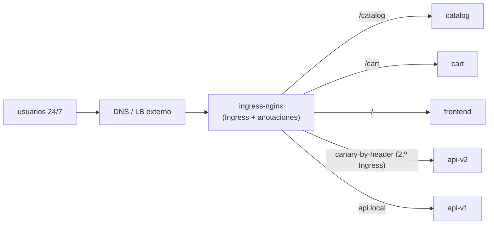
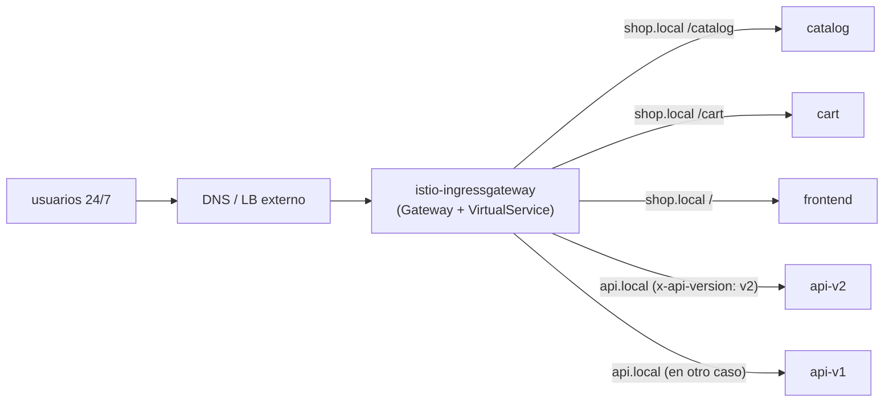
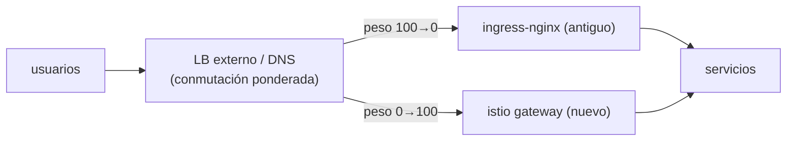

[RU version](README_RU.MD) · [Eng version](README.MD) · [Version française](README_FR.MD) · [Deutsche Version](README_DE.MD)

# Lab 31 - Migración de producción sin tiempo de inactividad: ingress-nginx → Istio Gateway

## Resumen

Emulamos una **migración de producción real** del enrutamiento de ingress desde **ingress-nginx** a
**Istio Gateway + VirtualService**. Las condiciones se acercan a las de un entorno productivo:

- el servicio funciona **24/7**, a los usuarios **no** se les puede afectar (zero downtime);
- la migración se realiza en la **ventana de carga mínima**;
- de estos servicios hay **más de 100** - no se puede migrar en una sola pasada, vamos por **oleadas**;
- en cada paso debe existir un **rollback rápido** con consecuencias mínimas.

Técnicamente, en este lab migras una sola «oleada» (dos hosts): varios hosts,
enrutamiento path-based y header-based. Pero el README describe también la **metodología** de migración de todo el
parque de servicios.

En el namespace `app` ya están desplegados 5 backends (`frontend`, `catalog`, `cart`, `api-v1`,
`api-v2`), cada uno responde `Server Name: <nombre>`. Istio está instalado, el ingress gateway en
NodePort `32080`.

## Arquitectura de partida (tal cual está)



## Arquitectura objetivo (a la que llegamos)



## Estado intermedio: ambos ingress funcionan en paralelo

El principio fundamental del zero-downtime: **no eliminamos nginx hasta el final de la migración**. ingress-nginx e
istio-ingressgateway conviven **simultáneamente**, y el tráfico público se conmuta a nivel del
**LB externo / DNS** - de forma gradual y reversible.



## Principio de la migración (para un solo servicio/host)

1. **Construir el equivalente en Istio** (`Gateway` + `VirtualService`) - una copia exacta de las reglas
   de nginx (hosts, paths, cabeceras, timeouts, rewrite). Ver la sección «Tarea».
2. **Verificación de paridad ANTES de conmutar a los usuarios.** El Istio-gateway ya funciona
   en paralelo; le enviamos tráfico de prueba (por dirección interna / con el Host adecuado) y
   contrastamos el comportamiento de cada regla con nginx. Los usuarios siguen yendo por nginx.
3. **(opcional) Shadow / mirroring.** Mediante el `mirror` del VirtualService copiamos parte
   del tráfico productivo hacia el nuevo camino (las respuestas se descartan) - validación bajo carga real
   sin afectar a los usuarios.
4. **Conmutación en la ventana de carga mínima.** En el LB/DNS externo cambiamos el peso de forma progresiva:
   `nginx 100/istio 0 → 90/10 → 50/50 → 0/100`. Entre pasos observamos las métricas.
5. **Soak (periodo de reposo).** Mantenemos el 100% en Istio varias horas/días, observamos errores y
   latencia. La configuración de nginx **no se toca** - queda como reserva en caliente.
6. **Baja de nginx** para este servicio - solo después de un soak exitoso.

## Mecanismo de conmutación de tráfico (y por qué importa para el rollback)

| Mecanismo | Ventajas | Inconvenientes / impacto en el rollback |
|---|---|---|
| **Pesos del target-group en el LB externo** (ALB/NLB) | instantáneo, sin caché; rollback en segundos | requiere un LB que soporte ponderación |
| **DNS ponderado** (Route53 weighted) | sencillo | **caché/TTL** - el rollback no es instantáneo; baja el TTL con antelación |
| **Conmutación por host** | aislamiento del riesgo por host | más pasos |

Recomendación para 24/7: conmutar con **pesos en el LB** (rollback instantáneo), no por DNS. Si
solo hay DNS - bajar el TTL con antelación (por ejemplo a 30-60s) un día antes de la migración.

## Riesgos de interrupción para los usuarios y cómo eliminarlos

| Riesgo | Consecuencia | Mitigación |
|---|---|---|
| Discrepancia de reglas (path/cabecera/regex) | parte de las peticiones va a otro sitio / 404 | prueba de paridad de **cada** regla antes de conmutar; diff de anotaciones nginx ↔ campos del VS |
| Diferencia en la semántica de paths (`pathType`, rewrite, regex de nginx) | se rompen algunas rutas | mapear explícitamente a `uri.exact/prefix` + `rewrite.uri`, probar |
| Timeouts/límites distintos (nginx vs Istio) | timeouts/cortes bajo carga | fijar `timeout`/`retries` explícitos en el VS acordes a los valores de nginx |
| Sticky sessions / affinity | «deslogueo» de usuarios | `DestinationRule` `consistentHash` (cookie/header) |
| mTLS/inyección en el namespace | 503 entre servicios | durante la migración mantener `PeerAuthentication: PERMISSIVE` |
| WebSocket / gRPC / cabeceras grandes | cortes de conexión | probar explícitamente; nombres de puertos correctos |
| Caché de DNS al hacer rollback | el rollback «se queda pegado» | conmutar con pesos del LB; TTL bajo con antelación |
| Falta de observabilidad en el momento del cutover | tardamos en detectar la regresión | dashboards y alertas (5xx, p99) **listos antes** de conmutar |

## Plan de rollback (si algo sale mal)

El rollback debe llevar **segundos-minutos**, porque el camino antiguo no está desmantelado:

1. En el LB/DNS externo devolver el peso a nginx (`istio 0 / nginx 100`).
2. Confirmar por métricas que 5xx/latencia volvieron a la normalidad.
3. El `Ingress` de nginx **permaneció intacto todo este tiempo** - no hay nada que restaurar.
4. Analizar la causa (normalmente - una regla que no coincide), corregir el `VirtualService`, volver a
   pasar la prueba de paridad y repetir la conmutación.

> Regla: **primero construimos y validamos el nuevo camino, solo después conmutamos, y solo
> al final eliminamos el antiguo.** Mientras el camino antiguo esté vivo, el rollback es trivial.

## Plan por etapas para más de 100 servicios (por oleadas)

No se puede migrar todo de golpe - acumulamos confianza por oleadas:

1. **Oleada 0 (piloto):** 2-3 servicios **no críticos** con poco tráfico. Conmutamos en la ventana
   de carga mínima, observamos **varios días**. Rodamos el runbook, los dashboards,
   el procedimiento de rollback.
2. **Oleada 1..N (grueso):** por lotes de 5-10 servicios. Cada lote - solo tras un soak
   estable del anterior. El mismo proceso repetible (plantillas de Gateway/VS).
3. **Oleada final (los más críticos / de mayor carga):** los migramos **los últimos**,
   con la máxima monitorización, la ventana más estrecha y un rollback ensayado.

Entre oleadas registramos: porcentaje de errores, p95/p99, incidentes. Cualquier regresión → factor de parada
para la siguiente oleada.

## Tarea (oleada piloto: shop.local + api.local)

Construir en Istio el equivalente exacto de las reglas de nginx.

### Paso 1. Un solo Gateway para ambos hosts

```bash
kubectl apply -f - <<'EOF'
apiVersion: networking.istio.io/v1
kind: Gateway
metadata:
  name: shop-gateway
  namespace: app
spec:
  selector:
    istio: ingressgateway
  servers:
    - port: {number: 80, name: http, protocol: HTTP}
      hosts:
        - "shop.local"
        - "api.local"
EOF
```

### Paso 2. shop.local - enrutamiento path-based

El orden importa: primero los prefijos concretos, el catch-all `/` - el último.

```bash
kubectl apply -f - <<'EOF'
apiVersion: networking.istio.io/v1
kind: VirtualService
metadata:
  name: shop
  namespace: app
spec:
  hosts: ["shop.local"]
  gateways: ["shop-gateway"]
  http:
    - match: [{uri: {prefix: /catalog}}]
      route: [{destination: {host: catalog, port: {number: 8080}}}]
    - match: [{uri: {prefix: /cart}}]
      route: [{destination: {host: cart, port: {number: 8080}}}]
    - route: [{destination: {host: frontend, port: {number: 8080}}}]
EOF
```

### Paso 3. api.local - enrutamiento header-based

Lo que en nginx requería un Ingress canary aparte, en Istio - un solo bloque `match`.

```bash
kubectl apply -f - <<'EOF'
apiVersion: networking.istio.io/v1
kind: VirtualService
metadata:
  name: api
  namespace: app
spec:
  hosts: ["api.local"]
  gateways: ["shop-gateway"]
  http:
    - match:
        - headers:
            x-api-version:
              exact: v2
      route: [{destination: {host: api-v2, port: {number: 8080}}}]
    - route: [{destination: {host: api-v1, port: {number: 8080}}}]
EOF
```

### Paso 4. Verificación de paridad del nuevo camino (los usuarios siguen en nginx)

```bash
curl -s http://shop.local:32080/catalog | grep "Server Name"   # catalog
curl -s http://shop.local:32080/cart    | grep "Server Name"   # cart
curl -s http://shop.local:32080/        | grep "Server Name"   # frontend
curl -s http://api.local:32080/         | grep "Server Name"   # api-v1
curl -s -H "x-api-version: v2" http://api.local:32080/ | grep "Server Name"   # api-v2
```

Coincidió en todas las reglas → se puede planificar la conmutación de pesos del LB en la ventana de baja carga.

## Cómo asegurarse de que todo está bien ANTES de conmutar el tráfico en el LB

El objetivo es validar por completo el nuevo camino a través de Istio, mientras **todos los usuarios van
por nginx** y el peso en el balanceador sigue siendo `istio 0 / nginx 100`.

### 1. Salud de la configuración de Istio

```bash
istioctl analyze -n app            # sin errores/advertencias en Gateway/VirtualService
kubectl get gateway,virtualservice -n app
istioctl proxy-status              # todos los proxies SYNCED (la config llegó a Envoy)
# concretamente en el pod del ingress gateway se ven nuestras rutas:
istioctl proxy-config routes deploy/istio-ingressgateway -n istio-system | grep -E 'shop.local|api.local'
```

### 2. Acceso directo al istio-gateway evitando el LB público

No se afecta a los usuarios: enviamos peticiones **directamente al istio-ingressgateway** con
el `Host` adecuado, sin cambiar el DNS/LB público. En producción - mediante `--resolve`, indicando la IP
del istio-gateway en lugar de la pública:

```bash
GW=<IP o NodePort istio-ingressgateway>
curl -s --resolve shop.local:80:$GW http://shop.local/catalog
curl -s --resolve api.local:80:$GW  -H "x-api-version: v2" http://api.local/
```

En este banco de pruebas el istio-gateway está disponible en `:32080`, y `shop.local`/`api.local` ya
se resuelven al nodo - por eso los comandos del paso 4 impactan justo en el nuevo camino, evitando el «público»
LB. Esto es precisamente la verificación pre-cutover.

### 3. Matriz de paridad nginx ↔ istio

Ejecutar **el mismo** conjunto de peticiones en ambos ingress y comparar el código de estado, el cuerpo (qué
servicio respondió), las cabeceras clave y las redirecciones:

```bash
NGINX=<IP ingress-nginx>ISTIO=<IP istio-ingressgateway>
for req in "shop.local /catalog" "shop.local /cart" "shop.local /" "api.local /"; do
  set -- $req; host=$1; path=$2
  echo "== $host$path =="
  echo -n "nginx: "; curl -s -o /dev/null -w "%{http_code}\n" --resolve $host:80:$NGINX  http://$host$path
  echo -n "istio: "; curl -s -o /dev/null -w "%{http_code}\n" --resolve $host:80:$ISTIO  http://$host$path
done
# ruta por cabecera:
curl -s --resolve api.local:80:$ISTIO -H "x-api-version: v2" http://api.local/ | grep "Server Name"
```

Todo debe coincidir **en cada** regla. Una discrepancia - factor de parada, arreglamos el VS y repetimos.

### 4. (opcional) Tráfico en sombra / replay

- **Replay desde los access-logs de nginx**: tomar una muestra de peticiones productivas de los logs de nginx y
  reproducirlas contra el istio-gateway (`--resolve`), comparar respuestas - validación con el
  perfil de tráfico real sin afectar a los usuarios.
- **Mirroring**: cuando istio ya sirve parte del tráfico, `VirtualService.mirror` envía
  una copia de las peticiones al nuevo backend (las respuestas se descartan) - verificación bajo carga real.

### 5. Ejecución de carga y observabilidad

```bash
# lanzar carga directamente al istio-gateway (los usuarios no se ven afectados)
fortio load -qps 200 -t 60s -H "Host: shop.local" http://$GW/catalog
```

Contrastar p95/p99 y errores con nginx; confirmar que los dashboards (5xx, latency) y las alertas están abiertos,
y que el procedimiento de rollback (devolver el peso a nginx) está ensayado.

**Solo cuando todo esté en verde → cambiamos los pesos en el LB en la ventana de carga mínima.**

## Configuración de partida de ingress-nginx (para referencia)

```yaml
# shop.local - path-based
apiVersion: networking.k8s.io/v1
kind: Ingress
metadata: {name: shop}
spec:
  ingressClassName: nginx
  rules:
  - host: shop.local
    http:
      paths:
      - {path: /catalog, pathType: Prefix, backend: {service: {name: catalog,  port: {number: 8080}}}}
      - {path: /cart,    pathType: Prefix, backend: {service: {name: cart,     port: {number: 8080}}}}
      - {path: /,        pathType: Prefix, backend: {service: {name: frontend, port: {number: 8080}}}}
---
# api.local - enrutamiento por cabecera = DOS Ingress (main + canary)
apiVersion: networking.k8s.io/v1
kind: Ingress
metadata: {name: api}
spec:
  ingressClassName: nginx
  rules:
  - host: api.local
    http:
      paths:
      - {path: /, pathType: Prefix, backend: {service: {name: api-v1, port: {number: 8080}}}}
---
apiVersion: networking.k8s.io/v1
kind: Ingress
metadata:
  name: api-canary
  annotations:
    nginx.ingress.kubernetes.io/canary: "true"
    nginx.ingress.kubernetes.io/canary-by-header: "x-api-version"
    nginx.ingress.kubernetes.io/canary-by-header-value: "v2"
spec:
  ingressClassName: nginx
  rules:
  - host: api.local
    http:
      paths:
      - {path: /, pathType: Prefix, backend: {service: {name: api-v2, port: {number: 8080}}}}
```

## Herramientas para la conversión automática de Ingress → Gateway API

No es obligatorio reescribir las reglas a mano - existen herramientas open-source que leen los
`Ingress` existentes (junto con las anotaciones del proveedor) directamente del clúster y generan
recursos Gateway API.

- **[ingress2gateway](https://github.com/kubernetes-sigs/ingress2gateway)**
  (kubernetes-sigs, proyecto oficial de SIG-Network) - la herramienta principal. Lee los Ingress
  y las anotaciones específicas del proveedor del clúster e imprime Gateway API
  (`Gateway`/`HTTPRoute`). Soporta varios proveedores (ingress-nginx, gce, kong,
  apisix, istio, etc.), se instala también como plugin de kubectl.
  ```bash
  # generar Gateway API a partir de los Ingress ingress-nginx existentes en todos los namespace
  ingress2gateway print --providers ingress-nginx -A
  ```
- **Extensiones para implementaciones concretas**: los equipos de kgateway/agentgateway ampliaron
  ingress2gateway para sus proyectos; [`ingress2eg`](https://github.com/kkk777-7/ingress2eg)
  - para Envoy Gateway; Kong tiene su propia guía de migración.

Advertencias importantes:

- la herramienta produce **Gateway API** (`Gateway`/`HTTPRoute`), no `Gateway`/`VirtualService`
  nativos de Istio. Istio implementa Gateway API (ver Lab 16), por eso los
  recursos generados se aplican en Istio con `gatewayClassName: istio`;
- **no todo se convierte 1:1**: las anotaciones específicas de nginx (rewrite, canary-by-header,
  auth-url, timeouts/límites personalizados) pueden transferirse parcialmente o no transferirse
  en absoluto - la salida de la herramienta es un **borrador**;
- por eso es obligatorio hacer **revisión + prueba de paridad** (sección anterior) antes de conmutar el tráfico.

Flujo práctico: `ingress2gateway print ... > gwapi.yaml` → revisión y ajuste → `kubectl
apply` en paralelo con nginx → verificación de paridad → conmutación de pesos en el LB.

> Nota: la descripción de las herramientas se ha parafraseado para cumplir con los requisitos
> de licencia; los enlaces a las fuentes originales figuran arriba.

## Correspondencia nginx Ingress → Istio

| ingress-nginx | Istio |
|---|---|
| `Ingress` (host + paths) | `Gateway` (host/port) + `VirtualService` (enrutamiento) |
| `ingressClassName: nginx` | `Gateway.selector: istio=ingressgateway` + `gateways:` en el VS |
| `rules[].host` | `Gateway.servers[].hosts` + `VirtualService.hosts` |
| `paths[].path` + `pathType` | `http[].match[].uri.{exact,prefix}` |
| canary-by-header (Ingress adicional) | un solo bloque `http[].match[].headers` |
| `rewrite-target` | `http[].rewrite.uri` |
| timeouts/retries (anotaciones) | `http[].timeout`, `http[].retries` |
| `nginx.ingress.kubernetes.io/*` | campos nativos del VS/DestinationRule |

## Comprobación del resultado

Ejecuta en el worker PC:

```bash
check_result
```

## Conclusión

Has recorrido la **oleada piloto** de una migración real de ingress-nginx → Istio Gateway:
construiste el equivalente de las reglas, verificaste la paridad antes de conmutar, analizaste el mecanismo de
conmutación con pesos del LB, los riesgos para los usuarios 24/7, el rollback instantáneo y el plan por etapas
para más de 100 servicios. Este es exactamente el proceso que se aplica al introducir un service mesh en
producción en vivo.

## Infraestructura

| Componente | Tipo | Cant. | Rol |
|---|---|---|---|
| control-plane | `t3.medium` | 1 | master + istiod + ingress gateway |
| worker | `t3.small` | 1 | capacidad para 5 backends |
| worker PC | `t3.small` | 1 | puesto de trabajo: `kubectl`, `curl`, `check_result` |

Región: `eu-central-1` (AZ `eu-central-1a` / `eu-central-1b`).
