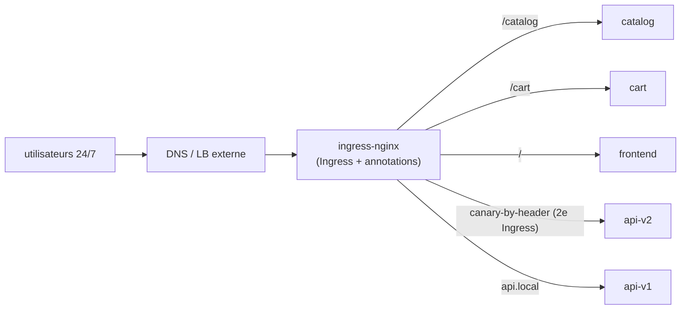
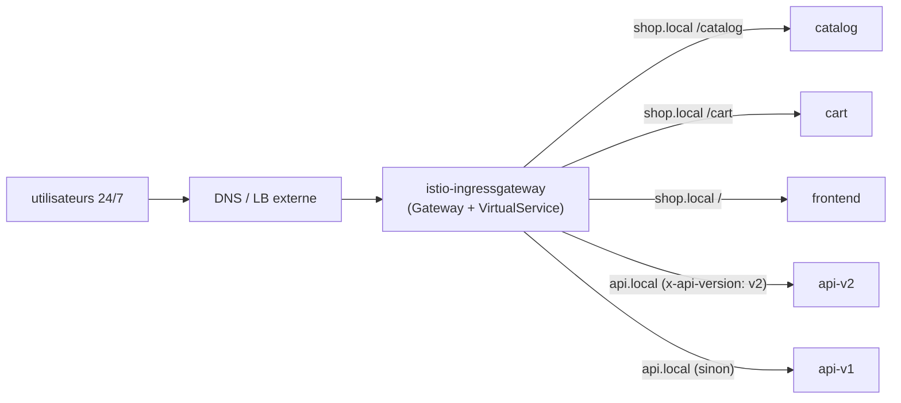
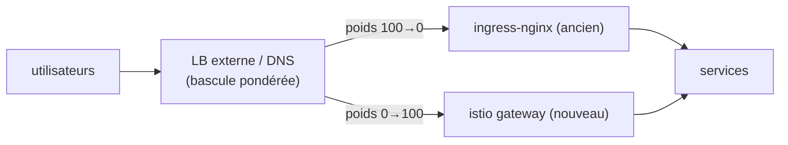

[RU version](README_RU.MD) · [Eng version](README.MD) · [Versión en español](README_ES.MD) · [Deutsche Version](README_DE.MD)

# Lab 31 - Migration en production sans interruption : ingress-nginx → Istio Gateway

## Vue d'ensemble

Nous simulons une **véritable migration de production** du routage ingress depuis **ingress-nginx**
vers **Istio Gateway + VirtualService**. Les hypothèses sont proches du réel :

- le service tourne **24/7**, les utilisateurs **ne doivent pas** être impactés (zero downtime) ;
- la migration se fait dans une **fenêtre de charge minimale** ;
- il y a **plus de 100** services de ce type - impossible de migrer en une seule passe, on procède
  par **vagues** ;
- à chaque étape, il doit exister un **rollback rapide** avec des conséquences minimales.

Techniquement, dans ce lab, vous migrez une seule « vague » (deux hôtes) : plusieurs hôtes,
routage par path et par en-tête. Mais le README décrit aussi la **méthodologie** de migration de
l'ensemble du parc de services.

Dans le namespace `app` sont déjà déployés 5 backends (`frontend`, `catalog`, `cart`, `api-v1`,
`api-v2`), chacun répondant `Server Name: <nom>`. Istio est installé, l'ingress gateway sur le
NodePort `32080`.

## Infrastructure

| Composant | Type | Nombre | Rôle |
|---|---|---|---|
| control-plane | `t3.medium` | 1 | master + istiod + ingress gateway |
| worker | `t3.small` | 1 | capacité pour 5 backends |
| worker PC | `t3.small` | 1 | poste de travail : `kubectl`, `curl`, `check_result` |

Région : `eu-central-1` (AZ `eu-central-1a` / `eu-central-1b`).

## Déploiement

```bash
TASK=31 make run_ica_task
```

## Architecture initiale (état actuel)



## Architecture cible (vers laquelle on converge)



## État intermédiaire : les deux ingress fonctionnent en parallèle

Principe clé du zero-downtime : **on ne supprime pas nginx avant la fin de la migration**.
ingress-nginx et istio-ingressgateway coexistent **simultanément**, et le trafic public bascule
au niveau du **LB externe / DNS** - progressivement et de façon réversible.



## Principe de migration (pour un service/hôte)

1. **Construire l'équivalent dans Istio** (`Gateway` + `VirtualService`) - copie exacte des règles
   nginx (hôtes, paths, en-têtes, timeouts, rewrite). Voir la section « Objectif ».
2. **Test de parité AVANT de basculer les utilisateurs.** L'istio-gateway tourne déjà en
   parallèle ; on lui envoie du trafic de test (via l'adresse interne / avec le bon Host) et on
   compare le comportement pour chaque règle avec nginx. Les utilisateurs passent encore par nginx.
3. **(optionnel) Shadow / mirroring.** Via le `mirror` du VirtualService, on copie une partie du
   trafic réel vers le nouveau chemin (les réponses sont ignorées) - validation sous charge réelle
   sans impact sur les utilisateurs.
4. **Bascule dans la fenêtre de charge minimale.** Sur le LB/DNS externe, on modifie doucement le
   poids : `nginx 100/istio 0 → 90/10 → 50/50 → 0/100`. Entre chaque étape, on surveille les métriques.
5. **Soak (période d'observation).** On maintient 100 % sur Istio pendant plusieurs heures/jours,
   on observe erreurs et latence. La conf nginx **reste intacte** - c'est une réserve chaude.
6. **Décommission de nginx** pour ce service - uniquement après un soak réussi.

## Mécanisme de bascule du trafic (et pourquoi c'est important pour le rollback)

| Mécanisme | Avantages | Inconvénients / impact sur le rollback |
|---|---|---|
| **Poids de target-group sur le LB externe** (ALB/NLB) | instantané, sans cache ; rollback en secondes | nécessite un LB supportant la pondération |
| **DNS pondéré** (Route53 weighted) | simple | **cache/TTL** - rollback non instantané ; abaissez le TTL à l'avance |
| **Bascule par hôte** | isolation du risque par hôte | plus d'étapes |

Recommandation pour du 24/7 : basculer **par poids sur le LB** (rollback instantané), et non par
DNS. Si seul le DNS est disponible - abaisser le TTL à l'avance (par exemple à 30–60 s) la veille
de la migration.

## Risques d'interruption pour les utilisateurs et comment les lever

| Risque | Conséquence | Mitigation |
|---|---|---|
| Non-concordance des règles (path/en-tête/regex) | une partie des requêtes part au mauvais endroit / 404 | test de parité de **chaque** règle avant la bascule ; diff annotations nginx ↔ champs du VS |
| Différence de sémantique des paths (`pathType`, rewrite, regex nginx) | certaines routes cassent | mapper explicitement vers `uri.exact/prefix` + `rewrite.uri`, tester |
| Timeouts/limites différents (nginx vs Istio) | timeouts/coupures sous charge | définir explicitement `timeout`/`retries` dans le VS selon les valeurs nginx |
| Sticky sessions / affinity | « déconnexion » des utilisateurs | `DestinationRule` `consistentHash` (cookie/header) |
| mTLS/injection dans le namespace | 503 entre services | garder `PeerAuthentication: PERMISSIVE` pendant la migration |
| WebSocket / gRPC / gros en-têtes | coupures de connexion | tester explicitement ; noms de ports corrects |
| Cache DNS lors du rollback | le rollback « colle » | basculer par poids du LB ; TTL bas à l'avance |
| Absence d'observabilité au moment du cutover | régression détectée trop tard | dashboards et alertes (5xx, p99) **prêts avant** la bascule |

## Plan de rollback (si quelque chose tourne mal)

Le rollback doit prendre **des secondes à des minutes**, car l'ancien chemin n'est pas démantelé :

1. Sur le LB/DNS externe, ramener le poids sur nginx (`istio 0 / nginx 100`).
2. Vérifier via les métriques que 5xx/latence sont revenus à la normale.
3. L'`Ingress` nginx **est resté intact pendant tout ce temps** - rien à restaurer.
4. Analyser la cause (généralement - une règle non concordante), corriger le `VirtualService`,
   refaire le test de parité et retenter la bascule.

> Règle : **on construit et valide d'abord le nouveau chemin, on ne bascule qu'ensuite, et on ne
> supprime l'ancien qu'à la toute fin.** Tant que l'ancien chemin est vivant - le rollback est trivial.

## Plan par étapes pour 100+ services (par vagues)

Impossible de tout migrer d'un coup - on accumule la confiance par vagues :

1. **Vague 0 (pilote) :** 2–3 services **non critiques** à faible trafic. On bascule dans la
   fenêtre de charge minimale, on observe **plusieurs jours**. On rode le runbook, les dashboards,
   la procédure de rollback.
2. **Vagues 1..N (le gros) :** par lots de 5–10 services. Chaque lot - seulement après un soak
   stable du précédent. Un processus identique et reproductible (templates Gateway/VS).
3. **Vague finale (les plus critiques / les plus chargés) :** on migre **en dernier**, avec un
   monitoring maximal, la fenêtre la plus étroite et un rollback répété.

Entre les vagues, on consigne : taux d'erreurs, p95/p99, incidents. Toute régression → facteur
d'arrêt pour la vague suivante.

## Objectif (vague pilote : shop.local + api.local)

Construire dans Istio l'équivalent exact des règles nginx.

### Étape 1. Une seule Gateway pour les deux hôtes

```bash
kubectl apply -f - <<'EOF'
apiVersion: networking.istio.io/v1
kind: Gateway
metadata:
  name: shop-gateway
  namespace: app
spec:
  selector:
    istio: ingressgateway
  servers:
    - port: {number: 80, name: http, protocol: HTTP}
      hosts:
        - "shop.local"
        - "api.local"
EOF
```

### Étape 2. shop.local - routage par path

L'ordre compte : d'abord les préfixes spécifiques, le catch-all `/` en dernier.

```bash
kubectl apply -f - <<'EOF'
apiVersion: networking.istio.io/v1
kind: VirtualService
metadata:
  name: shop
  namespace: app
spec:
  hosts: ["shop.local"]
  gateways: ["shop-gateway"]
  http:
    - match: [{uri: {prefix: /catalog}}]
      route: [{destination: {host: catalog, port: {number: 8080}}}]
    - match: [{uri: {prefix: /cart}}]
      route: [{destination: {host: cart, port: {number: 8080}}}]
    - route: [{destination: {host: frontend, port: {number: 8080}}}]
EOF
```

### Étape 3. api.local - routage par en-tête

Ce qui, dans nginx, nécessitait un Ingress canary séparé se fait dans Istio en un seul bloc `match`.

```bash
kubectl apply -f - <<'EOF'
apiVersion: networking.istio.io/v1
kind: VirtualService
metadata:
  name: api
  namespace: app
spec:
  hosts: ["api.local"]
  gateways: ["shop-gateway"]
  http:
    - match:
        - headers:
            x-api-version:
              exact: v2
      route: [{destination: {host: api-v2, port: {number: 8080}}}]
    - route: [{destination: {host: api-v1, port: {number: 8080}}}]
EOF
```

### Étape 4. Test de parité du nouveau chemin (les utilisateurs sont encore sur nginx)

```bash
curl -s http://shop.local:32080/catalog | grep "Server Name"   # catalog
curl -s http://shop.local:32080/cart    | grep "Server Name"   # cart
curl -s http://shop.local:32080/        | grep "Server Name"   # frontend
curl -s http://api.local:32080/         | grep "Server Name"   # api-v1
curl -s -H "x-api-version: v2" http://api.local:32080/ | grep "Server Name"   # api-v2
```

Concordance sur toutes les règles → on peut planifier la bascule des poids du LB dans la fenêtre de faible charge.

## Comment s'assurer que tout va bien AVANT de basculer le trafic sur le LB

L'objectif est de valider entièrement le nouveau chemin via Istio, alors que **tous les
utilisateurs passent par nginx** et que le poids sur le load balancer est encore `istio 0 / nginx 100`.

### 1. Santé de la configuration Istio

```bash
istioctl analyze -n app            # aucune erreur/warning sur Gateway/VirtualService
kubectl get gateway,virtualservice -n app
istioctl proxy-status              # tous les proxys SYNCED (config arrivée jusqu'à Envoy)
# concrètement, sur le pod ingress gateway on voit nos routes :
istioctl proxy-config routes deploy/istio-ingressgateway -n istio-system | grep -E 'shop.local|api.local'
```

### 2. Accès direct à l'istio-gateway en contournant le LB public

Les utilisateurs ne sont pas impactés : on envoie les requêtes **directement vers
istio-ingressgateway** avec le bon `Host`, sans modifier le DNS/LB public. En prod - via
`--resolve`, en indiquant l'IP de l'istio-gateway à la place du LB public :

```bash
GW=<IP ou NodePort istio-ingressgateway>
curl -s --resolve shop.local:80:$GW http://shop.local/catalog
curl -s --resolve api.local:80:$GW  -H "x-api-version: v2" http://api.local/
```

Sur ce banc d'essai, l'istio-gateway est accessible sur `:32080`, et `shop.local`/`api.local` se
résolvent déjà vers le nœud - c'est pourquoi les commandes de l'étape 4 frappent bien le nouveau
chemin, en contournant le LB « public ». C'est cela, la vérification pre-cutover.

### 3. Matrice de parité nginx ↔ istio

Exécuter le **même** jeu de requêtes dans les deux ingress et comparer le code de statut, le corps
(quel service a répondu), les en-têtes clés et les redirections :

```bash
NGINX=<IP ingress-nginx>ISTIO=<IP istio-ingressgateway>
for req in "shop.local /catalog" "shop.local /cart" "shop.local /" "api.local /"; do
  set -- $req; host=$1; path=$2
  echo "== $host$path =="
  echo -n "nginx: "; curl -s -o /dev/null -w "%{http_code}\n" --resolve $host:80:$NGINX  http://$host$path
  echo -n "istio: "; curl -s -o /dev/null -w "%{http_code}\n" --resolve $host:80:$ISTIO  http://$host$path
done
# route par en-tête :
curl -s --resolve api.local:80:$ISTIO -H "x-api-version: v2" http://api.local/ | grep "Server Name"
```

Tout doit concorder **pour chaque** règle. Un écart est un facteur d'arrêt : on corrige le VS et on recommence.

### 4. (optionnel) Trafic fantôme / replay

- **Replay depuis les access-logs nginx** : prendre un échantillon de requêtes réelles dans les
  logs nginx et les rejouer contre l'istio-gateway (`--resolve`), comparer les réponses -
  validation sur un profil de trafic réel sans impact sur les utilisateurs.
- **Mirroring** : quand istio sert déjà une partie du trafic, le `mirror` du `VirtualService`
  envoie une copie des requêtes vers le nouveau backend (les réponses sont ignorées) - vérification
  sous charge réelle.

### 5. Passe de charge et observabilité

```bash
# lancer de la charge directement sur l'istio-gateway (les utilisateurs ne sont pas impactés)
fortio load -qps 200 -t 60s -H "Host: shop.local" http://$GW/catalog
```

Comparer p95/p99 et erreurs avec nginx ; s'assurer que les dashboards (5xx, latency) et alertes
sont ouverts, et que la procédure de rollback (retour du poids sur nginx) a été répétée.

**Uniquement quand tout est au vert → on modifie les poids sur le LB dans la fenêtre de charge minimale.**

## Configuration ingress-nginx initiale (pour référence)

```yaml
# shop.local - par path
apiVersion: networking.k8s.io/v1
kind: Ingress
metadata: {name: shop}
spec:
  ingressClassName: nginx
  rules:
  - host: shop.local
    http:
      paths:
      - {path: /catalog, pathType: Prefix, backend: {service: {name: catalog,  port: {number: 8080}}}}
      - {path: /cart,    pathType: Prefix, backend: {service: {name: cart,     port: {number: 8080}}}}
      - {path: /,        pathType: Prefix, backend: {service: {name: frontend, port: {number: 8080}}}}
---
# api.local - routage par en-tête = DEUX Ingress (main + canary)
apiVersion: networking.k8s.io/v1
kind: Ingress
metadata: {name: api}
spec:
  ingressClassName: nginx
  rules:
  - host: api.local
    http:
      paths:
      - {path: /, pathType: Prefix, backend: {service: {name: api-v1, port: {number: 8080}}}}
---
apiVersion: networking.k8s.io/v1
kind: Ingress
metadata:
  name: api-canary
  annotations:
    nginx.ingress.kubernetes.io/canary: "true"
    nginx.ingress.kubernetes.io/canary-by-header: "x-api-version"
    nginx.ingress.kubernetes.io/canary-by-header-value: "v2"
spec:
  ingressClassName: nginx
  rules:
  - host: api.local
    http:
      paths:
      - {path: /, pathType: Prefix, backend: {service: {name: api-v2, port: {number: 8080}}}}
```

## Outils de conversion automatique Ingress → Gateway API

Réécrire les règles à la main n'est pas obligatoire - il existe des outils open-source qui lisent
les `Ingress` existants (avec les annotations du provider) directement depuis le cluster et
génèrent des ressources Gateway API.

- **[ingress2gateway](https://github.com/kubernetes-sigs/ingress2gateway)**
  (kubernetes-sigs, projet officiel du SIG-Network) - l'outil principal. Lit les Ingress et les
  annotations spécifiques au provider depuis le cluster et affiche du Gateway API
  (`Gateway`/`HTTPRoute`). Prend en charge plusieurs providers (ingress-nginx, gce, kong,
  apisix, istio, etc.), s'installe notamment comme plugin kubectl.
  ```bash
  # générer du Gateway API à partir des Ingress ingress-nginx existants dans tous les namespaces
  ingress2gateway print --providers ingress-nginx -A
  ```
- **Extensions pour des implémentations spécifiques** : les équipes kgateway/agentgateway ont
  étendu ingress2gateway pour leurs projets ; [`ingress2eg`](https://github.com/kkk777-7/ingress2eg)
  - pour Envoy Gateway ; Kong a son propre guide de migration.

Réserves importantes :

- l'outil produit du **Gateway API** (`Gateway`/`HTTPRoute`), pas des `Gateway`/`VirtualService`
  Istio natifs. Istio implémente Gateway API (voir Lab 16), donc les ressources générées
  s'appliquent dans Istio avec `gatewayClassName: istio` ;
- **tout ne se convertit pas en 1:1** : les annotations nginx spécifiques (rewrite,
  canary-by-header, auth-url, timeouts/limites personnalisés) peuvent être migrées partiellement
  ou pas du tout - la sortie de l'outil est un **brouillon** ;
- d'où l'obligation d'une **revue + test de parité** (section ci-dessus) avant de basculer le trafic.

Flux pratique : `ingress2gateway print ... > gwapi.yaml` → revue et correction → `kubectl apply`
en parallèle de nginx → test de parité → bascule des poids sur le LB.

> Remarque : la description des outils a été reformulée pour respecter les exigences de licence ;
> les liens vers les sources d'origine sont indiqués ci-dessus.

## Correspondance nginx Ingress → Istio

| ingress-nginx | Istio |
|---|---|
| `Ingress` (host + paths) | `Gateway` (host/port) + `VirtualService` (routage) |
| `ingressClassName: nginx` | `Gateway.selector: istio=ingressgateway` + `gateways:` dans le VS |
| `rules[].host` | `Gateway.servers[].hosts` + `VirtualService.hosts` |
| `paths[].path` + `pathType` | `http[].match[].uri.{exact,prefix}` |
| canary-by-header (Ingress supplémentaire) | un seul bloc `http[].match[].headers` |
| `rewrite-target` | `http[].rewrite.uri` |
| timeouts/retries (annotations) | `http[].timeout`, `http[].retries` |
| `nginx.ingress.kubernetes.io/*` | champs natifs du VS/DestinationRule |

## Vérification du résultat

Lancez sur le worker PC :

```bash
check_result
```

## Bilan

Vous avez déroulé une **vague pilote** d'une vraie migration ingress-nginx → Istio Gateway : vous
avez construit l'équivalent des règles, vérifié la parité avant la bascule, décortiqué le mécanisme
de bascule par poids du LB, les risques pour les utilisateurs 24/7, le rollback instantané et le
plan par étapes pour 100+ services. C'est exactement le processus utilisé lors de l'adoption d'un
maillage de services en production réelle.
