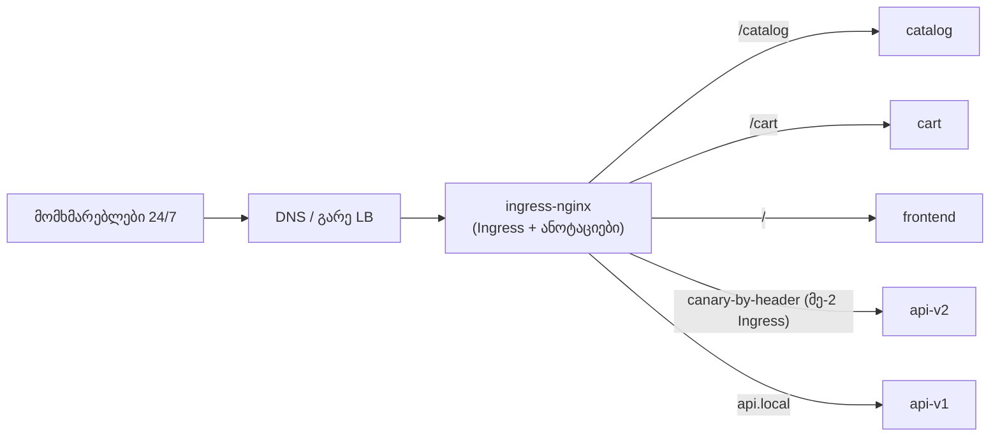
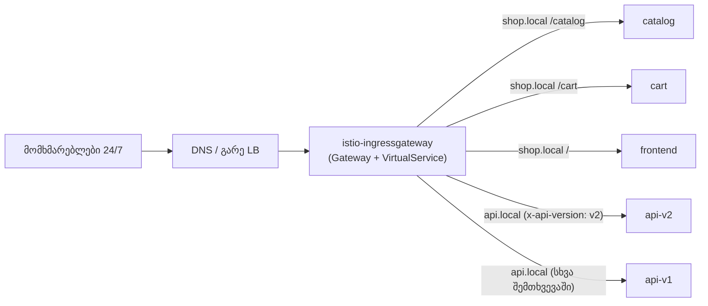

[Русская версия](README_RU.MD) · [Eng version](README.MD) · [Versión en español](README_ES.MD) · [Version française](README_FR.MD) · [Deutsche Version](README_DE.MD) · [繁體中文版](README_TW.MD) · [日本語版](README_JP.MD)

# Lab 31 - Production-ის მიგრაცია შეფერხების გარეშე: ingress-nginx → Istio Gateway

> [საცნობარო გადაწყვეტა](worker/files/solutions/1_GE.MD)

## მიმოხილვა

ჩვენ ვახდენთ ingress-როუტინგის **რეალური production-მიგრაციის** სიმულაციას
**ingress-nginx**-იდან **Istio Gateway + VirtualService**-ზე. საწყისი პირობები რეალურთან
მიახლოებულია:

- სერვისი მუშაობს **24/7**, მომხმარებლების შეფერხება **დაუშვებელია** (zero downtime);
- მიგრაციას ვატარებთ **მინიმალური დატვირთვის ფანჯარაში**;
- ასეთი სერვისი **100-ზე მეტია** - მათი ერთ ჯერზე მიგრაცია შეუძლებელია, ამიტომ
  **ტალღებად** მივდივართ;
- თითოეულ ეტაპზე შესაძლებელი უნდა იყოს **სწრაფი უკუსვლა** მინიმალური შედეგებით.

ტექნიკურად ამ ლაბორატორიაში ერთი „ტალღა“ (ორი ჰოსტი) გადაგაქვთ: რამდენიმე ჰოსტი,
path-based და header-based როუტინგი. თუმცა README-ში აღწერილია სერვისების მთელი პარკის
გადატანის **მეთოდოლოგიაც**.

namespace `app`-ში უკვე გაშვებულია 5 ბეკენდი (`frontend`, `catalog`, `cart`, `api-v1`,
`api-v2`), თითოეული პასუხობს `Server Name: <სახელი>`. Istio დაყენებულია, ingress gateway
ხელმისაწვდომია NodePort `32080`-ზე.

## ინფრასტრუქტურა

| კომპონენტი | ტიპი | რაოდენობა | დანიშნულება |
|---|---|---|---|
| control-plane | `t3.medium` | 1 | master + istiod + ingress gateway |
| worker | `t3.small` | 1 | რესურსი 5 ბეკენდისთვის |
| worker PC | `t3.small` | 1 | სამუშაო ადგილი: `kubectl`, `curl`, `check_result` |

რეგიონი: `eu-central-1` (AZ `eu-central-1a` / `eu-central-1b`).

## გაშლა

```bash
TASK=31 make run_ica_task
```

## საწყისი არქიტექტურა (არსებული მდგომარეობა)



## სამიზნე არქიტექტურა (სასურველი მდგომარეობა)



## შუალედური მდგომარეობა: ორივე ingress პარალელურად მუშაობს

zero-downtime-ის მთავარი პრინციპია: **nginx-ს მიგრაციის დასრულებამდე არ ვშლით**.
ingress-nginx და istio-ingressgateway **ერთდროულად** მუშაობენ, ხოლო საჯარო ტრაფიკი
**გარე LB / DNS**-ის დონეზე გადაირთვება - თანდათან და შექცევადად.


## მიგრაციის პრინციპი (ერთი სერვისისთვის/ჰოსტისთვის)

1. **Istio-ში ეკვივალენტის აგება** (`Gateway` + `VirtualService`) - nginx-ის წესების
   ზუსტი ასლი (ჰოსტები, გზები, სათაურები, timeout-ები, rewrite). იხილეთ სექცია
   „დავალება“.
2. **პარიტეტის შემოწმება მომხმარებლების გადართვამდე.** Istio-gateway უკვე პარალელურად
   მუშაობს; მასში ვგზავნით სატესტო ტრაფიკს (შიდა მისამართით / საჭირო Host-ით) და
   თითოეული წესის ქცევას nginx-ს ვადარებთ. მომხმარებლები ჯერ კიდევ nginx-ის გავლით
   მიდიან.
3. **(არასავალდებულო) Shadow / mirroring.** VirtualService-ის `mirror`-ის საშუალებით
   production-ტრაფიკის ნაწილს ახალ გზაზე ვაკოპირებთ (პასუხები უგულებელყოფილია) - რეალურ
   დატვირთვაზე ვალიდაცია მომხმარებლებზე გავლენის გარეშე.
4. **გადართვა მინიმალური დატვირთვის ფანჯარაში.** გარე LB/DNS-ზე წონას თანდათან ვცვლით:
   `nginx 100/istio 0 → 90/10 → 50/50 → 0/100`. ნაბიჯებს შორის მეტრიკებს ვაკვირდებით.
5. **Soak (დაკვირვების პერიოდი).** ტრაფიკის 100%-ს Istio-ზე რამდენიმე საათით/დღით
   ვტოვებთ და შეცდომებსა და დაყოვნებას ვაკვირდებით. nginx-ის კონფიგურაციას **არ ვეხებით**
   - ის ცხელ რეზერვად რჩება.
6. ამ სერვისისთვის **nginx-ის დეკომისია** - მხოლოდ წარმატებული დაკვირვების პერიოდის
   შემდეგ.

## ტრაფიკის გადართვის მექანიზმი (და რატომ არის ეს მნიშვნელოვანი უკუსვლისთვის)

| მექანიზმი | უპირატესობები | ნაკლოვანებები / გავლენა უკუსვლაზე |
|---|---|---|
| **გარე LB-ზე target-group-ის წონები** (ALB/NLB) | მყისიერად, კეშის გარეშე; უკუსვლა წამებში | საჭიროა LB, რომელსაც წონებით მართვა შეუძლია |
| **წონიანი DNS** (Route53 weighted) | მარტივია | **კეში/TTL** - უკუსვლა მყისიერი არ არის; წინასწარ დააყენეთ დაბალი TTL |
| **თითოეული ჰოსტის ცალ-ცალკე გადართვა** | რისკის იზოლაცია ჰოსტის მიხედვით | მეტი ნაბიჯი |

24/7 რეჟიმისთვის რეკომენდებულია **LB-ის წონებით** გადართვა (მყისიერი უკუსვლა) და არა
DNS-ით. თუ მხოლოდ DNS არის ხელმისაწვდომი - მიგრაციამდე ერთი დღით ადრე შეამცირეთ TTL
(მაგალითად, 30–60 წამამდე).

## მომხმარებლებისთვის შეფერხების რისკები და მათი შემცირება

| რისკი | შედეგი | მიტიგაცია |
|---|---|---|
| წესების შეუსაბამობა (გზა/სათაური/regex) | მოთხოვნების ნაწილი არასწორ ადგილას მიდის / 404 | გადართვამდე **თითოეული** წესის პარიტეტის ტესტი; nginx-ის ანოტაციების ↔ VS-ის ველების diff |
| გზების სემანტიკის განსხვავება (`pathType`, rewrite, nginx regex) | ზოგიერთი მარშრუტი ფუჭდება | ცხადად ასახეთ `uri.exact/prefix` + `rewrite.uri`-ში და შეამოწმეთ |
| განსხვავებული timeout-ები/ლიმიტები (nginx vs Istio) | timeout-ები/კავშირის გაწყვეტა დატვირთვისას | VS-ში nginx-ის მნიშვნელობების შესაბამისი ცხადი `timeout`/`retries` მიუთითეთ |
| Sticky sessions / affinity | მომხმარებლები სისტემიდან „გამოდიან“ | `DestinationRule` `consistentHash` (cookie/header) |
| mTLS/injection namespace-ში | 503 სერვისებს შორის | მიგრაციის დროს შეინარჩუნეთ `PeerAuthentication: PERMISSIVE` |
| WebSocket / gRPC / დიდი სათაურები | კავშირების გაწყვეტა | შეამოწმეთ ცალსახად; გამოიყენეთ პორტების სწორი სახელები |
| DNS-ის კეში უკუსვლისას | უკუსვლა „იჭედება“ | გადართეთ LB-ის წონებით; წინასწარ დაბალი TTL |
| cutover-ის დროს დაკვირვებადობის არარსებობა | რეგრესის აღმოჩენას დიდი დრო სჭირდება | dashboard-ები და alert-ები (5xx, p99) გადართვამდე **მზადაა** |

## უკუსვლის გეგმა (თუ რამე არასწორად წავიდა)

უკუსვლას **წამები-წუთები** უნდა დასჭირდეს, რადგან ძველი გზა დემონტირებული არ არის:

1. გარე LB/DNS-ზე წონა ისევ nginx-ზე დააბრუნეთ (`istio 0 / nginx 100`).
2. მეტრიკებით დარწმუნდით, რომ 5xx/დაყოვნება ნორმას დაუბრუნდა.
3. nginx `Ingress` **მთელი ამ დროის განმავლობაში ხელუხლებელი იყო** - აღდგენა საჭირო არ
   არის.
4. გაარკვიეთ მიზეზი (ჩვეულებრივ - წესის შეუსაბამობა), შეასწორეთ `VirtualService`, კვლავ
   გაიარეთ პარიტეტის ტესტი და გადართვა გაიმეორეთ.

> წესი: **ჯერ ვაგებთ და ვამოწმებთ ახალ გზას, მხოლოდ შემდეგ ვრთავთ ტრაფიკს და მხოლოდ
> სულ ბოლოს ვშლით ძველს.** სანამ ძველი გზა ცოცხალია, უკუსვლა ტრივიალურია.

## ეტაპობრივი გეგმა 100+ სერვისისთვის (ტალღებად)

ყველაფრის ერთდროულად მიგრაცია არ შეიძლება - თავდაჯერებულობას ტალღებად ვაგროვებთ:

1. **ტალღა 0 (პილოტი):** 2–3 **არაკრიტიკული**, დაბალი ტრაფიკის მქონე სერვისი. ვრთავთ
   მინიმალური დატვირთვის ფანჯარაში და **რამდენიმე დღე** ვაკვირდებით. ვამუშავებთ runbook-ს,
   dashboard-ებსა და უკუსვლის პროცედურას.
2. **ტალღა 1..N (ძირითადი მასა):** 5–10 სერვისის ჯგუფებად. ყოველი ჯგუფი - მხოლოდ წინა
   ჯგუფის სტაბილური soak-ის შემდეგ. ერთნაირი, განმეორებადი პროცესი (Gateway/VS-ის
   შაბლონები).
3. **საბოლოო ტალღა (ყველაზე კრიტიკული / მაღალდატვირთული):** მიგრირდება **ბოლოს**,
   მაქსიმალური მონიტორინგით, ყველაზე ვიწრო ფანჯარაში და წინასწარ გავარჯიშებული
   უკუსვლით.

ტალღებს შორის ვაფიქსირებთ: შეცდომების პროცენტს, p95/p99-ს, ინციდენტებს. ნებისმიერი
რეგრესი → შემდეგი ტალღის შეჩერების ფაქტორია.

## დავალება (საპილოტე ტალღა: shop.local + api.local)

Istio-ში ააგეთ nginx-ის წესების ზუსტი ეკვივალენტი.

### ნაბიჯი 1. ერთი Gateway ორივე ჰოსტისთვის

```bash
kubectl apply -f - <<'EOF'
apiVersion: networking.istio.io/v1
kind: Gateway
metadata:
  name: shop-gateway
  namespace: app
spec:
  selector:
    istio: ingressgateway
  servers:
    - port: {number: 80, name: http, protocol: HTTP}
      hosts:
        - "shop.local"
        - "api.local"
EOF
```

### ნაბიჯი 2. shop.local - path-based როუტინგი

თანმიმდევრობა მნიშვნელოვანია: ჯერ კონკრეტული პრეფიქსები, catch-all `/` - ბოლოს.

```bash
kubectl apply -f - <<'EOF'
apiVersion: networking.istio.io/v1
kind: VirtualService
metadata:
  name: shop
  namespace: app
spec:
  hosts: ["shop.local"]
  gateways: ["shop-gateway"]
  http:
    - match: [{uri: {prefix: /catalog}}]
      route: [{destination: {host: catalog, port: {number: 8080}}}]
    - match: [{uri: {prefix: /cart}}]
      route: [{destination: {host: cart, port: {number: 8080}}}]
    - route: [{destination: {host: frontend, port: {number: 8080}}}]
EOF
```

### ნაბიჯი 3. api.local - header-based როუტინგი

ის, რასაც nginx-ში ცალკე canary-Ingress სჭირდებოდა, Istio-ში ერთი `match` ბლოკია.

```bash
kubectl apply -f - <<'EOF'
apiVersion: networking.istio.io/v1
kind: VirtualService
metadata:
  name: api
  namespace: app
spec:
  hosts: ["api.local"]
  gateways: ["shop-gateway"]
  http:
    - match:
        - headers:
            x-api-version:
              exact: v2
      route: [{destination: {host: api-v2, port: {number: 8080}}}]
    - route: [{destination: {host: api-v1, port: {number: 8080}}}]
EOF
```

### ნაბიჯი 4. ახალი გზის პარიტეტის შემოწმება (მომხმარებლები ჯერ კიდევ nginx-ზე არიან)

```bash
curl -s http://shop.local:32080/catalog | grep "Server Name"   # catalog
curl -s http://shop.local:32080/cart    | grep "Server Name"   # cart
curl -s http://shop.local:32080/        | grep "Server Name"   # frontend
curl -s http://api.local:32080/         | grep "Server Name"   # api-v1
curl -s -H "x-api-version: v2" http://api.local:32080/ | grep "Server Name"   # api-v2
```

ყველა წესი დაემთხვა → შეიძლება დაიგეგმოს LB-ის წონების გადართვა დაბალი დატვირთვის
ფანჯარაში.

## როგორ დავრწმუნდეთ, რომ ყველაფერი რიგზეა LB-ზე ტრაფიკის გადართვამდე

მიზანია Istio-ს გავლით ახალი გზა სრულად შევამოწმოთ, სანამ **ყველა მომხმარებელი nginx-ის
გავლით მიდის** და ბალანსერზე წონა ჯერ კიდევ `istio 0 / nginx 100`-ია.

### 1. Istio-ს კონფიგურაციის მდგომარეობა

```bash
istioctl analyze -n app            # Gateway/VirtualService-ზე შეცდომები/გაფრთხილებები არ არის
kubectl get gateway,virtualservice -n app
istioctl proxy-status              # ყველა პროქსი SYNCED (კონფიგი მიაღწია Envoy-ს)
# კონკრეტულად ingress gateway-ის პოდზე ჩანს ჩვენი მარშრუტები:
istioctl proxy-config routes deploy/istio-ingressgateway -n istio-system | grep -E 'shop.local|api.local'
```

### 2. პირდაპირი მიმართვა istio-gateway-სადმი საჯარო LB-ის გვერდის ავლით

მომხმარებლებს ეს არ ეხება: მოთხოვნებს **პირდაპირ istio-ingressgateway-ში** საჭირო
`Host`-ით ვგზავნით, საჯარო DNS/LB-ის შეცვლის გარეშე. production-ში - `--resolve`-ის
საშუალებით, სადაც საჯაროს ნაცვლად istio-gateway-ის IP-ს მივუთითებთ:

```bash
GW=<istio-ingressgateway-ის IP ან NodePort>
curl -s --resolve shop.local:80:$GW http://shop.local/catalog
curl -s --resolve api.local:80:$GW  -H "x-api-version: v2" http://api.local/
```

ამ გარემოში istio-gateway ხელმისაწვდომია `:32080`-ზე, ხოლო `shop.local`/`api.local` უკვე
node-ზე resolve-დება - ამიტომ მე-4 ნაბიჯის ბრძანებები სწორედ ახალ გზას მიმართავს და
„საჯარო“ LB-ს გვერდს უვლის. ეს არის pre-cutover შემოწმება.

### 3. პარიტეტის მატრიცა nginx ↔ istio

გაუშვით მოთხოვნების **ერთი და იგივე** ნაკრები ორივე ingress-ში და შეადარეთ სტატუს-კოდი,
სხეული (რომელმა სერვისმა უპასუხა), ძირითადი სათაურები და redirect-ები:

```bash
NGINX=<IP ingress-nginx>ISTIO=<IP istio-ingressgateway>
for req in "shop.local /catalog" "shop.local /cart" "shop.local /" "api.local /"; do
  set -- $req; host=$1; path=$2
  echo "== $host$path =="
  echo -n "nginx: "; curl -s -o /dev/null -w "%{http_code}\n" --resolve $host:80:$NGINX  http://$host$path
  echo -n "istio: "; curl -s -o /dev/null -w "%{http_code}\n" --resolve $host:80:$ISTIO  http://$host$path
done
# header-მარშრუტი:
curl -s --resolve api.local:80:$ISTIO -H "x-api-version: v2" http://api.local/ | grep "Server Name"
```

ყველაფერი **თითოეული** წესისთვის უნდა დაემთხვეს. აცდენა შეჩერების ფაქტორია - ვასწორებთ
VS-ს და ტესტს ვიმეორებთ.

### 4. (არასავალდებულო) ჩრდილოვანი ტრაფიკი / replay

- **nginx-ის access-ლოგებიდან replay**: აიღეთ production-მოთხოვნების ნიმუში nginx-ის
  ლოგებიდან და გაიმეორეთ ისინი istio-gateway-ის წინააღმდეგ (`--resolve`), შეადარეთ
  პასუხები - რეალური ტრაფიკის პროფილზე ვალიდაცია მომხმარებლებზე გავლენის გარეშე.
- **Mirroring**: როდესაც istio უკვე ემსახურება ტრაფიკის ნაწილს, `VirtualService.mirror`
  მოთხოვნების ასლს ახალ ბეკენდში აგზავნის (პასუხები უგულებელყოფილია) - შემოწმება რეალური
  დატვირთვის ქვეშ.

### 5. დატვირთვის ტესტი და დაკვირვებადობა

```bash
# დატვირთვის გატარება პირდაპირ istio-gateway-ში (მომხმარებლები არ ზარალდებიან)
fortio load -qps 200 -t 60s -H "Host: shop.local" http://$GW/catalog
```

შეადარეთ p95/p99 და შეცდომები nginx-ს; დარწმუნდით, რომ dashboard-ები (5xx, latency) და
alert-ები გახსნილია, ხოლო უკუსვლის პროცედურა (წონის nginx-ზე დაბრუნება) გავარჯიშებულია.

**მხოლოდ მაშინ, როდესაც ყველაფერი მწვანეა → ვცვლით წონებს LB-ზე მინიმალური დატვირთვის
ფანჯარაში.**

## ingress-nginx-ის საწყისი კონფიგურაცია (ცნობისთვის)

```yaml
# shop.local - path-based
apiVersion: networking.k8s.io/v1
kind: Ingress
metadata: {name: shop}
spec:
  ingressClassName: nginx
  rules:
  - host: shop.local
    http:
      paths:
      - {path: /catalog, pathType: Prefix, backend: {service: {name: catalog,  port: {number: 8080}}}}
      - {path: /cart,    pathType: Prefix, backend: {service: {name: cart,     port: {number: 8080}}}}
      - {path: /,        pathType: Prefix, backend: {service: {name: frontend, port: {number: 8080}}}}
---
# api.local - header-მარშრუტიზაცია = ორი Ingress (main + canary)
apiVersion: networking.k8s.io/v1
kind: Ingress
metadata: {name: api}
spec:
  ingressClassName: nginx
  rules:
  - host: api.local
    http:
      paths:
      - {path: /, pathType: Prefix, backend: {service: {name: api-v1, port: {number: 8080}}}}
---
apiVersion: networking.k8s.io/v1
kind: Ingress
metadata:
  name: api-canary
  annotations:
    nginx.ingress.kubernetes.io/canary: "true"
    nginx.ingress.kubernetes.io/canary-by-header: "x-api-version"
    nginx.ingress.kubernetes.io/canary-by-header-value: "v2"
spec:
  ingressClassName: nginx
  rules:
  - host: api.local
    http:
      paths:
      - {path: /, pathType: Prefix, backend: {service: {name: api-v2, port: {number: 8080}}}}
```

## Ingress → Gateway API-ის ავტომატური კონვერტაციის ხელსაწყოები

წესების ხელით გადაწერა აუცილებელი არ არის - არსებობს open-source ხელსაწყოები, რომლებიც
არსებულ `Ingress`-ებს (პროვაიდერის ანოტაციებთან ერთად) პირდაპირ კლასტერიდან კითხულობენ
და Gateway API-ის რესურსებს აგენერირებენ.

- **[ingress2gateway](https://github.com/kubernetes-sigs/ingress2gateway)**
  (kubernetes-sigs, SIG-Network-ის ოფიციალური პროექტი) - ძირითადი ხელსაწყო. კლასტერიდან
  კითხულობს Ingress-სა და პროვაიდერის სპეციფიკურ ანოტაციებს და ბეჭდავს Gateway API-ს
  (`Gateway`/`HTTPRoute`). მხარს უჭერს რამდენიმე პროვაიდერს (ingress-nginx, gce, kong,
  apisix, istio და სხვა), ასევე ყენდება როგორც kubectl-ის plugin.
  ```bash
  # Gateway API-ის გენერირება არსებული ingress-nginx Ingress-ებიდან ყველა namespace-ში
  ingress2gateway print --providers ingress-nginx -A
  ```
- **კონკრეტული იმპლემენტაციების გაფართოებები**: kgateway/agentgateway-ის გუნდებმა
  ingress2gateway საკუთარ პროექტებზე გააფართოვეს; [`ingress2eg`](https://github.com/kkk777-7/ingress2eg)
  - Envoy Gateway-სთვის; Kong-ს მიგრაციის საკუთარი სახელმძღვანელო აქვს.

მნიშვნელოვანი შენიშვნები:

- ხელსაწყო ქმნის **Gateway API**-ს (`Gateway`/`HTTPRoute`) და არა Istio-ს ნატიურ
  `Gateway`/`VirtualService`-ს. Istio ახორციელებს Gateway API-ს (იხილეთ Lab 16), ამიტომ
  გენერირებული რესურსები Istio-ში `gatewayClassName: istio`-თი გამოიყენება;
- **ყველაფერი 1:1 არ კონვერტირდება**: nginx-ის სპეციფიკური ანოტაციები (rewrite,
  canary-by-header, auth-url, მორგებული timeout-ები/ლიმიტები) შეიძლება ნაწილობრივ
  გადავიდეს ან საერთოდ არ გადავიდეს - ხელსაწყოს შედეგი მხოლოდ **სამუშაო ვერსიაა**;
- ამიტომ ტრაფიკის გადართვამდე აუცილებელია **review + პარიტეტის ტესტი** (ზემოთ მოცემული
  სექცია).

პრაქტიკული flow: `ingress2gateway print ... > gwapi.yaml` → review და შესწორება →
`kubectl apply` nginx-ის პარალელურად → პარიტეტის შემოწმება → LB-ზე წონების გადართვა.

> შენიშვნა: ხელსაწყოების აღწერა ლიცენზიის მოთხოვნებთან შესაბამისობისთვის
> პერიფრაზირებულია; პირველწყაროების ბმულები ზემოთ არის მოცემული.

## nginx Ingress → Istio შესაბამისობა

| ingress-nginx | Istio |
|---|---|
| `Ingress` (host + paths) | `Gateway` (host/port) + `VirtualService` (როუტინგი) |
| `ingressClassName: nginx` | `Gateway.selector: istio=ingressgateway` + `gateways:` VS-ში |
| `rules[].host` | `Gateway.servers[].hosts` + `VirtualService.hosts` |
| `paths[].path` + `pathType` | `http[].match[].uri.{exact,prefix}` |
| canary-by-header (დამატებითი Ingress) | ერთი ბლოკი `http[].match[].headers` |
| `rewrite-target` | `http[].rewrite.uri` |
| timeout-ები/retry-ები (ანოტაციები) | `http[].timeout`, `http[].retries` |
| `nginx.ingress.kubernetes.io/*` | VS/DestinationRule-ის ნატიური ველები |

## შედეგის შემოწმება

გაუშვით worker PC-ზე:

```bash
check_result
```

## შეჯამება

თქვენ დაამუშავეთ ingress-nginx → Istio Gateway რეალური მიგრაციის **საპილოტე ტალღა**:
შექმენით წესების ეკვივალენტი, გადართვამდე შეამოწმეთ პარიტეტი, გაეცანით LB-ის წონებით
გადართვის მექანიზმს, 24/7-მომხმარებლებისთვის არსებულ რისკებს, მყისიერ უკუსვლასა და 100+
სერვისის ეტაპობრივი მიგრაციის გეგმას. სწორედ ეს პროცესი გამოიყენება ცოცხალ production-ში
service mesh-ის დანერგვისას.
