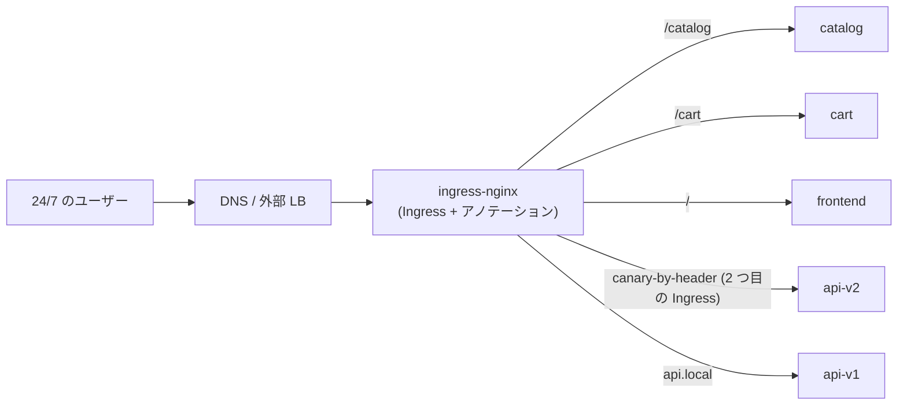
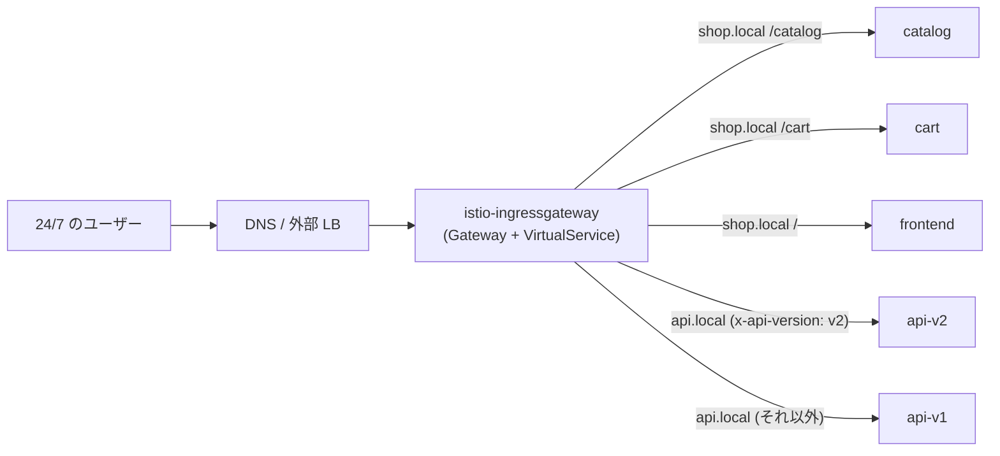
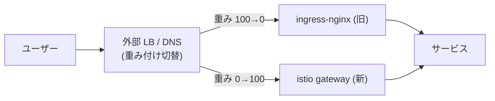

[Русская версия](README_RU.MD) · [Eng version](README.MD) · [Versión en español](README_ES.MD) · [Version française](README_FR.MD) · [Deutsche Version](README_DE.MD) · [ქართული ვერსია](README_GE.MD) · [繁體中文版](README_TW.MD)

# Lab 31 - ダウンタイムなしの本番移行: ingress-nginx → Istio Gateway

> [リファレンス解答](worker/files/solutions/1_JP.MD)

## 概要

**実際の本番移行**を想定し、ingress ルーティングを **ingress-nginx** から
**Istio Gateway + VirtualService** へ移行します。前提条件は実運用に近いものです。

- サービスは **24/7** で稼働しており、ユーザーに影響を与えることは**できない**（ゼロダウンタイム）。
- 移行は**負荷が最も低い時間帯**に実施する。
- このようなサービスは **100 以上**あり、一度には移行できないため、**ウェーブ**単位で進める。
- 各ステップで、影響を最小限に抑えた**迅速なロールバック**が必要である。

このラボで移行するのは 1 つの「ウェーブ」（2 つのホスト）です。複数ホスト、
path-based および header-based ルーティングを扱います。ただし、この README ではサービス群全体を
移行するための**方法論**も説明します。

namespace `app` には、すでに 5 つのバックエンド（`frontend`、`catalog`、`cart`、`api-v1`、
`api-v2`）がデプロイされており、それぞれ `Server Name: <名前>` を返します。Istio はインストール済みで、
ingress gateway は NodePort `32080` にあります。

## インフラストラクチャ

| コンポーネント | タイプ | 数 | 役割 |
|---|---|---|---|
| control-plane | `t3.medium` | 1 | master + istiod + ingress gateway |
| worker | `t3.small` | 1 | 5 バックエンド用の容量 |
| worker PC | `t3.small` | 1 | 作業端末: `kubectl`、`curl`、`check_result` |

リージョン: `eu-central-1`（AZ `eu-central-1a` / `eu-central-1b`）。

## デプロイ

```bash
TASK=31 make run_ica_task
```

## 現在のアーキテクチャ（現状）



## 目標アーキテクチャ（移行先）



## 中間状態: 両方の ingress を並行稼働させる

ゼロダウンタイムの中心原則は、**移行完了まで nginx を削除しないこと**です。ingress-nginx と
istio-ingressgateway は**同時に**稼働し、パブリックトラフィックは
**外部 LB / DNS** のレベルで、段階的かつ可逆的に切り替えます。



## 移行原則（1 サービス／ホストあたり）

1. **Istio で等価な構成を作成する**（`Gateway` + `VirtualService`）- nginx ルール
   （ホスト、パス、ヘッダー、タイムアウト、rewrite）の正確なコピーです。「課題」セクションを参照してください。
2. **ユーザー切替前にパリティを確認する。** Istio-gateway はすでに並行稼働しているため、
   テストトラフィックをそこへ送信し（内部アドレスまたは適切な Host を使用）、各ルールの動作を nginx と
   突き合わせます。ユーザーは引き続き nginx を経由します。
3. **（任意）Shadow / mirroring。** VirtualService の `mirror` を通じて、本番トラフィックの一部を
   新しい経路へ複製します（レスポンスは破棄されます）。ユーザーに影響を与えず、実負荷で検証できます。
4. **低負荷時間帯に切り替える。** 外部 LB/DNS 上で重みを段階的に変更します:
   `nginx 100/istio 0 → 90/10 → 50/50 → 0/100`。各ステップの間にメトリクスを確認します。
5. **Soak（安定稼働観察）。** Istio に 100% を数時間／数日間流し、エラーと
   レイテンシを監視します。nginx 設定には**手を触れず**、ウォームスタンバイとして残します。
6. このサービスの nginx を**廃止**するのは、安定稼働観察が成功してからに限ります。

## トラフィック切替メカニズム（およびロールバックに重要な理由）

| メカニズム | 長所 | 短所／ロールバックへの影響 |
|---|---|---|
| **外部 LB の target-group 重み**（ALB/NLB） | 即時、キャッシュなし。数秒でロールバック | 重み付けをサポートする LB が必要 |
| **重み付き DNS**（Route53 weighted） | シンプル | **キャッシュ/TTL** によりロールバックは即時ではない。あらかじめ TTL を低く設定する |
| **ホスト単位の切替** | ホストごとにリスクを分離 | ステップ数が多い |

24/7 サービスでは、DNS ではなく **LB の重み**で切り替えること（即時ロールバック）を推奨します。DNS のみを使用する場合は、
移行の前日に TTL をあらかじめ下げてください（例: 30–60 秒）。

## ユーザー中断のリスクと軽減策

| リスク | 影響 | 軽減策 |
|---|---|---|
| ルールの不一致（パス／ヘッダー／regex） | 一部リクエストが誤った宛先へ行く／404 | 切替前に**すべての**ルールをパリティテスト。nginx アノテーション ↔ VS フィールドを diff |
| パスセマンティクスの違い（`pathType`、rewrite、nginx regex） | 一部のルートが壊れる | `uri.exact/prefix` + `rewrite.uri` へ明示的にマッピングし、テストする |
| タイムアウト／制限の違い（nginx vs Istio） | 負荷時のタイムアウト／接続切断 | nginx の値に合わせて VS の `timeout`/`retries` を明示的に設定 |
| Sticky sessions / affinity | ユーザーが「ログアウト」される | `DestinationRule` の `consistentHash`（cookie/header） |
| namespace 内の mTLS／injection | サービス間で 503 | 移行中は `PeerAuthentication: PERMISSIVE` を維持 |
| WebSocket / gRPC / 大きなヘッダー | 接続切断 | 明示的にテスト。適切なポート名を使用 |
| ロールバック時の DNS キャッシュ | ロールバックが「固まる」 | LB の重みで切り替える。事前に低い TTL を設定 |
| cutover 時の可観測性不足 | リグレッションの検出に時間がかかる | ダッシュボードとアラート（5xx、p99）を切替**前に**準備 |

## ロールバック計画（問題が発生した場合）

旧経路は撤去されていないため、ロールバックは**数秒から数分**で完了する必要があります。

1. 外部 LB/DNS で、重みを nginx に戻します（`istio 0 / nginx 100`）。
2. メトリクスを確認し、5xx／レイテンシが正常に戻ったことを確認します。
3. nginx `Ingress` は**その間ずっと変更されていません**。復元するものはありません。
4. 原因を分析し（通常はルールの不一致）、`VirtualService` を修正して、再度
   パリティテストを実行し、切替を繰り返します。

> 原則: **最初に新しい経路を構築して検証し、その後で切り替え、旧経路を削除するのは最後です。**
> 旧経路が生きている限り、ロールバックは容易です。

## 100 以上のサービスに対する段階的計画（ウェーブ）

すべてを一度に移行することはできません。ウェーブごとに確信を積み上げます。

1. **ウェーブ 0（パイロット）:** 低トラフィックの**非クリティカル**なサービスを 2～3 個。低負荷時間帯に
   切り替え、**数日間**観察します。runbook、ダッシュボード、ロールバック手順を検証します。
2. **ウェーブ 1..N（主要部分）:** 5～10 サービスずつのバッチで進めます。各バッチは、前の
   バッチの soak が安定してからに限ります。同一の再現可能なプロセス（Gateway/VS テンプレート）を使用します。
3. **最終ウェーブ（最もクリティカル／高負荷）:** **最後に**移行します。
   最大限の監視、最も狭い時間枠、リハーサル済みのロールバックを用います。

ウェーブ間で、エラー率、p95/p99、インシデントを記録します。リグレッションがあれば次のウェーブの
ストップ要因です。

## 課題（パイロットウェーブ: shop.local + api.local）

Istio に nginx ルールと正確に等価な構成を作成してください。

### ステップ 1. 両ホストに 1 つの Gateway

```bash
kubectl apply -f - <<'EOF'
apiVersion: networking.istio.io/v1
kind: Gateway
metadata:
  name: shop-gateway
  namespace: app
spec:
  selector:
    istio: ingressgateway
  servers:
    - port: {number: 80, name: http, protocol: HTTP}
      hosts:
        - "shop.local"
        - "api.local"
EOF
```

### ステップ 2. shop.local - path-based ルーティング

順序が重要です。具体的なプレフィックスを先にし、catch-all の `/` を最後に置きます。

```bash
kubectl apply -f - <<'EOF'
apiVersion: networking.istio.io/v1
kind: VirtualService
metadata:
  name: shop
  namespace: app
spec:
  hosts: ["shop.local"]
  gateways: ["shop-gateway"]
  http:
    - match: [{uri: {prefix: /catalog}}]
      route: [{destination: {host: catalog, port: {number: 8080}}}]
    - match: [{uri: {prefix: /cart}}]
      route: [{destination: {host: cart, port: {number: 8080}}}]
    - route: [{destination: {host: frontend, port: {number: 8080}}}]
EOF
```

### ステップ 3. api.local - header-based ルーティング

nginx では別個の canary-Ingress を必要としたものが、Istio では 1 つの `match` ブロックです。

```bash
kubectl apply -f - <<'EOF'
apiVersion: networking.istio.io/v1
kind: VirtualService
metadata:
  name: api
  namespace: app
spec:
  hosts: ["api.local"]
  gateways: ["shop-gateway"]
  http:
    - match:
        - headers:
            x-api-version:
              exact: v2
      route: [{destination: {host: api-v2, port: {number: 8080}}}]
    - route: [{destination: {host: api-v1, port: {number: 8080}}}]
EOF
```

### ステップ 4. 新しい経路のパリティ確認（ユーザーはまだ nginx を利用）

```bash
curl -s http://shop.local:32080/catalog | grep "Server Name"   # catalog
curl -s http://shop.local:32080/cart    | grep "Server Name"   # cart
curl -s http://shop.local:32080/        | grep "Server Name"   # frontend
curl -s http://api.local:32080/         | grep "Server Name"   # api-v1
curl -s -H "x-api-version: v2" http://api.local:32080/ | grep "Server Name"   # api-v2
```

すべてのルールが一致すれば、低負荷時間帯での LB 重み切替を計画できます。

## LB でトラフィックを切り替える前に、問題がないことを確認する方法

目的は、**すべてのユーザーが nginx を経由している**間に新しい Istio 経路を完全に検証することです。
ロードバランサーの重みは依然として `istio 0 / nginx 100` です。

### 1. Istio 構成の健全性

```bash
istioctl analyze -n app            # Gateway/VirtualService に関するエラー/警告なし
kubectl get gateway,virtualservice -n app
istioctl proxy-status              # すべてのプロキシが SYNCED (設定が Envoy に届いた)
# 具体的に ingress gateway の Pod で我々のルートが見える:
istioctl proxy-config routes deploy/istio-ingressgateway -n istio-system | grep -E 'shop.local|api.local'
```

### 2. パブリック LB を迂回して istio-gateway に直接アクセスする

ユーザーには影響しません。パブリック DNS/LB を変更せず、適切な `Host` を付けて
**istio-ingressgateway に直接**リクエストを送信します。本番では、パブリック IP ではなく
istio-gateway の IP を指定して `--resolve` を使用します。

```bash
GW=<istio-ingressgateway の IP または NodePort>
curl -s --resolve shop.local:80:$GW http://shop.local/catalog
curl -s --resolve api.local:80:$GW  -H "x-api-version: v2" http://api.local/
```

この環境では istio-gateway は `:32080` でアクセス可能で、`shop.local`/`api.local` はすでに
ノードに名前解決されます。したがってステップ 4 のコマンドは「パブリック」LB を通らず、まさに新しい
経路に到達します。これが pre-cutover チェックです。

### 3. nginx ↔ istio のパリティマトリクス

両 ingress に**同じ**リクエストセットを実行し、ステータスコード、本文（どの
サービスが応答したか）、主要ヘッダー、リダイレクトを比較します。

```bash
NGINX=<IP ingress-nginx>ISTIO=<IP istio-ingressgateway>
for req in "shop.local /catalog" "shop.local /cart" "shop.local /" "api.local /"; do
  set -- $req; host=$1; path=$2
  echo "== $host$path =="
  echo -n "nginx: "; curl -s -o /dev/null -w "%{http_code}\n" --resolve $host:80:$NGINX  http://$host$path
  echo -n "istio: "; curl -s -o /dev/null -w "%{http_code}\n" --resolve $host:80:$ISTIO  http://$host$path
done
# header ルート:
curl -s --resolve api.local:80:$ISTIO -H "x-api-version: v2" http://api.local/ | grep "Server Name"
```

**各**ルールで完全に一致しなければなりません。不一致はストップ要因です。VS を修正して再実行します。

### 4. （任意）シャドートラフィック／リプレイ

- **nginx access ログからのリプレイ**: nginx ログから本番リクエストのサンプルを取り出し、
  istio-gateway に対して再生します（`--resolve`）。レスポンスを比較することで、ユーザーへ影響を与えずに
  実際のトラフィックプロファイルで検証できます。
- **Mirroring**: Istio がすでにトラフィックの一部を処理している場合、`VirtualService.mirror` が
  リクエストのコピーを新しいバックエンドに送ります（レスポンスは破棄されます）。実負荷での確認です。

### 5. 負荷テストと可観測性

```bash
# 負荷を istio-gateway に直接かける (ユーザーには影響しない)
fortio load -qps 200 -t 60s -H "Host: shop.local" http://$GW/catalog
```

p95/p99 とエラーを nginx と照合し、ダッシュボード（5xx、latency）とアラートが開かれ、
ロールバック手順（nginx への重み戻し）がリハーサル済みであることを確認します。

**すべてが正常になって初めて、低負荷時間帯に LB の重みを変更します。**

## ingress-nginx の初期構成（参考）

```yaml
# shop.local - path-based
apiVersion: networking.k8s.io/v1
kind: Ingress
metadata: {name: shop}
spec:
  ingressClassName: nginx
  rules:
  - host: shop.local
    http:
      paths:
      - {path: /catalog, pathType: Prefix, backend: {service: {name: catalog,  port: {number: 8080}}}}
      - {path: /cart,    pathType: Prefix, backend: {service: {name: cart,     port: {number: 8080}}}}
      - {path: /,        pathType: Prefix, backend: {service: {name: frontend, port: {number: 8080}}}}
---
# api.local - header ルーティング = 2 つの Ingress (main + canary)
apiVersion: networking.k8s.io/v1
kind: Ingress
metadata: {name: api}
spec:
  ingressClassName: nginx
  rules:
  - host: api.local
    http:
      paths:
      - {path: /, pathType: Prefix, backend: {service: {name: api-v1, port: {number: 8080}}}}
---
apiVersion: networking.k8s.io/v1
kind: Ingress
metadata:
  name: api-canary
  annotations:
    nginx.ingress.kubernetes.io/canary: "true"
    nginx.ingress.kubernetes.io/canary-by-header: "x-api-version"
    nginx.ingress.kubernetes.io/canary-by-header-value: "v2"
spec:
  ingressClassName: nginx
  rules:
  - host: api.local
    http:
      paths:
      - {path: /, pathType: Prefix, backend: {service: {name: api-v2, port: {number: 8080}}}}
```

## Ingress → Gateway API の自動変換ツール

ルールを手作業で書き直す必要はありません。既存の `Ingress`（プロバイダーのアノテーションを含む）を
クラスターから直接読み取り、Gateway API リソースを生成するオープンソースツールがあります。

- **[ingress2gateway](https://github.com/kubernetes-sigs/ingress2gateway)**
  （kubernetes-sigs、SIG-Network の公式プロジェクト）- 主なツールです。クラスターから Ingress と
  プロバイダー固有のアノテーションを読み取り、Gateway API
  （`Gateway`/`HTTPRoute`）を出力します。複数のプロバイダー（ingress-nginx、gce、kong、
  apisix、istio など）をサポートし、kubectl プラグインとしてもインストールできます。
  ```bash
  # すべての namespace の ingress-nginx の既存 Ingress から Gateway API を生成する
  ingress2gateway print --providers ingress-nginx -A
  ```
- **特定実装向けの拡張**: kgateway/agentgateway チームは自プロジェクト向けに
  ingress2gateway を拡張しています。[`ingress2eg`](https://github.com/kkk777-7/ingress2eg) は
  Envoy Gateway 向けです。Kong には独自の移行ガイドがあります。

重要な注意事項:

- ツールが出力するのはネイティブ Istio の `Gateway`/`VirtualService` ではなく、
  **Gateway API**（`Gateway`/`HTTPRoute`）です。Istio は Gateway API を実装しているため（Lab 16 を参照）、
  生成されたリソースは `gatewayClassName: istio` として Istio に適用されます。
- **すべてが 1:1 に変換されるわけではありません**。nginx 固有のアノテーション（rewrite、canary-by-header、
  auth-url、カスタムタイムアウト／制限）は、部分的にしか移行されないか、まったく移行されないことがあります。
  ツールの出力は**下書き**です。
- したがって、トラフィックを切り替える前に、必ず**レビュー + パリティテスト**（上記セクション）を実施してください。

実践的なフロー: `ingress2gateway print ... > gwapi.yaml` → レビューと修正 → nginx と並行して `kubectl
apply` → パリティ確認 → LB の重み切替。

> 注記: ツールの説明はライセンス要件に適合するよう言い換えています。一次情報へのリンクは上記にあります。

## nginx Ingress → Istio の対応

| ingress-nginx | Istio |
|---|---|
| `Ingress`（host + paths） | `Gateway`（host/port）+ `VirtualService`（ルーティング） |
| `ingressClassName: nginx` | `Gateway.selector: istio=ingressgateway` + VS の `gateways:` |
| `rules[].host` | `Gateway.servers[].hosts` + `VirtualService.hosts` |
| `paths[].path` + `pathType` | `http[].match[].uri.{exact,prefix}` |
| canary-by-header（追加の Ingress） | 1 つの `http[].match[].headers` ブロック |
| `rewrite-target` | `http[].rewrite.uri` |
| タイムアウト／リトライ（アノテーション） | `http[].timeout`、`http[].retries` |
| `nginx.ingress.kubernetes.io/*` | ネイティブの VS/DestinationRule フィールド |

## 結果の確認

worker PC で実行します:

```bash
check_result
```

## まとめ

ingress-nginx → Istio Gateway の実際の移行における**パイロットウェーブ**を実施しました。
ルールの等価構成を作り、切替前にパリティを確認し、LB の重みによる切替メカニズム、24/7 ユーザーへのリスク、
即時ロールバック、100 以上のサービスに対する段階的な計画を確認しました。これは、稼働中の本番環境へ
service mesh を導入する際に用いるプロセスそのものです。
