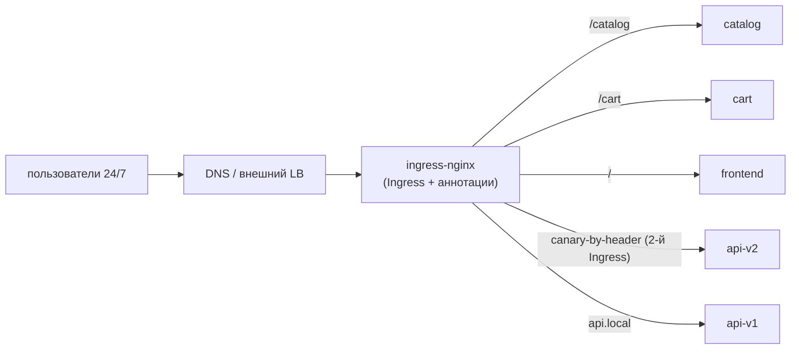
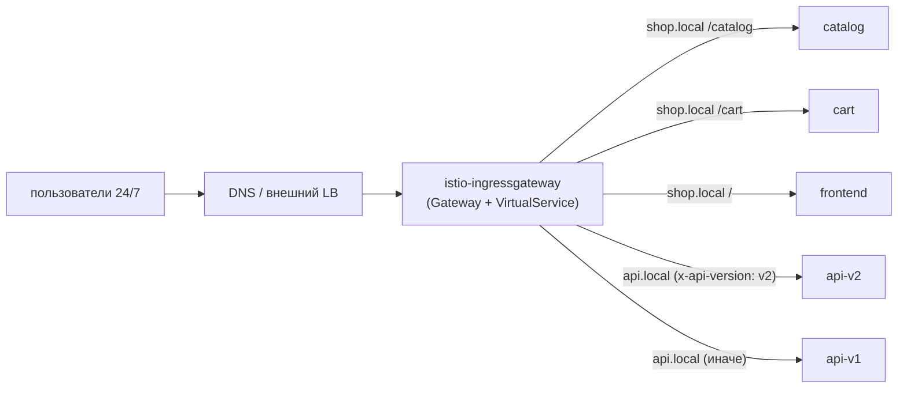
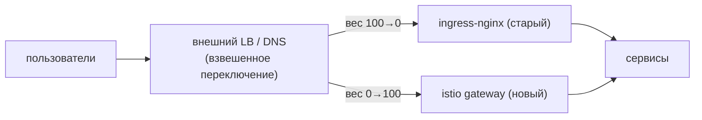

[Eng version](README.MD)

# Lab 31 - Миграция продакшена без даунтайма: ingress-nginx → Istio Gateway

## Обзор

Мы эмулируем **реальную продакшен-миграцию** ingress-роутинга с **ingress-nginx** на
**Istio Gateway + VirtualService**. Вводные приближены к боевым:

- сервис работает **24/7**, пользователей **нельзя** затрагивать (zero downtime);
- миграцию проводим в **окно минимальной нагрузки**;
- таких сервисов **больше 100** - за один проход мигрировать нельзя, идём **волнами**;
- на каждом шаге должен быть **быстрый откат** с минимальными последствиями.

Технически в этой лабе вы переносите одну «волну» (два хоста): несколько хостов,
path-based и header-based роутинг. Но README описывает и **методологию** переноса всего
парка сервисов.

В namespace `app` уже развёрнуты 5 бэкендов (`frontend`, `catalog`, `cart`, `api-v1`,
`api-v2`), каждый отвечает `Server Name: <имя>`. Istio установлен, ingress gateway на
NodePort `32080`.

## Исходная архитектура (как есть)



## Целевая архитектура (к чему приводим)



## Промежуточное состояние: оба ingress работают параллельно

Главный принцип zero-downtime: **не удаляем nginx до конца миграции**. ingress-nginx и
istio-ingressgateway живут **одновременно**, а публичный трафик переключается на уровне
**внешнего LB / DNS** - постепенно и обратимо.



## Принцип миграции (для одного сервиса/хоста)

1. **Построить эквивалент в Istio** (`Gateway` + `VirtualService`) - точная копия правил
   nginx (хосты, пути, заголовки, таймауты, rewrite). См. раздел «Задание».
2. **Проверка на паритет ДО переключения пользователей.** Istio-gateway уже работает
   параллельно; шлём в него тестовый трафик (по внутреннему адресу / с нужным Host) и
   сверяем поведение по каждому правилу с nginx. Пользователи всё ещё идут через nginx.
3. **(опционально) Shadow / mirroring.** Через VirtualService `mirror` копируем часть
   боевого трафика в новый путь (ответы отбрасываются) - валидация под реальной нагрузкой
   без влияния на пользователей.
4. **Переключение в окно минимальной нагрузки.** На внешнем LB/DNS плавно меняем вес:
   `nginx 100/istio 0 → 90/10 → 50/50 → 0/100`. Между шагами смотрим метрики.
5. **Soak (выдержка).** Держим 100% на Istio несколько часов/дней, наблюдаем ошибки и
   латентность. nginx-конфиг **не трогаем** - он остаётся горячим резервом.
6. **Декомиссия nginx** для этого сервиса - только после успешной выдержки.

## Механизм переключения трафика (и почему это важно для отката)

| Механизм | Плюсы | Минусы / влияние на откат |
|---|---|---|
| **Веса target-group на внешнем LB** (ALB/NLB) | мгновенно, без кэша; откат за секунды | нужен LB, поддерживающий взвешивание |
| **Взвешенный DNS** (Route53 weighted) | просто | **кэш/TTL** - откат не мгновенный; ставьте низкий TTL заранее |
| **Пер-хостовое переключение** | изоляция риска по хосту | больше шагов |

Рекомендация для 24/7: переключать **весами на LB** (мгновенный откат), а не DNS. Если
только DNS - заранее снизить TTL (например до 30–60с) за сутки до миграции.

## Риски прерывания для пользователей и как их снять

| Риск | Последствие | Митигация |
|---|---|---|
| Несовпадение правил (путь/заголовок/regex) | часть запросов уходит не туда / 404 | паритет-тест **каждого** правила до переключения; diff аннотаций nginx ↔ поля VS |
| Разница семантики путей (`pathType`, rewrite, regex nginx) | ломаются some маршруты | явно маппить в `uri.exact/prefix` + `rewrite.uri`, тестировать |
| Разные таймауты/лимиты (nginx vs Istio) | таймауты/обрывы под нагрузкой | выставить явные `timeout`/`retries` в VS под значения nginx |
| Sticky sessions / affinity | «разлогинивание» пользователей | `DestinationRule` `consistentHash` (cookie/header) |
| mTLS/инъекция в namespace | 503 между сервисами | на время миграции держать `PeerAuthentication: PERMISSIVE` |
| WebSocket / gRPC / большие заголовки | обрывы соединений | тестировать явно; правильные имена портов |
| Кэш DNS при откате | откат «залипает» | переключать весами LB; низкий TTL заранее |
| Нет наблюдаемости в момент cutover | долго ловим регресс | дашборды и алерты (5xx, p99) **готовы до** переключения |

## План отката (если что-то пошло не так)

Откат должен занимать **секунды-минуты**, потому что старый путь не демонтирован:

1. На внешнем LB/DNS вернуть вес обратно на nginx (`istio 0 / nginx 100`).
2. Убедиться по метрикам, что 5xx/латентность вернулись в норму.
3. nginx `Ingress` **всё это время оставался нетронутым** - ничего восстанавливать не
   нужно.
4. Разобрать причину (обычно - несовпадение правила), поправить `VirtualService`, снова
   пройти паритет-тест и повторить переключение.

> Правило: **сначала строим и валидируем новый путь, только потом переключаем, и только
> в самом конце удаляем старый.** Пока старый путь жив - откат тривиален.

## Поэтапный план для 100+ сервисов (волнами)

Мигрировать всё сразу нельзя - копим уверенность волнами:

1. **Волна 0 (пилот):** 2–3 **некритичных** сервиса с низким трафиком. Переключаем в окно
   минимальной нагрузки, наблюдаем **несколько дней**. Обкатываем runbook, дашборды,
   процедуру отката.
2. **Волна 1..N (основная масса):** батчами по 5–10 сервисов. Каждый батч - только после
   стабильного soak предыдущего. Одинаковый повторяемый процесс (шаблоны Gateway/VS).
3. **Финальная волна (самые критичные / высоконагруженные):** мигрируем **последними**,
   с максимальным мониторингом, самым узким окном и отрепетированным откатом.

Между волнами фиксируем: процент ошибок, p95/p99, инциденты. Любой регресс → стоп-фактор
для следующей волны.

## Задание (пилотная волна: shop.local + api.local)

Построить в Istio точный эквивалент правил nginx.

### Шаг 1. Один Gateway на оба хоста

```bash
kubectl apply -f - <<'EOF'
apiVersion: networking.istio.io/v1
kind: Gateway
metadata:
  name: shop-gateway
  namespace: app
spec:
  selector:
    istio: ingressgateway
  servers:
    - port: {number: 80, name: http, protocol: HTTP}
      hosts:
        - "shop.local"
        - "api.local"
EOF
```

### Шаг 2. shop.local - path-based роутинг

Порядок важен: сначала конкретные префиксы, catch-all `/` - последним.

```bash
kubectl apply -f - <<'EOF'
apiVersion: networking.istio.io/v1
kind: VirtualService
metadata:
  name: shop
  namespace: app
spec:
  hosts: ["shop.local"]
  gateways: ["shop-gateway"]
  http:
    - match: [{uri: {prefix: /catalog}}]
      route: [{destination: {host: catalog, port: {number: 8080}}}]
    - match: [{uri: {prefix: /cart}}]
      route: [{destination: {host: cart, port: {number: 8080}}}]
    - route: [{destination: {host: frontend, port: {number: 8080}}}]
EOF
```

### Шаг 3. api.local - header-based роутинг

То, что в nginx требовало отдельный canary-Ingress, в Istio - один блок `match`.

```bash
kubectl apply -f - <<'EOF'
apiVersion: networking.istio.io/v1
kind: VirtualService
metadata:
  name: api
  namespace: app
spec:
  hosts: ["api.local"]
  gateways: ["shop-gateway"]
  http:
    - match:
        - headers:
            x-api-version:
              exact: v2
      route: [{destination: {host: api-v2, port: {number: 8080}}}]
    - route: [{destination: {host: api-v1, port: {number: 8080}}}]
EOF
```

### Шаг 4. Паритет-проверка нового пути (пользователи ещё на nginx)

```bash
curl -s http://shop.local:32080/catalog | grep "Server Name"   # catalog
curl -s http://shop.local:32080/cart    | grep "Server Name"   # cart
curl -s http://shop.local:32080/        | grep "Server Name"   # frontend
curl -s http://api.local:32080/         | grep "Server Name"   # api-v1
curl -s -H "x-api-version: v2" http://api.local:32080/ | grep "Server Name"   # api-v2
```

Совпало по всем правилам → можно планировать переключение весов LB в окно низкой нагрузки.

## Как убедиться, что всё хорошо ДО переключения трафика на LB

Цель - полностью провалидировать новый путь через Istio, пока **все пользователи идут
через nginx** и вес на балансировщике всё ещё `istio 0 / nginx 100`.

### 1. Здоровье конфигурации Istio

```bash
istioctl analyze -n app            # нет ошибок/варнингов по Gateway/VirtualService
kubectl get gateway,virtualservice -n app
istioctl proxy-status              # все прокси SYNCED (конфиг доехал до Envoy)
# конкретно на поде ingress gateway видны наши маршруты:
istioctl proxy-config routes deploy/istio-ingressgateway -n istio-system | grep -E 'shop.local|api.local'
```

### 2. Прямое обращение к istio-gateway в обход публичного LB

Пользователи не затрагиваются: мы шлём запросы **напрямую в istio-ingressgateway** с
нужным `Host`, не меняя публичный DNS/LB. В проде - через `--resolve`, указывая IP
istio-gateway вместо публичного:

```bash
GW=<IP или NodePort istio-ingressgateway>
curl -s --resolve shop.local:80:$GW http://shop.local/catalog
curl -s --resolve api.local:80:$GW  -H "x-api-version: v2" http://api.local/
```

В этом стенде istio-gateway доступен на `:32080`, а `shop.local`/`api.local` уже
резолвятся на ноду - поэтому команды из шага 4 бьют именно в новый путь, минуя «публичный»
LB. Это и есть pre-cutover проверка.

### 3. Паритет-матрица nginx ↔ istio

Прогнать **один и тот же** набор запросов в оба ingress и сравнить статус-код, тело (какой
сервис ответил), ключевые заголовки и редиректы:

```bash
NGINX=<IP ingress-nginx>ISTIO=<IP istio-ingressgateway>
for req in "shop.local /catalog" "shop.local /cart" "shop.local /" "api.local /"; do
  set -- $req; host=$1; path=$2
  echo "== $host$path =="
  echo -n "nginx: "; curl -s -o /dev/null -w "%{http_code}\n" --resolve $host:80:$NGINX  http://$host$path
  echo -n "istio: "; curl -s -o /dev/null -w "%{http_code}\n" --resolve $host:80:$ISTIO  http://$host$path
done
# header-роут:
curl -s --resolve api.local:80:$ISTIO -H "x-api-version: v2" http://api.local/ | grep "Server Name"
```

Всё должно совпасть **по каждому** правилу. Расхождение - стоп-фактор, чиним VS и повторяем.

### 4. (опционально) Теневой трафик / реплей

- **Реплей из access-логов nginx**: взять выборку боевых запросов из логов nginx и
  воспроизвести их против istio-gateway (`--resolve`), сравнить ответы - валидация на
  реальном профиле трафика без влияния на пользователей.
- **Mirroring**: когда istio уже обслуживает часть трафика, `VirtualService.mirror` шлёт
  копию запросов в новый бэкенд (ответы отбрасываются) - проверка под реальной нагрузкой.

### 5. Нагрузочный прогон и наблюдаемость

```bash
# прогнать нагрузку прямо в istio-gateway (пользователи не затронуты)
fortio load -qps 200 -t 60s -H "Host: shop.local" http://$GW/catalog
```

Сверить p95/p99 и ошибки с nginx; убедиться, что дашборды (5xx, latency) и алерты открыты,
а процедура отката (возврат веса на nginx) отрепетирована.

**Только когда всё зелёное → меняем веса на LB в окно минимальной нагрузки.**

## Исходная конфигурация ingress-nginx (для справки)

```yaml
# shop.local - path-based
apiVersion: networking.k8s.io/v1
kind: Ingress
metadata: {name: shop}
spec:
  ingressClassName: nginx
  rules:
  - host: shop.local
    http:
      paths:
      - {path: /catalog, pathType: Prefix, backend: {service: {name: catalog,  port: {number: 8080}}}}
      - {path: /cart,    pathType: Prefix, backend: {service: {name: cart,     port: {number: 8080}}}}
      - {path: /,        pathType: Prefix, backend: {service: {name: frontend, port: {number: 8080}}}}
---
# api.local - header-роутинг = ДВА Ingress (main + canary)
apiVersion: networking.k8s.io/v1
kind: Ingress
metadata: {name: api}
spec:
  ingressClassName: nginx
  rules:
  - host: api.local
    http:
      paths:
      - {path: /, pathType: Prefix, backend: {service: {name: api-v1, port: {number: 8080}}}}
---
apiVersion: networking.k8s.io/v1
kind: Ingress
metadata:
  name: api-canary
  annotations:
    nginx.ingress.kubernetes.io/canary: "true"
    nginx.ingress.kubernetes.io/canary-by-header: "x-api-version"
    nginx.ingress.kubernetes.io/canary-by-header-value: "v2"
spec:
  ingressClassName: nginx
  rules:
  - host: api.local
    http:
      paths:
      - {path: /, pathType: Prefix, backend: {service: {name: api-v2, port: {number: 8080}}}}
```

## Инструменты для автоматической конвертации Ingress → Gateway API

Переписывать правила руками не обязательно - есть open-source инструменты, которые читают
существующие `Ingress` (вместе с аннотациями провайдера) прямо из кластера и генерируют
ресурсы Gateway API.

- **[ingress2gateway](https://github.com/kubernetes-sigs/ingress2gateway)**
  (kubernetes-sigs, официальный проект SIG-Network) - основной инструмент. Читает Ingress
  и провайдер-специфичные аннотации из кластера и печатает Gateway API
  (`Gateway`/`HTTPRoute`). Поддерживает несколько провайдеров (ingress-nginx, gce, kong,
  apisix, istio и др.), ставится в т.ч. как kubectl-плагин.
  ```bash
  # сгенерировать Gateway API из существующих Ingress ingress-nginx во всех namespace
  ingress2gateway print --providers ingress-nginx -A
  ```
- **Расширения под конкретные реализации**: команды kgateway/agentgateway расширили
  ingress2gateway под свои проекты; [`ingress2eg`](https://github.com/kkk777-7/ingress2eg)
  - под Envoy Gateway; у Kong есть собственный гайд миграции.

Важные оговорки:

- инструмент выдаёт **Gateway API** (`Gateway`/`HTTPRoute`), а не нативные Istio
  `Gateway`/`VirtualService`. Istio реализует Gateway API (см. Lab 16), поэтому
  сгенерированные ресурсы применяются в Istio с `gatewayClassName: istio`;
- **не всё конвертируется 1:1**: специфичные аннотации nginx (rewrite, canary-by-header,
  auth-url, кастомные таймауты/лимиты) могут перенестись частично или не перенестись
  вовсе - вывод инструмента это **черновик**;
- поэтому обязательно **ревью + паритет-тест** (раздел выше) перед переключением трафика.

Практический флоу: `ingress2gateway print ... > gwapi.yaml` → ревью и правка → `kubectl
apply` параллельно с nginx → паритет-проверка → переключение весов на LB.

> Замечание: описание инструментов перефразировано для соответствия лицензионным
> требованиям; ссылки на первоисточники приведены выше.

## Соответствие nginx Ingress → Istio

| ingress-nginx | Istio |
|---|---|
| `Ingress` (host + paths) | `Gateway` (host/port) + `VirtualService` (роутинг) |
| `ingressClassName: nginx` | `Gateway.selector: istio=ingressgateway` + `gateways:` в VS |
| `rules[].host` | `Gateway.servers[].hosts` + `VirtualService.hosts` |
| `paths[].path` + `pathType` | `http[].match[].uri.{exact,prefix}` |
| canary-by-header (доп. Ingress) | один блок `http[].match[].headers` |
| `rewrite-target` | `http[].rewrite.uri` |
| таймауты/ретраи (аннотации) | `http[].timeout`, `http[].retries` |
| `nginx.ingress.kubernetes.io/*` | нативные поля VS/DestinationRule |

## Проверка результата

Запустите на worker PC:

```bash
check_result
```

## Итог

Вы отработали **пилотную волну** реальной миграции ingress-nginx → Istio Gateway:
построили эквивалент правил, проверили паритет до переключения, разобрали механизм
переключения весами LB, риски для 24/7-пользователей, мгновенный откат и поэтапный план
для 100+ сервисов. Это ровно тот процесс, который применяют при внедрении service mesh в
живом проде.

## Инфраструктура

| Компонент | Тип | Кол-во | Роль |
|---|---|---|---|
| control-plane | `t3.medium` | 1 | master + istiod + ingress gateway |
| worker | `t3.small` | 1 | ёмкость для 5 бэкендов |
| worker PC | `t3.small` | 1 | рабочее место: `kubectl`, `curl`, `check_result` |

Регион: `eu-central-1` (AZ `eu-central-1a` / `eu-central-1b`).
