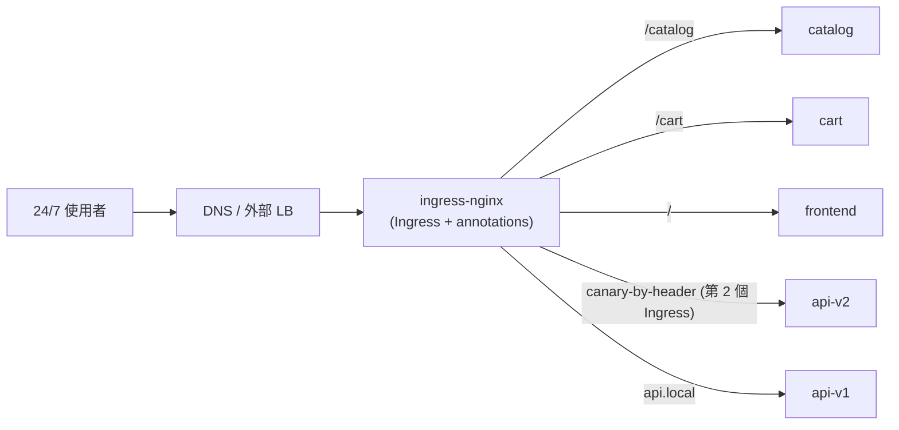
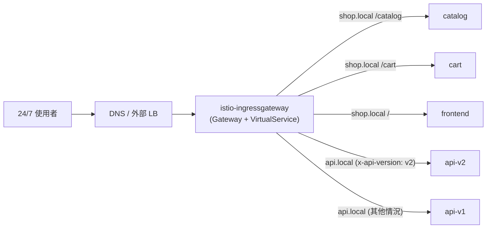
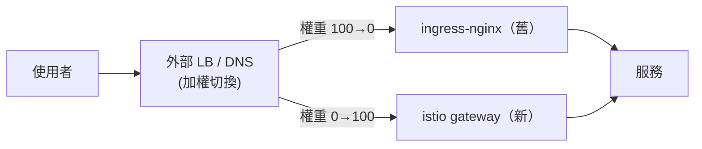

[Русская версия](README_RU.MD) · [Eng version](README.MD) · [Versión en español](README_ES.MD) · [Version française](README_FR.MD) · [Deutsche Version](README_DE.MD) · [ქართული ვერსია](README_GE.MD) · [日本語版](README_JP.MD)

# Lab 31 - 零停機遷移生產環境：ingress-nginx → Istio Gateway

> [參考解答](worker/files/solutions/1_TW.MD)

## 概觀

我們模擬將 ingress 路由從 **ingress-nginx** 遷移至 **Istio Gateway + VirtualService** 的**真實生產遷移**。前提條件接近實戰：

- 服務 **24/7** 運作，**不得**影響使用者（zero downtime）；
- 在**最低負載時段**執行遷移；
- 此類服務有 **100 多個**，無法一次遷移，必須以**波次**進行；
- 每一個步驟都必須能以最小影響**快速回滾**。

技術上，本實驗會遷移一個「波次」（兩個主機）：多個主機、以 path 為基礎及以 header 為基礎的路由。但 README 也說明遷移整個服務群的**方法論**。

namespace `app` 已部署 5 個後端（`frontend`、`catalog`、`cart`、`api-v1`、`api-v2`），每個都回應 `Server Name: <名稱>`。Istio 已安裝，ingress gateway 使用 NodePort `32080`。

## 基礎設施

| 元件 | 類型 | 數量 | 角色 |
|---|---|---|---|
| control-plane | `t3.medium` | 1 | master + istiod + ingress gateway |
| worker | `t3.small` | 1 | 供 5 個後端使用的容量 |
| worker PC | `t3.small` | 1 | 工作站：`kubectl`、`curl`、`check_result` |

區域：`eu-central-1`（AZ `eu-central-1a` / `eu-central-1b`）。

## 部署

```bash
TASK=31 make run_ica_task
```

## 原始架構（現況）



## 目標架構（遷移後）



## 中間狀態：兩個 ingress 並行運作

zero-downtime 的核心原則：**在遷移完成前不移除 nginx**。ingress-nginx 與 istio-ingressgateway **同時**運作，並在**外部 LB / DNS** 層級逐步且可逆地切換公開流量。



## 遷移原則（單一服務／主機）

1. **在 Istio 建立對等項目**（`Gateway` + `VirtualService`）：nginx 規則的精確複本（主機、路徑、headers、逾時、rewrite）。請見「作業」章節。
2. **在切換使用者前進行同等性檢查。**Istio-gateway 已並行運作；向其傳送測試流量（透過內部位址／使用所需的 Host），並針對每個規則與 nginx 比對行為。使用者仍經由 nginx 存取。
3. **（可選）Shadow / mirroring。**透過 VirtualService `mirror` 將部分正式流量複製至新路徑（捨棄回應）- 在不影響使用者的情況下，以真實負載驗證。
4. **於最低負載時段切換。**在外部 LB/DNS 平順調整權重：`nginx 100/istio 0 → 90/10 → 50/50 → 0/100`。步驟之間檢查 metrics。
5. **Soak（觀察期）。**在 Istio 保持 100% 數小時／數天，觀察錯誤和 latency。**不變更** nginx-config，它仍保留為熱備援。
6. 僅在成功完成觀察期後，才對此服務**退役 nginx**。

## 流量切換機制（以及為何它對回滾很重要）

| 機制 | 優點 | 缺點／對回滾的影響 |
|---|---|---|
| **外部 LB 的 target-group 權重**（ALB/NLB） | 立即生效，無快取；數秒內回滾 | 需要支援加權的 LB |
| **加權 DNS**（Route53 weighted） | 簡單 | **快取/TTL** - 回滾非即時；需事先設定較低 TTL |
| **按主機切換** | 依主機隔離風險 | 步驟較多 |

對 24/7 的建議：以 **LB 權重**切換（立即回滾），而非 DNS。若只能使用 DNS，應在遷移前一天先降低 TTL（例如至 30–60s）。

## 對使用者造成中斷的風險及其緩解方式

| 風險 | 後果 | 緩解措施 |
|---|---|---|
| 規則不相符（路徑/header/regex） | 部分請求發往錯誤位置／404 | 切換前對**每個**規則做同等性測試；比對 nginx annotations ↔ VS 欄位 |
| 路徑語意差異（`pathType`、rewrite、nginx regex） | 部分路由失效 | 明確映射為 `uri.exact/prefix` + `rewrite.uri`，並測試 |
| 逾時／限制不同（nginx vs Istio） | 負載下逾時／中斷 | 在 VS 明確設定與 nginx 相符的 `timeout`/`retries` |
| Sticky sessions / affinity | 使用者「被登出」 | `DestinationRule` `consistentHash`（cookie/header） |
| namespace 中的 mTLS/injection | 服務間 503 | 遷移期間保持 `PeerAuthentication: PERMISSIVE` |
| WebSocket / gRPC / 大型 headers | 連線中斷 | 明確測試；使用正確的 port 名稱 |
| 回滾時 DNS 快取 | 回滾「卡住」 | 以 LB 權重切換；預先降低 TTL |
| cutover 時缺少可觀測性 | 花太久才發現回歸問題 | 在切換**前**準備好 dashboards 與 alerts（5xx、p99） |

## 回滾計畫（若發生問題）

回滾必須只花費**數秒至數分鐘**，因為舊路徑尚未拆除：

1. 在外部 LB/DNS 將權重切回 nginx（`istio 0 / nginx 100`）。
2. 透過 metrics 確認 5xx/latency 已恢復正常。
3. nginx `Ingress` **始終保持未變更**，無需還原任何內容。
4. 分析原因（通常是規則不相符）、修正 `VirtualService`、再次執行同等性測試，然後重新進行切換。

> 規則：**先建立並驗證新路徑，之後才切換，最後才移除舊路徑。**只要舊路徑仍存在，回滾便很簡單。

## 100+ 個服務的分階段計畫（以波次進行）

無法一次遷移全部服務，必須藉由波次逐步建立信心：

1. **波次 0（試點）：**2–3 個低流量的**非關鍵**服務。在最低負載時段切換，觀察**數天**。演練 runbook、dashboards 和回滾程序。
2. **波次 1..N（主要部分）：**每批 5–10 個服務。僅在前一批完成穩定 soak 後進行下一批。採用一致、可重複的程序（Gateway/VS 範本）。
3. **最終波次（最關鍵／高負載）：****最後**遷移，使用最高程度的監控、最短時段和已演練的回滾程序。

在各波次之間記錄：錯誤百分比、p95/p99、事件。任何回歸 → 成為下一波次的停止因素。

## 作業（試點波次：shop.local + api.local）

在 Istio 建立 nginx 規則的精確對等項目。

### 步驟 1. 一個 Gateway 用於兩個主機

```bash
kubectl apply -f - <<'EOF'
apiVersion: networking.istio.io/v1
kind: Gateway
metadata:
  name: shop-gateway
  namespace: app
spec:
  selector:
    istio: ingressgateway
  servers:
    - port: {number: 80, name: http, protocol: HTTP}
      hosts:
        - "shop.local"
        - "api.local"
EOF
```

### 步驟 2. shop.local - path-based 路由

順序很重要：先列出具體前綴，catch-all `/` 放在最後。

```bash
kubectl apply -f - <<'EOF'
apiVersion: networking.istio.io/v1
kind: VirtualService
metadata:
  name: shop
  namespace: app
spec:
  hosts: ["shop.local"]
  gateways: ["shop-gateway"]
  http:
    - match: [{uri: {prefix: /catalog}}]
      route: [{destination: {host: catalog, port: {number: 8080}}}]
    - match: [{uri: {prefix: /cart}}]
      route: [{destination: {host: cart, port: {number: 8080}}}]
    - route: [{destination: {host: frontend, port: {number: 8080}}}]
EOF
```

### 步驟 3. api.local - header-based 路由

在 nginx 中需要獨立 canary-Ingress 的內容，在 Istio 中僅需一個 `match` 區塊。

```bash
kubectl apply -f - <<'EOF'
apiVersion: networking.istio.io/v1
kind: VirtualService
metadata:
  name: api
  namespace: app
spec:
  hosts: ["api.local"]
  gateways: ["shop-gateway"]
  http:
    - match:
        - headers:
            x-api-version:
              exact: v2
      route: [{destination: {host: api-v2, port: {number: 8080}}}]
    - route: [{destination: {host: api-v1, port: {number: 8080}}}]
EOF
```

### 步驟 4. 新路徑的同等性檢查（使用者仍使用 nginx）

```bash
curl -s http://shop.local:32080/catalog | grep "Server Name"   # catalog
curl -s http://shop.local:32080/cart    | grep "Server Name"   # cart
curl -s http://shop.local:32080/        | grep "Server Name"   # frontend
curl -s http://api.local:32080/         | grep "Server Name"   # api-v1
curl -s -H "x-api-version: v2" http://api.local:32080/ | grep "Server Name"   # api-v2
```

所有規則皆相符 → 即可規劃在低負載時段切換 LB 權重。

## 如何在將流量切換至 LB 前確認一切正常

目標是在**所有使用者仍經由 nginx**、且 load balancer 權重仍為 `istio 0 / nginx 100` 時，完整驗證經過 Istio 的新路徑。

### 1. Istio 組態健康狀態

```bash
istioctl analyze -n app            # Gateway/VirtualService 沒有錯誤/警告
kubectl get gateway,virtualservice -n app
istioctl proxy-status              # 所有 proxy 皆 SYNCED (設定已送達 Envoy)
# 具體在 ingress gateway 的 Pod 上可見我們的路由：
istioctl proxy-config routes deploy/istio-ingressgateway -n istio-system | grep -E 'shop.local|api.local'
```

### 2. 直接存取 istio-gateway，繞過公開 LB

使用者不受影響：我們以所需的 `Host` **直接**向 istio-ingressgateway 傳送請求，不變更公開 DNS/LB。在生產環境中，使用 `--resolve` 指定 istio-gateway IP 而非公開 IP：

```bash
GW=<istio-ingressgateway 的 IP 或 NodePort>
curl -s --resolve shop.local:80:$GW http://shop.local/catalog
curl -s --resolve api.local:80:$GW  -H "x-api-version: v2" http://api.local/
```

在此環境中，istio-gateway 可在 `:32080` 存取，且 `shop.local`/`api.local` 已解析至 node，因此步驟 4 的命令會直接命中新路徑，繞過「公開」LB。這就是 pre-cutover 檢查。

### 3. nginx ↔ istio 同等性矩陣

對兩個 ingress 執行**同一組**請求，並比較 status code、body（由哪個服務回應）、關鍵 headers 和 redirects：

```bash
NGINX=<IP ingress-nginx>ISTIO=<IP istio-ingressgateway>
for req in "shop.local /catalog" "shop.local /cart" "shop.local /" "api.local /"; do
  set -- $req; host=$1; path=$2
  echo "== $host$path =="
  echo -n "nginx: "; curl -s -o /dev/null -w "%{http_code}\n" --resolve $host:80:$NGINX  http://$host$path
  echo -n "istio: "; curl -s -o /dev/null -w "%{http_code}\n" --resolve $host:80:$ISTIO  http://$host$path
done
# header 路由：
curl -s --resolve api.local:80:$ISTIO -H "x-api-version: v2" http://api.local/ | grep "Server Name"
```

每個規則都必須**完全相符**。任何差異皆為停止因素；修正 VS 後重試。

### 4. （可選）Shadow 流量／replay

- **從 nginx access logs replay：**從 nginx logs 取出正式請求樣本，針對 istio-gateway 重播（`--resolve`）並比較回應 - 以真實流量特徵驗證，不影響使用者。
- **Mirroring：**當 istio 已處理部分流量時，`VirtualService.mirror` 會將請求副本傳送至新 backend（捨棄回應）- 在真實負載下檢查。

### 5. 負載測試與可觀測性

```bash
# 直接對 istio-gateway 施加負載 (不影響使用者)
fortio load -qps 200 -t 60s -H "Host: shop.local" http://$GW/catalog
```

將 p95/p99 和錯誤與 nginx 比對；確認 dashboards（5xx、latency）與 alerts 已開啟，且已演練回滾程序（將權重切回 nginx）。

**僅在一切綠燈後 → 才在最低負載時段變更 LB 權重。**

## 原始 ingress-nginx 組態（供參考）

```yaml
# shop.local - path-based
apiVersion: networking.k8s.io/v1
kind: Ingress
metadata: {name: shop}
spec:
  ingressClassName: nginx
  rules:
  - host: shop.local
    http:
      paths:
      - {path: /catalog, pathType: Prefix, backend: {service: {name: catalog,  port: {number: 8080}}}}
      - {path: /cart,    pathType: Prefix, backend: {service: {name: cart,     port: {number: 8080}}}}
      - {path: /,        pathType: Prefix, backend: {service: {name: frontend, port: {number: 8080}}}}
---
# api.local - header 路由 = 兩個 Ingress (main + canary)
apiVersion: networking.k8s.io/v1
kind: Ingress
metadata: {name: api}
spec:
  ingressClassName: nginx
  rules:
  - host: api.local
    http:
      paths:
      - {path: /, pathType: Prefix, backend: {service: {name: api-v1, port: {number: 8080}}}}
---
apiVersion: networking.k8s.io/v1
kind: Ingress
metadata:
  name: api-canary
  annotations:
    nginx.ingress.kubernetes.io/canary: "true"
    nginx.ingress.kubernetes.io/canary-by-header: "x-api-version"
    nginx.ingress.kubernetes.io/canary-by-header-value: "v2"
spec:
  ingressClassName: nginx
  rules:
  - host: api.local
    http:
      paths:
      - {path: /, pathType: Prefix, backend: {service: {name: api-v2, port: {number: 8080}}}}
```

## 自動將 Ingress 轉換為 Gateway API 的工具

不一定要手動重寫規則 - 有些 open-source 工具可直接從 cluster 讀取現有 `Ingress`（連同 provider annotations），並產生 Gateway API resources。

- **[ingress2gateway](https://github.com/kubernetes-sigs/ingress2gateway)**
  （kubernetes-sigs，SIG-Network 官方專案）- 主要工具。從 cluster 讀取 Ingress 與 provider-specific annotations，並輸出 Gateway API（`Gateway`/`HTTPRoute`）。支援多個 providers（ingress-nginx、gce、kong、apisix、istio 等），也可安裝為 kubectl-plugin。
  ```bash
  # 從所有 namespace 中現有的 ingress-nginx Ingress 產生 Gateway API
  ingress2gateway print --providers ingress-nginx -A
  ```
- **特定實作的擴充功能：**kgateway/agentgateway 團隊已為其專案擴充 ingress2gateway；[`ingress2eg`](https://github.com/kkk777-7/ingress2eg) 適用於 Envoy Gateway；Kong 有自己的遷移指南。

重要注意事項：

- 該工具產生的是 **Gateway API**（`Gateway`/`HTTPRoute`），而非原生 Istio 的 `Gateway`/`VirtualService`。Istio 實作 Gateway API（參見 Lab 16），因此可使用 `gatewayClassName: istio` 將產生的資源套用至 Istio；
- **並非所有內容都能 1:1 轉換：**nginx-specific annotations（rewrite、canary-by-header、auth-url、自訂逾時／限制）可能僅部分遷移或完全無法遷移 - 工具輸出是**草稿**；
- 因此在切換流量前，必須進行**review + 同等性測試**（上方章節）。

實務流程：`ingress2gateway print ... > gwapi.yaml` → review 和修正 → 與 nginx 並行執行 `kubectl apply` → 同等性檢查 → 在 LB 切換權重。

> 注意：工具說明已為符合授權要求而改寫；上方已提供原始來源連結。

## nginx Ingress → Istio 對應關係

| ingress-nginx | Istio |
|---|---|
| `Ingress`（host + paths） | `Gateway`（host/port）+ `VirtualService`（路由） |
| `ingressClassName: nginx` | `Gateway.selector: istio=ingressgateway` + VS 中的 `gateways:` |
| `rules[].host` | `Gateway.servers[].hosts` + `VirtualService.hosts` |
| `paths[].path` + `pathType` | `http[].match[].uri.{exact,prefix}` |
| canary-by-header（額外 Ingress） | 單一 `http[].match[].headers` 區塊 |
| `rewrite-target` | `http[].rewrite.uri` |
| 逾時／重試（annotations） | `http[].timeout`、`http[].retries` |
| `nginx.ingress.kubernetes.io/*` | 原生 VS/DestinationRule 欄位 |

## 驗證結果

在 worker PC 上執行：

```bash
check_result
```

## 結語

您已完成 ingress-nginx → Istio Gateway 真實遷移的**試點波次**：建立對等規則、在切換前檢查同等性、了解使用 LB 權重的切換機制、24/7 使用者的風險、立即回滾，以及針對 100+ 服務的分階段計畫。這正是將 service mesh 導入運行中 production 時所採用的流程。
