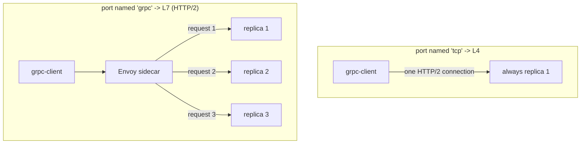

[RU version](README_RU.MD) · [Versión en español](README_ES.MD)

# Lab 32 - gRPC: per-request load balancing, port naming, retries and timeouts

## Overview

gRPC is often mistaken for "just TCP", but that is wrong: gRPC runs **over HTTP/2**, so
for Istio it is L7 traffic. Two consequences follow:

1. gRPC gets all L7 features - retries, timeouts, header routing, rich metrics and, most
   importantly, **per-request load balancing**.
2. For Istio to detect the protocol, the service port must be **explicitly named**
   (`grpc` / `grpc-*`) or carry `appProtocol: grpc`. Otherwise Istio treats the traffic as
   raw TCP and balances by *connection*: the client's single long-lived HTTP/2 connection
   sticks to one replica and balancing effectively does not work.

This lab deploys the `viktoruj/ping_pong` image, which speaks gRPC (its `PingPong.Echo`
method returns the serving pod's hostname):
- **grpc-server** - the gRPC Echo/Health server (port `8079`), **3 replicas** (the
  backends);
- **grpc-client** - the same image, a gRPC load generator (`/app -grpc-client ...`).

The `grpc-server` Service is intentionally created with a **mis-named** port (`tcp`), so
gRPC balancing is currently broken: every request lands on a single pod (the client sees
a single distinct server).



## Task

1. Fix the **Service** `grpc-server`: port `8079` must be recognised as gRPC - name the
   port `grpc` (or add `appProtocol: grpc`) so HTTP/2 per-request balancing kicks in.
2. Create a **VirtualService** for `grpc-server` with gRPC **retries** (`attempts` +
   a gRPC-aware `retryOn`) and a request **timeout**.
3. Confirm gRPC requests now spread across all three replicas (per-request LB).

## Step 1. Fix the port naming

gRPC is HTTP/2, not raw TCP. Istio detects the protocol from the port **name prefix**
(`grpc`, `http2`, ...) or the `appProtocol` field. Rename the port to `grpc`:

```bash
kubectl -n app patch svc grpc-server --type=json -p='[
  {"op":"replace","path":"/spec/ports/0/name","value":"grpc"},
  {"op":"add","path":"/spec/ports/0/appProtocol","value":"grpc"}
]'
```

As soon as Istio sees an HTTP/2 (gRPC) cluster, Envoy balances **each request** inside the
shared connection across all endpoints - no extra config required.

## Step 2. VirtualService with retries + timeout

gRPC is configured through the `http` block (not `tcp`):

```bash
kubectl apply -f - <<'EOF'
apiVersion: networking.istio.io/v1
kind: VirtualService
metadata:
  name: grpc-server
  namespace: app
spec:
  hosts:
    - grpc-server
  http:
    - route:
        - destination:
            host: grpc-server
            port:
              number: 8079
      timeout: 2s
      retries:
        attempts: 3
        perTryTimeout: 1s
        retryOn: connect-failure,refused-stream,unavailable,cancelled,deadline-exceeded
EOF
```

- `retryOn` uses gRPC-aware conditions: `unavailable`, `cancelled`, `deadline-exceeded`
  map to gRPC status codes; `refused-stream` and `connect-failure` cover transport issues.
- `timeout` bounds the whole request; `perTryTimeout` bounds each attempt.

## Step 3. Verify

Drive gRPC load from the client and confirm requests reach **all three** replicas:

```bash
kubectl exec -n app deploy/grpc-client -c ping-pong -- \
  /app -grpc-client -target grpc-server:8079 -n 180 -c 4
```

Expected tail:

```
--- summary ---
requests: 180  ok: 180  errors: 0
distinct servers: 3
host grpc-server-xxxx-aaaa: 60
host grpc-server-xxxx-bbbb: 60
host grpc-server-xxxx-cccc: 60
```

`distinct servers: 3` proves per-request balancing. Before the fix (port named `tcp`) the
same command reports `distinct servers: 1`.

## How it works

- **gRPC is HTTP/2, not TCP.** With an L4/TCP view Envoy load-balances *connections*: the
  client keeps one long-lived connection, so every call sticks to one pod. Declaring the
  port as `grpc` makes Envoy parse HTTP/2 and balance **each request** (stream) across
  endpoints.
- **Port naming is the switch.** The port must be named `grpc` / `grpc-*` (or `http2`), or
  carry `appProtocol: grpc`. A neutral name (`tcp`, unnamed) drops every L7 feature: no
  per-request LB, no retries, no timeouts, no gRPC metrics.
- **L7 features apply to gRPC.** Because it is HTTP, gRPC gets `http` retries (with
  gRPC-aware `retryOn`), `timeout`/`perTryTimeout`, header routing, fault injection and
  rich telemetry - exactly like plain HTTP.

## Check the result

Run on the worker PC:

```bash
check_result
```

## Summary

You enabled per-request gRPC balancing through correct port naming and configured retries
and a timeout for gRPC as for HTTP. Understanding that **gRPC is HTTP/2** is one of the key
mesh-operations skills: correct gRPC balancing is one of the most common reasons teams put
gRPC services into a service mesh in the first place.

## Infrastructure

| Component | Type | Count | Role |
|---|---|---|---|
| control-plane | `t3.medium` | 1 | master + istiod |
| worker | `t3.medium` | 1 | capacity for grpc-server (3 replicas) + client |
| worker PC | `t3.small` | 1 | workstation: `kubectl`, `check_result` |

Region: `eu-central-1` (AZ `eu-central-1a` / `eu-central-1b`).
