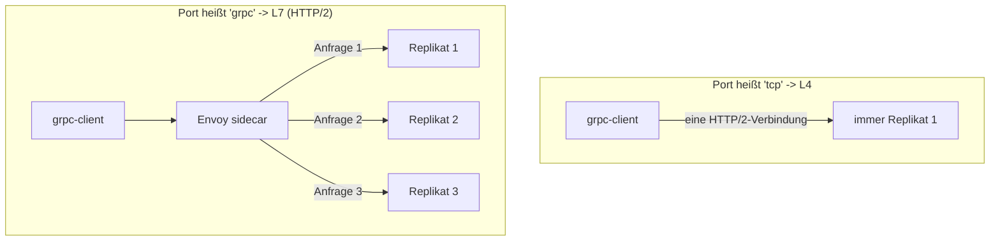

[RU version](README_RU.MD) · [Eng version](README.MD) · [Versión en español](README_ES.MD) · [Version française](README_FR.MD)

# Lab 32 - gRPC: Per-Request-Load-Balancing, Portbenennung, Retries und Timeouts

## Überblick

gRPC wird oft für „einfaches TCP" gehalten, aber das ist ein Irrtum: gRPC läuft **über HTTP/2**,
das heißt für Istio ist es L7-Verkehr. Daraus folgen zwei Dinge:

1. gRPC erhält alle L7-Möglichkeiten - Retries, Timeouts, Routing nach Headern, detaillierte
   Metriken und vor allem **Per-Request-Load-Balancing**.
2. Damit Istio das Protokoll erkennt, muss der Port des Service **explizit benannt** werden
   (`grpc` / `grpc-*`) oder `appProtocol: grpc` gesetzt sein. Andernfalls betrachtet Istio den
   Verkehr als rohes TCP und balanciert nach *Verbindungen*: die einzige langlebige
   HTTP/2-Verbindung des Clients „klebt" an einem Replikat, und das Load Balancing funktioniert
   faktisch nicht.

Im Lab ist das Image `viktoruj/ping_pong` bereitgestellt, das gRPC beherrscht (die Methode
`PingPong.Echo` gibt den Namen des bedienenden Pods zurück):
- **grpc-server** - gRPC-Echo/Health-Server (Port `8079`), **3 Replikate** (Backends);
- **grpc-client** - dasselbe Image, Generator von gRPC-Last (`/app -grpc-client ...`).

Der Service `grpc-server` wurde absichtlich mit einem **falschen Portnamen** (`tcp`) erstellt,
daher ist das gRPC-Load-Balancing aktuell defekt: alle Anfragen fliegen zu einem Pod (der Client
sieht einen einzigen eindeutigen Server).



## Infrastruktur

| Komponente | Typ | Anzahl | Rolle |
|---|---|---|---|
| control-plane | `t3.medium` | 1 | master + istiod |
| worker | `t3.medium` | 1 | Kapazität für grpc-server (3 Replikate) + client |
| worker PC | `t3.small` | 1 | Arbeitsplatz: `kubectl`, `check_result` |

Region: `eu-central-1` (AZ `eu-central-1a` / `eu-central-1b`).

## Deployment

```bash
TASK=32 make run_ica_task
```

## Aufgabe

1. Den **Service** `grpc-server` korrigieren: Port `8079` muss als gRPC erkannt werden - den Port
   `grpc` nennen (oder `appProtocol: grpc` hinzufügen), damit das Per-Request-Load-Balancing über
   HTTP/2 aktiviert wird.
2. Einen **VirtualService** für `grpc-server` mit gRPC-**Retries** (`attempts` + gRPC-orientiertes
   `retryOn`) und einem Anfrage-**Timeout** erstellen.
3. Sicherstellen, dass die gRPC-Anfragen sich nun auf alle drei Replikate verteilen
   (Per-Request-LB).

## Schritt 1. Portbenennung korrigieren

gRPC ist HTTP/2, kein rohes TCP. Istio bestimmt das Protokoll anhand des **Präfixes des
Portnamens** (`grpc`, `http2`, ...) oder anhand des Feldes `appProtocol`. Benennen Sie den Port in
`grpc` um:

```bash
kubectl -n app patch svc grpc-server --type=json -p='[
  {"op":"replace","path":"/spec/ports/0/name","value":"grpc"},
  {"op":"add","path":"/spec/ports/0/appProtocol","value":"grpc"}
]'
```

Sobald Istio einen HTTP/2- (gRPC-) Cluster sieht, beginnt Envoy, **jede Anfrage** innerhalb der
gemeinsamen Verbindung über alle Endpoints zu balancieren - ohne zusätzliche Konfiguration.

## Schritt 2. VirtualService mit Retries und Timeout

gRPC wird über den Block `http` konfiguriert (nicht `tcp`):

```bash
kubectl apply -f - <<'EOF'
apiVersion: networking.istio.io/v1
kind: VirtualService
metadata:
  name: grpc-server
  namespace: app
spec:
  hosts:
    - grpc-server
  http:
    - route:
        - destination:
            host: grpc-server
            port:
              number: 8079
      timeout: 2s
      retries:
        attempts: 3
        perTryTimeout: 1s
        retryOn: connect-failure,refused-stream,unavailable,cancelled,deadline-exceeded
EOF
```

- `retryOn` verwendet gRPC-orientierte Bedingungen: `unavailable`, `cancelled`,
  `deadline-exceeded` entsprechen gRPC-Codes; `refused-stream` und `connect-failure` decken
  Transportfehler ab.
- `timeout` begrenzt die gesamte Anfrage, `perTryTimeout` - jeden Versuch.

## Schritt 3. Prüfung

Starten Sie die gRPC-Last vom Client und stellen Sie sicher, dass die Anfragen **alle drei**
Replikate erreicht haben:

```bash
kubectl exec -n app deploy/grpc-client -c ping-pong -- \
  /app -grpc-client -target grpc-server:8079 -n 180 -c 4
```

Erwartetes „Ende" der Ausgabe:

```
--- summary ---
requests: 180  ok: 180  errors: 0
distinct servers: 3
host grpc-server-xxxx-aaaa: 60
host grpc-server-xxxx-bbbb: 60
host grpc-server-xxxx-cccc: 60
```

`distinct servers: 3` beweist das Per-Request-Load-Balancing. Vor der Korrektur (Port `tcp`)
zeigt derselbe Befehl `distinct servers: 1`.

## Wie es funktioniert

- **gRPC ist HTTP/2, kein TCP.** Bei einer L4-Sichtweise balanciert Envoy *Verbindungen*: der
  Client hält eine langlebige Verbindung, daher kleben alle Aufrufe an einem Pod. Die Deklaration
  des Ports als `grpc` zwingt Envoy, HTTP/2 zu parsen und **jede Anfrage** (Stream) über die
  Endpoints zu balancieren.
- **Der Portname ist der Schalter.** Der Port muss `grpc` / `grpc-*` (oder `http2`) heißen oder
  `appProtocol: grpc` tragen. Ein neutraler Name (`tcp`, ohne Namen) schaltet alle L7-Features ab:
  kein Per-Request-LB, keine Retries, keine Timeouts und keine gRPC-Metriken.
- **L7-Features funktionieren für gRPC.** Da es HTTP ist, erhält gRPC `http`-Retries (mit
  gRPC-orientiertem `retryOn`), `timeout`/`perTryTimeout`, Routing nach Headern, Fault Injection
  und detaillierte Telemetrie - genau wie normales HTTP.

## Ergebnisprüfung

Führen Sie auf dem worker PC aus:

```bash
check_result
```

## Fazit

Sie haben das Per-Request-Load-Balancing für gRPC über die korrekte Portbenennung aktiviert und
Retries sowie Timeout für gRPC wie für HTTP konfiguriert. Das Verständnis, dass **gRPC HTTP/2
ist**, ist eine der Schlüsselfähigkeiten beim Betrieb eines Mesh: gerade wegen des korrekten Load
Balancing werden gRPC-Services am häufigsten in ein Service Mesh eingebunden.
