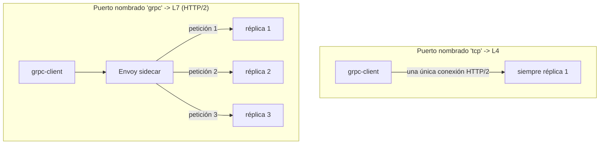

[RU version](README_RU.MD) · [Eng version](README.MD)

# Lab 32 - gRPC: balanceo per-request, nombrado del puerto, reintentos y timeouts

## Resumen

A menudo se toma gRPC por «simplemente TCP», pero es un error: gRPC funciona **sobre HTTP/2**,
es decir, para Istio es tráfico L7. De ahí dos consecuencias:

1. gRPC obtiene todas las capacidades L7 - reintentos, timeouts, enrutamiento por cabeceras,
   métricas detalladas y, sobre todo, **balanceo per-request**.
2. Para que Istio reconozca el protocolo, el puerto del servicio hay que **nombrarlo explícitamente** (`grpc` / `grpc-*`)
   o indicar `appProtocol: grpc`. De lo contrario, Istio considera el tráfico como TCP puro y balancea por
   *conexiones*: la única conexión HTTP/2 de larga duración del cliente «se pega» a una
   réplica, y el balanceo de hecho no funciona.

En el lab está desplegada la imagen `viktoruj/ping_pong`, que soporta gRPC (el método `PingPong.Echo`
devuelve el nombre del pod que atendió):
- **grpc-server** - servidor gRPC Echo/Health (puerto `8079`), **3 réplicas** (backends);
- **grpc-client** - la misma imagen, generador de carga gRPC (`/app -grpc-client ...`).

El servicio `grpc-server` se creó a propósito con un **nombre de puerto incorrecto** (`tcp`), por eso
ahora el balanceo gRPC está roto: todas las peticiones vuelan a un único pod (el cliente ve un único
servidor distinto).



## Tarea

1. Corregir el **Service** `grpc-server`: el puerto `8079` debe reconocerse como gRPC -
   nombrar el puerto `grpc` (o añadir `appProtocol: grpc`), para que se active el balanceo per-request
   por HTTP/2.
2. Crear un **VirtualService** para `grpc-server` con **reintentos** gRPC (`attempts` + `retryOn`
   orientado a gRPC) y **timeout** de la petición.
3. Confirmar que las peticiones gRPC ahora se reparten entre las tres réplicas (LB per-request).

## Paso 1. Corregir el nombrado del puerto

gRPC es HTTP/2, no TCP puro. Istio determina el protocolo por el **prefijo del nombre del puerto**
(`grpc`, `http2`, ...) o por el campo `appProtocol`. Renombra el puerto a `grpc`:

```bash
kubectl -n app patch svc grpc-server --type=json -p='[
  {"op":"replace","path":"/spec/ports/0/name","value":"grpc"},
  {"op":"add","path":"/spec/ports/0/appProtocol","value":"grpc"}
]'
```

En cuanto Istio ve un clúster HTTP/2 (gRPC), Envoy empieza a balancear **cada
petición** dentro de la conexión común entre todos los endpoints - sin configuración adicional.

## Paso 2. VirtualService con reintentos y timeout

gRPC se configura mediante el bloque `http` (no `tcp`):

```bash
kubectl apply -f - <<'EOF'
apiVersion: networking.istio.io/v1
kind: VirtualService
metadata:
  name: grpc-server
  namespace: app
spec:
  hosts:
    - grpc-server
  http:
    - route:
        - destination:
            host: grpc-server
            port:
              number: 8079
      timeout: 2s
      retries:
        attempts: 3
        perTryTimeout: 1s
        retryOn: connect-failure,refused-stream,unavailable,cancelled,deadline-exceeded
EOF
```

- `retryOn` usa condiciones orientadas a gRPC: `unavailable`, `cancelled`,
  `deadline-exceeded` corresponden a códigos gRPC; `refused-stream` y `connect-failure`
  cubren fallos de transporte.
- `timeout` limita toda la petición, `perTryTimeout` - cada intento.

## Paso 3. Verificación

Lanza carga gRPC desde el cliente y confirma que las peticiones llegaron a **las tres** réplicas:

```bash
kubectl exec -n app deploy/grpc-client -c ping-pong -- \
  /app -grpc-client -target grpc-server:8079 -n 180 -c 4
```

«Cola» esperada de la salida:

```
--- summary ---
requests: 180  ok: 180  errors: 0
distinct servers: 3
host grpc-server-xxxx-aaaa: 60
host grpc-server-xxxx-bbbb: 60
host grpc-server-xxxx-cccc: 60
```

`distinct servers: 3` demuestra el balanceo per-request. Antes de la corrección (puerto `tcp`)
el mismo comando mostrará `distinct servers: 1`.

## Cómo funciona

- **gRPC es HTTP/2, no TCP.** Con una visión L4, Envoy balancea *conexiones*: el cliente
  mantiene una única conexión de larga duración, por eso todas las llamadas se pegan a un mismo pod.
  Declarar el puerto como `grpc` hace que Envoy analice HTTP/2 y balancee **cada
  petición** (stream) entre los endpoints.
- **El nombre del puerto es el interruptor.** El puerto debe llamarse `grpc` / `grpc-*` (o
  `http2`), o llevar `appProtocol: grpc`. Un nombre neutral (`tcp`, sin nombre) desactiva
  todas las funciones L7: no hay LB per-request, ni reintentos, ni timeouts, ni métricas gRPC.
- **Las funciones L7 funcionan para gRPC.** Como es HTTP, gRPC obtiene reintentos `http` (con `retryOn`
  orientado a gRPC), `timeout`/`perTryTimeout`, enrutamiento por cabeceras,
  fault injection y telemetría detallada - igual que el HTTP normal.

## Comprobación del resultado

Ejecuta en el worker PC:

```bash
check_result
```

## Conclusión

Has activado el balanceo per-request de gRPC mediante el nombrado correcto del puerto y configurado
reintentos y timeout para gRPC como para HTTP. Comprender que **gRPC es HTTP/2** es una de
las habilidades clave para operar un mesh: precisamente por el balanceo correcto los servicios gRPC
suelen incorporarse a un service mesh.

## Infraestructura

| Componente | Tipo | Cant. | Rol |
|---|---|---|---|
| control-plane | `t3.medium` | 1 | master + istiod |
| worker | `t3.medium` | 1 | capacidad para grpc-server (3 réplicas) + client |
| worker PC | `t3.small` | 1 | puesto de trabajo: `kubectl`, `check_result` |

Región: `eu-central-1` (AZ `eu-central-1a` / `eu-central-1b`).
