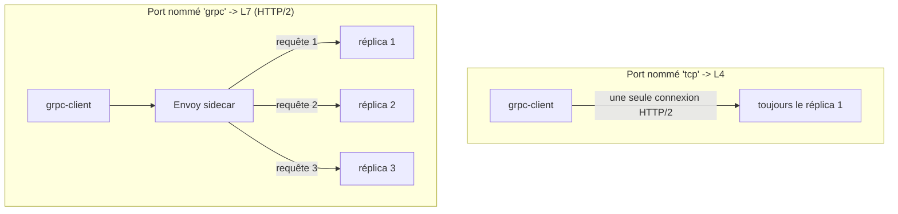

[RU version](README_RU.MD) · [Eng version](README.MD) · [Versión en español](README_ES.MD) · [Deutsche Version](README_DE.MD)

# Lab 32 - gRPC : répartition de charge per-request, nommage du port, tentatives et timeouts

## Vue d'ensemble

On prend souvent gRPC pour du « simple TCP », mais c'est une erreur : gRPC fonctionne
**au-dessus de HTTP/2**, c'est-à-dire que pour Istio c'est du trafic L7. D'où deux conséquences :

1. gRPC bénéficie de toutes les capacités L7 - tentatives, timeouts, routage par en-tête,
   métriques détaillées et, surtout, la **répartition de charge per-request**.
2. Pour qu'Istio reconnaisse le protocole, le port du service doit être **explicitement nommé**
   (`grpc` / `grpc-*`) ou porter `appProtocol: grpc`. Sinon Istio considère le trafic comme du TCP
   brut et répartit par *connexions* : l'unique connexion HTTP/2 longue durée du client « colle »
   à un seul réplica, et la répartition de charge ne fonctionne de fait pas.

Le lab déploie l'image `viktoruj/ping_pong`, qui sait faire du gRPC (la méthode `PingPong.Echo`
renvoie le nom du pod ayant servi) :
- **grpc-server** - serveur gRPC Echo/Health (port `8079`), **3 réplicas** (backends) ;
- **grpc-client** - la même image, générateur de charge gRPC (`/app -grpc-client ...`).

Le service `grpc-server` a été délibérément créé avec un **nom de port incorrect** (`tcp`), donc
pour l'instant la répartition de charge gRPC est cassée : toutes les requêtes vont vers un seul pod
(le client voit un seul serveur unique).



## Objectif

1. Corriger le **Service** `grpc-server` : le port `8079` doit être reconnu comme gRPC - nommer
   le port `grpc` (ou ajouter `appProtocol: grpc`), afin d'activer la répartition de charge
   per-request sur HTTP/2.
2. Créer un **VirtualService** pour `grpc-server` avec des **tentatives** gRPC (`attempts` +
   `retryOn` orienté gRPC) et un **timeout** de requête.
3. Vérifier que les requêtes gRPC se répartissent désormais sur les trois réplicas (LB per-request).

## Étape 1. Corriger le nommage du port

gRPC, c'est HTTP/2, pas du TCP brut. Istio détermine le protocole d'après le **préfixe du nom de
port** (`grpc`, `http2`, ...) ou d'après le champ `appProtocol`. Renommez le port en `grpc` :

```bash
kubectl -n app patch svc grpc-server --type=json -p='[
  {"op":"replace","path":"/spec/ports/0/name","value":"grpc"},
  {"op":"add","path":"/spec/ports/0/appProtocol","value":"grpc"}
]'
```

Dès qu'Istio voit un cluster HTTP/2 (gRPC), Envoy commence à répartir **chaque requête** au sein
de la connexion partagée sur tous les endpoints - sans configuration supplémentaire.

## Étape 2. VirtualService avec tentatives et timeout

gRPC se configure via le bloc `http` (pas `tcp`) :

```bash
kubectl apply -f - <<'EOF'
apiVersion: networking.istio.io/v1
kind: VirtualService
metadata:
  name: grpc-server
  namespace: app
spec:
  hosts:
    - grpc-server
  http:
    - route:
        - destination:
            host: grpc-server
            port:
              number: 8079
      timeout: 2s
      retries:
        attempts: 3
        perTryTimeout: 1s
        retryOn: connect-failure,refused-stream,unavailable,cancelled,deadline-exceeded
EOF
```

- `retryOn` utilise des conditions orientées gRPC : `unavailable`, `cancelled`,
  `deadline-exceeded` correspondent à des codes gRPC ; `refused-stream` et `connect-failure`
  couvrent les défaillances de transport.
- `timeout` limite l'ensemble de la requête, `perTryTimeout` - chaque tentative.

## Étape 3. Vérification

Lancez de la charge gRPC depuis le client et vérifiez que les requêtes ont atteint les **trois**
réplicas :

```bash
kubectl exec -n app deploy/grpc-client -c ping-pong -- \
  /app -grpc-client -target grpc-server:8079 -n 180 -c 4
```

Fin de sortie attendue :

```
--- summary ---
requests: 180  ok: 180  errors: 0
distinct servers: 3
host grpc-server-xxxx-aaaa: 60
host grpc-server-xxxx-bbbb: 60
host grpc-server-xxxx-cccc: 60
```

`distinct servers: 3` prouve la répartition de charge per-request. Avant la correction (port `tcp`),
la même commande affichera `distinct servers: 1`.

## Comment ça fonctionne

- **gRPC, c'est HTTP/2, pas TCP.** Vu au niveau L4, Envoy répartit les *connexions* : le client
  maintient une connexion longue durée unique, donc tous les appels collent à un seul pod. Déclarer
  le port comme `grpc` force Envoy à analyser HTTP/2 et à répartir **chaque requête** (stream) sur
  les endpoints.
- **Le nom du port est l'interrupteur.** Le port doit s'appeler `grpc` / `grpc-*` (ou `http2`), ou
  bien porter `appProtocol: grpc`. Un nom neutre (`tcp`, sans nom) désactive toutes les fonctions
  L7 : plus de LB per-request, de tentatives, de timeouts ni de métriques gRPC.
- **Les fonctions L7 marchent pour gRPC.** Comme c'est du HTTP, gRPC bénéficie des tentatives
  `http` (avec un `retryOn` orienté gRPC), de `timeout`/`perTryTimeout`, du routage par en-tête, de
  la fault injection et d'une télémétrie détaillée - exactement comme du HTTP classique.

## Vérification du résultat

Lancez sur le worker PC :

```bash
check_result
```

## Bilan

Vous avez activé la répartition de charge per-request de gRPC grâce à un nommage de port correct et
configuré les tentatives et le timeout pour gRPC comme pour du HTTP. Comprendre que **gRPC, c'est
HTTP/2** est l'une des compétences clés de l'exploitation d'un maillage : c'est précisément pour une
répartition de charge correcte que l'on intègre le plus souvent les services gRPC dans un maillage
de services.

## Infrastructure

| Composant | Type | Nombre | Rôle |
|---|---|---|---|
| control-plane | `t3.medium` | 1 | master + istiod |
| worker | `t3.medium` | 1 | capacité pour grpc-server (3 réplicas) + client |
| worker PC | `t3.small` | 1 | poste de travail : `kubectl`, `check_result` |

Région : `eu-central-1` (AZ `eu-central-1a` / `eu-central-1b`).
