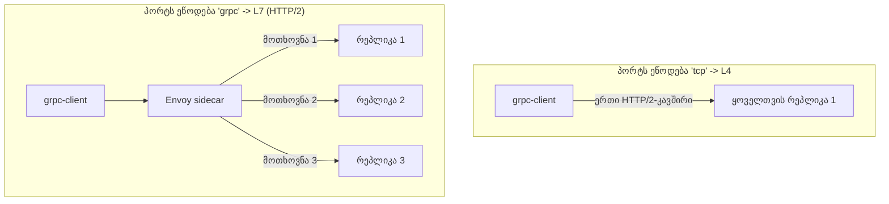

[Русская версия](README_RU.MD) · [Eng version](README.MD) · [Versión en español](README_ES.MD) · [Version française](README_FR.MD) · [Deutsche Version](README_DE.MD) · [繁體中文版](README_TW.MD) · [日本語版](README_JP.MD)

# Lab 32 - gRPC: per-request ბალანსირება, პორტის სახელდება, retry-ები და timeout-ები

> [საცნობარო გადაწყვეტა](worker/files/solutions/1_GE.MD)

## მიმოხილვა

gRPC ხშირად „უბრალოდ TCP“-დ მიაჩნიათ, მაგრამ ეს შეცდომაა: gRPC მუშაობს **HTTP/2-ის ზედა
დონეზე**, ანუ Istio-სთვის ეს L7-ტრაფიკია. აქედან ორი დასკვნა გამომდინარეობს:

1. gRPC იღებს L7-ის ყველა შესაძლებლობას - retry-ებს, timeout-ებს, სათაურების მიხედვით
   მარშრუტიზაციას, დეტალურ მეტრიკებს და, რაც მთავარია, **per-request ბალანსირებას**.
2. იმისათვის, რომ Istio-მ პროტოკოლი ამოიცნოს, სერვისის პორტს **ცალსახად უნდა ეწოდოს**
   (`grpc` / `grpc-*`) ან მითითებული უნდა ჰქონდეს `appProtocol: grpc`. წინააღმდეგ
   შემთხვევაში Istio ტრაფიკს ნედლ TCP-დ აღიქვამს და *კავშირების* მიხედვით აბალანსებს:
   კლიენტის ერთადერთი ხანგრძლივად არსებული HTTP/2-კავშირი ერთ რეპლიკას „ეწებება“ და
   ბალანსირება ფაქტობრივად არ მუშაობს.

ლაბორატორიაში გაშლილია image `viktoruj/ping_pong`, რომელსაც gRPC-ის მხარდაჭერა აქვს
(მეთოდი `PingPong.Echo` აბრუნებს მოთხოვნის დამმუშავებელი pod-ის სახელს):
- **grpc-server** - gRPC Echo/Health-სერვერი (პორტი `8079`), **3 რეპლიკა** (ბეკენდები);
- **grpc-client** - იგივე image, gRPC-დატვირთვის გენერატორი (`/app -grpc-client ...`).

სერვისი `grpc-server` განზრახ შექმნილია **პორტის არასწორი სახელით** (`tcp`), ამიტომ
ამჟამად gRPC-ბალანსირება დარღვეულია: ყველა მოთხოვნა ერთ pod-ში მიდის (კლიენტი მხოლოდ
ერთ უნიკალურ სერვერს ხედავს).



## ინფრასტრუქტურა

| კომპონენტი | ტიპი | რაოდენობა | დანიშნულება |
|---|---|---|---|
| control-plane | `t3.medium` | 1 | master + istiod |
| worker | `t3.medium` | 1 | რესურსი grpc-server-ისთვის (3 რეპლიკა) + client |
| worker PC | `t3.small` | 1 | სამუშაო ადგილი: `kubectl`, `check_result` |

რეგიონი: `eu-central-1` (AZ `eu-central-1a` / `eu-central-1b`).

## გაშლა

```bash
TASK=32 make run_ica_task
```

## დავალება

1. გაასწორეთ **Service** `grpc-server`: პორტი `8079` უნდა ამოიცნობოდეს, როგორც gRPC -
   პორტს დაარქვით `grpc` (ან დაამატეთ `appProtocol: grpc`), რათა ჩაირთოს HTTP/2-ის
   per-request ბალანსირება.
2. შექმენით **VirtualService** `grpc-server`-ისთვის gRPC-**retry-ებით** (`attempts` +
   gRPC-ზე ორიენტირებული `retryOn`) და მოთხოვნის **timeout-ით**.
3. დარწმუნდით, რომ gRPC-მოთხოვნები ახლა სამივე რეპლიკაზე ნაწილდება (per-request LB).

## ნაბიჯი 1. პორტის სახელდების გასწორება

gRPC არის HTTP/2 და არა ნედლი TCP. Istio პროტოკოლს განსაზღვრავს **პორტის სახელის
პრეფიქსით** (`grpc`, `http2`, ...) ან `appProtocol` ველით. პორტს გადაარქვით `grpc`:

```bash
kubectl -n app patch svc grpc-server --type=json -p='[
  {"op":"replace","path":"/spec/ports/0/name","value":"grpc"},
  {"op":"add","path":"/spec/ports/0/appProtocol","value":"grpc"}
]'
```

როგორც კი Istio HTTP/2 (gRPC) კლასტერს დაინახავს, Envoy საერთო კავშირის შიგნით
**თითოეული მოთხოვნის** ყველა endpoint-ზე ბალანსირებას იწყებს - დამატებითი
კონფიგურაციის გარეშე.

## ნაბიჯი 2. VirtualService retry-ებითა და timeout-ით

gRPC კონფიგურირდება `http` ბლოკის მეშვეობით (არა `tcp`):

```bash
kubectl apply -f - <<'EOF'
apiVersion: networking.istio.io/v1
kind: VirtualService
metadata:
  name: grpc-server
  namespace: app
spec:
  hosts:
    - grpc-server
  http:
    - route:
        - destination:
            host: grpc-server
            port:
              number: 8079
      timeout: 2s
      retries:
        attempts: 3
        perTryTimeout: 1s
        retryOn: connect-failure,refused-stream,unavailable,cancelled,deadline-exceeded
EOF
```

- `retryOn` იყენებს gRPC-ზე ორიენტირებულ პირობებს: `unavailable`, `cancelled`,
  `deadline-exceeded` შეესაბამება gRPC-კოდებს; `refused-stream` და `connect-failure`
  სატრანსპორტო შეფერხებებს ფარავს.
- `timeout` ზღუდავს მთლიან მოთხოვნას, `perTryTimeout` - თითოეულ მცდელობას.

## ნაბიჯი 3. შემოწმება

გაუშვით gRPC-დატვირთვა კლიენტიდან და დარწმუნდით, რომ მოთხოვნებმა **სამივე** რეპლიკამდე
მიაღწია:

```bash
kubectl exec -n app deploy/grpc-client -c ping-pong -- \
  /app -grpc-client -target grpc-server:8079 -n 180 -c 4
```

გამოტანის მოსალოდნელი „ბოლო ნაწილი“:

```
--- summary ---
requests: 180  ok: 180  errors: 0
distinct servers: 3
host grpc-server-xxxx-aaaa: 60
host grpc-server-xxxx-bbbb: 60
host grpc-server-xxxx-cccc: 60
```

`distinct servers: 3` ადასტურებს per-request ბალანსირებას. გასწორებამდე (პორტი `tcp`)
იგივე ბრძანება აჩვენებს `distinct servers: 1`-ს.

## როგორ მუშაობს ეს

- **gRPC არის HTTP/2 და არა TCP.** L4 დონეზე Envoy *კავშირებს* აბალანსებს: კლიენტი ერთ
  ხანგრძლივად არსებულ კავშირს ინარჩუნებს, ამიტომ ყველა გამოძახება ერთ pod-ს ეწებება.
  პორტის `grpc`-ად გამოცხადება Envoy-ს აიძულებს, გაარჩიოს HTTP/2 და **თითოეული მოთხოვნა**
  (stream) endpoint-ებზე გადაანაწილოს.
- **პორტის სახელი გადამრთველია.** პორტს უნდა ეწოდოს `grpc` / `grpc-*` (ან `http2`), ან
  უნდა ჰქონდეს `appProtocol: grpc`. ნეიტრალური სახელი (`tcp`, ან სახელის გარეშე) ყველა
  L7-ფუნქციას თიშავს: აღარ არის per-request LB, retry-ები, timeout-ები და gRPC-მეტრიკები.
- **L7-ფუნქციები gRPC-სთვისაც მუშაობს.** რადგან ეს HTTP-ია, gRPC იღებს `http`-retry-ებს
  (gRPC-ზე ორიენტირებული `retryOn`-ით), `timeout`/`perTryTimeout`-ს, სათაურების მიხედვით
  მარშრუტიზაციას, fault injection-სა და დეტალურ ტელემეტრიას - ზუსტად ისე, როგორც
  ჩვეულებრივი HTTP.

## შედეგის შემოწმება

worker PC-ზე გაუშვით:

```bash
check_result
```

## შეჯამება

თქვენ ჩართეთ gRPC-ის per-request ბალანსირება პორტის სწორად სახელდებით და gRPC-სთვის,
როგორც HTTP-ისთვის, დააკონფიგურირეთ retry-ები და timeout. იმის გაგება, რომ **gRPC არის
HTTP/2**, mesh-ის ექსპლუატაციის ერთ-ერთი საკვანძო უნარია: gRPC-სერვისები service mesh-ში
ყველაზე ხშირად სწორედ სწორი ბალანსირების უზრუნველსაყოფად შეჰყავთ.
