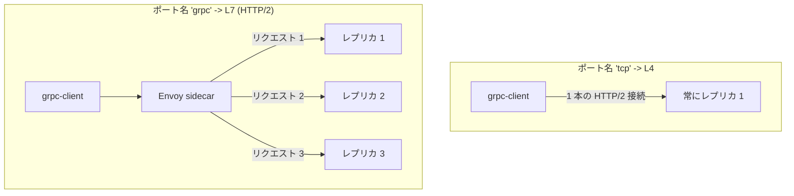

[Русская версия](README_RU.MD) · [Eng version](README.MD) · [Versión en español](README_ES.MD) · [Version française](README_FR.MD) · [Deutsche Version](README_DE.MD) · [ქართული ვერსია](README_GE.MD) · [繁體中文版](README_TW.MD)

# Lab 32 - gRPC: リクエスト単位の負荷分散、ポート命名、リトライ、タイムアウト

> [リファレンス解答](worker/files/solutions/1_JP.MD)

## 概要

gRPC はしばしば「単なる TCP」と誤解されますが、それは誤りです。gRPC は **HTTP/2 上で**
動作するため、Istio にとっては L7 トラフィックです。ここから次の 2 つの結果が導かれます。

1. gRPC はリトライ、タイムアウト、ヘッダーによるルーティング、詳細なメトリクス、そして最も
   重要な **リクエスト単位の負荷分散**といった、すべての L7 機能を利用できます。
2. Istio がプロトコルを認識するには、Service のポートに **明示的な名前**（`grpc` / `grpc-*`）を
   付けるか、`appProtocol: grpc` を設定する必要があります。そうしない場合、Istio はトラフィックを
   生の TCP とみなし、*接続単位*で負荷分散します。クライアントの 1 本の長寿命 HTTP/2 接続が 1 つの
   レプリカに固定され、負荷分散は実質的に機能しません。

このラボでは、gRPC を話す（`PingPong.Echo` メソッドが処理した Pod のホスト名を返す）
`viktoruj/ping_pong` イメージをデプロイします。
- **grpc-server** - gRPC Echo/Health サーバー（ポート `8079`）、**3 レプリカ**（バックエンド）。
- **grpc-client** - 同じイメージを使用した gRPC 負荷ジェネレーター（`/app -grpc-client ...`）。

`grpc-server` Service は意図的に **誤ったポート名**（`tcp`）で作成されています。そのため現在は
gRPC の負荷分散が壊れており、すべてのリクエストが 1 つの Pod に到達します（クライアントには一意な
サーバーが 1 つだけ表示されます）。



## インフラストラクチャ

| コンポーネント | タイプ | 数 | 役割 |
|---|---|---|---|
| control-plane | `t3.medium` | 1 | master + istiod |
| worker | `t3.medium` | 1 | grpc-server（3 レプリカ）+ client 用の容量 |
| worker PC | `t3.small` | 1 | ワークステーション: `kubectl`, `check_result` |

リージョン: `eu-central-1`（AZ `eu-central-1a` / `eu-central-1b`）。

## プロビジョニング

```bash
TASK=32 make run_ica_task
```

## 課題

1. **Service** `grpc-server` を修正します。ポート `8079` が gRPC として認識されるよう、ポート名を
   `grpc` にする（または `appProtocol: grpc` を追加する）ことで、HTTP/2 のリクエスト単位の
   負荷分散を有効にします。
2. gRPC の **リトライ**（`attempts` + gRPC 対応の `retryOn`）とリクエスト**タイムアウト**を持つ
   `grpc-server` 用の **VirtualService** を作成します。
3. gRPC リクエストが 3 つすべてのレプリカへ分散されることを確認します（リクエスト単位 LB）。

## ステップ 1. ポート命名を修正する

gRPC は生の TCP ではなく HTTP/2 です。Istio はポート名の**プレフィックス**（`grpc`、`http2`、...）
または `appProtocol` フィールドからプロトコルを検出します。ポート名を `grpc` に変更します。

```bash
kubectl -n app patch svc grpc-server --type=json -p='[
  {"op":"replace","path":"/spec/ports/0/name","value":"grpc"},
  {"op":"add","path":"/spec/ports/0/appProtocol","value":"grpc"}
]'
```

Istio が HTTP/2（gRPC）クラスターを認識するとすぐに、Envoy は追加設定なしで共有接続内の**各
リクエスト**をすべてのエンドポイントに分散します。

## ステップ 2. リトライとタイムアウトを持つ VirtualService

gRPC は `tcp` ではなく `http` ブロックで設定します。

```bash
kubectl apply -f - <<'EOF'
apiVersion: networking.istio.io/v1
kind: VirtualService
metadata:
  name: grpc-server
  namespace: app
spec:
  hosts:
    - grpc-server
  http:
    - route:
        - destination:
            host: grpc-server
            port:
              number: 8079
      timeout: 2s
      retries:
        attempts: 3
        perTryTimeout: 1s
        retryOn: connect-failure,refused-stream,unavailable,cancelled,deadline-exceeded
EOF
```

- `retryOn` は gRPC 対応の条件を使用します。`unavailable`、`cancelled`、
  `deadline-exceeded` は gRPC ステータスコードに対応し、`refused-stream` と `connect-failure`
  はトランスポート障害をカバーします。
- `timeout` はリクエスト全体を制限し、`perTryTimeout` は各試行を制限します。

## ステップ 3. 検証

クライアントから gRPC 負荷を発生させ、リクエストが**3 つすべて**のレプリカに到達することを確認します。

```bash
kubectl exec -n app deploy/grpc-client -c ping-pong -- \
  /app -grpc-client -target grpc-server:8079 -n 180 -c 4
```

想定される出力の末尾:

```
--- summary ---
requests: 180  ok: 180  errors: 0
distinct servers: 3
host grpc-server-xxxx-aaaa: 60
host grpc-server-xxxx-bbbb: 60
host grpc-server-xxxx-cccc: 60
```

`distinct servers: 3` はリクエスト単位の負荷分散を証明します。修正前（ポート名が `tcp`）は、同じ
コマンドで `distinct servers: 1` が表示されます。

## 仕組み

- **gRPC は TCP ではなく HTTP/2 です。** L4/TCP の視点では、Envoy は*接続*を負荷分散します。
  クライアントは 1 本の長寿命接続を維持するため、すべての呼び出しが 1 つの Pod に固定されます。
  ポートを `grpc` として宣言すると、Envoy は HTTP/2 を解析し、**各リクエスト**（stream）を
  エンドポイントに分散します。
- **ポート名がスイッチです。** ポート名は `grpc` / `grpc-*`（または `http2`）にするか、
  `appProtocol: grpc` を持たせる必要があります。中立的な名前（`tcp`、名前なし）はすべての L7 機能を
  無効にします。リクエスト単位 LB、リトライ、タイムアウト、gRPC メトリクスは利用できません。
- **L7 機能は gRPC にも適用されます。** gRPC は HTTP であるため、gRPC 対応の `retryOn` を持つ
  `http` リトライ、`timeout`/`perTryTimeout`、ヘッダーによるルーティング、fault injection、詳細な
  テレメトリーを、通常の HTTP とまったく同じように利用できます。

## 結果を確認する

worker PC で実行します。

```bash
check_result
```

## まとめ

正しいポート命名により gRPC のリクエスト単位の負荷分散を有効にし、HTTP と同様に gRPC のリトライと
タイムアウトを設定しました。**gRPC は HTTP/2 である**ことを理解するのは、mesh を運用するうえで重要な
スキルの 1 つです。正しい gRPC 負荷分散は、チームが gRPC サービスを service mesh に導入する最も一般的な
理由の 1 つでもあります。