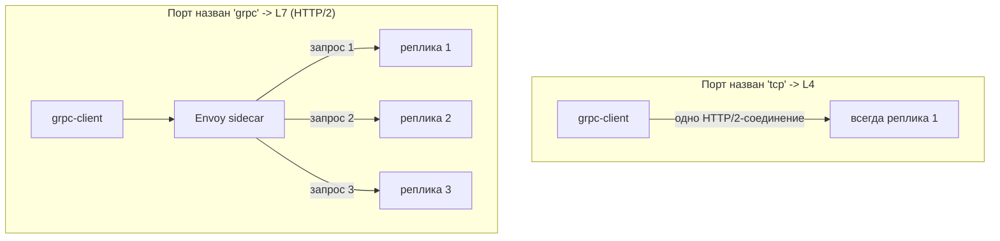

[Eng version](README.MD) · [Versión en español](README_ES.MD) · [Version française](README_FR.MD) · [Deutsche Version](README_DE.MD)

# Lab 32 - gRPC: per-request балансировка, именование порта, ретраи и таймауты

## Обзор

gRPC часто принимают за «просто TCP», но это ошибка: gRPC работает **поверх HTTP/2**,
то есть для Istio это L7-трафик. Отсюда два следствия:

1. gRPC получает все L7-возможности - ретраи, таймауты, маршрутизацию по заголовкам,
   детальные метрики и, главное, **per-request балансировку**.
2. Чтобы Istio распознал протокол, порт сервиса нужно **явно назвать** (`grpc` / `grpc-*`)
   или задать `appProtocol: grpc`. Иначе Istio считает трафик сырым TCP и балансирует по
   *соединениям*: единственное долгоживущее HTTP/2-соединение клиента «прилипает» к одной
   реплике, и балансировка фактически не работает.

В лабе развёрнут образ `viktoruj/ping_pong`, который умеет gRPC (метод `PingPong.Echo`
возвращает имя обслужившего пода):
- **grpc-server** - gRPC Echo/Health-сервер (порт `8079`), **3 реплики** (бэкенды);
- **grpc-client** - тот же образ, генератор gRPC-нагрузки (`/app -grpc-client ...`).

Сервис `grpc-server` намеренно создан с **неправильным именем порта** (`tcp`), поэтому
сейчас gRPC-балансировка сломана: все запросы летят в один под (клиент видит один
уникальный сервер).



## Задание

1. Исправить **Service** `grpc-server`: порт `8079` должен быть распознан как gRPC -
   назвать порт `grpc` (или добавить `appProtocol: grpc`), чтобы включилась per-request
   балансировка по HTTP/2.
2. Создать **VirtualService** для `grpc-server` с gRPC-**ретраями** (`attempts` + gRPC-
   ориентированный `retryOn`) и **таймаутом** запроса.
3. Убедиться, что gRPC-запросы теперь расходятся по всем трём репликам (per-request LB).

## Шаг 1. Исправить именование порта

gRPC - это HTTP/2, а не сырой TCP. Istio определяет протокол по **префиксу имени порта**
(`grpc`, `http2`, ...) или по полю `appProtocol`. Переименуйте порт в `grpc`:

```bash
kubectl -n app patch svc grpc-server --type=json -p='[
  {"op":"replace","path":"/spec/ports/0/name","value":"grpc"},
  {"op":"add","path":"/spec/ports/0/appProtocol","value":"grpc"}
]'
```

Как только Istio видит HTTP/2 (gRPC) кластер, Envoy начинает балансировать **каждый
запрос** внутри общего соединения по всем эндпоинтам - без дополнительной настройки.

## Шаг 2. VirtualService с ретраями и таймаутом

gRPC настраивается через блок `http` (не `tcp`):

```bash
kubectl apply -f - <<'EOF'
apiVersion: networking.istio.io/v1
kind: VirtualService
metadata:
  name: grpc-server
  namespace: app
spec:
  hosts:
    - grpc-server
  http:
    - route:
        - destination:
            host: grpc-server
            port:
              number: 8079
      timeout: 2s
      retries:
        attempts: 3
        perTryTimeout: 1s
        retryOn: connect-failure,refused-stream,unavailable,cancelled,deadline-exceeded
EOF
```

- `retryOn` использует gRPC-ориентированные условия: `unavailable`, `cancelled`,
  `deadline-exceeded` соответствуют gRPC-кодам; `refused-stream` и `connect-failure`
  покрывают транспортные сбои.
- `timeout` ограничивает весь запрос, `perTryTimeout` - каждую попытку.

## Шаг 3. Проверка

Запустите gRPC-нагрузку с клиента и убедитесь, что запросы дошли до **всех трёх** реплик:

```bash
kubectl exec -n app deploy/grpc-client -c ping-pong -- \
  /app -grpc-client -target grpc-server:8079 -n 180 -c 4
```

Ожидаемый «хвост» вывода:

```
--- summary ---
requests: 180  ok: 180  errors: 0
distinct servers: 3
host grpc-server-xxxx-aaaa: 60
host grpc-server-xxxx-bbbb: 60
host grpc-server-xxxx-cccc: 60
```

`distinct servers: 3` доказывает per-request балансировку. До исправления (порт `tcp`)
та же команда покажет `distinct servers: 1`.

## Как это работает

- **gRPC - это HTTP/2, а не TCP.** При L4-взгляде Envoy балансирует *соединения*: клиент
  держит одно долгоживущее соединение, поэтому все вызовы прилипают к одному поду.
  Объявление порта как `grpc` заставляет Envoy разбирать HTTP/2 и балансировать **каждый
  запрос** (stream) по эндпоинтам.
- **Имя порта - это переключатель.** Порт должен называться `grpc` / `grpc-*` (или
  `http2`), либо нести `appProtocol: grpc`. Нейтральное имя (`tcp`, без имени) отключает
  все L7-фичи: нет per-request LB, ретраев, таймаутов и gRPC-метрик.
- **L7-фичи работают для gRPC.** Так как это HTTP, gRPC получает `http`-ретраи (с gRPC-
  ориентированным `retryOn`), `timeout`/`perTryTimeout`, маршрутизацию по заголовкам,
  fault injection и подробную телеметрию - ровно как обычный HTTP.

## Проверка результата

Запустите на worker PC:

```bash
check_result
```

## Итог

Вы включили per-request балансировку gRPC через правильное именование порта и настроили
ретраи и таймаут для gRPC как для HTTP. Понимание того, что **gRPC - это HTTP/2**, - один
из ключевых навыков эксплуатации mesh: именно ради корректной балансировки gRPC-сервисы
чаще всего и заводят в service mesh.

## Инфраструктура

| Компонент | Тип | Кол-во | Роль |
|---|---|---|---|
| control-plane | `t3.medium` | 1 | master + istiod |
| worker | `t3.medium` | 1 | ёмкость для grpc-server (3 реплики) + client |
| worker PC | `t3.small` | 1 | рабочее место: `kubectl`, `check_result` |

Регион: `eu-central-1` (AZ `eu-central-1a` / `eu-central-1b`).
