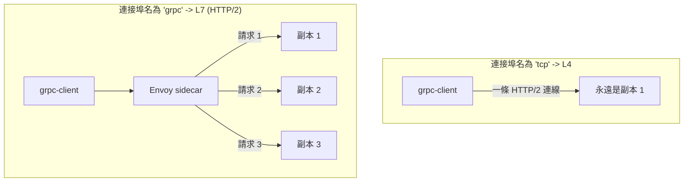

[Русская версия](README_RU.MD) · [Eng version](README.MD) · [Versión en español](README_ES.MD) · [Version française](README_FR.MD) · [Deutsche Version](README_DE.MD) · [ქართული ვერსია](README_GE.MD) · [日本語版](README_JP.MD)

# Lab 32 - gRPC：逐請求負載平衡、連接埠命名、重試與逾時

> [參考解答](worker/files/solutions/1_TW.MD)

## 概述

gRPC 常被誤認為「只是 TCP」，但這是錯誤的：gRPC 運行於 **HTTP/2**
之上，這表示對 Istio 而言它是 L7 流量。因此有兩項結果：

1. gRPC 可獲得所有 L7 功能：重試、逾時、依標頭路由、詳細
   指標，以及最重要的 **逐請求負載平衡**。
2. 為讓 Istio 辨識協定，Service 的連接埠必須**明確命名**為 (`grpc` / `grpc-*`)，
   或設定 `appProtocol: grpc`。否則 Istio 會將流量視為原始 TCP，並依
   *連線*進行平衡：用戶端唯一的長生命週期 HTTP/2 連線會「黏附」至單一
   副本，負載平衡實際上便無法運作。

此實驗已部署支援 gRPC 的映像檔 `viktoruj/ping_pong`（方法 `PingPong.Echo`
會傳回提供服務的 Pod 名稱）：
- **grpc-server** - gRPC Echo/Health 伺服器（連接埠 `8079`）、**3 個副本**（後端）；
- **grpc-client** - 相同映像檔，gRPC 負載產生器（`/app -grpc-client ...`）。

Service `grpc-server` 刻意以**錯誤的連接埠名稱** (`tcp`) 建立，因此目前
gRPC 負載平衡已損壞：所有請求都會送往同一個 Pod（用戶端只看到一個
唯一伺服器）。



## 基礎設施

| 元件 | 類型 | 數量 | 角色 |
|---|---|---|---|
| control-plane | `t3.medium` | 1 | master + istiod |
| worker | `t3.medium` | 1 | grpc-server（3 個副本）+ client 的容量 |
| worker PC | `t3.small` | 1 | 工作站：`kubectl`、`check_result` |

區域：`eu-central-1`（AZ `eu-central-1a` / `eu-central-1b`）。

## 部署

```bash
TASK=32 make run_ica_task
```

## 任務

1. 修正 **Service** `grpc-server`：連接埠 `8079` 必須被辨識為 gRPC--將連接埠
   命名為 `grpc`（或新增 `appProtocol: grpc`），以啟用透過 HTTP/2 的逐請求
   負載平衡。
2. 為 `grpc-server` 建立含 gRPC **重試**（`attempts` + 針對 gRPC 的
   `retryOn`）及請求**逾時**的 **VirtualService**。
3. 確保 gRPC 請求現在會分散至全部三個副本（逐請求 LB）。

## 步驟 1. 修正連接埠命名

gRPC 是 HTTP/2，不是原始 TCP。Istio 依據**連接埠名稱的前綴**
(`grpc`、`http2`、...) 或欄位 `appProtocol` 來判斷協定。將連接埠重新命名為
`grpc`：

```bash
kubectl -n app patch svc grpc-server --type=json -p='[
  {"op":"replace","path":"/spec/ports/0/name","value":"grpc"},
  {"op":"add","path":"/spec/ports/0/appProtocol","value":"grpc"}
]'
```

一旦 Istio 發現 HTTP/2（gRPC）叢集，Envoy 便會開始在共用連線內對所有端點平衡**每個
請求**，無需額外設定。

## 步驟 2. 建立含重試與逾時的 VirtualService

gRPC 透過 `http` 區塊（而非 `tcp`）設定：

```bash
kubectl apply -f - <<'EOF'
apiVersion: networking.istio.io/v1
kind: VirtualService
metadata:
  name: grpc-server
  namespace: app
spec:
  hosts:
    - grpc-server
  http:
    - route:
        - destination:
            host: grpc-server
            port:
              number: 8079
      timeout: 2s
      retries:
        attempts: 3
        perTryTimeout: 1s
        retryOn: connect-failure,refused-stream,unavailable,cancelled,deadline-exceeded
EOF
```

- `retryOn` 使用面向 gRPC 的條件：`unavailable`、`cancelled`、
  `deadline-exceeded` 對應 gRPC 代碼；`refused-stream` 與 `connect-failure`
  涵蓋傳輸層故障。
- `timeout` 限制整個請求，`perTryTimeout` 限制每次嘗試。

## 步驟 3. 驗證

從用戶端啟動 gRPC 負載，並確認請求已抵達**全部三個**副本：

```bash
kubectl exec -n app deploy/grpc-client -c ping-pong -- \
  /app -grpc-client -target grpc-server:8079 -n 180 -c 4
```

預期的輸出「尾端」：

```
--- summary ---
requests: 180  ok: 180  errors: 0
distinct servers: 3
host grpc-server-xxxx-aaaa: 60
host grpc-server-xxxx-bbbb: 60
host grpc-server-xxxx-cccc: 60
```

`distinct servers: 3` 證明逐請求負載平衡。在修正之前（連接埠為 `tcp`），
相同指令將顯示 `distinct servers: 1`。

## 運作原理

- **gRPC 是 HTTP/2，不是 TCP。** 從 L4 的角度，Envoy 對*連線*進行平衡：用戶端
  維持一條長生命週期連線，因此所有呼叫都會黏附至單一 Pod。將連接埠宣告為 `grpc`
  會讓 Envoy 解析 HTTP/2，並對端點平衡**每個請求**（stream）。
- **連接埠名稱是開關。** 連接埠必須命名為 `grpc` / `grpc-*`（或
  `http2`），或帶有 `appProtocol: grpc`。中性的名稱（`tcp`、未命名）會停用
  所有 L7 功能：沒有逐請求 LB、重試、逾時與 gRPC 指標。
- **L7 功能可用於 gRPC。** 由於它是 HTTP，gRPC 可獲得 `http` 重試（搭配面向 gRPC 的
  `retryOn`）、`timeout`/`perTryTimeout`、依標頭路由、故障注入及詳細遙測--
  完全如同一般 HTTP。

## 驗證結果

在 worker PC 上執行：

```bash
check_result
```

## 總結

您已透過正確的連接埠命名啟用 gRPC 的逐請求負載平衡，並將 gRPC 的重試與逾時如同 HTTP
般設定。理解 **gRPC 是 HTTP/2** 是 mesh 操作的關鍵技能之一：正是為了正確的負載平衡，
gRPC Service 才最常被導入 service mesh。