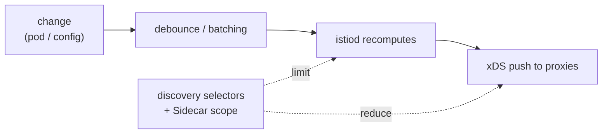

[RU version](README_RU.MD)

# Lab 33 - Control plane: performance & operations

## Overview

istiod carries no traffic itself - it watches the cluster and pushes configuration to every
Envoy over xDS. That is exactly what loads it. The two main performance levers **limit
scope**:

- **discovery selectors** - istiod only watches the namespaces you care about, ignoring the
  rest;
- **Sidecar scope** - each proxy is given config only for the services it needs, not the
  whole mesh.

Plus operations: **istiod golden signals** for monitoring and **OPA Gatekeeper** to turn
best practices into mandatory admission rules.

This lab deploys three namespaces:
- `app` (in mesh, `mesh=enabled`) - `frontend`;
- `shop` (in mesh, `mesh=enabled`) - `catalog` + a sidecar-less `probe`;
- `legacy` (no injection, no `mesh` label) - `legacy-app`.

Istio is installed with the default profile (cluster-wide discovery, no Sidecar scope) and
OPA Gatekeeper is pre-installed. `istioctl` is available on the worker PC.



## Task

1. Enable **discovery selectors** so istiod only tracks namespaces labelled `mesh=enabled`
   (namespace `legacy` must drop out of the mesh).
2. Create a **Sidecar** in `app` with a restricted egress (`app` + `istio-system`) so `app`
   proxies no longer know about `shop`.
3. Observe istiod **golden signals**.
4. Configure **OPA Gatekeeper**: a deploy policy that rejects non-compliant resources.

## Step 1. Discovery selectors

Re-apply the install with `meshConfig.discoverySelectors` matching `mesh=enabled`:

```bash
cat <<EOF > /tmp/iop.yaml
apiVersion: install.istio.io/v1alpha1
kind: IstioOperator
spec:
  profile: default
  meshConfig:
    discoverySelectors:
      - matchLabels:
          mesh: enabled
EOF
istioctl install -f /tmp/iop.yaml -y

# legacy dropped from the mesh (checked from a proxy without a Sidecar scope):
istioctl proxy-config clusters deploy/catalog.shop | grep legacy-app || echo "legacy dropped"
```

## Step 2. Sidecar egress scope in app

```bash
kubectl apply -f - <<'EOF'
apiVersion: networking.istio.io/v1
kind: Sidecar
metadata:
  name: default
  namespace: app
spec:
  egress:
    - hosts:
        - "./*"
        - "istio-system/*"
EOF

# shop dropped from the app proxy config:
istioctl proxy-config clusters deploy/frontend.app | grep catalog.shop || echo "shop dropped"
```

## Step 3. istiod golden signals

```bash
kubectl exec -n shop deploy/probe -c probe -- \
  curl -s http://istiod.istio-system:15014/metrics \
  | grep -E 'pilot_proxy_convergence_time|pilot_xds_pushes'

istioctl proxy-status   # who is connected and in sync
```

`pilot_proxy_convergence_time` is the main signal (how long a change takes to reach the
proxies); `pilot_xds_pushes` counts pushes. Rising values mean the control plane is under
pressure - the scope levers in steps 1-2 are what bring it down.

## Step 4. OPA Gatekeeper

Require every namespace to carry an injection label (a classic policy from the chapter):

```bash
kubectl apply -f - <<'EOF'
apiVersion: templates.gatekeeper.sh/v1
kind: ConstraintTemplate
metadata:
  name: k8srequiredlabels
spec:
  crd:
    spec:
      names:
        kind: K8sRequiredLabels
      validation:
        openAPIV3Schema:
          type: object
          properties:
            labels:
              type: array
              items:
                type: string
  targets:
    - target: admission.k8s.gatekeeper.sh
      rego: |
        package k8srequiredlabels
        violation[{"msg": msg}] {
          provided := {label | input.review.object.metadata.labels[label]}
          required := {label | label := input.parameters.labels[_]}
          missing := required - provided
          count(missing) > 0
          msg := sprintf("namespace is missing required labels: %v", [missing])
        }
EOF

kubectl apply -f - <<'EOF'
apiVersion: constraints.gatekeeper.sh/v1beta1
kind: K8sRequiredLabels
metadata:
  name: ns-must-have-injection
spec:
  match:
    kinds:
      - apiGroups: [""]
        kinds: ["Namespace"]
  parameters:
    labels: ["istio-injection"]
EOF

# verify (should be DENIED):
kubectl create ns test-no-label
```

## How it works

- **Discovery selectors** limit which namespaces istiod watches at all. A namespace without
  the selector label is invisible to the control plane - its services never become
  clusters/endpoints on any proxy, cutting config size and push work. Biggest win when part
  of the cluster is not in the mesh.
- **Sidecar egress scope** limits, per namespace, which services a proxy is told about. With
  `./*` + `istio-system/*`, an `app` proxy no longer carries config for `shop` or the rest
  of the mesh - shrinking each proxy's config and the push fan-out from istiod.
- **Golden signals** (`pilot_proxy_convergence_time`, `pilot_xds_pushes`, connected proxies,
  istiod CPU/mem) show whether the control plane keeps up; scope is the main tool to lower
  convergence time.
- **OPA Gatekeeper** turns best practices into admission rules: non-compliant resources are
  rejected at creation.

## Check the result

Run on the worker PC:

```bash
check_result
```

## Summary

You narrowed the control-plane scope with two levers (discovery selectors + Sidecar scope),
observed istiod golden signals, and made a deploy policy mandatory with OPA Gatekeeper - the
baseline toolkit for operating Istio at scale.

## Infrastructure

| Component | Type | Count | Role |
|---|---|---|---|
| control-plane | `t3.large` | 1 | master + istiod + OPA Gatekeeper |
| worker | `t3.large` | 1 | capacity for the three-namespace workloads |
| worker PC | `t3.small` | 1 | workstation: `kubectl`, `istioctl`, `check_result` |

Region: `eu-central-1` (AZ `eu-central-1a` / `eu-central-1b`).
