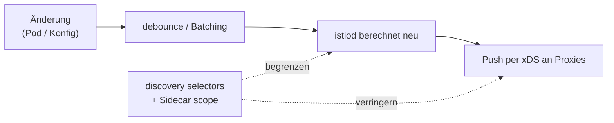

[RU version](README_RU.MD) · [Eng version](README.MD) · [Versión en español](README_ES.MD) · [Version française](README_FR.MD)

# Lab 33 - Control Plane: Performance und Betrieb

## Überblick

istiod trägt selbst keinen Verkehr - es beobachtet den Cluster und verteilt die Konfiguration an
alle Envoy per xDS. Genau das belastet es. Die zwei wichtigsten Performance-Hebel sind die
**Einschränkung des Sichtbarkeitsbereichs**:

- **discovery selectors** - istiod beobachtet nur die nötigen Namespaces und ignoriert die
  übrigen;
- **Sidecar scope** - jeder Proxy bekommt nur die Konfiguration der Services, die er braucht,
  nicht des gesamten Mesh.

Dazu der Betrieb: die **goldenen Signale von istiod** für das Monitoring und **OPA Gatekeeper**,
um Best Practices in verbindliche Admission-Regeln zu übersetzen.

Im Lab sind drei Namespaces bereitgestellt:
- `app` (im Mesh, `mesh=enabled`) - `frontend`;
- `shop` (im Mesh, `mesh=enabled`) - `catalog` + sidecar-loses `probe`;
- `legacy` (ohne Injection und ohne Label `mesh`) - `legacy-app`.

Istio steht im Default-Profil (sieht den gesamten Cluster, ohne Sidecar scope), OPA Gatekeeper
ist bereits installiert. Auf dem worker PC ist `istioctl` vorhanden.



## Infrastruktur

| Komponente | Typ | Anzahl | Rolle |
|---|---|---|---|
| control-plane | `t3.large` | 1 | master + istiod + OPA Gatekeeper |
| worker | `t3.large` | 1 | Kapazität für Workloads der drei Namespaces |
| worker PC | `t3.small` | 1 | Arbeitsplatz: `kubectl`, `istioctl`, `check_result` |

Region: `eu-central-1` (AZ `eu-central-1a` / `eu-central-1b`).

## Deployment

```bash
TASK=33 make run_ica_task
```

## Aufgabe

1. **discovery selectors** aktivieren, damit istiod nur die Namespaces mit dem Label
   `mesh=enabled` beobachtet (der Namespace `legacy` soll aus dem Mesh herausfallen).
2. Einen **Sidecar** in `app` mit eingeschränktem Egress (`app` + `istio-system`) erstellen, damit
   die Proxies von `app` nichts mehr über `shop` wissen.
3. Die **goldenen Signale** von istiod anschauen.
4. **OPA Gatekeeper** einrichten: eine Deployment-Policy, die verstoßende Ressourcen ablehnt.

## Schritt 1. Discovery selectors

Neu installieren mit `meshConfig.discoverySelectors` nach dem Label `mesh=enabled`:

```bash
cat <<EOF > /tmp/iop.yaml
apiVersion: install.istio.io/v1alpha1
kind: IstioOperator
spec:
  profile: default
  meshConfig:
    discoverySelectors:
      - matchLabels:
          mesh: enabled
EOF
istioctl install -f /tmp/iop.yaml -y

# legacy ist aus dem Mesh verschwunden (Sicht von einem Proxy ohne Sidecar scope):
istioctl proxy-config clusters deploy/catalog.shop | grep legacy-app || echo "legacy dropped"
```

## Schritt 2. Sidecar egress scope in app

```bash
kubectl apply -f - <<'EOF'
apiVersion: networking.istio.io/v1
kind: Sidecar
metadata:
  name: default
  namespace: app
spec:
  egress:
    - hosts:
        - "./*"
        - "istio-system/*"
EOF

# shop ist aus der Konfiguration der app-Proxies verschwunden:
istioctl proxy-config clusters deploy/frontend.app | grep catalog.shop || echo "shop dropped"
```

## Schritt 3. Goldene Signale von istiod

```bash
kubectl exec -n shop deploy/probe -c probe -- \
  curl -s http://istiod.istio-system:15014/metrics \
  | grep -E 'pilot_proxy_convergence_time|pilot_xds_pushes'

istioctl proxy-status   # wer verbunden und synchronisiert ist
```

`pilot_proxy_convergence_time` - das Hauptsignal (wie lange eine Änderung bis zum Proxy braucht),
`pilot_xds_pushes` - Anzahl der Verteilungen. Ihr Anstieg = die Control Plane kommt nicht hinterher;
der Scope aus den Schritten 1-2 behebt genau das.

## Schritt 4. OPA Gatekeeper

Wir verlangen, dass jeder Namespace ein Injection-Label hat (typische Policy aus Kapitel 30):

```bash
kubectl apply -f - <<'EOF'
apiVersion: templates.gatekeeper.sh/v1
kind: ConstraintTemplate
metadata:
  name: k8srequiredlabels
spec:
  crd:
    spec:
      names:
        kind: K8sRequiredLabels
      validation:
        openAPIV3Schema:
          type: object
          properties:
            labels:
              type: array
              items:
                type: string
  targets:
    - target: admission.k8s.gatekeeper.sh
      rego: |
        package k8srequiredlabels
        violation[{"msg": msg}] {
          provided := {label | input.review.object.metadata.labels[label]}
          required := {label | label := input.parameters.labels[_]}
          missing := required - provided
          count(missing) > 0
          msg := sprintf("namespace is missing required labels: %v", [missing])
        }
EOF

kubectl apply -f - <<'EOF'
apiVersion: constraints.gatekeeper.sh/v1beta1
kind: K8sRequiredLabels
metadata:
  name: ns-must-have-injection
spec:
  match:
    kinds:
      - apiGroups: [""]
        kinds: ["Namespace"]
  parameters:
    labels: ["istio-injection"]
EOF

# Prüfung (sollte DENIED sein):
kubectl create ns test-no-label
```

## Wie es funktioniert

- **Discovery selectors** begrenzen, welche Namespaces istiod überhaupt beobachtet. Ein Namespace
  ohne das nötige Label ist für die Control Plane unsichtbar - seine Services werden auf keinem
  Proxy zu Clustern/Endpoints. Der größte Gewinn entsteht, wenn ein Teil des Clusters nicht im
  Mesh ist.
- **Sidecar egress scope** begrenzt, von welchen Services ein Proxy erfährt. Mit `./*` +
  `istio-system/*` trägt der Proxy in `app` nicht mehr die Konfiguration von `shop` und dem
  übrigen Mesh - weniger Konfig auf dem Proxy und weniger Verteilungen von istiod.
- **Goldene Signale** (`pilot_proxy_convergence_time`, `pilot_xds_pushes`, Anzahl der Proxies,
  CPU/Speicher von istiod) zeigen, ob die Control Plane hinterherkommt; der Scope ist das
  Hauptwerkzeug, um die Konvergenzzeit zu senken.
- **OPA Gatekeeper** verwandelt Best Practices in Admission-Regeln: nicht konforme Ressourcen
  werden bei der Erstellung abgelehnt.

## Ergebnisprüfung

Führen Sie auf dem worker PC aus:

```bash
check_result
```

## Fazit

Sie haben den Sichtbarkeitsbereich der Control Plane mit zwei Hebeln (discovery selectors +
Sidecar scope) verengt, die goldenen Signale von istiod angeschaut und eine Deployment-Policy über
OPA Gatekeeper verbindlich gemacht - das Grundset für den Betrieb von Istio in großem Maßstab.
