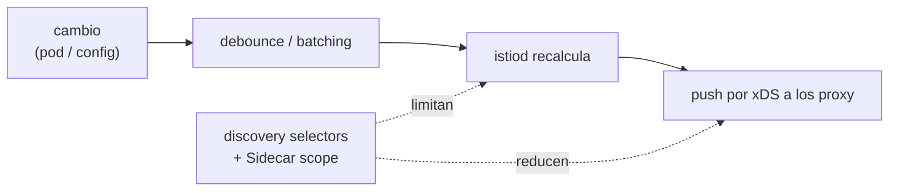

[RU version](README_RU.MD) · [Eng version](README.MD) · [Version française](README_FR.MD) · [Deutsche Version](README_DE.MD)

# Lab 33 - Control plane: rendimiento y operación

## Resumen

istiod no transporta tráfico por sí mismo - vigila el clúster y distribuye la configuración a todos los Envoy por
xDS. Justamente eso es lo que lo carga. Las dos palancas principales de rendimiento son la **limitación
del alcance de visibilidad**:

- **discovery selectors** - istiod vigila solo los namespace necesarios, ignorando el resto;
- **Sidecar scope** - a cada proxy se le entrega la configuración solo de los servicios que necesita, no de todo el
  mesh.

Más la operación: **señales doradas de istiod** para la monitorización y **OPA Gatekeeper** para
convertir las best practices en reglas de admission obligatorias.

En el lab están desplegados tres namespace:
- `app` (en el mesh, `mesh=enabled`) - `frontend`;
- `shop` (en el mesh, `mesh=enabled`) - `catalog` + `probe` sin sidecar;
- `legacy` (sin inyección y sin la etiqueta `mesh`) - `legacy-app`.

Istio está en el perfil default (ve todo el clúster, sin Sidecar scope), OPA Gatekeeper ya está
instalado. En el worker PC hay `istioctl`.



## Tarea

1. Activar **discovery selectors** para que istiod vigile solo los namespace con la etiqueta
   `mesh=enabled` (el namespace `legacy` debe quedar fuera del mesh).
2. Crear un **Sidecar** en `app` con egress limitado (`app` + `istio-system`), para que los proxy
   de `app` dejen de conocer `shop`.
3. Consultar las **señales doradas** de istiod.
4. Configurar **OPA Gatekeeper**: política de despliegue que rechace los recursos que la infringen.

## Paso 1. Discovery selectors

Reinstala con `meshConfig.discoverySelectors` por la etiqueta `mesh=enabled`:

```bash
cat <<EOF > /tmp/iop.yaml
apiVersion: install.istio.io/v1alpha1
kind: IstioOperator
spec:
  profile: default
  meshConfig:
    discoverySelectors:
      - matchLabels:
          mesh: enabled
EOF
istioctl install -f /tmp/iop.yaml -y

# legacy desapareció del mesh (miramos desde un proxy sin Sidecar scope):
istioctl proxy-config clusters deploy/catalog.shop | grep legacy-app || echo "legacy dropped"
```

## Paso 2. Sidecar egress scope en app

```bash
kubectl apply -f - <<'EOF'
apiVersion: networking.istio.io/v1
kind: Sidecar
metadata:
  name: default
  namespace: app
spec:
  egress:
    - hosts:
        - "./*"
        - "istio-system/*"
EOF

# shop desapareció de la configuración de los proxy de app:
istioctl proxy-config clusters deploy/frontend.app | grep catalog.shop || echo "shop dropped"
```

## Paso 3. Señales doradas de istiod

```bash
kubectl exec -n shop deploy/probe -c probe -- \
  curl -s http://istiod.istio-system:15014/metrics \
  | grep -E 'pilot_proxy_convergence_time|pilot_xds_pushes'

istioctl proxy-status   # quién está conectado y sincronizado
```

`pilot_proxy_convergence_time` - la señal principal (en cuánto un cambio llega al proxy),
`pilot_xds_pushes` - número de distribuciones. Su crecimiento = el control plane no da abasto; el scope de los pasos
1-2 es justo lo que lo cura.

## Paso 4. OPA Gatekeeper

Exigimos que cualquier namespace tenga la etiqueta de inyección (política típica del capítulo 30):

```bash
kubectl apply -f - <<'EOF'
apiVersion: templates.gatekeeper.sh/v1
kind: ConstraintTemplate
metadata:
  name: k8srequiredlabels
spec:
  crd:
    spec:
      names:
        kind: K8sRequiredLabels
      validation:
        openAPIV3Schema:
          type: object
          properties:
            labels:
              type: array
              items:
                type: string
  targets:
    - target: admission.k8s.gatekeeper.sh
      rego: |
        package k8srequiredlabels
        violation[{"msg": msg}] {
          provided := {label | input.review.object.metadata.labels[label]}
          required := {label | label := input.parameters.labels[_]}
          missing := required - provided
          count(missing) > 0
          msg := sprintf("namespace is missing required labels: %v", [missing])
        }
EOF

kubectl apply -f - <<'EOF'
apiVersion: constraints.gatekeeper.sh/v1beta1
kind: K8sRequiredLabels
metadata:
  name: ns-must-have-injection
spec:
  match:
    kinds:
      - apiGroups: [""]
        kinds: ["Namespace"]
  parameters:
    labels: ["istio-injection"]
EOF

# verificación (debe ser DENIED):
kubectl create ns test-no-label
```

## Cómo funciona

- **Discovery selectors** limitan a qué namespace vigila istiod en absoluto.
  Un namespace sin la etiqueta necesaria es invisible para el control plane - sus servicios no se convierten en
  clústeres/endpoints en ningún proxy. La mayor ganancia se da cuando parte del clúster no está en el mesh.
- **Sidecar egress scope** limita de qué servicios se entera el proxy. Con `./*` +
  `istio-system/*` el proxy en `app` ya no lleva la configuración de `shop` ni del resto del mesh - menos
  configuración en el proxy y menos distribuciones de istiod.
- **Las señales doradas** (`pilot_proxy_convergence_time`, `pilot_xds_pushes`, número de proxy,
  CPU/memoria de istiod) muestran si el control plane da abasto; el scope es la herramienta principal
  para reducir el tiempo de convergencia.
- **OPA Gatekeeper** convierte las best practices en reglas de admission: los recursos no conformes
  se rechazan al crearse.

## Comprobación del resultado

Ejecuta en el worker PC:

```bash
check_result
```

## Conclusión

Has estrechado el alcance de visibilidad del control plane con dos palancas (discovery selectors + Sidecar
scope), consultado las señales doradas de istiod y hecho obligatoria la política de despliegue mediante OPA
Gatekeeper - el conjunto básico para operar Istio a escala.

## Infraestructura

| Componente | Tipo | Cant. | Rol |
|---|---|---|---|
| control-plane | `t3.large` | 1 | master + istiod + OPA Gatekeeper |
| worker | `t3.large` | 1 | capacidad para las workload de tres namespace |
| worker PC | `t3.small` | 1 | puesto de trabajo: `kubectl`, `istioctl`, `check_result` |

Región: `eu-central-1` (AZ `eu-central-1a` / `eu-central-1b`).
