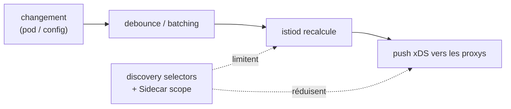

[RU version](README_RU.MD) · [Eng version](README.MD) · [Versión en español](README_ES.MD) · [Deutsche Version](README_DE.MD)

# Lab 33 - Control plane : performance et exploitation

## Vue d'ensemble

istiod ne transporte pas lui-même le trafic - il surveille le cluster et diffuse la configuration à
tous les Envoy via xDS. C'est justement ce qui le charge. Les deux principaux leviers de
performance sont la **restriction du champ de visibilité** :

- **discovery selectors** - istiod ne surveille que les namespaces nécessaires, en ignorant les autres ;
- **Sidecar scope** - chaque proxy ne reçoit que la config des services dont il a besoin, et non
  celle de tout le maillage.

Plus l'exploitation : les **signaux dorés d'istiod** pour le monitoring et **OPA Gatekeeper** pour
transformer les best practices en règles d'admission obligatoires.

Le lab déploie trois namespaces :
- `app` (dans le mesh, `mesh=enabled`) - `frontend` ;
- `shop` (dans le mesh, `mesh=enabled`) - `catalog` + `probe` sans sidecar ;
- `legacy` (sans injection ni label `mesh`) - `legacy-app`.

Istio est installé avec le profil default (voit tout le cluster, sans Sidecar scope), OPA
Gatekeeper est déjà installé. Le worker PC dispose d'`istioctl`.



## Infrastructure

| Composant | Type | Nombre | Rôle |
|---|---|---|---|
| control-plane | `t3.large` | 1 | master + istiod + OPA Gatekeeper |
| worker | `t3.large` | 1 | capacité pour les workloads des trois namespaces |
| worker PC | `t3.small` | 1 | poste de travail : `kubectl`, `istioctl`, `check_result` |

Région : `eu-central-1` (AZ `eu-central-1a` / `eu-central-1b`).

## Déploiement

```bash
TASK=33 make run_ica_task
```

## Objectif

1. Activer les **discovery selectors**, pour qu'istiod ne surveille que les namespaces portant le
   label `mesh=enabled` (le namespace `legacy` doit sortir du mesh).
2. Créer un **Sidecar** dans `app` avec un egress restreint (`app` + `istio-system`), afin que les
   proxys de `app` cessent de connaître `shop`.
3. Consulter les **signaux dorés** d'istiod.
4. Configurer **OPA Gatekeeper** : une politique de déploiement rejetant les ressources non conformes.

## Étape 1. Discovery selectors

Réinstallez avec `meshConfig.discoverySelectors` sur le label `mesh=enabled` :

```bash
cat <<EOF > /tmp/iop.yaml
apiVersion: install.istio.io/v1alpha1
kind: IstioOperator
spec:
  profile: default
  meshConfig:
    discoverySelectors:
      - matchLabels:
          mesh: enabled
EOF
istioctl install -f /tmp/iop.yaml -y

# legacy a disparu du mesh (vu depuis un proxy sans Sidecar scope) :
istioctl proxy-config clusters deploy/catalog.shop | grep legacy-app || echo "legacy dropped"
```

## Étape 2. Sidecar egress scope dans app

```bash
kubectl apply -f - <<'EOF'
apiVersion: networking.istio.io/v1
kind: Sidecar
metadata:
  name: default
  namespace: app
spec:
  egress:
    - hosts:
        - "./*"
        - "istio-system/*"
EOF

# shop a disparu de la configuration des proxys de app :
istioctl proxy-config clusters deploy/frontend.app | grep catalog.shop || echo "shop dropped"
```

## Étape 3. Signaux dorés d'istiod

```bash
kubectl exec -n shop deploy/probe -c probe -- \
  curl -s http://istiod.istio-system:15014/metrics \
  | grep -E 'pilot_proxy_convergence_time|pilot_xds_pushes'

istioctl proxy-status   # qui est connecté et synchronisé
```

`pilot_proxy_convergence_time` - le signal principal (en combien de temps un changement parvient au
proxy), `pilot_xds_pushes` - le nombre de diffusions. Leur hausse = le control plane ne suit plus ;
le scope des étapes 1-2 est justement ce qui corrige cela.

## Étape 4. OPA Gatekeeper

Nous exigeons que tout namespace ait un label d'injection (politique type du chapitre 30) :

```bash
kubectl apply -f - <<'EOF'
apiVersion: templates.gatekeeper.sh/v1
kind: ConstraintTemplate
metadata:
  name: k8srequiredlabels
spec:
  crd:
    spec:
      names:
        kind: K8sRequiredLabels
      validation:
        openAPIV3Schema:
          type: object
          properties:
            labels:
              type: array
              items:
                type: string
  targets:
    - target: admission.k8s.gatekeeper.sh
      rego: |
        package k8srequiredlabels
        violation[{"msg": msg}] {
          provided := {label | input.review.object.metadata.labels[label]}
          required := {label | label := input.parameters.labels[_]}
          missing := required - provided
          count(missing) > 0
          msg := sprintf("namespace is missing required labels: %v", [missing])
        }
EOF

kubectl apply -f - <<'EOF'
apiVersion: constraints.gatekeeper.sh/v1beta1
kind: K8sRequiredLabels
metadata:
  name: ns-must-have-injection
spec:
  match:
    kinds:
      - apiGroups: [""]
        kinds: ["Namespace"]
  parameters:
    labels: ["istio-injection"]
EOF

# vérification (doit être DENIED) :
kubectl create ns test-no-label
```

## Comment ça fonctionne

- **Discovery selectors** limitent les namespaces qu'istiod surveille du tout. Un namespace sans le
  label requis est invisible pour le control plane - ses services ne se transforment en
  clusters/endpoints sur aucun proxy. Le gain est maximal quand une partie du cluster n'est pas dans
  le mesh.
- **Sidecar egress scope** limite les services dont un proxy prend connaissance. Avec `./*` +
  `istio-system/*`, le proxy de `app` ne porte plus la config de `shop` ni du reste du maillage -
  moins de config sur le proxy et moins de diffusions depuis istiod.
- **Les signaux dorés** (`pilot_proxy_convergence_time`, `pilot_xds_pushes`, nombre de proxys,
  CPU/mémoire d'istiod) montrent si le control plane suit ; le scope est l'outil principal pour
  réduire le temps de convergence.
- **OPA Gatekeeper** transforme les best practices en règles d'admission : les ressources non
  conformes sont rejetées à la création.

## Vérification du résultat

Lancez sur le worker PC :

```bash
check_result
```

## Bilan

Vous avez réduit le champ de visibilité du control plane avec deux leviers (discovery selectors +
Sidecar scope), consulté les signaux dorés d'istiod et rendu une politique de déploiement
obligatoire via OPA Gatekeeper - le kit de base pour exploiter Istio à l'échelle.
