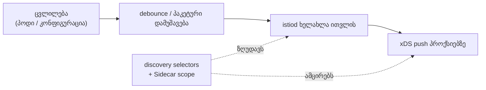

[Русская версия](README_RU.MD) · [Eng version](README.MD) · [Versión en español](README_ES.MD) · [Version française](README_FR.MD) · [Deutsche Version](README_DE.MD) · [繁體中文版](README_TW.MD) · [日本語版](README_JP.MD)

# ლაბორატორია 33 - Control plane: წარმადობა და ექსპლუატაცია

> [საცნობარო გადაწყვეტა](worker/files/solutions/1_GE.MD)

## მიმოხილვა

istiod თავად არ ატარებს ტრაფიკს - ის აკვირდება კლასტერს და xDS-ის მეშვეობით ყველა Envoy-ს
კონფიგურაციას უგზავნის. სწორედ ეს ქმნის მის დატვირთვას. წარმადობის ორი მთავარი ბერკეტია
**ხილვადობის არეალის შეზღუდვა**:

- **discovery selectors** - istiod აკვირდება მხოლოდ საჭირო namespace-ებს და დანარჩენებს
  უგულებელყოფს;
- **Sidecar scope** - თითოეულ პროქსის მიეწოდება მხოლოდ მისთვის საჭირო სერვისების
  კონფიგურაცია და არა მთელი mesh-ის.

ამას ემატება ექსპლუატაცია: მონიტორინგისთვის istiod-ის **ოქროს სიგნალები** და **OPA Gatekeeper**,
რომელიც best practices-ს სავალდებულო admission-წესებად გარდაქმნის.

ლაბორატორიაში განთავსებულია სამი namespace:
- `app` (mesh-ში, `mesh=enabled`) - `frontend`;
- `shop` (mesh-ში, `mesh=enabled`) - `catalog` + sidecar-ის გარეშე გაშვებული `probe`;
- `legacy` (ინექციისა და `mesh` ჭდის გარეშე) - `legacy-app`.

Istio დაყენებულია default-პროფილით (ხედავს მთელ კლასტერს, Sidecar scope-ის გარეშე), OPA
Gatekeeper კი უკვე დაყენებულია. Worker PC-ზე ხელმისაწვდომია `istioctl`.



## ინფრასტრუქტურა

| კომპონენტი | ტიპი | რაოდენობა | როლი |
|---|---|---|---|
| control-plane | `t3.large` | 1 | master + istiod + OPA Gatekeeper |
| worker | `t3.large` | 1 | სამი namespace-ის workload-ებისთვის განკუთვნილი რესურსები |
| worker PC | `t3.small` | 1 | სამუშაო ადგილი: `kubectl`, `istioctl`, `check_result` |

რეგიონი: `eu-central-1` (AZ `eu-central-1a` / `eu-central-1b`).

## გაშვება

```bash
TASK=33 make run_ica_task
```

## დავალება

1. ჩართეთ **discovery selectors**, რათა istiod მხოლოდ `mesh=enabled` ჭდის მქონე namespace-ებს
   აკვირდებოდეს (namespace `legacy` mesh-იდან უნდა გამოირიცხოს).
2. `app`-ში შექმენით **Sidecar** შეზღუდული egress-ით (`app` + `istio-system`), რათა `app`-ის
   პროქსიებმა `shop`-ის შესახებ ინფორმაცია აღარ მიიღონ.
3. დაათვალიერეთ istiod-ის **ოქროს სიგნალები**.
4. გამართეთ **OPA Gatekeeper**: განთავსების პოლიტიკა, რომელიც მოთხოვნების დამრღვევ რესურსებს
   უარყოფს.

## ნაბიჯი 1. Discovery selectors

ხელახლა დააყენეთ `meshConfig.discoverySelectors`-ით, `mesh=enabled` ჭდის საფუძველზე:

```bash
cat <<EOF > /tmp/iop.yaml
apiVersion: install.istio.io/v1alpha1
kind: IstioOperator
spec:
  profile: default
  meshConfig:
    discoverySelectors:
      - matchLabels:
          mesh: enabled
EOF
istioctl install -f /tmp/iop.yaml -y

# legacy გაქრა mesh-იდან (ვუყურებთ Sidecar scope-ის არმქონე პროქსიდან):
istioctl proxy-config clusters deploy/catalog.shop | grep legacy-app || echo "legacy dropped"
```

## ნაბიჯი 2. Sidecar egress scope app-ში

```bash
kubectl apply -f - <<'EOF'
apiVersion: networking.istio.io/v1
kind: Sidecar
metadata:
  name: default
  namespace: app
spec:
  egress:
    - hosts:
        - "./*"
        - "istio-system/*"
EOF

# shop გაქრა app-ის პროქსის კონფიგურაციიდან:
istioctl proxy-config clusters deploy/frontend.app | grep catalog.shop || echo "shop dropped"
```

## ნაბიჯი 3. istiod-ის ოქროს სიგნალები

```bash
kubectl exec -n shop deploy/probe -c probe -- \
  curl -s http://istiod.istio-system:15014/metrics \
  | grep -E 'pilot_proxy_convergence_time|pilot_xds_pushes'

istioctl proxy-status   # ვინ არის მიერთებული და სინქრონიზებული
```

`pilot_proxy_convergence_time` მთავარი სიგნალია (რამდენ ხანში აღწევს ცვლილება პროქსიმდე),
`pilot_xds_pushes` კი გაგზავნების რაოდენობაა. მათი ზრდა ნიშნავს, რომ control plane დატვირთვას
ვერ უმკლავდება; ნაბიჯებში 1–2 გამოყენებული scope სწორედ ამ პრობლემას აგვარებს.

## ნაბიჯი 4. OPA Gatekeeper

მოვითხოვოთ, რომ ნებისმიერ namespace-ს ინექციის ჭდე ჰქონდეს (30-ე თავიდან აღებული ტიპური
პოლიტიკა):

```bash
kubectl apply -f - <<'EOF'
apiVersion: templates.gatekeeper.sh/v1
kind: ConstraintTemplate
metadata:
  name: k8srequiredlabels
spec:
  crd:
    spec:
      names:
        kind: K8sRequiredLabels
      validation:
        openAPIV3Schema:
          type: object
          properties:
            labels:
              type: array
              items:
                type: string
  targets:
    - target: admission.k8s.gatekeeper.sh
      rego: |
        package k8srequiredlabels
        violation[{"msg": msg}] {
          provided := {label | input.review.object.metadata.labels[label]}
          required := {label | label := input.parameters.labels[_]}
          missing := required - provided
          count(missing) > 0
          msg := sprintf("namespace is missing required labels: %v", [missing])
        }
EOF

kubectl apply -f - <<'EOF'
apiVersion: constraints.gatekeeper.sh/v1beta1
kind: K8sRequiredLabels
metadata:
  name: ns-must-have-injection
spec:
  match:
    kinds:
      - apiGroups: [""]
        kinds: ["Namespace"]
  parameters:
    labels: ["istio-injection"]
EOF

# შემოწმება (უნდა იყოს DENIED):
kubectl create ns test-no-label
```

## როგორ მუშაობს

- **Discovery selectors** ზღუდავს, თუ რომელ namespace-ებს აკვირდება istiod. საჭირო ჭდის გარეშე
  namespace უხილავია control plane-ისთვის - მისი სერვისები არც ერთ პროქსიზე არ გარდაიქმნება
  კლასტერებად/endpoint-ებად. ყველაზე დიდი სარგებელი მიიღება, როდესაც კლასტერის ნაწილი mesh-ში
  არ შედის.
- **Sidecar egress scope** ზღუდავს, თუ რომელი სერვისების შესახებ იღებს ინფორმაციას პროქსი.
  `./*` + `istio-system/*`-ის გამოყენებისას `app`-ის პროქსი აღარ შეიცავს `shop`-ისა და mesh-ის
  დანარჩენი ნაწილის კონფიგურაციას - პროქსიზე ნაკლები კონფიგურაციაა, istiod-იდან კი ნაკლები
  გაგზავნა.
- **ოქროს სიგნალები** (`pilot_proxy_convergence_time`, `pilot_xds_pushes`, პროქსიების რაოდენობა,
  istiod-ის CPU/მეხსიერება) აჩვენებს, უმკლავდება თუ არა control plane დატვირთვას; scope
  კონვერგენციის დროის შემცირების მთავარი ინსტრუმენტია.
- **OPA Gatekeeper** best practices-ს admission-წესებად გარდაქმნის: შეუსაბამო რესურსები შექმნისას
  უარყოფილია.

## შედეგის შემოწმება

Worker PC-ზე გაუშვით:

```bash
check_result
```

## შეჯამება

თქვენ ორი ბერკეტით (discovery selectors + Sidecar scope) შეავიწროეთ control plane-ის ხილვადობის
არეალი, დაათვალიერეთ istiod-ის ოქროს სიგნალები და OPA Gatekeeper-ის მეშვეობით განთავსების
პოლიტიკა სავალდებულო გახადეთ - ეს Istio-ს მასშტაბური ექსპლუატაციის საბაზისო ნაკრებია.
