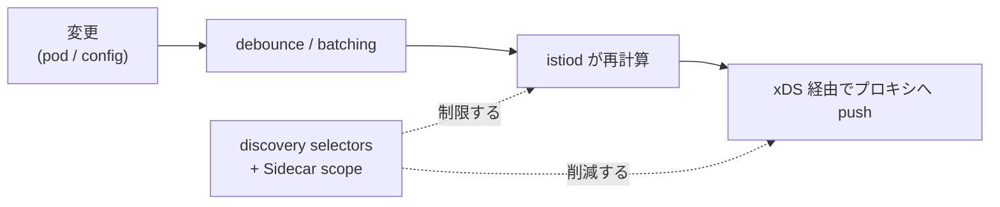

[Русская версия](README_RU.MD) · [Eng version](README.MD) · [Versión en español](README_ES.MD) · [Version française](README_FR.MD) · [Deutsche Version](README_DE.MD) · [ქართული ვერსია](README_GE.MD) · [繁體中文版](README_TW.MD)

# Lab 33 - Control plane: パフォーマンスと運用

> [リファレンス解答](worker/files/solutions/1_JP.MD)

## 概要

istiod 自身はトラフィックを運びません。クラスタを監視し、xDS 経由で全 Envoy に設定を配信します。
これが istiod に負荷をかける要因です。パフォーマンスにおける主な 2 つのレバーは、**可視範囲の制限**です。

- **discovery selectors** - istiod は必要な namespace のみを監視し、その他は無視します。
- **Sidecar scope** - 各プロキシには、mesh 全体ではなく、それが必要とするサービスのみの設定が渡されます。

さらに運用面では、監視のための istiod の**ゴールデンシグナル**と、best practices を必須の
admission ルールへ変換する **OPA Gatekeeper** があります。

このラボでは、3 つの namespace がデプロイされています。
- `app`（mesh 内、`mesh=enabled`）- `frontend`。
- `shop`（mesh 内、`mesh=enabled`）- `catalog` + sidecar なしの `probe`。
- `legacy`（injection なし、`mesh` ラベルなし）- `legacy-app`。

Istio は default プロファイルでインストールされています（Sidecar scope なしでクラスタ全体を認識）。
OPA Gatekeeper はすでにインストール済みです。worker PC には `istioctl` があります。



## インフラストラクチャ

| コンポーネント | タイプ | 数 | 役割 |
|---|---|---|---|
| control-plane | `t3.large` | 1 | master + istiod + OPA Gatekeeper |
| worker | `t3.large` | 1 | 3 つの namespace の workload 用キャパシティ |
| worker PC | `t3.small` | 1 | 作業環境: `kubectl`、`istioctl`、`check_result` |

リージョン: `eu-central-1`（AZ `eu-central-1a` / `eu-central-1b`）。

## デプロイ

```bash
TASK=33 make run_ica_task
```

## 課題

1. **discovery selectors** を有効化し、istiod が `mesh=enabled` ラベルを持つ namespace
   のみを監視するようにします（namespace `legacy` は mesh から除外される必要があります）。
2. `app` に egress を制限した **Sidecar**（`app` + `istio-system`）を作成し、`app` のプロキシが
   `shop` を認識しないようにします。
3. istiod の**ゴールデンシグナル**を確認します。
4. **OPA Gatekeeper** を設定します。違反するリソースを拒否するデプロイポリシーを作成します。

## ステップ 1. Discovery selectors

`mesh=enabled` ラベルに基づく `meshConfig.discoverySelectors` を使用して再インストールします。

```bash
cat <<EOF > /tmp/iop.yaml
apiVersion: install.istio.io/v1alpha1
kind: IstioOperator
spec:
  profile: default
  meshConfig:
    discoverySelectors:
      - matchLabels:
          mesh: enabled
EOF
istioctl install -f /tmp/iop.yaml -y

# legacy が mesh から消えた (Sidecar scope なしのプロキシから見る):
istioctl proxy-config clusters deploy/catalog.shop | grep legacy-app || echo "legacy dropped"
```

## ステップ 2. app の Sidecar egress scope

```bash
kubectl apply -f - <<'EOF'
apiVersion: networking.istio.io/v1
kind: Sidecar
metadata:
  name: default
  namespace: app
spec:
  egress:
    - hosts:
        - "./*"
        - "istio-system/*"
EOF

# shop が app プロキシの設定から消えた:
istioctl proxy-config clusters deploy/frontend.app | grep catalog.shop || echo "shop dropped"
```

## ステップ 3. istiod のゴールデンシグナル

```bash
kubectl exec -n shop deploy/probe -c probe -- \
  curl -s http://istiod.istio-system:15014/metrics \
  | grep -E 'pilot_proxy_convergence_time|pilot_xds_pushes'

istioctl proxy-status   # 誰が接続され同期されているか
```

`pilot_proxy_convergence_time` は主なシグナルです（変更がプロキシに到達するまでの時間）。
`pilot_xds_pushes` は配信回数です。これらの増加は control plane が処理しきれていないことを示します。
ステップ 1～2 の scope はまさにこれを改善します。

## ステップ 4. OPA Gatekeeper

すべての namespace に injection ラベルがあることを要求します（第 30 章の典型的なポリシー）。

```bash
kubectl apply -f - <<'EOF'
apiVersion: templates.gatekeeper.sh/v1
kind: ConstraintTemplate
metadata:
  name: k8srequiredlabels
spec:
  crd:
    spec:
      names:
        kind: K8sRequiredLabels
      validation:
        openAPIV3Schema:
          type: object
          properties:
            labels:
              type: array
              items:
                type: string
  targets:
    - target: admission.k8s.gatekeeper.sh
      rego: |
        package k8srequiredlabels
        violation[{"msg": msg}] {
          provided := {label | input.review.object.metadata.labels[label]}
          required := {label | label := input.parameters.labels[_]}
          missing := required - provided
          count(missing) > 0
          msg := sprintf("namespace is missing required labels: %v", [missing])
        }
EOF

kubectl apply -f - <<'EOF'
apiVersion: constraints.gatekeeper.sh/v1beta1
kind: K8sRequiredLabels
metadata:
  name: ns-must-have-injection
spec:
  match:
    kinds:
      - apiGroups: [""]
        kinds: ["Namespace"]
  parameters:
    labels: ["istio-injection"]
EOF

# 検証 (DENIED であるべき):
kubectl create ns test-no-label
```

## 仕組み

- **Discovery selectors** は、istiod がそもそもどの namespace を監視するかを制限します。
  必要なラベルがない namespace は control plane から見えず、そのサービスはどのプロキシでも
  クラスタ/endpoint に変換されません。クラスタの一部が mesh に属さない場合に最も大きな効果があります。
- **Sidecar egress scope** は、プロキシがどのサービスを認識するかを制限します。`./*` +
  `istio-system/*` により、`app` のプロキシは `shop` および mesh の残りの設定を運ばなくなります。
  これによりプロキシの設定と istiod からの配信が減少します。
- **ゴールデンシグナル**（`pilot_proxy_convergence_time`、`pilot_xds_pushes`、プロキシ数、
  istiod の CPU/メモリ）は、control plane が処理しきれているかを示します。scope は収束時間を
  削減する主な手段です。
- **OPA Gatekeeper** は best practices を admission ルールへ変換します。準拠していない
  リソースは作成時に拒否されます。

## 結果の確認

worker PC で実行します。

```bash
check_result
```

## まとめ

2 つのレバー（discovery selectors + Sidecar scope）で control plane の可視範囲を狭め、istiod の
ゴールデンシグナルを確認し、OPA Gatekeeper によりデプロイポリシーを必須化しました。これは
大規模な Istio 運用のための基本セットです。
