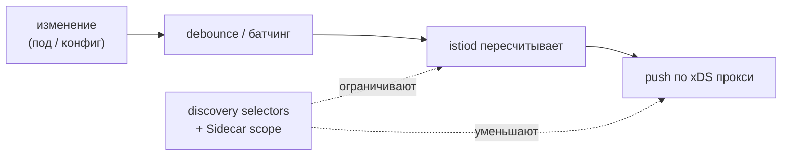

[Eng version](README.MD) · [Versión en español](README_ES.MD) · [Version française](README_FR.MD) · [Deutsche Version](README_DE.MD)

# Lab 33 - Control plane: производительность и эксплуатация

## Обзор

istiod сам трафик не носит - он следит за кластером и рассылает конфигурацию всем Envoy по
xDS. Именно это его и нагружает. Два главных рычага производительности - **ограничение
области видимости**:

- **discovery selectors** - istiod следит только за нужными namespace, игнорируя остальные;
- **Sidecar scope** - каждому прокси отдаётся конфиг только нужных ему сервисов, а не всего
  mesh.

Плюс эксплуатация: **золотые сигналы istiod** для мониторинга и **OPA Gatekeeper** для
перевода best practices в обязательные admission-правила.

В лабе развёрнуты три namespace:
- `app` (в mesh, `mesh=enabled`) - `frontend`;
- `shop` (в mesh, `mesh=enabled`) - `catalog` + sidecar-less `probe`;
- `legacy` (без инъекции и без метки `mesh`) - `legacy-app`.

Istio стоит в default-профиле (видит весь кластер, без Sidecar scope), OPA Gatekeeper уже
установлен. На worker PC есть `istioctl`.



## Инфраструктура

| Компонент | Тип | Кол-во | Роль |
|---|---|---|---|
| control-plane | `t3.large` | 1 | master + istiod + OPA Gatekeeper |
| worker | `t3.large` | 1 | ёмкость для workload'ов трёх namespace |
| worker PC | `t3.small` | 1 | рабочее место: `kubectl`, `istioctl`, `check_result` |

Регион: `eu-central-1` (AZ `eu-central-1a` / `eu-central-1b`).

## Развёртывание

```bash
TASK=33 make run_ica_task
```

## Задание

1. Включить **discovery selectors**, чтобы istiod следил только за namespace с меткой
   `mesh=enabled` (namespace `legacy` должен выпасть из mesh).
2. Создать **Sidecar** в `app` с ограниченным egress (`app` + `istio-system`), чтобы прокси
   `app` перестали знать про `shop`.
3. Посмотреть **золотые сигналы** istiod.
4. Настроить **OPA Gatekeeper**: политика деплоя, отклоняющая нарушающие ресурсы.

## Шаг 1. Discovery selectors

Переустановите с `meshConfig.discoverySelectors` по метке `mesh=enabled`:

```bash
cat <<EOF > /tmp/iop.yaml
apiVersion: install.istio.io/v1alpha1
kind: IstioOperator
spec:
  profile: default
  meshConfig:
    discoverySelectors:
      - matchLabels:
          mesh: enabled
EOF
istioctl install -f /tmp/iop.yaml -y

# legacy пропал из mesh (смотрим с прокси без Sidecar scope):
istioctl proxy-config clusters deploy/catalog.shop | grep legacy-app || echo "legacy dropped"
```

## Шаг 2. Sidecar egress scope в app

```bash
kubectl apply -f - <<'EOF'
apiVersion: networking.istio.io/v1
kind: Sidecar
metadata:
  name: default
  namespace: app
spec:
  egress:
    - hosts:
        - "./*"
        - "istio-system/*"
EOF

# shop пропал из конфигурации прокси app:
istioctl proxy-config clusters deploy/frontend.app | grep catalog.shop || echo "shop dropped"
```

## Шаг 3. Золотые сигналы istiod

```bash
kubectl exec -n shop deploy/probe -c probe -- \
  curl -s http://istiod.istio-system:15014/metrics \
  | grep -E 'pilot_proxy_convergence_time|pilot_xds_pushes'

istioctl proxy-status   # кто подключён и синхронизирован
```

`pilot_proxy_convergence_time` - главный сигнал (за сколько изменение доходит до прокси),
`pilot_xds_pushes` - число рассылок. Их рост = control plane не справляется; scope из шагов
1-2 как раз это и лечит.

## Шаг 4. OPA Gatekeeper

Требуем, чтобы у любого namespace была метка инъекции (типовая политика из главы 30):

```bash
kubectl apply -f - <<'EOF'
apiVersion: templates.gatekeeper.sh/v1
kind: ConstraintTemplate
metadata:
  name: k8srequiredlabels
spec:
  crd:
    spec:
      names:
        kind: K8sRequiredLabels
      validation:
        openAPIV3Schema:
          type: object
          properties:
            labels:
              type: array
              items:
                type: string
  targets:
    - target: admission.k8s.gatekeeper.sh
      rego: |
        package k8srequiredlabels
        violation[{"msg": msg}] {
          provided := {label | input.review.object.metadata.labels[label]}
          required := {label | label := input.parameters.labels[_]}
          missing := required - provided
          count(missing) > 0
          msg := sprintf("namespace is missing required labels: %v", [missing])
        }
EOF

kubectl apply -f - <<'EOF'
apiVersion: constraints.gatekeeper.sh/v1beta1
kind: K8sRequiredLabels
metadata:
  name: ns-must-have-injection
spec:
  match:
    kinds:
      - apiGroups: [""]
        kinds: ["Namespace"]
  parameters:
    labels: ["istio-injection"]
EOF

# проверка (должно быть DENIED):
kubectl create ns test-no-label
```

## Как это работает

- **Discovery selectors** ограничивают, за какими namespace istiod вообще следит.
  Namespace без нужной метки невидим для control plane - его сервисы не превращаются в
  кластеры/эндпоинты ни на одном прокси. Наибольший выигрыш, когда часть кластера не в mesh.
- **Sidecar egress scope** ограничивает, о каких сервисах узнаёт прокси. С `./*` +
  `istio-system/*` прокси в `app` больше не несёт конфиг `shop` и остального mesh - меньше
  конфига на прокси и меньше рассылок от istiod.
- **Золотые сигналы** (`pilot_proxy_convergence_time`, `pilot_xds_pushes`, число прокси,
  CPU/память istiod) показывают, справляется ли control plane; scope - основной инструмент
  снизить время сходимости.
- **OPA Gatekeeper** превращает best practices в admission-правила: несоответствующие
  ресурсы отклоняются при создании.

## Проверка результата

Запустите на worker PC:

```bash
check_result
```

## Итог

Вы сузили область видимости control plane двумя рычагами (discovery selectors + Sidecar
scope), посмотрели золотые сигналы istiod и сделали политику деплоя обязательной через OPA
Gatekeeper - базовый набор для эксплуатации Istio в масштабе.
