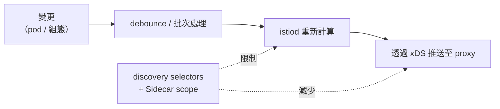

[Русская версия](README_RU.MD) · [Eng version](README.MD) · [Versión en español](README_ES.MD) · [Version française](README_FR.MD) · [Deutsche Version](README_DE.MD) · [ქართული ვერსია](README_GE.MD) · [日本語版](README_JP.MD)

# 實驗 33 - 控制平面：效能與維運

> [參考解答](worker/files/solutions/1_TW.MD)

## 概覽

istiod 本身不承載流量--它會監看叢集，並透過 xDS 將組態發送給所有 Envoy。
這正是它的負載來源。兩個主要的效能槓桿都是**縮小可見範圍**：

- **discovery selectors**--istiod 僅監看必要的 namespace，忽略其餘 namespace；
- **Sidecar scope**--每個 proxy 僅取得其所需服務的組態，而非整個 mesh 的組態。

此外還有維運面向：用於監控的 istiod **黃金訊號**，以及將最佳實務轉換為強制
admission 規則的 **OPA Gatekeeper**。

本實驗部署了三個 namespace：
- `app`（位於 mesh 內，`mesh=enabled`）--`frontend`；
- `shop`（位於 mesh 內，`mesh=enabled`）--`catalog` + 無 sidecar 的 `probe`；
- `legacy`（無注入且沒有 `mesh` 標籤）--`legacy-app`。

Istio 使用 default profile 安裝（可見整個叢集，沒有 Sidecar scope），OPA Gatekeeper 已經
安裝。worker PC 上有 `istioctl`。



## 基礎設施

| 元件 | 類型 | 數量 | 角色 |
|---|---|---|---|
| control-plane | `t3.large` | 1 | master + istiod + OPA Gatekeeper |
| worker | `t3.large` | 1 | 三個 namespace 的 workload 容量 |
| worker PC | `t3.small` | 1 | 工作站：`kubectl`、`istioctl`、`check_result` |

區域：`eu-central-1`（AZ `eu-central-1a` / `eu-central-1b`）。

## 部署

```bash
TASK=33 make run_ica_task
```

## 任務

1. 啟用 **discovery selectors**，讓 istiod 僅監看帶有 `mesh=enabled` 標籤的 namespace
   （namespace `legacy` 必須從 mesh 中排除）。
2. 在 `app` 中建立具有限制 egress（`app` + `istio-system`）的 **Sidecar**，使 `app`
   proxy 不再知道 `shop`。
3. 查看 istiod 的**黃金訊號**。
4. 設定 **OPA Gatekeeper**：一項拒絕違規資源的部署策略。

## 步驟 1：Discovery selectors

使用依 `mesh=enabled` 標籤設定的 `meshConfig.discoverySelectors` 重新安裝：

```bash
cat <<EOF > /tmp/iop.yaml
apiVersion: install.istio.io/v1alpha1
kind: IstioOperator
spec:
  profile: default
  meshConfig:
    discoverySelectors:
      - matchLabels:
          mesh: enabled
EOF
istioctl install -f /tmp/iop.yaml -y

# legacy 已從 mesh 消失 (以沒有 Sidecar scope 的 proxy 檢視)：
istioctl proxy-config clusters deploy/catalog.shop | grep legacy-app || echo "legacy dropped"
```

## 步驟 2：app 中的 Sidecar egress scope

```bash
kubectl apply -f - <<'EOF'
apiVersion: networking.istio.io/v1
kind: Sidecar
metadata:
  name: default
  namespace: app
spec:
  egress:
    - hosts:
        - "./*"
        - "istio-system/*"
EOF

# shop 已從 app proxy 的設定中消失：
istioctl proxy-config clusters deploy/frontend.app | grep catalog.shop || echo "shop dropped"
```

## 步驟 3：istiod 黃金訊號

```bash
kubectl exec -n shop deploy/probe -c probe -- \
  curl -s http://istiod.istio-system:15014/metrics \
  | grep -E 'pilot_proxy_convergence_time|pilot_xds_pushes'

istioctl proxy-status   # 誰已連線並同步
```

`pilot_proxy_convergence_time` 是主要訊號（變更傳達至 proxy 所需的時間），
`pilot_xds_pushes` 是發送次數。它們的增加表示 control plane 無法負荷；步驟 1–2 的
scope 正是用來改善此問題。

## 步驟 4：OPA Gatekeeper

要求每個 namespace 都具有注入標籤（第 30 章的典型策略）：

```bash
kubectl apply -f - <<'EOF'
apiVersion: templates.gatekeeper.sh/v1
kind: ConstraintTemplate
metadata:
  name: k8srequiredlabels
spec:
  crd:
    spec:
      names:
        kind: K8sRequiredLabels
      validation:
        openAPIV3Schema:
          type: object
          properties:
            labels:
              type: array
              items:
                type: string
  targets:
    - target: admission.k8s.gatekeeper.sh
      rego: |
        package k8srequiredlabels
        violation[{"msg": msg}] {
          provided := {label | input.review.object.metadata.labels[label]}
          required := {label | label := input.parameters.labels[_]}
          missing := required - provided
          count(missing) > 0
          msg := sprintf("namespace is missing required labels: %v", [missing])
        }
EOF

kubectl apply -f - <<'EOF'
apiVersion: constraints.gatekeeper.sh/v1beta1
kind: K8sRequiredLabels
metadata:
  name: ns-must-have-injection
spec:
  match:
    kinds:
      - apiGroups: [""]
        kinds: ["Namespace"]
  parameters:
    labels: ["istio-injection"]
EOF

# 檢查 (應為 DENIED)：
kubectl create ns test-no-label
```

## 運作方式

- **Discovery selectors** 限制 istiod 實際監看哪些 namespace。沒有必要標籤的 Namespace
  對 control plane 不可見--其服務不會在任何 proxy 上轉換為 clusters/endpoints。當叢集的
  一部分不在 mesh 中時，收益最大。
- **Sidecar egress scope** 限制 proxy 會得知哪些服務。使用 `./*` +
  `istio-system/*` 後，`app` 中的 proxy 不再攜帶 `shop` 與 mesh 其餘部分的組態--
  每個 proxy 的組態更少，istiod 的發送也更少。
- **黃金訊號**（`pilot_proxy_convergence_time`、`pilot_xds_pushes`、proxy 數量、
  istiod CPU/記憶體）顯示 control plane 是否能夠負荷；scope 是降低收斂時間的主要工具。
- **OPA Gatekeeper** 將最佳實務轉為 admission 規則：不符合的資源會在建立時遭拒絕。

## 結果驗證

在 worker PC 上執行：

```bash
check_result
```

## 總結

您已透過兩個槓桿（discovery selectors + Sidecar scope）縮小 control plane 的可見範圍，
查看了 istiod 黃金訊號，並透過 OPA Gatekeeper 使部署策略成為強制要求--這是大規模
維運 Istio 的基本組合。
