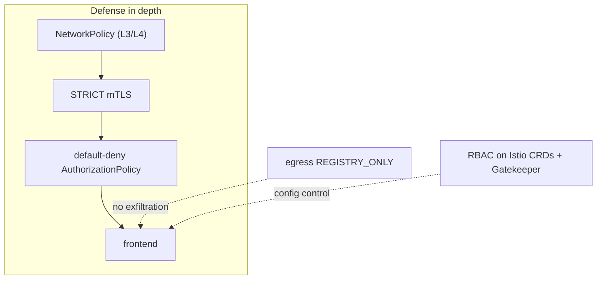

[RU version](README_RU.MD) · [Versión en español](README_ES.MD)

# Lab 34 - Hardening & threat model

## Overview

A mesh does not only add protection - it **also becomes part of the attack surface**. This
lab pulls the course's security practices into a single **defense-in-depth** hardening
pass: encryption and identity, least-privilege authorization, egress control, restricted
rights on Istio CRDs, mandatory admission rules, and an independent network layer.

Deployed:
- namespace `app` (in mesh): `frontend` (ping_pong HTTP) + two curl clients `good` (SA
  `good`) and `bad` (SA `bad`) + SA `mesh-editor`;
- namespace `legacy` (no injection): `legacy` - a sidecar-less curl client.

Istio uses the default profile (PERMISSIVE mTLS, ALLOW_ANY egress, no authz) and OPA
Gatekeeper is pre-installed. `istioctl` is available on the worker PC.



## Task

1. Enable **STRICT mTLS** mesh-wide.
2. Apply a **default-deny** authorization in `app` and allow only `good`.
3. Enable **egress control** (`REGISTRY_ONLY`).
4. Restrict rights on Istio CRDs: `mesh-editor` may manage Istio config but **not**
   `EnvoyFilter`.
5. **OPA Gatekeeper**: reject `PeerAuthentication` with `mode: DISABLE`.
6. **NetworkPolicy** as an independent layer (sidecar-bypass resilience).

## Step 1. STRICT mTLS

```bash
kubectl apply -f - <<'EOF'
apiVersion: security.istio.io/v1
kind: PeerAuthentication
metadata:
  name: default
  namespace: istio-system      # root namespace -> mesh-wide
spec:
  mtls:
    mode: STRICT
EOF

# the sidecar-less legacy client (plaintext) can no longer reach frontend:
kubectl exec -n legacy deploy/legacy -c curl -- \
  curl -s -o /dev/null -w '%{http_code}\n' --max-time 8 http://frontend.app.svc.cluster.local:8080/
```

## Step 2. Default-deny + targeted allow

```bash
kubectl apply -f - <<'EOF'
apiVersion: security.istio.io/v1
kind: AuthorizationPolicy
metadata:
  name: deny-all
  namespace: app
spec: {}
EOF

kubectl apply -f - <<'EOF'
apiVersion: security.istio.io/v1
kind: AuthorizationPolicy
metadata:
  name: allow-good
  namespace: app
spec:
  selector:
    matchLabels:
      app: frontend
  action: ALLOW
  rules:
    - from:
        - source:
            principals: ["cluster.local/ns/app/sa/good"]
EOF

kubectl exec -n app deploy/good -c curl -- curl -s -o /dev/null -w '%{http_code}\n' http://frontend.app.svc.cluster.local:8080/   # 200
kubectl exec -n app deploy/bad  -c curl -- curl -s -o /dev/null -w '%{http_code}\n' http://frontend.app.svc.cluster.local:8080/   # 403
```

## Step 3. Egress control: REGISTRY_ONLY

```bash
cat <<EOF > /tmp/iop.yaml
apiVersion: install.istio.io/v1alpha1
kind: IstioOperator
spec:
  profile: default
  meshConfig:
    outboundTrafficPolicy:
      mode: REGISTRY_ONLY
EOF
istioctl install -f /tmp/iop.yaml -y

kubectl exec -n app deploy/good -c curl -- \
  curl -s -o /dev/null -w '%{http_code}\n' --max-time 8 http://www.example.com/   # 502 (blocked)
```

## Step 4. RBAC on Istio CRDs (forbid EnvoyFilter)

`EnvoyFilter` is the most dangerous CRD (it injects raw Envoy config). Grant `mesh-editor`
Istio config management but **exclude** `envoyfilters`:

```bash
kubectl apply -f - <<'EOF'
apiVersion: rbac.authorization.k8s.io/v1
kind: Role
metadata:
  name: mesh-editor
  namespace: app
rules:
  - apiGroups: ["networking.istio.io"]
    resources: ["virtualservices","destinationrules","gateways","serviceentries","sidecars","workloadentries"]
    verbs: ["get","list","watch","create","update","patch","delete"]
  - apiGroups: ["security.istio.io"]
    resources: ["authorizationpolicies","requestauthentications"]
    verbs: ["get","list","watch","create","update","patch","delete"]
  # envoyfilters intentionally NOT granted
---
apiVersion: rbac.authorization.k8s.io/v1
kind: RoleBinding
metadata:
  name: mesh-editor
  namespace: app
roleRef:
  kind: Role
  name: mesh-editor
  apiGroup: rbac.authorization.k8s.io
subjects:
  - kind: ServiceAccount
    name: mesh-editor
    namespace: app
EOF

kubectl auth can-i create virtualservices.networking.istio.io --as=system:serviceaccount:app:mesh-editor -n app   # yes
kubectl auth can-i create envoyfilters.networking.istio.io     --as=system:serviceaccount:app:mesh-editor -n app   # no
```

## Step 5. OPA Gatekeeper: forbid disabling mTLS

```bash
kubectl apply -f - <<'EOF'
apiVersion: templates.gatekeeper.sh/v1
kind: ConstraintTemplate
metadata:
  name: k8sdenymtlsdisable
spec:
  crd:
    spec:
      names:
        kind: K8sDenyMtlsDisable
  targets:
    - target: admission.k8s.gatekeeper.sh
      rego: |
        package k8sdenymtlsdisable
        violation[{"msg": msg}] {
          input.review.object.spec.mtls.mode == "DISABLE"
          msg := "PeerAuthentication with mode: DISABLE is not allowed"
        }
EOF

kubectl apply -f - <<'EOF'
apiVersion: constraints.gatekeeper.sh/v1beta1
kind: K8sDenyMtlsDisable
metadata:
  name: no-mtls-disable
spec:
  match:
    kinds:
      - apiGroups: ["security.istio.io"]
        kinds: ["PeerAuthentication"]
EOF

# should be DENIED:
kubectl apply -f - <<'EOF'
apiVersion: security.istio.io/v1
kind: PeerAuthentication
metadata:
  name: try-disable
  namespace: app
spec:
  mtls:
    mode: DISABLE
EOF
```

## Step 6. NetworkPolicy (sidecar-bypass resilience)

mTLS and authz live in the sidecar; if traffic bypasses it, they do not apply.
NetworkPolicy is enforced in the kernel by the CNI (Calico) - an independent L3/L4 layer:

```bash
kubectl apply -f - <<'EOF'
apiVersion: networking.k8s.io/v1
kind: NetworkPolicy
metadata:
  name: frontend-allow-app
  namespace: app
spec:
  podSelector:
    matchLabels:
      app: frontend
  policyTypes:
    - Ingress
  ingress:
    # app port 8080 only from pods in the app namespace
    - from:
        - namespaceSelector:
            matchLabels:
              kubernetes.io/metadata.name: app
      ports:
        - port: 8080
          protocol: TCP
    # istio sidecar health (15021) / metrics (15090) from anywhere (kubelet, prometheus)
    - ports:
        - port: 15021
          protocol: TCP
        - port: 15090
          protocol: TCP
EOF
```

Only pods in `app` can reach `frontend` on `8080`; `legacy` is dropped before it ever
reaches the sidecar. Port `15021` stays open so the kubelet readiness probe of the Istio
sidecar keeps passing (otherwise the pod would go NotReady).

## How it works (threat model)

- **STRICT mTLS** - only mutually-authenticated mesh traffic is accepted; plaintext and
  non-mesh clients are rejected. Encryption + service identity.
- **Default-deny authz** - least privilege: nothing is allowed unless an explicit ALLOW
  matches, limiting the blast radius of a compromised workload.
- **REGISTRY_ONLY egress** - a compromised pod cannot exfiltrate to arbitrary external
  hosts; only declared destinations are reachable.
- **RBAC on CRDs** - restricting `EnvoyFilter` (and Istio config in general) stops an
  over-privileged user from reprogramming the data plane.
- **OPA Gatekeeper** - makes "never disable mTLS" a hard admission rule, not a convention.
- **NetworkPolicy** - independent kernel-level control that still holds if the sidecar is
  bypassed - defense in depth.

## Check the result

Run on the worker PC:

```bash
check_result
```

## Summary

You hardened Istio with defense in depth: STRICT mTLS, default-deny authorization, egress
control, restricted rights on Istio CRDs, mandatory policies via OPA Gatekeeper, and an
independent network layer (NetworkPolicy) in case the sidecar is bypassed.

## Infrastructure

| Component | Type | Count | Role |
|---|---|---|---|
| control-plane | `t3.large` | 1 | master + istiod + OPA Gatekeeper |
| worker | `t3.large` | 1 | capacity for the app/legacy workloads |
| worker PC | `t3.small` | 1 | workstation: `kubectl`, `istioctl`, `check_result` |

Region: `eu-central-1` (AZ `eu-central-1a` / `eu-central-1b`).
