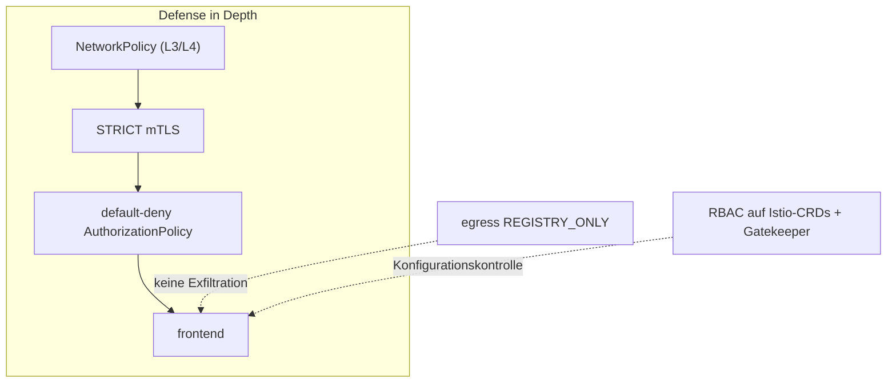

[RU version](README_RU.MD) · [Eng version](README.MD) · [Versión en español](README_ES.MD) · [Version française](README_FR.MD)

# Lab 34 - Hardening und Bedrohungsmodell des Mesh

## Überblick

Ein Mesh schützt nicht nur, sondern **wird selbst zum Teil der Angriffsfläche**. Dieses Lab fasst
die Security-Praktiken des Kurses zu einem einheitlichen Hardening nach dem Prinzip der
**Defense in Depth** zusammen: Verschlüsselung und Identity, Least-Privilege-Autorisierung,
Egress-Kontrolle, Einschränkung der Rechte auf Istio-CRDs, verbindliche Admission-Regeln und eine
unabhängige Netzwerkschicht.

Bereitgestellt:
- Namespace `app` (im Mesh): `frontend` (ping_pong HTTP) + zwei curl-Clients `good` (SA `good`)
  und `bad` (SA `bad`) + SA `mesh-editor`;
- Namespace `legacy` (ohne Injection): `legacy` - curl ohne Sidecar.

Istio im Default-Profil (mTLS PERMISSIVE, Egress ALLOW_ANY, keine Autorisierung), OPA Gatekeeper
installiert. Auf dem worker PC ist `istioctl` vorhanden.



## Aufgabe

1. **STRICT mTLS** für das gesamte Mesh aktivieren.
2. Eine **default-deny**-Autorisierung in `app` einrichten und gezielt nur `good` erlauben.
3. **Egress-Kontrolle** (`REGISTRY_ONLY`) aktivieren.
4. Die Rechte auf Istio-CRDs einschränken: `mesh-editor` darf die Istio-Konfiguration verwalten,
   aber **nicht** `EnvoyFilter`.
5. **OPA Gatekeeper**: `PeerAuthentication` mit `mode: DISABLE` verbieten.
6. **NetworkPolicy** als unabhängige Schicht (Widerstandsfähigkeit gegen Sidecar-Umgehung).

## Schritt 1. STRICT mTLS

```bash
kubectl apply -f - <<'EOF'
apiVersion: security.istio.io/v1
kind: PeerAuthentication
metadata:
  name: default
  namespace: istio-system      # root namespace -> für das gesamte Mesh
spec:
  mtls:
    mode: STRICT
EOF

# legacy ohne Sidecar (plaintext) erreicht frontend nicht mehr:
kubectl exec -n legacy deploy/legacy -c curl -- \
  curl -s -o /dev/null -w '%{http_code}\n' --max-time 8 http://frontend.app.svc.cluster.local:8080/
```

## Schritt 2. Default-deny + gezielte Erlaubnis

```bash
kubectl apply -f - <<'EOF'
apiVersion: security.istio.io/v1
kind: AuthorizationPolicy
metadata:
  name: deny-all
  namespace: app
spec: {}
EOF

kubectl apply -f - <<'EOF'
apiVersion: security.istio.io/v1
kind: AuthorizationPolicy
metadata:
  name: allow-good
  namespace: app
spec:
  selector:
    matchLabels:
      app: frontend
  action: ALLOW
  rules:
    - from:
        - source:
            principals: ["cluster.local/ns/app/sa/good"]
EOF

kubectl exec -n app deploy/good -c curl -- curl -s -o /dev/null -w '%{http_code}\n' http://frontend.app.svc.cluster.local:8080/   # 200
kubectl exec -n app deploy/bad  -c curl -- curl -s -o /dev/null -w '%{http_code}\n' http://frontend.app.svc.cluster.local:8080/   # 403
```

## Schritt 3. Egress-Kontrolle: REGISTRY_ONLY

```bash
cat <<EOF > /tmp/iop.yaml
apiVersion: install.istio.io/v1alpha1
kind: IstioOperator
spec:
  profile: default
  meshConfig:
    outboundTrafficPolicy:
      mode: REGISTRY_ONLY
EOF
istioctl install -f /tmp/iop.yaml -y

kubectl exec -n app deploy/good -c curl -- \
  curl -s -o /dev/null -w '%{http_code}\n' --max-time 8 http://www.example.com/   # 502 (blockiert)
```

## Schritt 4. RBAC auf Istio-CRDs (EnvoyFilter verbieten)

`EnvoyFilter` ist das gefährlichste CRD (es fügt rohe Konfiguration in Envoy ein). Wir geben
`mesh-editor` die Verwaltung der Istio-Konfiguration, aber **ohne** `envoyfilters`:

```bash
kubectl apply -f - <<'EOF'
apiVersion: rbac.authorization.k8s.io/v1
kind: Role
metadata:
  name: mesh-editor
  namespace: app
rules:
  - apiGroups: ["networking.istio.io"]
    resources: ["virtualservices","destinationrules","gateways","serviceentries","sidecars","workloadentries"]
    verbs: ["get","list","watch","create","update","patch","delete"]
  - apiGroups: ["security.istio.io"]
    resources: ["authorizationpolicies","requestauthentications"]
    verbs: ["get","list","watch","create","update","patch","delete"]
  # envoyfilters geben wir NICHT
---
apiVersion: rbac.authorization.k8s.io/v1
kind: RoleBinding
metadata:
  name: mesh-editor
  namespace: app
roleRef:
  kind: Role
  name: mesh-editor
  apiGroup: rbac.authorization.k8s.io
subjects:
  - kind: ServiceAccount
    name: mesh-editor
    namespace: app
EOF

kubectl auth can-i create virtualservices.networking.istio.io --as=system:serviceaccount:app:mesh-editor -n app   # yes
kubectl auth can-i create envoyfilters.networking.istio.io     --as=system:serviceaccount:app:mesh-editor -n app   # no
```

## Schritt 5. OPA Gatekeeper: Deaktivierung von mTLS verbieten

```bash
kubectl apply -f - <<'EOF'
apiVersion: templates.gatekeeper.sh/v1
kind: ConstraintTemplate
metadata:
  name: k8sdenymtlsdisable
spec:
  crd:
    spec:
      names:
        kind: K8sDenyMtlsDisable
  targets:
    - target: admission.k8s.gatekeeper.sh
      rego: |
        package k8sdenymtlsdisable
        violation[{"msg": msg}] {
          input.review.object.spec.mtls.mode == "DISABLE"
          msg := "PeerAuthentication with mode: DISABLE is not allowed"
        }
EOF

kubectl apply -f - <<'EOF'
apiVersion: constraints.gatekeeper.sh/v1beta1
kind: K8sDenyMtlsDisable
metadata:
  name: no-mtls-disable
spec:
  match:
    kinds:
      - apiGroups: ["security.istio.io"]
        kinds: ["PeerAuthentication"]
EOF

# sollte DENIED sein:
kubectl apply -f - <<'EOF'
apiVersion: security.istio.io/v1
kind: PeerAuthentication
metadata:
  name: try-disable
  namespace: app
spec:
  mtls:
    mode: DISABLE
EOF
```

## Schritt 6. NetworkPolicy (Widerstandsfähigkeit gegen Sidecar-Umgehung)

mTLS und Autorisierung leben im Sidecar; wenn der Verkehr ihn umgeht, greifen sie nicht. Die
NetworkPolicy arbeitet im Kernel (CNI Calico) - eine unabhängige Schicht:

```bash
kubectl apply -f - <<'EOF'
apiVersion: networking.k8s.io/v1
kind: NetworkPolicy
metadata:
  name: frontend-allow-app
  namespace: app
spec:
  podSelector:
    matchLabels:
      app: frontend
  policyTypes:
    - Ingress
  ingress:
    # Anwendungsport 8080 - nur aus Pods des Namespace app
    - from:
        - namespaceSelector:
            matchLabels:
              kubernetes.io/metadata.name: app
      ports:
        - port: 8080
          protocol: TCP
    # health (15021) / Metriken (15090) des Sidecars - von überall (kubelet, prometheus)
    - ports:
        - port: 15021
          protocol: TCP
        - port: 15090
          protocol: TCP
EOF
```

Den Port `15021` lassen wir offen, sonst beginnt die Readiness-Probe des Sidecars vom kubelet zu
scheitern und der Pod wird NotReady.

## Wie es funktioniert (Bedrohungsmodell)

- **STRICT mTLS** - es wird nur gegenseitig authentifizierter Mesh-Verkehr akzeptiert; Plaintext
  und Clients ohne Sidecar werden abgewiesen.
- **Default-deny-Autorisierung** - Least Privilege: ohne explizites ALLOW ist nichts erlaubt, das
  begrenzt den Wirkungsradius eines kompromittierten Pods.
- **REGISTRY_ONLY Egress** - ein kompromittierter Pod schleust keine Daten an eine beliebige
  externe Adresse aus.
- **RBAC auf CRDs** - die Einschränkung von `EnvoyFilter` (und der Istio-Konfiguration) verhindert,
  dass die Data Plane über übermäßige Rechte umgeschrieben wird.
- **OPA Gatekeeper** - „niemals mTLS deaktivieren" wird zu einer harten Admission-Regel.
- **NetworkPolicy** - eine unabhängige Schicht im Kernel, die selbst bei Sidecar-Umgehung greift -
  Defense in Depth.

## Ergebnisprüfung

Führen Sie auf dem worker PC aus:

```bash
check_result
```

## Fazit

Sie haben ein Hardening von Istio nach dem Prinzip Defense in Depth angewendet: STRICT mTLS,
default-deny-Autorisierung, Egress-Kontrolle, Einschränkung der Rechte auf Istio-CRDs,
verbindliche Policies über OPA Gatekeeper und eine unabhängige Netzwerkschicht (NetworkPolicy) für
den Fall der Sidecar-Umgehung.

## Infrastruktur

| Komponente | Typ | Anzahl | Rolle |
|---|---|---|---|
| control-plane | `t3.large` | 1 | master + istiod + OPA Gatekeeper |
| worker | `t3.large` | 1 | Kapazität für Workloads app/legacy |
| worker PC | `t3.small` | 1 | Arbeitsplatz: `kubectl`, `istioctl`, `check_result` |

Region: `eu-central-1` (AZ `eu-central-1a` / `eu-central-1b`).
