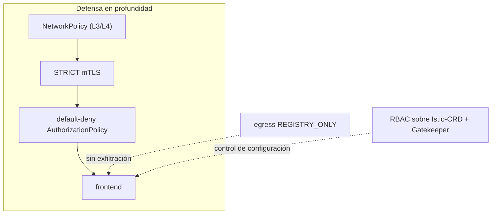

[RU version](README_RU.MD) · [Eng version](README.MD) · [Version française](README_FR.MD) · [Deutsche Version](README_DE.MD)

# Lab 34 - Hardening y modelo de amenazas del mesh

## Resumen

El mesh no solo protege, sino que **él mismo se convierte en parte de la superficie de ataque**. Este lab
reúne las prácticas de seguridad del curso en un hardening único según el principio de **defensa en profundidad**:
cifrado e identity, autorización least-privilege, control de egress, limitación de permisos sobre los
CRD de Istio, reglas de admission obligatorias y una barrera de red independiente.

Desplegado:
- namespace `app` (en el mesh): `frontend` (ping_pong HTTP) + dos clientes curl `good` (SA
  `good`) y `bad` (SA `bad`) + SA `mesh-editor`;
- namespace `legacy` (sin inyección): `legacy` - curl sin sidecar.

Istio en el perfil default (mTLS PERMISSIVE, egress ALLOW_ANY, sin autorización), OPA
Gatekeeper instalado. En el worker PC hay `istioctl`.



## Infraestructura

| Componente | Tipo | Cant. | Rol |
|---|---|---|---|
| control-plane | `t3.large` | 1 | master + istiod + OPA Gatekeeper |
| worker | `t3.large` | 1 | capacidad para las workload de app/legacy |
| worker PC | `t3.small` | 1 | puesto de trabajo: `kubectl`, `istioctl`, `check_result` |

Región: `eu-central-1` (AZ `eu-central-1a` / `eu-central-1b`).

## Despliegue

```bash
TASK=34 make run_ica_task
```

## Tarea

1. Activar **STRICT mTLS** en todo el mesh.
2. Establecer una autorización **default-deny** en `app` y permitir puntualmente solo a `good`.
3. Activar el **control de egress** (`REGISTRY_ONLY`).
4. Limitar los permisos sobre los CRD de Istio: `mesh-editor` puede gestionar la configuración de Istio, pero **no**
   `EnvoyFilter`.
5. **OPA Gatekeeper**: prohibir `PeerAuthentication` con `mode: DISABLE`.
6. **NetworkPolicy** como barrera independiente (resistencia a la evasión del sidecar).

## Paso 1. STRICT mTLS

```bash
kubectl apply -f - <<'EOF'
apiVersion: security.istio.io/v1
kind: PeerAuthentication
metadata:
  name: default
  namespace: istio-system      # root namespace -> a todo el mesh
spec:
  mtls:
    mode: STRICT
EOF

# legacy sin sidecar (plaintext) ya no alcanza a frontend:
kubectl exec -n legacy deploy/legacy -c curl -- \
  curl -s -o /dev/null -w '%{http_code}\n' --max-time 8 http://frontend.app.svc.cluster.local:8080/
```

## Paso 2. Default-deny + permiso puntual

```bash
kubectl apply -f - <<'EOF'
apiVersion: security.istio.io/v1
kind: AuthorizationPolicy
metadata:
  name: deny-all
  namespace: app
spec: {}
EOF

kubectl apply -f - <<'EOF'
apiVersion: security.istio.io/v1
kind: AuthorizationPolicy
metadata:
  name: allow-good
  namespace: app
spec:
  selector:
    matchLabels:
      app: frontend
  action: ALLOW
  rules:
    - from:
        - source:
            principals: ["cluster.local/ns/app/sa/good"]
EOF

kubectl exec -n app deploy/good -c curl -- curl -s -o /dev/null -w '%{http_code}\n' http://frontend.app.svc.cluster.local:8080/   # 200
kubectl exec -n app deploy/bad  -c curl -- curl -s -o /dev/null -w '%{http_code}\n' http://frontend.app.svc.cluster.local:8080/   # 403
```

## Paso 3. Control de egress: REGISTRY_ONLY

```bash
cat <<EOF > /tmp/iop.yaml
apiVersion: install.istio.io/v1alpha1
kind: IstioOperator
spec:
  profile: default
  meshConfig:
    outboundTrafficPolicy:
      mode: REGISTRY_ONLY
EOF
istioctl install -f /tmp/iop.yaml -y

kubectl exec -n app deploy/good -c curl -- \
  curl -s -o /dev/null -w '%{http_code}\n' --max-time 8 http://www.example.com/   # 502 (bloqueado)
```

## Paso 4. RBAC sobre los CRD de Istio (prohibición de EnvoyFilter)

`EnvoyFilter` es el CRD más peligroso (inserta configuración cruda en Envoy). Daremos a `mesh-editor`
la gestión de la configuración de Istio, pero **sin** `envoyfilters`:

```bash
kubectl apply -f - <<'EOF'
apiVersion: rbac.authorization.k8s.io/v1
kind: Role
metadata:
  name: mesh-editor
  namespace: app
rules:
  - apiGroups: ["networking.istio.io"]
    resources: ["virtualservices","destinationrules","gateways","serviceentries","sidecars","workloadentries"]
    verbs: ["get","list","watch","create","update","patch","delete"]
  - apiGroups: ["security.istio.io"]
    resources: ["authorizationpolicies","requestauthentications"]
    verbs: ["get","list","watch","create","update","patch","delete"]
  # envoyfilters NO los concedemos
---
apiVersion: rbac.authorization.k8s.io/v1
kind: RoleBinding
metadata:
  name: mesh-editor
  namespace: app
roleRef:
  kind: Role
  name: mesh-editor
  apiGroup: rbac.authorization.k8s.io
subjects:
  - kind: ServiceAccount
    name: mesh-editor
    namespace: app
EOF

kubectl auth can-i create virtualservices.networking.istio.io --as=system:serviceaccount:app:mesh-editor -n app   # yes
kubectl auth can-i create envoyfilters.networking.istio.io     --as=system:serviceaccount:app:mesh-editor -n app   # no
```

## Paso 5. OPA Gatekeeper: prohibición de desactivar mTLS

```bash
kubectl apply -f - <<'EOF'
apiVersion: templates.gatekeeper.sh/v1
kind: ConstraintTemplate
metadata:
  name: k8sdenymtlsdisable
spec:
  crd:
    spec:
      names:
        kind: K8sDenyMtlsDisable
  targets:
    - target: admission.k8s.gatekeeper.sh
      rego: |
        package k8sdenymtlsdisable
        violation[{"msg": msg}] {
          input.review.object.spec.mtls.mode == "DISABLE"
          msg := "PeerAuthentication with mode: DISABLE is not allowed"
        }
EOF

kubectl apply -f - <<'EOF'
apiVersion: constraints.gatekeeper.sh/v1beta1
kind: K8sDenyMtlsDisable
metadata:
  name: no-mtls-disable
spec:
  match:
    kinds:
      - apiGroups: ["security.istio.io"]
        kinds: ["PeerAuthentication"]
EOF

# debe ser DENIED:
kubectl apply -f - <<'EOF'
apiVersion: security.istio.io/v1
kind: PeerAuthentication
metadata:
  name: try-disable
  namespace: app
spec:
  mtls:
    mode: DISABLE
EOF
```

## Paso 6. NetworkPolicy (resistencia a la evasión del sidecar)

mTLS y la autorización viven en el sidecar; si el tráfico lo evita - no se aplican.
NetworkPolicy funciona en el kernel (CNI Calico) - una barrera independiente:

```bash
kubectl apply -f - <<'EOF'
apiVersion: networking.k8s.io/v1
kind: NetworkPolicy
metadata:
  name: frontend-allow-app
  namespace: app
spec:
  podSelector:
    matchLabels:
      app: frontend
  policyTypes:
    - Ingress
  ingress:
    # puerto de la aplicación 8080 - solo desde los pods del namespace app
    - from:
        - namespaceSelector:
            matchLabels:
              kubernetes.io/metadata.name: app
      ports:
        - port: 8080
          protocol: TCP
    # health (15021) / métricas (15090) del sidecar - desde cualquier sitio (kubelet, prometheus)
    - ports:
        - port: 15021
          protocol: TCP
        - port: 15090
          protocol: TCP
EOF
```

El puerto `15021` lo dejamos abierto, de lo contrario la readiness-probe del sidecar desde kubelet empezará a fallar y
el pod pasará a NotReady.

## Cómo funciona (modelo de amenazas)

- **STRICT mTLS** - solo se acepta tráfico del mesh mutuamente autenticado; plaintext y
  clientes sin sidecar se rechazan.
- **Autorización default-deny** - least privilege: sin un ALLOW explícito no se permite nada,
  limita el radio de impacto de un pod comprometido.
- **Egress REGISTRY_ONLY** - un pod comprometido no filtrará datos a una dirección
  externa arbitraria.
- **RBAC sobre CRD** - limitar `EnvoyFilter` (y la configuración de Istio) impide reescribir el data
  plane mediante permisos excesivos.
- **OPA Gatekeeper** - «nunca desactivar mTLS» se convierte en una regla de admission estricta.
- **NetworkPolicy** - barrera independiente en el kernel, funciona incluso ante la evasión del sidecar - defensa
  en profundidad.

## Comprobación del resultado

Ejecuta en el worker PC:

```bash
check_result
```

## Conclusión

Has aplicado el hardening de Istio según el principio de defensa en profundidad: STRICT mTLS, autorización
default-deny, control de egress, limitación de permisos sobre los CRD de Istio, políticas obligatorias mediante
OPA Gatekeeper y una barrera de red independiente (NetworkPolicy) por si se evade el sidecar.
