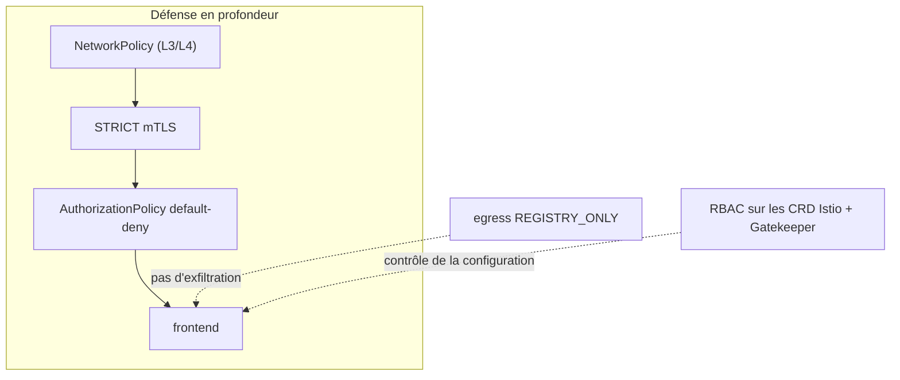

[RU version](README_RU.MD) · [Eng version](README.MD) · [Versión en español](README_ES.MD) · [Deutsche Version](README_DE.MD)

# Lab 34 - Hardening et modèle de menace du mesh

## Vue d'ensemble

Le mesh ne fait pas que protéger, il **devient lui-même une partie de la surface d'attaque**. Ce
lab rassemble les pratiques de sécurité du cours en un hardening unique selon le principe de la
**défense en profondeur** : chiffrement et identity, autorisation least-privilege, contrôle de
l'egress, restriction des droits sur les CRD Istio, règles d'admission obligatoires et frontière
réseau indépendante.

Déployé :
- namespace `app` (dans le mesh) : `frontend` (ping_pong HTTP) + deux clients curl `good` (SA
  `good`) et `bad` (SA `bad`) + SA `mesh-editor` ;
- namespace `legacy` (sans injection) : `legacy` - curl sans sidecar.

Istio en profil default (mTLS PERMISSIVE, egress ALLOW_ANY, aucune autorisation), OPA Gatekeeper
installé. Le worker PC dispose d'`istioctl`.



## Objectif

1. Activer le **mTLS STRICT** sur tout le mesh.
2. Mettre en place une autorisation **default-deny** dans `app` et n'autoriser ponctuellement que `good`.
3. Activer le **contrôle de l'egress** (`REGISTRY_ONLY`).
4. Restreindre les droits sur les CRD Istio : `mesh-editor` peut gérer la config Istio, mais **pas**
   les `EnvoyFilter`.
5. **OPA Gatekeeper** : interdire les `PeerAuthentication` avec `mode: DISABLE`.
6. **NetworkPolicy** comme frontière indépendante (résilience au contournement du sidecar).

## Étape 1. STRICT mTLS

```bash
kubectl apply -f - <<'EOF'
apiVersion: security.istio.io/v1
kind: PeerAuthentication
metadata:
  name: default
  namespace: istio-system      # root namespace -> sur tout le mesh
spec:
  mtls:
    mode: STRICT
EOF

# legacy sans sidecar (plaintext) n'atteindra plus frontend :
kubectl exec -n legacy deploy/legacy -c curl -- \
  curl -s -o /dev/null -w '%{http_code}\n' --max-time 8 http://frontend.app.svc.cluster.local:8080/
```

## Étape 2. Default-deny + autorisation ponctuelle

```bash
kubectl apply -f - <<'EOF'
apiVersion: security.istio.io/v1
kind: AuthorizationPolicy
metadata:
  name: deny-all
  namespace: app
spec: {}
EOF

kubectl apply -f - <<'EOF'
apiVersion: security.istio.io/v1
kind: AuthorizationPolicy
metadata:
  name: allow-good
  namespace: app
spec:
  selector:
    matchLabels:
      app: frontend
  action: ALLOW
  rules:
    - from:
        - source:
            principals: ["cluster.local/ns/app/sa/good"]
EOF

kubectl exec -n app deploy/good -c curl -- curl -s -o /dev/null -w '%{http_code}\n' http://frontend.app.svc.cluster.local:8080/   # 200
kubectl exec -n app deploy/bad  -c curl -- curl -s -o /dev/null -w '%{http_code}\n' http://frontend.app.svc.cluster.local:8080/   # 403
```

## Étape 3. Contrôle de l'egress : REGISTRY_ONLY

```bash
cat <<EOF > /tmp/iop.yaml
apiVersion: install.istio.io/v1alpha1
kind: IstioOperator
spec:
  profile: default
  meshConfig:
    outboundTrafficPolicy:
      mode: REGISTRY_ONLY
EOF
istioctl install -f /tmp/iop.yaml -y

kubectl exec -n app deploy/good -c curl -- \
  curl -s -o /dev/null -w '%{http_code}\n' --max-time 8 http://www.example.com/   # 502 (bloqué)
```

## Étape 4. RBAC sur les CRD Istio (interdiction d'EnvoyFilter)

`EnvoyFilter` est le CRD le plus dangereux (il injecte de la config brute dans Envoy). Donnons à
`mesh-editor` la gestion de la config Istio, mais **sans** les `envoyfilters` :

```bash
kubectl apply -f - <<'EOF'
apiVersion: rbac.authorization.k8s.io/v1
kind: Role
metadata:
  name: mesh-editor
  namespace: app
rules:
  - apiGroups: ["networking.istio.io"]
    resources: ["virtualservices","destinationrules","gateways","serviceentries","sidecars","workloadentries"]
    verbs: ["get","list","watch","create","update","patch","delete"]
  - apiGroups: ["security.istio.io"]
    resources: ["authorizationpolicies","requestauthentications"]
    verbs: ["get","list","watch","create","update","patch","delete"]
  # envoyfilters NON accordés
---
apiVersion: rbac.authorization.k8s.io/v1
kind: RoleBinding
metadata:
  name: mesh-editor
  namespace: app
roleRef:
  kind: Role
  name: mesh-editor
  apiGroup: rbac.authorization.k8s.io
subjects:
  - kind: ServiceAccount
    name: mesh-editor
    namespace: app
EOF

kubectl auth can-i create virtualservices.networking.istio.io --as=system:serviceaccount:app:mesh-editor -n app   # yes
kubectl auth can-i create envoyfilters.networking.istio.io     --as=system:serviceaccount:app:mesh-editor -n app   # no
```

## Étape 5. OPA Gatekeeper : interdire la désactivation du mTLS

```bash
kubectl apply -f - <<'EOF'
apiVersion: templates.gatekeeper.sh/v1
kind: ConstraintTemplate
metadata:
  name: k8sdenymtlsdisable
spec:
  crd:
    spec:
      names:
        kind: K8sDenyMtlsDisable
  targets:
    - target: admission.k8s.gatekeeper.sh
      rego: |
        package k8sdenymtlsdisable
        violation[{"msg": msg}] {
          input.review.object.spec.mtls.mode == "DISABLE"
          msg := "PeerAuthentication with mode: DISABLE is not allowed"
        }
EOF

kubectl apply -f - <<'EOF'
apiVersion: constraints.gatekeeper.sh/v1beta1
kind: K8sDenyMtlsDisable
metadata:
  name: no-mtls-disable
spec:
  match:
    kinds:
      - apiGroups: ["security.istio.io"]
        kinds: ["PeerAuthentication"]
EOF

# doit être DENIED :
kubectl apply -f - <<'EOF'
apiVersion: security.istio.io/v1
kind: PeerAuthentication
metadata:
  name: try-disable
  namespace: app
spec:
  mtls:
    mode: DISABLE
EOF
```

## Étape 6. NetworkPolicy (résilience au contournement du sidecar)

Le mTLS et l'autorisation vivent dans le sidecar ; si le trafic le contourne - ils ne s'appliquent
pas. Une NetworkPolicy fonctionne dans le noyau (CNI Calico) - une frontière indépendante :

```bash
kubectl apply -f - <<'EOF'
apiVersion: networking.k8s.io/v1
kind: NetworkPolicy
metadata:
  name: frontend-allow-app
  namespace: app
spec:
  podSelector:
    matchLabels:
      app: frontend
  policyTypes:
    - Ingress
  ingress:
    # port applicatif 8080 - uniquement depuis les pods du namespace app
    - from:
        - namespaceSelector:
            matchLabels:
              kubernetes.io/metadata.name: app
      ports:
        - port: 8080
          protocol: TCP
    # health (15021) / métriques (15090) du sidecar - depuis partout (kubelet, prometheus)
    - ports:
        - port: 15021
          protocol: TCP
        - port: 15090
          protocol: TCP
EOF
```

On laisse le port `15021` ouvert, sinon la readiness probe du sidecar par kubelet se mettra à
échouer et le pod passera NotReady.

## Comment ça fonctionne (modèle de menace)

- **STRICT mTLS** - seul le trafic du mesh mutuellement authentifié est accepté ; le plaintext et
  les clients sans sidecar sont rejetés.
- **Autorisation default-deny** - least privilege : sans ALLOW explicite, rien n'est autorisé, ce
  qui limite le rayon d'action d'un pod compromis.
- **Egress REGISTRY_ONLY** - un pod compromis ne pourra pas exfiltrer de données vers une adresse
  externe arbitraire.
- **RBAC sur les CRD** - la restriction d'`EnvoyFilter` (et de la config Istio) empêche de réécrire
  le data plane via des droits excessifs.
- **OPA Gatekeeper** - « ne jamais désactiver le mTLS » devient une règle d'admission stricte.
- **NetworkPolicy** - frontière indépendante dans le noyau, qui fonctionne même en cas de
  contournement du sidecar - défense en profondeur.

## Vérification du résultat

Lancez sur le worker PC :

```bash
check_result
```

## Bilan

Vous avez appliqué un hardening d'Istio selon le principe de la défense en profondeur : STRICT
mTLS, autorisation default-deny, contrôle de l'egress, restriction des droits sur les CRD Istio,
politiques obligatoires via OPA Gatekeeper et frontière réseau indépendante (NetworkPolicy) en cas
de contournement du sidecar.

## Infrastructure

| Composant | Type | Nombre | Rôle |
|---|---|---|---|
| control-plane | `t3.large` | 1 | master + istiod + OPA Gatekeeper |
| worker | `t3.large` | 1 | capacité pour les workloads app/legacy |
| worker PC | `t3.small` | 1 | poste de travail : `kubectl`, `istioctl`, `check_result` |

Région : `eu-central-1` (AZ `eu-central-1a` / `eu-central-1b`).
