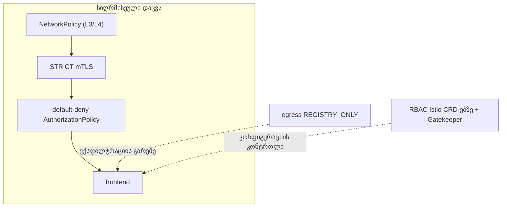

[Русская версия](README_RU.MD) · [Eng version](README.MD) · [Versión en español](README_ES.MD) · [Version française](README_FR.MD) · [Deutsche Version](README_DE.MD) · [繁體中文版](README_TW.MD) · [日本語版](README_JP.MD)

# ლაბორატორია 34 - mesh-ის ჰარდენინგი და საფრთხეების მოდელი

> [საცნობარო გადაწყვეტა](worker/files/solutions/1_GE.MD)

## მიმოხილვა

Mesh არა მხოლოდ იცავს, არამედ **თავადაც ხდება შეტევის ზედაპირის ნაწილი**. ეს ლაბორატორია
კურსის უსაფრთხოების პრაქტიკებს აერთიანებს ერთიან ჰარდენინგში **სიღრმისეული დაცვის**
პრინციპით: დაშიფვრა და identity, least-privilege ავტორიზაცია, egress-ის კონტროლი,
Istio CRD-ებზე უფლებების შეზღუდვა, სავალდებულო admission-წესები და დამოუკიდებელი ქსელური ზღვარი.

გაშლილია:
- namespace `app` (mesh-ში): `frontend` (ping_pong HTTP) + ორი curl-კლიენტი `good` (SA
  `good`) და `bad` (SA `bad`) + SA `mesh-editor`;
- namespace `legacy` (ინექციის გარეშე): `legacy` - curl sidecar-ის გარეშე.

Istio გაშვებულია default-პროფილით (mTLS PERMISSIVE, egress ALLOW_ANY, ავტორიზაციის გარეშე),
OPA Gatekeeper დაყენებულია. Worker PC-ზე ხელმისაწვდომია `istioctl`.



## ინფრასტრუქტურა

| კომპონენტი | ტიპი | რაოდენობა | როლი |
|---|---|---|---|
| control-plane | `t3.large` | 1 | master + istiod + OPA Gatekeeper |
| worker | `t3.large` | 1 | app/legacy workload-ებისთვის განკუთვნილი რესურსები |
| worker PC | `t3.small` | 1 | სამუშაო გარემო: `kubectl`, `istioctl`, `check_result` |

რეგიონი: `eu-central-1` (AZ `eu-central-1a` / `eu-central-1b`).

## გაშლა

```bash
TASK=34 make run_ica_task
```

## დავალება

1. ჩართეთ **STRICT mTLS** მთელ mesh-ზე.
2. namespace `app`-ში შექმენით **default-deny** ავტორიზაცია და კონკრეტულად მხოლოდ `good` დაუშვით.
3. ჩართეთ **egress-ის კონტროლი** (`REGISTRY_ONLY`).
4. შეზღუდეთ Istio CRD-ებზე უფლებები: `mesh-editor`-ს შეუძლია Istio-ს კონფიგურაციის მართვა, მაგრამ **არა**
   `EnvoyFilter`-ის.
5. **OPA Gatekeeper**: აკრძალეთ `PeerAuthentication` პარამეტრით `mode: DISABLE`.
6. გამოიყენეთ **NetworkPolicy**, როგორც დამოუკიდებელი ზღვარი (sidecar-ის გვერდის ავლის მიმართ მდგრადობა).

## ნაბიჯი 1. STRICT mTLS

```bash
kubectl apply -f - <<'EOF'
apiVersion: security.istio.io/v1
kind: PeerAuthentication
metadata:
  name: default
  namespace: istio-system      # root namespace -> მთელ mesh-ზე
spec:
  mtls:
    mode: STRICT
EOF

# legacy sidecar-ის გარეშე (plaintext) frontend-ს ვეღარ მისწვდება:
kubectl exec -n legacy deploy/legacy -c curl -- \
  curl -s -o /dev/null -w '%{http_code}\n' --max-time 8 http://frontend.app.svc.cluster.local:8080/
```

## ნაბიჯი 2. Default-deny + კონკრეტული დაშვება

```bash
kubectl apply -f - <<'EOF'
apiVersion: security.istio.io/v1
kind: AuthorizationPolicy
metadata:
  name: deny-all
  namespace: app
spec: {}
EOF

kubectl apply -f - <<'EOF'
apiVersion: security.istio.io/v1
kind: AuthorizationPolicy
metadata:
  name: allow-good
  namespace: app
spec:
  selector:
    matchLabels:
      app: frontend
  action: ALLOW
  rules:
    - from:
        - source:
            principals: ["cluster.local/ns/app/sa/good"]
EOF

kubectl exec -n app deploy/good -c curl -- curl -s -o /dev/null -w '%{http_code}\n' http://frontend.app.svc.cluster.local:8080/   # 200
kubectl exec -n app deploy/bad  -c curl -- curl -s -o /dev/null -w '%{http_code}\n' http://frontend.app.svc.cluster.local:8080/   # 403
```

## ნაბიჯი 3. Egress-ის კონტროლი: REGISTRY_ONLY

```bash
cat <<EOF > /tmp/iop.yaml
apiVersion: install.istio.io/v1alpha1
kind: IstioOperator
spec:
  profile: default
  meshConfig:
    outboundTrafficPolicy:
      mode: REGISTRY_ONLY
EOF
istioctl install -f /tmp/iop.yaml -y

kubectl exec -n app deploy/good -c curl -- \
  curl -s -o /dev/null -w '%{http_code}\n' --max-time 8 http://www.example.com/   # 502 (დაბლოკილია)
```

## ნაბიჯი 4. RBAC Istio CRD-ებზე (EnvoyFilter-ის აკრძალვა)

`EnvoyFilter` ყველაზე სახიფათო CRD-ია (Envoy-ში დაუმუშავებელ კონფიგურაციას ამატებს). მივცეთ
`mesh-editor`-ს Istio-ს კონფიგურაციის მართვის უფლება, მაგრამ **`envoyfilters`-ის გარეშე**:

```bash
kubectl apply -f - <<'EOF'
apiVersion: rbac.authorization.k8s.io/v1
kind: Role
metadata:
  name: mesh-editor
  namespace: app
rules:
  - apiGroups: ["networking.istio.io"]
    resources: ["virtualservices","destinationrules","gateways","serviceentries","sidecars","workloadentries"]
    verbs: ["get","list","watch","create","update","patch","delete"]
  - apiGroups: ["security.istio.io"]
    resources: ["authorizationpolicies","requestauthentications"]
    verbs: ["get","list","watch","create","update","patch","delete"]
  # envoyfilters არ გავცემთ
---
apiVersion: rbac.authorization.k8s.io/v1
kind: RoleBinding
metadata:
  name: mesh-editor
  namespace: app
roleRef:
  kind: Role
  name: mesh-editor
  apiGroup: rbac.authorization.k8s.io
subjects:
  - kind: ServiceAccount
    name: mesh-editor
    namespace: app
EOF

kubectl auth can-i create virtualservices.networking.istio.io --as=system:serviceaccount:app:mesh-editor -n app   # yes
kubectl auth can-i create envoyfilters.networking.istio.io     --as=system:serviceaccount:app:mesh-editor -n app   # no
```

## ნაბიჯი 5. OPA Gatekeeper: mTLS-ის გამორთვის აკრძალვა

```bash
kubectl apply -f - <<'EOF'
apiVersion: templates.gatekeeper.sh/v1
kind: ConstraintTemplate
metadata:
  name: k8sdenymtlsdisable
spec:
  crd:
    spec:
      names:
        kind: K8sDenyMtlsDisable
  targets:
    - target: admission.k8s.gatekeeper.sh
      rego: |
        package k8sdenymtlsdisable
        violation[{"msg": msg}] {
          input.review.object.spec.mtls.mode == "DISABLE"
          msg := "PeerAuthentication with mode: DISABLE is not allowed"
        }
EOF

kubectl apply -f - <<'EOF'
apiVersion: constraints.gatekeeper.sh/v1beta1
kind: K8sDenyMtlsDisable
metadata:
  name: no-mtls-disable
spec:
  match:
    kinds:
      - apiGroups: ["security.istio.io"]
        kinds: ["PeerAuthentication"]
EOF

# უნდა იყოს DENIED:
kubectl apply -f - <<'EOF'
apiVersion: security.istio.io/v1
kind: PeerAuthentication
metadata:
  name: try-disable
  namespace: app
spec:
  mtls:
    mode: DISABLE
EOF
```

## ნაბიჯი 6. NetworkPolicy (sidecar-ის გვერდის ავლის მიმართ მდგრადობა)

mTLS და ავტორიზაცია sidecar-ში მუშაობს; თუ ტრაფიკი მას გვერდს აუვლის, ისინი არ გამოიყენება.
NetworkPolicy ბირთვში (CNI Calico) მუშაობს და დამოუკიდებელ ზღვარს ქმნის:

```bash
kubectl apply -f - <<'EOF'
apiVersion: networking.k8s.io/v1
kind: NetworkPolicy
metadata:
  name: frontend-allow-app
  namespace: app
spec:
  podSelector:
    matchLabels:
      app: frontend
  policyTypes:
    - Ingress
  ingress:
    # აპლიკაციის პორტი 8080 - მხოლოდ namespace app-ის პოდებიდან
    - from:
        - namespaceSelector:
            matchLabels:
              kubernetes.io/metadata.name: app
      ports:
        - port: 8080
          protocol: TCP
    # health (15021) / მეტრიკები (15090) sidecar - ყველგან (kubelet, prometheus)
    - ports:
        - port: 15021
          protocol: TCP
        - port: 15090
          protocol: TCP
EOF
```

პორტს `15021` ღიას ვტოვებთ, წინააღმდეგ შემთხვევაში kubelet-ის მიერ sidecar-ის readiness-შემოწმება
ჩავარდება და პოდი NotReady მდგომარეობაში გადავა.

## როგორ მუშაობს (საფრთხეების მოდელი)

- **STRICT mTLS** - მიიღება მხოლოდ mesh-ის ორმხრივად ავთენტიფიცირებული ტრაფიკი; plaintext და
  sidecar-ის არმქონე კლიენტები უარყოფილია.
- **Default-deny ავტორიზაცია** - least privilege: მკაფიო ALLOW-ის გარეშე არაფერი დაიშვება,
  რაც კომპრომეტირებული პოდის ზემოქმედების არეალს ზღუდავს.
- **REGISTRY_ONLY egress** - კომპრომეტირებული პოდი მონაცემებს ნებისმიერ გარე მისამართზე ვერ გაიტანს.
- **RBAC CRD-ებზე** - `EnvoyFilter`-ის (და Istio-ს კონფიგურაციის) შეზღუდვა ზედმეტი უფლებებით data
  plane-ის გადაწერის საშუალებას არ იძლევა.
- **OPA Gatekeeper** - „არასოდეს გამორთო mTLS“ მკაცრ admission-წესად იქცევა.
- **NetworkPolicy** - დამოუკიდებელი ზღვარი ბირთვში, რომელიც sidecar-ის გვერდის ავლის შემთხვევაშიც
  მუშაობს - სიღრმისეული დაცვა.

## შედეგის შემოწმება

Worker PC-ზე გაუშვით:

```bash
check_result
```

## შეჯამება

თქვენ Istio-ს ჰარდენინგი სიღრმისეული დაცვის პრინციპით განახორციელეთ: STRICT mTLS,
default-deny ავტორიზაცია, egress-ის კონტროლი, Istio CRD-ებზე უფლებების შეზღუდვა,
OPA Gatekeeper-ის სავალდებულო პოლიტიკები და დამოუკიდებელი ქსელური ზღვარი (NetworkPolicy)
sidecar-ის გვერდის ავლის შემთხვევისთვის.
