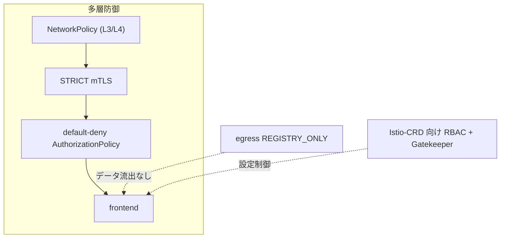

[Русская версия](README_RU.MD) · [Eng version](README.MD) · [Versión en español](README_ES.MD) · [Version française](README_FR.MD) · [Deutsche Version](README_DE.MD) · [ქართული ვერსია](README_GE.MD) · [繁體中文版](README_TW.MD)

# Lab 34 - mesh のハードニングと脅威モデル

> [リファレンス解答](worker/files/solutions/1_JP.MD)

## 概要

Mesh は保護するだけでなく、**それ自体が攻撃対象領域の一部にもなります**。このラボでは、
コースのセキュリティプラクティスを、**多層防御**の原則に基づく一つのハードニングに統合します:
暗号化と identity、least-privilege の認可、egress の制御、Istio-CRD の権限制限、
必須の admission ポリシー、および独立したネットワーク境界です。

デプロイ済み:
- namespace `app`（mesh 内）: `frontend`（ping_pong HTTP）+ 2 つの curl クライアント `good`（SA
  `good`）と `bad`（SA `bad`）+ SA `mesh-editor`;
- namespace `legacy`（injection なし）: `legacy` - sidecar なしの curl。

Istio は default プロファイル（mTLS PERMISSIVE、egress ALLOW_ANY、認可なし）で、OPA
Gatekeeper がインストールされています。worker PC には `istioctl` があります。



## インフラストラクチャ

| コンポーネント | タイプ | 数 | 役割 |
|---|---|---|---|
| control-plane | `t3.large` | 1 | master + istiod + OPA Gatekeeper |
| worker | `t3.large` | 1 | app/legacy workload 用の容量 |
| worker PC | `t3.small` | 1 | 作業環境: `kubectl`、`istioctl`、`check_result` |

リージョン: `eu-central-1`（AZ `eu-central-1a` / `eu-central-1b`）。

## デプロイ

```bash
TASK=34 make run_ica_task
```

## 課題

1. mesh 全体で **STRICT mTLS** を有効にする。
2. `app` で **default-deny** 認可を設定し、`good` のみを個別に許可する。
3. **egress 制御**（`REGISTRY_ONLY`）を有効にする。
4. Istio-CRD の権限を制限する: `mesh-editor` は Istio 設定を管理できるが、`EnvoyFilter` は**管理できない**。
5. **OPA Gatekeeper**: `mode: DISABLE` の `PeerAuthentication` を禁止する。
6. 独立した境界として **NetworkPolicy** を設定する（sidecar バイパスへの耐性）。

## ステップ 1. STRICT mTLS

```bash
kubectl apply -f - <<'EOF'
apiVersion: security.istio.io/v1
kind: PeerAuthentication
metadata:
  name: default
  namespace: istio-system      # root namespace -> mesh 全体に対して
spec:
  mtls:
    mode: STRICT
EOF

# sidecar なしの legacy (plaintext) は frontend にもう到達できない:
kubectl exec -n legacy deploy/legacy -c curl -- \
  curl -s -o /dev/null -w '%{http_code}\n' --max-time 8 http://frontend.app.svc.cluster.local:8080/
```

## ステップ 2. Default-deny + 個別許可

```bash
kubectl apply -f - <<'EOF'
apiVersion: security.istio.io/v1
kind: AuthorizationPolicy
metadata:
  name: deny-all
  namespace: app
spec: {}
EOF

kubectl apply -f - <<'EOF'
apiVersion: security.istio.io/v1
kind: AuthorizationPolicy
metadata:
  name: allow-good
  namespace: app
spec:
  selector:
    matchLabels:
      app: frontend
  action: ALLOW
  rules:
    - from:
        - source:
            principals: ["cluster.local/ns/app/sa/good"]
EOF

kubectl exec -n app deploy/good -c curl -- curl -s -o /dev/null -w '%{http_code}\n' http://frontend.app.svc.cluster.local:8080/   # 200
kubectl exec -n app deploy/bad  -c curl -- curl -s -o /dev/null -w '%{http_code}\n' http://frontend.app.svc.cluster.local:8080/   # 403
```

## ステップ 3. egress 制御: REGISTRY_ONLY

```bash
cat <<EOF > /tmp/iop.yaml
apiVersion: install.istio.io/v1alpha1
kind: IstioOperator
spec:
  profile: default
  meshConfig:
    outboundTrafficPolicy:
      mode: REGISTRY_ONLY
EOF
istioctl install -f /tmp/iop.yaml -y

kubectl exec -n app deploy/good -c curl -- \
  curl -s -o /dev/null -w '%{http_code}\n' --max-time 8 http://www.example.com/   # 502 (ブロックされた)
```

## ステップ 4. Istio-CRD の RBAC（EnvoyFilter の禁止）

`EnvoyFilter` は最も危険な CRD です（Envoy に生の設定を挿入します）。`mesh-editor` に
Istio 設定の管理を許可しますが、`envoyfilters` は**許可しません**:

```bash
kubectl apply -f - <<'EOF'
apiVersion: rbac.authorization.k8s.io/v1
kind: Role
metadata:
  name: mesh-editor
  namespace: app
rules:
  - apiGroups: ["networking.istio.io"]
    resources: ["virtualservices","destinationrules","gateways","serviceentries","sidecars","workloadentries"]
    verbs: ["get","list","watch","create","update","patch","delete"]
  - apiGroups: ["security.istio.io"]
    resources: ["authorizationpolicies","requestauthentications"]
    verbs: ["get","list","watch","create","update","patch","delete"]
  # envoyfilters は発行しない
---
apiVersion: rbac.authorization.k8s.io/v1
kind: RoleBinding
metadata:
  name: mesh-editor
  namespace: app
roleRef:
  kind: Role
  name: mesh-editor
  apiGroup: rbac.authorization.k8s.io
subjects:
  - kind: ServiceAccount
    name: mesh-editor
    namespace: app
EOF

kubectl auth can-i create virtualservices.networking.istio.io --as=system:serviceaccount:app:mesh-editor -n app   # yes
kubectl auth can-i create envoyfilters.networking.istio.io     --as=system:serviceaccount:app:mesh-editor -n app   # no
```

## ステップ 5. OPA Gatekeeper: mTLS の無効化を禁止

```bash
kubectl apply -f - <<'EOF'
apiVersion: templates.gatekeeper.sh/v1
kind: ConstraintTemplate
metadata:
  name: k8sdenymtlsdisable
spec:
  crd:
    spec:
      names:
        kind: K8sDenyMtlsDisable
  targets:
    - target: admission.k8s.gatekeeper.sh
      rego: |
        package k8sdenymtlsdisable
        violation[{"msg": msg}] {
          input.review.object.spec.mtls.mode == "DISABLE"
          msg := "PeerAuthentication with mode: DISABLE is not allowed"
        }
EOF

kubectl apply -f - <<'EOF'
apiVersion: constraints.gatekeeper.sh/v1beta1
kind: K8sDenyMtlsDisable
metadata:
  name: no-mtls-disable
spec:
  match:
    kinds:
      - apiGroups: ["security.istio.io"]
        kinds: ["PeerAuthentication"]
EOF

# DENIED であるべき:
kubectl apply -f - <<'EOF'
apiVersion: security.istio.io/v1
kind: PeerAuthentication
metadata:
  name: try-disable
  namespace: app
spec:
  mtls:
    mode: DISABLE
EOF
```

## ステップ 6. NetworkPolicy（sidecar バイパスへの耐性）

mTLS と認可は sidecar 上で動作します。トラフィックが sidecar をバイパスすると、それらは適用されません。
NetworkPolicy はカーネル（CNI Calico）で動作するため、独立した境界になります:

```bash
kubectl apply -f - <<'EOF'
apiVersion: networking.k8s.io/v1
kind: NetworkPolicy
metadata:
  name: frontend-allow-app
  namespace: app
spec:
  podSelector:
    matchLabels:
      app: frontend
  policyTypes:
    - Ingress
  ingress:
    # アプリのポート 8080 - namespace app の Pod からのみ
    - from:
        - namespaceSelector:
            matchLabels:
              kubernetes.io/metadata.name: app
      ports:
        - port: 8080
          protocol: TCP
    # health (15021) / メトリクス (15090) sidecar - どこからでも (kubelet, prometheus)
    - ports:
        - port: 15021
          protocol: TCP
        - port: 15090
          protocol: TCP
EOF
```

ポート `15021` は開放したままにします。そうしないと、kubelet からの sidecar の readiness probe が失敗し、
pod が NotReady になります。

## 仕組み（脅威モデル）

- **STRICT mTLS** - 相互認証された mesh トラフィックのみを受け入れます。plaintext および sidecar のない
  クライアントは拒否されます。
- **Default-deny 認可** - least privilege: 明示的な ALLOW がなければ何も許可されず、
  侵害された pod による影響範囲を制限します。
- **REGISTRY_ONLY egress** - 侵害された pod が任意の外部アドレスにデータを流出させることを防ぎます。
- **CRD の RBAC** - `EnvoyFilter`（および Istio 設定）を制限することで、過剰な権限を通じて
  data plane が書き換えられることを防ぎます。
- **OPA Gatekeeper** - 「mTLS を決して無効化しない」を厳格な admission ポリシーにします。
- **NetworkPolicy** - カーネル内の独立した境界で、sidecar がバイパスされた場合でも動作します。多層防御です。

## 結果の確認

worker PC で実行します:

```bash
check_result
```

## まとめ

多層防御の原則に基づく Istio のハードニングを適用しました: STRICT mTLS、default-deny
認可、egress 制御、Istio-CRD の権限制限、OPA Gatekeeper による必須ポリシー、そして sidecar が
バイパスされた場合に備えた独立したネットワーク境界（NetworkPolicy）です。