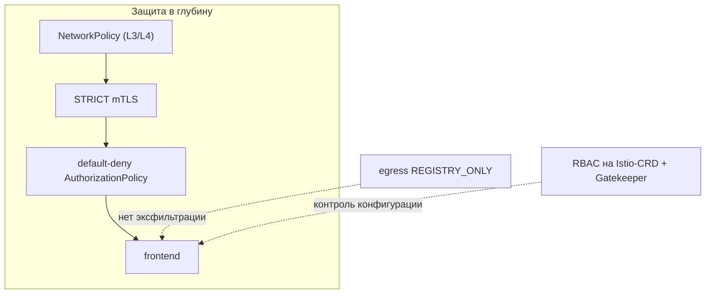

[Eng version](README.MD) · [Versión en español](README_ES.MD) · [Version française](README_FR.MD) · [Deutsche Version](README_DE.MD)

# Lab 34 - Харденинг и модель угроз mesh

## Обзор

Mesh не только защищает, но и **сам становится частью поверхности атаки**. Эта лаба
собирает security-практики курса в единый харденинг по принципу **защиты в глубину**:
шифрование и identity, авторизация least-privilege, контроль egress, ограничение прав на
Istio-CRD, обязательные admission-правила и независимый сетевой рубеж.

Развёрнуто:
- namespace `app` (в mesh): `frontend` (ping_pong HTTP) + два curl-клиента `good` (SA
  `good`) и `bad` (SA `bad`) + SA `mesh-editor`;
- namespace `legacy` (без инъекции): `legacy` - curl без sidecar.

Istio в default-профиле (mTLS PERMISSIVE, egress ALLOW_ANY, авторизации нет), OPA
Gatekeeper установлен. На worker PC есть `istioctl`.



## Задание

1. Включить **STRICT mTLS** на весь mesh.
2. Сделать **default-deny** авторизацию в `app` и точечно разрешить только `good`.
3. Включить **контроль egress** (`REGISTRY_ONLY`).
4. Ограничить права на Istio-CRD: `mesh-editor` может управлять конфигом Istio, но **не**
   `EnvoyFilter`.
5. **OPA Gatekeeper**: запретить `PeerAuthentication` с `mode: DISABLE`.
6. **NetworkPolicy** как независимый рубеж (устойчивость к обходу sidecar).

## Шаг 1. STRICT mTLS

```bash
kubectl apply -f - <<'EOF'
apiVersion: security.istio.io/v1
kind: PeerAuthentication
metadata:
  name: default
  namespace: istio-system      # root namespace -> на весь mesh
spec:
  mtls:
    mode: STRICT
EOF

# legacy без sidecar (plaintext) больше не достучится до frontend:
kubectl exec -n legacy deploy/legacy -c curl -- \
  curl -s -o /dev/null -w '%{http_code}\n' --max-time 8 http://frontend.app.svc.cluster.local:8080/
```

## Шаг 2. Default-deny + точечное разрешение

```bash
kubectl apply -f - <<'EOF'
apiVersion: security.istio.io/v1
kind: AuthorizationPolicy
metadata:
  name: deny-all
  namespace: app
spec: {}
EOF

kubectl apply -f - <<'EOF'
apiVersion: security.istio.io/v1
kind: AuthorizationPolicy
metadata:
  name: allow-good
  namespace: app
spec:
  selector:
    matchLabels:
      app: frontend
  action: ALLOW
  rules:
    - from:
        - source:
            principals: ["cluster.local/ns/app/sa/good"]
EOF

kubectl exec -n app deploy/good -c curl -- curl -s -o /dev/null -w '%{http_code}\n' http://frontend.app.svc.cluster.local:8080/   # 200
kubectl exec -n app deploy/bad  -c curl -- curl -s -o /dev/null -w '%{http_code}\n' http://frontend.app.svc.cluster.local:8080/   # 403
```

## Шаг 3. Контроль egress: REGISTRY_ONLY

```bash
cat <<EOF > /tmp/iop.yaml
apiVersion: install.istio.io/v1alpha1
kind: IstioOperator
spec:
  profile: default
  meshConfig:
    outboundTrafficPolicy:
      mode: REGISTRY_ONLY
EOF
istioctl install -f /tmp/iop.yaml -y

kubectl exec -n app deploy/good -c curl -- \
  curl -s -o /dev/null -w '%{http_code}\n' --max-time 8 http://www.example.com/   # 502 (заблокировано)
```

## Шаг 4. RBAC на Istio-CRD (запрет EnvoyFilter)

`EnvoyFilter` - самый опасный CRD (вставляет сырой конфиг в Envoy). Дадим `mesh-editor`
управление конфигом Istio, но **без** `envoyfilters`:

```bash
kubectl apply -f - <<'EOF'
apiVersion: rbac.authorization.k8s.io/v1
kind: Role
metadata:
  name: mesh-editor
  namespace: app
rules:
  - apiGroups: ["networking.istio.io"]
    resources: ["virtualservices","destinationrules","gateways","serviceentries","sidecars","workloadentries"]
    verbs: ["get","list","watch","create","update","patch","delete"]
  - apiGroups: ["security.istio.io"]
    resources: ["authorizationpolicies","requestauthentications"]
    verbs: ["get","list","watch","create","update","patch","delete"]
  # envoyfilters НЕ выдаём
---
apiVersion: rbac.authorization.k8s.io/v1
kind: RoleBinding
metadata:
  name: mesh-editor
  namespace: app
roleRef:
  kind: Role
  name: mesh-editor
  apiGroup: rbac.authorization.k8s.io
subjects:
  - kind: ServiceAccount
    name: mesh-editor
    namespace: app
EOF

kubectl auth can-i create virtualservices.networking.istio.io --as=system:serviceaccount:app:mesh-editor -n app   # yes
kubectl auth can-i create envoyfilters.networking.istio.io     --as=system:serviceaccount:app:mesh-editor -n app   # no
```

## Шаг 5. OPA Gatekeeper: запрет отключения mTLS

```bash
kubectl apply -f - <<'EOF'
apiVersion: templates.gatekeeper.sh/v1
kind: ConstraintTemplate
metadata:
  name: k8sdenymtlsdisable
spec:
  crd:
    spec:
      names:
        kind: K8sDenyMtlsDisable
  targets:
    - target: admission.k8s.gatekeeper.sh
      rego: |
        package k8sdenymtlsdisable
        violation[{"msg": msg}] {
          input.review.object.spec.mtls.mode == "DISABLE"
          msg := "PeerAuthentication with mode: DISABLE is not allowed"
        }
EOF

kubectl apply -f - <<'EOF'
apiVersion: constraints.gatekeeper.sh/v1beta1
kind: K8sDenyMtlsDisable
metadata:
  name: no-mtls-disable
spec:
  match:
    kinds:
      - apiGroups: ["security.istio.io"]
        kinds: ["PeerAuthentication"]
EOF

# должно быть DENIED:
kubectl apply -f - <<'EOF'
apiVersion: security.istio.io/v1
kind: PeerAuthentication
metadata:
  name: try-disable
  namespace: app
spec:
  mtls:
    mode: DISABLE
EOF
```

## Шаг 6. NetworkPolicy (устойчивость к обходу sidecar)

mTLS и авторизация живут в sidecar; если трафик его обходит - они не применяются.
NetworkPolicy работает в ядре (CNI Calico) - независимый рубеж:

```bash
kubectl apply -f - <<'EOF'
apiVersion: networking.k8s.io/v1
kind: NetworkPolicy
metadata:
  name: frontend-allow-app
  namespace: app
spec:
  podSelector:
    matchLabels:
      app: frontend
  policyTypes:
    - Ingress
  ingress:
    # порт приложения 8080 - только из подов namespace app
    - from:
        - namespaceSelector:
            matchLabels:
              kubernetes.io/metadata.name: app
      ports:
        - port: 8080
          protocol: TCP
    # health (15021) / метрики (15090) sidecar - отовсюду (kubelet, prometheus)
    - ports:
        - port: 15021
          protocol: TCP
        - port: 15090
          protocol: TCP
EOF
```

Порт `15021` оставляем открытым, иначе readiness-проба sidecar от kubelet начнёт падать и
под станет NotReady.

## Как это работает (модель угроз)

- **STRICT mTLS** - принимается только взаимно аутентифицированный трафик mesh; plaintext и
  клиенты без sidecar отклоняются.
- **Default-deny авторизация** - least privilege: без явного ALLOW ничего не разрешено,
  ограничивает радиус поражения скомпрометированного пода.
- **REGISTRY_ONLY egress** - скомпрометированный под не сольёт данные на произвольный
  внешний адрес.
- **RBAC на CRD** - ограничение `EnvoyFilter` (и конфига Istio) не даёт переписать data
  plane через избыточные права.
- **OPA Gatekeeper** - «никогда не отключать mTLS» становится жёстким admission-правилом.
- **NetworkPolicy** - независимый рубеж в ядре, работает даже при обходе sidecar - защита
  в глубину.

## Проверка результата

Запустите на worker PC:

```bash
check_result
```

## Итог

Вы применили харденинг Istio по принципу защиты в глубину: STRICT mTLS, default-deny
авторизация, контроль egress, ограничение прав на Istio-CRD, обязательные политики через
OPA Gatekeeper и независимый сетевой рубеж (NetworkPolicy) на случай обхода sidecar.

## Инфраструктура

| Компонент | Тип | Кол-во | Роль |
|---|---|---|---|
| control-plane | `t3.large` | 1 | master + istiod + OPA Gatekeeper |
| worker | `t3.large` | 1 | ёмкость для workload'ов app/legacy |
| worker PC | `t3.small` | 1 | рабочее место: `kubectl`, `istioctl`, `check_result` |

Регион: `eu-central-1` (AZ `eu-central-1a` / `eu-central-1b`).
